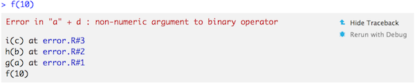

# Debugging

```{r setup, include = FALSE}
source("common.R")
```

## Introduction
\index{debugging} 
\index{bugs}
 
What happens when something goes when R code throws an error that you don't expect? What do you do? What tools do you have to find and fix the problem? This chapter will teach you the art and science of debugging, starting with a general strategy, and then following up with specific tools.

I'll show the tools provided both by R and the RStudio IDE. RStudio's integrated debugging support makes life easier by exposing existing R tools in a user friendly way. I'll show you both ways so that you can work with whatever environment you use. You may also want to refer to the official [RStudio debugging documentation](https://support.rstudio.com/hc/en-us/articles/205612627-Debugging-with-RStudio) which always reflects the tools in the latest version of RStudio.

Note that you shouldn't need to use these tools when writing new functions. If you find yourself using them frequently with new code, you may want to reconsider your approach. Instead of trying to write one big function all at once, work interactively on small pieces. If you start small, you can quickly identify why something doesn't work. But if you start large, you may end up struggling to identify the source of the problem.

### Outline {-}

* Section \@ref(debugging-techniques) outlines a general approach for 
  finding and fixing error.
   
* Section \@ref(traceback) introduces you to the `traceback()` function
  which helps you locate exactly where an error occurred.
  
* Section \@ref(browser) shows you how to pause the execution of a function 
  and launch environment where you can interactively explore what's happening.
  
* Section \@ref(non-interactive-debugging) discusses the challenging problem
  of debugging when you're running code non-interactively.
  
* Section \@ref(non-error-failures) discusses a handful of non-error problems
  that occassionally also need debugging.

## Overall approach {#debugging-techniques}

> "Finding your bug is a process of confirming the many things
> that you believe are true — until you find one which is not
> true." 
> 
> ---Norm Matloff

Debugging code is challenging. Most bugs are subtle and hard to find because if they were obvious, you would've avoided them in the first place. A good strategy helps. Below I outline a five step process that I have found useful:

1. __Realise that you have a bug__

    If you're reading this chapter, you've probably already completed this step.
    It is a surprisingly important one: you can't fix a bug until you know it
    exists. This is one reason why automated test suites are important when
    producing high-quality code. Unfortunately, automated testing is outside the
    scope of this book, but you can read more about it at
    <http://r-pkgs.had.co.nz/tests.html>.
    
1. __Look for existing work__

    Next, see if you've discovered a common error that might have a known 
    solution. The easiest way to determine this is to google the text of 
    the error message (making sure to remove any variable names or values that
    are specific to your problem).
    
    This is such a useful technique that the errorist [@errorist] and searcher     
    [@searcher] packages automate the process.

1. __Make it repeatable__

    Once you've determined you have a bug, you need to be able to reproduce it
    on command. Without this, it becomes extremely difficult to isolate its
    cause and to confirm that you've successfully fixed it.

    Generally, you will start with a big block of code that you know causes the
    error and then slowly whittle it down to get to the smallest possible
    snippet that still causes the error. Binary search is particularly useful
    for this. To do a binary search, you repeatedly remove half of the code
    until you find the bug. This is fast because, with each step, you reduce the
    amount of code to look through by half.

    If it takes a long time to generate the bug, it's also worthwhile to figure
    out how to generate it faster. The quicker you can do this, the quicker you
    can figure out the cause.

    As you work on creating a minimal example, you'll also discover similar
    inputs that don't trigger the bug. Make note of them: they will be helpful
    when diagnosing the cause of the bug.

    If you're using automated testing, this is also a good time to create an
    automated test case. If your existing test coverage is low, take the
    opportunity to add some nearby tests to ensure that existing good behaviour
    is preserved. This reduces the chances of creating a new bug.

1. __Figure out where it is__

    If you're lucky, one of the tools in the following section will help you to
    quickly identify the line of code that's causing the bug. Usually, however,
    you'll have to think a bit more about the problem. It's a great idea to
    adopt the scientific method. Generate hypotheses, design experiments to test
    them, and record your results. This may seem like a lot of work, but a
    systematic approach will end up saving you time. I often waste a lot of time
    relying on my intuition to solve a bug ("oh, it must be an off-by-one error,
    so I'll just subtract 1 here"), when I would have been better off taking a
    systematic approach.

1. __Fix it and test it__

    Once you've found the bug, you need to figure out how to fix it and to check
    that the fix actually worked. Again, it's very useful to have automated
    tests in place. Not only does this help to ensure that you've actually fixed
    the bug, it also helps to ensure you haven't introduced any new bugs in the
    process. In the absence of automated tests, make sure to carefully record
    the correct output, and check against the inputs that previously failed.

## Locate the error {#traceback}
\index{call stack}
\indexc{traceback()}

Once you've made the error repeatable, the next step is to figure out where it comes from. The most important tool for this part of the process is `traceback()`, which shows you the sequence of calls (aka the call stack, Section \@ref(call-stack)), that lead to the error.

Here's a simple example: you can see that `f()` calls `g()` calls `h()` calls `i()` which adds together a number and a string creating an error: 

```{r, error = TRUE}
f <- function(a) g(a)
g <- function(b) h(b)
h <- function(c) i(c)
i <- function(d) "a" + d
f(10)
```

When we run this code in RStudio we see:

```{r, echo = FALSE, out.width = NULL}
knitr::include_graphics("screenshots/traceback-hidden.png")
```

Two options appear to the right of the error message: "Show Traceback" and "Rerun with Debug".  If you click "Show traceback" you see:

```{r, echo = FALSE, out.width = NULL}

```

If you're not using RStudio, you can use `traceback()` to get the same information (sans pretty formatting):

```{r, eval = FALSE}
traceback()
# 4: i(c) at exceptions-example.R#3
# 3: h(b) at exceptions-example.R#2
# 2: g(a) at exceptions-example.R#1
# 1: f(10)
```

You read the call stack from bottom to top: the initial call is `f()`, which calls `g()`, then `h()`, then `i()`, which triggers the error. If you're calling code that you `source()`d into R, the traceback will also display the location of the function, in the form `filename.r#linenumber`. These are clickable in RStudio, and will take you to the corresponding line of code in the editor.

Sometimes this is enough information to let you track down the error and fix it. However, `traceback()` shows you where the error occurred, but not why. The next useful tool is the interactive debugger. 

## The interactive debugger {#browser}
\index{debugger, interactive}
\indexc{browser()}

R's interactive debugger allows you to pause execution of a function and interactively explore its state. The easiest way to enter the interactive debugger is through RStudio's "Rerun with Debug" tool. This reruns the command that created the error, pausing execution where the error occurred. You're now inside the function and you can interactively explore to figure out what the problem is: ou'll see the corresponding code in the editor (with the statement that will be run next highlighted), objects in the current environment in the "Environment" pane, the call stack in a "Traceback" pane, and you can run arbitrary R code in the console. 

As well as RStudios "Rerun with debug" you can manually start the debugger with  `base::browser()`. No matter how you use R, you can insert this call to get an interactive environment where ever you need it. For example, we could insert it in `g()`:

```{r, eval = FALSE}
g <- function(b) {
  browser()
  h(b)
}
f(10)
```

You'll know when you're in the interactive debugger because you get a special prompt:

```
Browse[1]> 
```

### `browser()` commands

As well as allowing you to run regular R code, `browser()` provides a few special commands. You can use them by either typing short text commands, or by clicking a button in the RStudio toolbar (({height=20})):

* Next, `n`: executes the next step in the function. Note that if you have a
  variable named `n`; to print it you'll need to do `print(n)`.

* Step into, {height=20} or `s`: 
  works like next, but if the next step is a function, it will step into that
  function so you can explore it interactively.

* Finish, {height=20} or `f`: 
  finishes execution of the current loop or function.

* Continue, `c`: leaves interactive debugging and continues regular execution
  of the function. This is useful if you've fixed the bad state and want to
  check that the function proceeds correctly.

* Stop, `Q`: stops debugging, terminates the function, and returns to the global
  workspace. Use this once you've figured out where the problem is, and you're
  ready to fix it and reload the code.

There are two other slightly less useful commands that aren't available in the toolbar:

* Enter: repeats the previous command. I find this too easy to activate
  accidentally, so I turn it off using `options(browserNLdisabled = TRUE)`.

* `where`: prints stack trace of active calls (the interactive equivalent of
  `traceback`).

### Alternatives

There are three alternatives to using `browser()`: setting break points in RStudio, `option(error = recover)`, and `debug()` and friends.

#### Breakpoints
\index{breakpoints}

You can set a breakpoint in RStudio by clicking to the left of the line number, or pressing `Shift + F9`. Equivalently, add `browser()` where you want execution to pause. Breakpoints behave similarly to `browser()` but they are easier to set (one click instead of nine key presses), and you don't run the risk of accidentally including a `browser()` statement in your source code. There are two small downsides to breakpoints:

* There are a few unusual situations in which breakpoints will not work: 
  read [breakpoint troubleshooting](http://www.rstudio.com/ide/docs/debugging/breakpoint-troubleshooting) for more details.

* RStudio currently does not support conditional breakpoints, whereas you 
  can always put `browser()` inside an `if` statement.

#### `recover()`
\indexc{recover()}

Another way to activate `browser()` is to use `options(error = browser())`. Now when you get an error, you'll get an interactive prompt that displays the traceback and gives you the ability to interactively debug inside any of the frames:

```{r, eval = FALSE}
options(error = recover)
f(10)

#> Error in "a" + d : non-numeric argument to binary operator
#> 
#> Enter a frame number, or 0 to exit   
#> 
#> 1: f(10)
#> 2: exceptions-example.R#1: g(a)
#> 3: exceptions-example.R#2: h(b)
#> 4: exceptions-example.R#3: i(c)
#> 
#> Selection: 
```

You can return to default error handling with `options(error = NULL)`.

#### `debug()`
\indexc{debug()}
\indexc{trace()}
\indexc{setBreakpoint()}

Another approach is to call a function that inserts the `browser()` call:

* `debug()` inserts a browser statement in the first line of the specified
  function. `undebug()` removes it. Alternatively, you can use `debugonce()`
  to browse only on the next run.

* `utils::setBreakpoint()` works similarly, but instead of taking a function
  name, it takes a file name and line number and finds the appropriate function
  for you. 

These two functions are both special cases of `trace()`, which inserts arbitrary code at any position in an existing function. `trace()` is occasionally useful when you're debugging code that you don't have the source for. To remove tracing from a function, use `untrace()`. You can only perform one trace per function, but that one trace can call multiple functions.

#### The call stack
\index{call stack}

Unfortunately, the call stacks printed by `traceback()`, `browser()` + `where`, and `recover()` are not consistent. The following table shows how the call stacks from a simple nested set of calls are displayed by the three tools. 

`traceback()`   `where`             `recover()`
--------------  -----------------   ------------
`4: i(c)`       `where 1: i(c)`     `1: f()`
`3: h(b)`       `where 2: h(b)`     `2: g(a)`
`2: g(a)`       `where 3: g(a)`     `3: h(b)`
`1: f(10)`      `where 4: f(10)`    `4: i(c)`

Note that numbering is different between `traceback()` and `where`, and that `recover()` displays calls in the opposite order, and omits the call to `stop()`. RStudio displays calls in the same order as `traceback()` but omits the numbers.

```{r, eval = FALSE, echo = FALSE}
f <- function(x) g(x)
g <- function(x) h(x)
h <- function(x) stop("Error")
f(); traceback()
options(error = browser); f()
options(error = recover); f()
options(error = NULL)
```

### Compiled code {#debug-compiled}
\index{debugging!C code}
\index{gdb}

Unfortunately debugging compiled code (like C or C++) is beyond the scope of this book. There are two resources that you might find useful:

* <http://r-pkgs.had.co.nz/src.html#src-debugging>
* <https://github.com/wch/r-debug/blob/master/debugging-r.md>

## Non-interactive debugging
\index{debugging!non-interactive}

The most challenging debugging comes when you can't run the code interactively, typically because it's part of some pipeline run automatically (possibly on another computer), or because the error doesn't occur when you run same code interactively. This can be extremely frustrating! 

This section will give you some useful tools, but don't forget the general strategy outlined above. When you can't explore interactively, it's particularly important to spend some time making the problem as small as possible so you can iterate quickly.  You might also want to double check for the common causes below:

* Is the global environment different? Have you loaded different packages in
  your interactive environment? Are there objects left around from previous
  sessions that are causing differences?

* Is the working directory different? Are the `R_LIBS` (location of R library)
  or `PATH` (location of external commands) environment variables different?

You might also try running the code using `callr::r()`; this runs the code in a fresh session, and can be a useful way to reproduce the problem by running code from an interactive session.

### `dump.frames()`
\indexc{dump.frames()}
\indexc{recover()}

`dump.frames()` is an equivalent to `recover()` for non-interactive code. In the non-interactive session, it creates a `last.dump.rda` file in the current working directory. Then, in a later interactive R session, you load that file, and use `debugger()` to enter an interactive debugger with the same interface as `recover()`. This lets you cheat, and interactively debug code that was run non-interactively.

```{r, eval = FALSE}
# In batch R process ----
dump_and_quit <- function() {
  # Save debugging info to file last.dump.rda
  dump.frames(to.file = TRUE)
  # Quit R with error status
  q(status = 1)
}
options(error = dump_and_quit)

# In a later interactive session ----
load("last.dump.rda")
debugger()
```

### Print debugging
\index{debugging!with print}

If you can't get `dump.frames()` to work, a good fallback is print debugging, where you insert numerous print statements to narrow down where the problem is occuring, and to see the values of important variables. This is particularly useful if you can't get a good traceback. Start by inserting coarse-grained markers, and then make them progressively more fine-grained as you determine exactly where the problem is.

```{r, error = TRUE}
f <- function(a) {
  cat("f()\n")
  g(a)
}
g <- function(b) {
  cat("g()\n")
  cat("b =", b, "\n")
  h(b)
}
h <- function(c) {
  cat("i()\n")
  i(c)
}

f(10)
```

Print debugging is particularly useful for compiled code because it's not uncommon for the compiler to modify your code to such an extent you can't figure out the root problem even when inside an interactive debugger.

### RMarkdown
\index{debugging!RMarkdown}

<!-- Adapted from https://whattheyforgot.org/debugging-r-code.html#debugging-in-rmarkdown-documents -->

If you're knitting the file using RStudio, first start by using `rmarkdown::render()` instead. This runs the code in the current session, which makes it easier to debug. If doing this makes the problem go away, you'll need to figure out what makes the environments different.

If the problem persists, you'll need to use your interactive debugging skills. Whatever method you use, you'll need an extra step: in the error handler, you'll need to call `sink()`. This removes the default "sink" that knitr uses to capture all output, and ensures that you can see the results in the console. For example, to use `recover()` with RMarkdown, you'd put the following code in your setup block:

```{r, eval = FALSE}
options(error = function() {
  sink()
  recover()
})
```

This will generate a warning about "no sink to remove" when knitr completes; you can safely ignore this warning.

If you simply want to a traceback, the easiest option is to use `rlang::trace_back()`, taking advantage of the `rlang_trace_top_env` option. This ensures that you only see the traceback from your code, not all of the functions called by RMarkdown and knitr.

```{r, eval = FALSE}
options(rlang_trace_top_env = rlang::current_env())
options(error = function() {
  sink()
  print(rlang::trace_back(bottom = sys.frame(-1)), simplify = "none")
})
```

## Non-error failures
\index{debugging!warnings}
\index{debugging!messages}
\index{crash}

There are other ways for a function to fail apart from throwing an error:

*   A function may generate an unexpected warning. The easiest way to track down
    warnings is to convert them into errors with `options(warn = 2)` and use the
    in the call stack, like `doWithOneRestart()`, `withOneRestart()`,
    regular debugging tools. When you do this you'll see some extra calls
    `withRestarts()`, and `.signalSimpleWarning()`. Ignore these: they are
    internal functions used to turn warnings into errors.

*   A function may generate an unexpected message. There's no built-in tool to
    help solve this problem, but it's possible to create one:

    ```{r}
    message2error <- function(code) {
      withCallingHandlers(code, message = function(cnd) {
        cat("Message generated in:\n")
        print(rlang::trace_back(bottom = sys.frame(-1)), simplify = "branch")
        stop(cnd)
      })
    }

    f <- function() g()
    g <- function() message("Hi!")
    f()
  
    message2error(f())
    ```

*   A function might never return. This is particularly hard to debug
    automatically, but sometimes terminating the function and looking at the
    call stack is informative. Otherwise, use use print debugging, as 
    described above.

*   The worst scenario is that your code might crash R completely, leaving you
    with no way to interactively debug your code. This indicates a bug in
    underlying compiled (C or C++) code.
    
    If it's in your compiled code, you'll need to follow the links in Section 
    \@ref(debug-compiled) and learn how to use an interactive C debugger
    (or insert many print statements).
    
    If it's in a package or base R, you'll need to contact the package 
    maintainer. In either case, work on making the smallest possible
    reprex (Section \@ref(getting-help)) to make it as easy as possible for the
    developer to help you.
    
