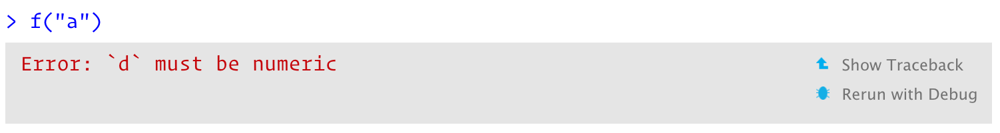
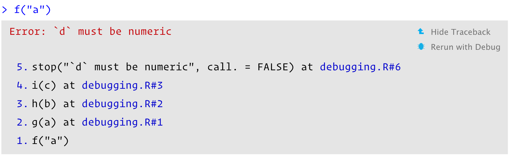

# Debugging

```{r setup, include = FALSE}
source("common.R")
```

## Introduction
\index{debugging} 
\index{bugs|see {debugging}}
\index{errors!debugging}
 
What do you do when R code throws an unexpected error? What tools do you have to find and fix the problem? This chapter will teach you the art and science of debugging, starting with a general strategy, then following up with specific tools.

I'll show the tools provided by both R and the RStudio IDE. I recommend using RStudio's tools if possible, but I'll also show you the equivalents that work everywhere. You may also want to refer to the official [RStudio debugging documentation](https://support.rstudio.com/hc/en-us/articles/205612627-Debugging-with-RStudio) which always reflects the latest version of RStudio.

NB: You shouldn't need to use these tools when writing _new_ functions. If you find yourself using them frequently with new code, reconsider your approach. Instead of trying to write one big function all at once, work interactively on small pieces. If you start small, you can quickly identify why something doesn't work, and don't need sophisticated debugging tools.

### Outline {-}

* Section \@ref(debugging-strategy) outlines a general strategy for 
  finding and fixing errors.
   
* Section \@ref(traceback) introduces you to the `traceback()` function
  which helps you locate exactly where an error occurred.
  
* Section \@ref(browser) shows you how to pause the execution of a function 
  and launch environment where you can interactively explore what's happening.
  
* Section \@ref(non-interactive-debugging) discusses the challenging problem
  of debugging when you're running code non-interactively.
  
* Section \@ref(non-error-failures) discusses a handful of non-error problems
  that occassionally also need debugging.

## Overall approach {#debugging-strategy}

> Finding your bug is a process of confirming the many things
> that you believe are true — until you find one which is not
> true.
> 
> ---Norm Matloff

Finding the root cause of a problem is always challenging. Most bugs are subtle and hard to find because if they were obvious, you would've avoided them in the first place. A good strategy helps. Below I outline a four step process that I have found useful:

1. __Google!__

    Whenever you see an error message, start by googling it. If you're lucky,
    you'll discover that it's a common error with a known solution. When
    googling, improve your chances of a good match by removing any variable 
    names or values that are specific to your problem.
    
    You can automate this process with the errorist [@errorist] and searcher
    [@searcher] packages. See their websites for more details.
    
1. __Make it repeatable__

    To find the root cause of an error, you're going to need to execute the
    code many times as you consider and reject hypotheses. To make that 
    iteration as quick possible, it's worth some upfront investment to make
    the problem both easy and fast to reproduce. 
    
    Start by creating a reproducible example (Section \@ref(getting-help)).
    Next, make the example minimal by removing code and simplifying data. 
    As you do this, you may discover inputs that don't trigger the error. 
    Make note of them: they will be helpful when diagnosing the root cause.
    
    If you're using automated testing, this is also a good time to create an
    automated test case. If your existing test coverage is low, take the
    opportunity to add some nearby tests to ensure that existing good behaviour
    is preserved. This reduces the chances of creating a new bug.

1. __Figure out where it is__

    If you're lucky, one of the tools in the following section will help you to
    quickly identify the line of code that's causing the bug. Usually, however,
    you'll have to think a bit more about the problem. It's a great idea to
    adopt the scientific method. Generate hypotheses, design experiments to test
    them, and record your results. This may seem like a lot of work, but a
    systematic approach will end up saving you time. I often waste a lot of time
    relying on my intuition to solve a bug ("oh, it must be an off-by-one error,
    so I'll just subtract 1 here"), when I would have been better off taking a
    systematic approach.
    
    If this fails, you might need to ask help from someone else. If you've 
    followed the previous step, you'll have a small example that's easy to 
    share with others. That makes it much easier for other people to look at
    the problem, and more likely to help you find a solution.

1. __Fix it and test it__

    Once you've found the bug, you need to figure out how to fix it and to check
    that the fix actually worked. Again, it's very useful to have automated
    tests in place. Not only does this help to ensure that you've actually fixed
    the bug, it also helps to ensure you haven't introduced any new bugs in the
    process. In the absence of automated tests, make sure to carefully record
    the correct output, and check against the inputs that previously failed.

## Locating errors {#traceback}
\index{call stacks}
\indexc{traceback()}

Once you've made the error repeatable, the next step is to figure out where it comes from. The most important tool for this part of the process is `traceback()`, which shows you the sequence of calls (also known as the call stack, Section \@ref(call-stack)) that lead to the error.

Here's a simple example: you can see that `f()` calls `g()` calls `h()` calls `i()`, which checks if its argument is numeric:

```{r, code = readLines("debugging.R"), error = TRUE}
```
```{r, include = FALSE}
source("debugging.R")
```

When we run `f("a")` code in RStudio we see:

```{r, echo = FALSE, out.width = "100%"}

```

Two options appear to the right of the error message: "Show Traceback" and "Rerun with Debug".  If you click "Show traceback" you see:

```{r, echo = FALSE, out.width = "100%"}

```

If you're not using RStudio, you can use `traceback()` to get the same information (sans pretty formatting):

```{r, eval = FALSE}
traceback()
#> 5: stop("`d` must be numeric", call. = FALSE) at debugging.R#6
#> 4: i(c) at debugging.R#3
#> 3: h(b) at debugging.R#2
#> 2: g(a) at debugging.R#1
#> 1: f("a")
```

NB: You read the `traceback()` output from bottom to top: the initial call is `f()`, which calls `g()`, then `h()`, then `i()`, which triggers the error. If you're calling code that you `source()`d into R, the traceback will also display the location of the function, in the form `filename.r#linenumber`. These are clickable in RStudio, and will take you to the corresponding line of code in the editor.

### Lazy evaluation {#debug-lazy}
\indexc{last\_trace()}

One drawback to `traceback()` is that it always linearises the call tree, which can be confusing if there is much lazy evaluation involved (Section \@ref(lazy-call-stack)). For example, take the following example where the error happens when evaluating the first argument to `f()`:

```{r, error = TRUE}
j <- function() k()
k <- function() stop("Oops!", call. = FALSE)
f(j())
```

```{r, eval = FALSE}
traceback()
#> 7: stop("Oops!") at #1
#> 6: k() at #1
#> 5: j() at debugging.R#1
#> 4: i(c) at debugging.R#3
#> 3: h(b) at debugging.R#2
#> 2: g(a) at debugging.R#1
#> 1: f(j())
```

You can using `rlang::with_abort()` and `rlang::last_trace()` to see the call tree. Here, I think it makes it much easier to see the source of the problem. Look at the last branch of the call tree to see that the error comes from `j()` calling `k()`.

```{r, error = TRUE}
rlang::with_abort(f(j()))
rlang::last_trace()
```

NB: `rlang::last_trace()` is ordered in the opposite way to `traceback()`. We'll come back to that issue in Section \@ref(call-stack-ordering).

## Interactive debugger {#browser}
\index{debugging!interactive}
\indexc{browser()}

Sometimes, the precise location of the error is enough to let you track it down and fix it. Frequently, however, you need more information, and the easiest way to get it is with the interactive debugger which allows you to pause execution of a function and interactively explore its state. 

If you're using RStudio, the easiest way to enter the interactive debugger is through RStudio's "Rerun with Debug" tool. This reruns the command that created the error, pausing execution where the error occurred. Otherwise, you can insert a call to `browser()` where you want to pause, and re-run the function. For example, we could insert a call `browser()` in `g()`:

```{r, eval = FALSE}
g <- function(b) {
  browser()
  h(b)
}
f(10)
```

`browser()` is just a regular function call which means that you can run it conditionally by wrapping it in an `if` statement:
 
```{r, eval = FALSE}
g <- function(b) {
  if (b < 0) {
    browser()
  }
  h(b)
}
```

In either case, you'll end up in an interactive environment _inside_ the function where you can run arbitrary R code to explore the current state. You'll know when you're in the interactive debugger because you get a special prompt:

```
Browse[1]> 
```

In RStudio, you'll see the corresponding code in the editor (with the statement that will be run next highlighted), objects in the current environment in the Environment pane, and the call stack in the Traceback pane. 


### `browser()` commands

As well as allowing you to run regular R code, `browser()` provides a few special commands. You can use them by either typing short text commands, or by clicking a button in the RStudio toolbar, Figure \@ref(fig:debug-toolbar):

```{r debug-toolbar, echo = FALSE, out.width = "50%", fig.cap = "RStudio debugging toolbar"}

```

* Next, `n`: executes the next step in the function. If you have a
  variable named `n`, you'll need `print(n)` to display its value.

* Step into, {width=20} or `s`: 
  works like next, but if the next step is a function, it will step into that
  function so you can explore it interactively.

* Finish, {width=20} or `f`: 
  finishes execution of the current loop or function.

* Continue, `c`: leaves interactive debugging and continues regular execution
  of the function. This is useful if you've fixed the bad state and want to
  check that the function proceeds correctly.

* Stop, `Q`: stops debugging, terminates the function, and returns to the global
  workspace. Use this once you've figured out where the problem is, and you're
  ready to fix it and reload the code.

There are two other slightly less useful commands that aren't available in the toolbar:

* Enter: repeats the previous command. I find this too easy to activate
  accidentally, so I turn it off using `options(browserNLdisabled = TRUE)`.
  \index{options!browserNLdisabled@\texttt{browserNLdisabled}}

* `where`: prints stack trace of active calls (the interactive equivalent of
  `traceback`).

### Alternatives

There are three alternatives to using `browser()`: setting breakpoints in RStudio, `options(error = recover)`, and `debug()` and other related functions.

#### Breakpoints
\index{breakpoints}

In RStudio, you can set a breakpoint by clicking to the left of the line number, or pressing `Shift + F9`. Breakpoints behave similarly to `browser()` but they are easier to set (one click instead of nine key presses), and you don't run the risk of accidentally including a `browser()` statement in your source code. There are two small downsides to breakpoints:

* There are a few unusual situations in which breakpoints will not work.
  Read [breakpoint troubleshooting](http://www.rstudio.com/ide/docs/debugging/breakpoint-troubleshooting) for more details.

* RStudio currently does not support conditional breakpoints.

#### `recover()`
\index{options!error@\texttt{error}}
\indexc{recover()}

Another way to activate `browser()` is to use `options(error = recover)`. Now when you get an error, you'll get an interactive prompt that displays the traceback and gives you the ability to interactively debug inside any of the frames:

```{r, eval = FALSE}
options(error = recover)
f("x")
#> Error: `d` must be numeric
#> 
#> Enter a frame number, or 0 to exit   
#> 
#> 1: f("x")
#> 2: debugging.R#1: g(a)
#> 3: debugging.R#2: h(b)
#> 4: debugging.R#3: i(c)
#> 
#> Selection:
```

You can return to default error handling with `options(error = NULL)`.

#### `debug()`
\indexc{debug()}
\indexc{trace()}
\indexc{setBreakpoint()}

Another approach is to call a function that inserts the `browser()` call for you:

* `debug()` inserts a browser statement in the first line of the specified
  function. `undebug()` removes it. Alternatively, you can use `debugonce()`
  to browse only on the next run.

* `utils::setBreakpoint()` works similarly, but instead of taking a function
  name, it takes a file name and line number and finds the appropriate function
  for you. 

These two functions are both special cases of `trace()`, which inserts arbitrary code at any position in an existing function. `trace()` is occasionally useful when you're debugging code that you don't have the source for. To remove tracing from a function, use `untrace()`. You can only perform one trace per function, but that one trace can call multiple functions.

#### Call stack {#call-stack-ordering}
\index{call stacks}

Unfortunately, the call stacks printed by `traceback()`, `browser()` & `where`, and `recover()` are not consistent. The following table shows how the call stacks from a simple nested set of calls are displayed by the three tools. The numbering is different between `traceback()` and `where`, and `recover()` displays calls in the opposite order. 

`traceback()`    `where`             `recover()`   rlang functions
--------------   -----------------   ------------  ---------------------------
`5: stop("...")`  
`4: i(c)`        `where 1: i(c)`     `1: f()`      `1. └─global::f(10)`
`3: h(b)`        `where 2: h(b)`     `2: g(a)`     `2.   └─global::g(a)` 
`2: g(a)`        `where 3: g(a)`     `3: h(b)`     `3.     └─global::h(b)`
`1: f("a")`      `where 4: f("a")`   `4: i("a")`   `4.       └─global::i("a")`

RStudio displays calls in the same order as `traceback()`. rlang functions use the same ordering and numbering as `recover()`, but also use indenting to reinforce the hierarchy of calls.

```{r, eval = FALSE, echo = FALSE}
f("a")
base::traceback()
options(error = browser); f()
options(error = recover); f()
options(error = NULL)

rlang::with_abort(f("a")); 
rlang::last_trace()
```

### Compiled code {#debug-compiled}
\index{debugging!C code}

It is also possible to use an interactive debugger (gdb or lldb) for compiled code (like C or C++). Unfortunately that's beyond the scope of this book, but there are a few resources that you might find useful:

* <http://r-pkgs.had.co.nz/src.html#src-debugging>
* <https://github.com/wch/r-debug/blob/master/debugging-r.md>
* <http://kevinushey.github.io/blog/2015/04/05/debugging-with-valgrind/>
* <https://www.jimhester.com/2018/08/22/debugging-rstudio/>

## Non-interactive debugging
\index{debugging!non-interactive}

Debugging is most challenging when you can't run code interactively, typically because it's part of some pipeline run automatically (possibly on another computer), or because the error doesn't occur when you run same code interactively. This can be extremely frustrating! 

This section will give you some useful tools, but don't forget the general strategy in Section \@ref(debugging-strategy). When you can't explore interactively, it's particularly important to spend some time making the problem as small as possible so you can iterate quickly. Sometimes `callr::r(f, list(1, 2))` can be useful; this calls `f(1, 2)` in a fresh session, and can help to reproduce the problem.

You might also want to double check for these common issues:

* Is the global environment different? Have you loaded different packages? 
  Are objects left from previous sessions causing differences?

* Is the working directory different? 

* Is the `PATH` environment variable, which determines where external 
  commands (like `git`) are found, different?

* Is the `R_LIBS` environment variable, which determines where `library()`
  looks for packages, different?

### `dump.frames()`
\indexc{dump.frames()}
\indexc{recover()}

`dump.frames()` is the equivalent to `recover()` for non-interactive code; it saves a `last.dump.rda` file in the working directory. Later, an interactive session, you can `load("last.dump.rda"); debugger()` to enter an interactive debugger with the same interface as `recover()`. This lets you "cheat", interactively debugging code that was run non-interactively.

```{r, eval = FALSE}
# In batch R process ----
dump_and_quit <- function() {
  # Save debugging info to file last.dump.rda
  dump.frames(to.file = TRUE)
  # Quit R with error status
  q(status = 1)
}
options(error = dump_and_quit)

# In a later interactive session ----
load("last.dump.rda")
debugger()
```

### Print debugging
\index{debugging!with print}

If `dump.frames()` doesn't help, a good fallback is __print debugging__, where you insert numerous print statements to precisely locate the problem, and see the values of important variables. Print debugging is slow and primitive, but it always works, so it's particularly useful if you can't get a good traceback. Start by inserting coarse-grained markers, and then make them progressively more fine-grained as you determine exactly where the problem is.

```{r, error = TRUE}
f <- function(a) {
  cat("f()\n")
  g(a)
}
g <- function(b) {
  cat("g()\n")
  cat("b =", b, "\n")
  h(b)
}
h <- function(c) {
  cat("i()\n")
  i(c)
}

f(10)
```

Print debugging is particularly useful for compiled code because it's not uncommon for the compiler to modify your code to such an extent you can't figure out the root problem even when inside an interactive debugger.

### RMarkdown
\index{debugging!RMarkdown}

<!-- Adapted from https://whattheyforgot.org/debugging-r-code.html#debugging-in-rmarkdown-documents -->

Debugging code inside RMarkdown files requires some special tools. First, if you're knitting the file using RStudio, switch to calling `rmarkdown::render("path/to/file.Rmd")` instead. This runs the code in the current session, which makes it easier to debug. If doing this makes the problem go away, you'll need to figure out what makes the environments different.

If the problem persists, you'll need to use your interactive debugging skills. Whatever method you use, you'll need an extra step: in the error handler, you'll need to call `sink()`. This removes the default sink that knitr uses to capture all output, and ensures that you can see the results in the console. For example, to use `recover()` with RMarkdown, you'd put the following code in your setup block:

```{r, eval = FALSE}
options(error = function() {
  sink()
  recover()
})
```

This will generate a "no sink to remove" warning when knitr completes; you can safely ignore this warning.

If you simply want a traceback, the easiest option is to use `rlang::trace_back()`, taking advantage of the `rlang_trace_top_env` option. This ensures that you only see the traceback from your code, instead of all the functions called by RMarkdown and knitr.

```{r, eval = FALSE}
options(rlang_trace_top_env = rlang::current_env())
options(error = function() {
  sink()
  print(rlang::trace_back(bottom = sys.frame(-1)), simplify = "none")
})
```

## Non-error failures
\index{debugging!warnings}
\index{debugging!messages}
\index{debugging!crashes}
\index{crashes|see {debugging}}

There are other ways for a function to fail apart from throwing an error:

*   A function may generate an unexpected warning. The easiest way to track down
    warnings is to convert them into errors with `options(warn = 2)` and use the
    the call stack, like `doWithOneRestart()`, `withOneRestart()`,
    regular debugging tools. When you do this you'll see some extra calls
    `withRestarts()`, and `.signalSimpleWarning()`. Ignore these: they are
    internal functions used to turn warnings into errors.

*   A function may generate an unexpected message. You can use 
    `rlang::with_abort()` to turn these messages into errors:

    ```{r, error = TRUE}
    f <- function() g()
    g <- function() message("Hi!")
    f()
  
    rlang::with_abort(f(), "message")
    rlang::last_trace()
    ```

*   A function might never return. This is particularly hard to debug
    automatically, but sometimes terminating the function and looking at the
    `traceback()` is informative. Otherwise, use use print debugging, 
    as in Section \@ref(print-debugging).

*   The worst scenario is that your code might crash R completely, leaving you
    with no way to interactively debug your code. This indicates a bug in
    compiled (C or C++) code.
    
    If the bug is in your compiled code, you'll need to follow the links in Section 
    \@ref(debug-compiled) and learn how to use an interactive C debugger
    (or insert many print statements).
    
    If the bug is in a package or base R, you'll need to contact the package 
    maintainer. In either case, work on making the smallest possible
    reproducible example (Section \@ref(getting-help)) to help the developer help you.
    
