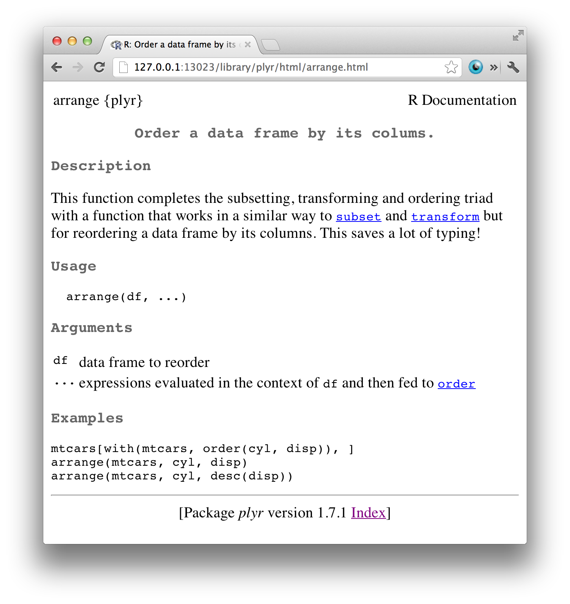

# Documenting functions

Documentation is one of the most important aspects of good code. Without it, users won't know how to use your package, and are unlikely to do so. Documentation is also useful for you in the future (so you remember what the heck you were thinking!), and for other developers working on your package.

The standard way to write R documentation is to create `.Rd` files in the `man/` directory. These files describe each object (function, data set, class, generic or method) in your package, documenting how it works and giving the user examples of how to use it.  Rather than writing Rd files by hand, we're going to use the [roxygen2](http://roxygen.org/) package. With roxygen, you write the documentation in comments next to each function, and then run an R script to create the main files.

This workflow has a number of advantages over writing `.Rd` files by hand:

* Code and documentation are adjacent so when you modify your code, it's easy
  to remember that you need to update the documentation.

* Roxygen2 dynamically inspects the objects that are documenting, so it can
  figure out a lot of information `.Rd` files need by itself.  For example, it
  can automatically add links to super and subclasses.

* It takes care of other files that are fiddly or downright painful to
  maintain by hand: the [namespace](`NAMESPACE`), collate order in
  description, and the demos index.

* Abstracts over the differences in documenting S3 and S4 methods, generics 
  and classes so that they behave basically the same.

This chapter will proceed as follows. First, we'll discuss the basic documentation process, what each step does, and how to see the output at every stage. Next we'll show you, at a high-level, how to document all the different types of R objects (functions, datasets, s3 methods, s4 methods, s4 classes, r5 classes, and packages). After that you'll learn how to format text within the documentation.

## Help

You've probably used help a lot, but you might not be aware of the more advanced features:

* `package?lubridate`
* `class?myclass`
* `methods?`
* `method?`
* `method?combo("numeric", "numeric")`
* `?combo(1:10, letters)`

Roxygen automatically takes care of generating the special aliases needed to make these lookups work.

How does help work? It finds the matching Rd file, and compiles it to either text or HTML output. It's complicated by the fact that binary packages don't include individual Rd files, they actually included a pre-parsed database of Rd files.

## Roxygen process

There's a three step process to go from the R comments in the source files to Rd files to human readable documentation. The process starts with special comments starting with `#'` that indicate a comment is a roxygen comment:

    #' Order a data frame by its columns.
    #'
    #' This function completes the subsetting, transforming and ordering triad
    #' with a function that works in a similar way to \code{\link{subset}} and 
    #' \code{\link{transform}} but for reordering a data frame by its columns.
    #' This saves a lot of typing!
    #'
    #' @param df data frame to reorder
    #' @param ... expressions evaluated in the context of \code{df} and 
    #'   then fed to \code{\link{order}}
    #' @keywords manip
    #' @export
    #' @examples
    #' mtcars[with(mtcars, order(cyl, disp)), ]
    #' arrange(mtcars, cyl, disp)
    #' arrange(mtcars, cyl, desc(disp))
    arrange <- function(df, ...) {
      ord <- eval(substitute(order(...)), df, parent.frame())
      unrowname(df[ord, ])
    }

To convert roxygen comments to the official `.Rd` files, we'll use `devtools::document()`. Like the other devtools functions you've seen so far, it takes a package directory as its first argument, and if you omit it, it will use the current working directory.

This produces an `.Rd` file in the `man/` directory:

    \name{arrange}
    \alias{arrange}
    \title{Order a data frame by its columns.}
    \usage{arrange(df, ...)}
    \description{
      This function completes the subsetting, transforming and
      ordering triad with a function that works in a similar
      way to \code{\link{subset}} and \code{\link{transform}}
      but for reordering a data frame by its columns. This
      saves a lot of typing!
    }
    \keyword{manip}
    \arguments{
      \item{df}{data frame to reorder}
      \item{...}{expressions evaluated in the context of 
        \code{df} and then fed to \code{\link{order}}}
    }
    \examples{mtcars[with(mtcars, order(cyl, disp)), ]
    arrange(mtcars, cyl, disp)
    arrange(mtcars, cyl, desc(disp))}

Rd files are a special file format loosely based on LaTeX. You can read more about the Rd format in the [R extensions](http://cran.r-project.org/doc/manuals/R-exts.html#Rd-format) manual. We'll avoid discussing Rd files as much as possible, focussing instead on what you need to know about roxygen.

When you request documentation, R then converts this file into the display you're probably used to seeing:

When you use `help` or `example` it looks for the Rd files in the _installed_ package. This isn't very useful for package development, because we want to retrieve the `.Rd` files from the _source_ package. `devtools` provides two functions to do this `dev_help` and `dev_example` - these behave similarly to `help` and `example`, but look in source packages you have loaded with `load_all`, rather than installed packages you've loaded with `library`.

## Common documentation tags

As you've seen roxygen comments have a special format. They start with `#'` and they include tags of the form `@tagname` that break the documentation up into pieces. The content of a tag extends from the tag name to the next tag, and they can span multiple lines.

If you want to put a literal `@` in the documentation, use `@@`.

Each documentation block starts with a text description.  The first sentence/line becomes the title of the documentation.  That's what you see when you look at `help(package = mypackage)` and is shown at the top of the documentation for each package. It should be succinct. The second paragraph is the description: this is the first thing shown in the documentation and should briefly describe what the function does.  The third and subsequent paragraphs go into the details: this is a (often long) section that comes after the description of the parameters.  If you want to override the default behaviour, you can use the `@title`, `@description` and `@details` tags.

Here's an example showing what the documentation for `sum` might look like if it was written using roxygen:

      #' Sum of Vector Elements
      #'
      #' \code{sum} returns the sum of all the values present in its arguments.
      #'
      #' This is a generic function: methods can be defined for it directly
      #' or via the \code{Summary} group generic.  For this to work properly,
      #' the arguments \code{...} should be unnamed, and dispatch is on the
      #' first argument.'
      sum <- function(..., na.rm = TRUE) {}

The following documentation is equivalent, but uses explicit tags.  This is not necessary unless you want to have a multiple paragraph description or title, or want to omit the description (in which case roxygen will replace with the title).

      #' @title Sum of Vector Elements
      #'
      #' @description
      #' \code{sum} returns the sum of all the values present in its arguments.
      #'
      #' @details
      #' This is a generic function: methods can be defined for it directly
      #' or via the \code{Summary} group generic.  For this to work properly,
      #' the arguments \code{...} should be unnamed, and dispatch is on the
      #' first argument.'
      sum <- function(..., na.rm = TRUE) {}

If you use explicit tags, you can put them in any order and still get the same output. The following documentation block would produce exactly the same Rd file and final documentation as the previous two.

      #' @details
      #' This is a generic function: methods can be defined for it directly
      #' or via the \code{Summary} group generic.  For this to work properly,
      #' the arguments \code{...} should be unnamed, and dispatch is on the
      #' first argument.'
      #'
      #' @title Sum of Vector Elements
      #'
      #' @description
      #' \code{sum} returns the sum of all the values present in its arguments.
      #'
      sum <- function(..., na.rm = TRUE) {}

You can also opt to document multiple functions in one `.Rd` file.  If you want to do so, use the `@rdname` tag to manully specify the name of the rd file (if you omit this it's done automatically in a way that every object gets its own documentation). You should be careful about documenting too many functions in one file because it gets confusing (which parameter belongs to which function?), but it can be useful if the functions are tightly connected.  

You can get documentation on a given tag with `?TagName`. For example, if you wanted to get help on the param tag, you'd do `?TagParam`. (Unfortunately you can't do `?@param` because of a technical limitation in Rd files.)

## Documenting functions (and methods)

When documenting a function, the first decision you need to make is whether you want to export it or not. Exporting is described more in [[namespaces]], but basically when you export a function you are saying it is ready for use and you are making a commitment to keep it around in a similar form for the near future. All exported functions need to be documented. You don't have to document internal functions, but it can be a good idea if they're particularly complicated.  Few users will read the documentation for internal functions, but it will be useful for you so when you come back to them in the future you don't need to struggle to recall what the inputs and outputs are.

The following code shows the arrange function and its documentation from the
plyr package.

    #' Order a data frame by its columns.
    #'
    #' This function completes the subsetting, transforming and ordering triad
    #' with a function that works in a similar way to \code{\link{subset}} and 
    #' \code{\link{transform}} but for reordering a data frame by its columns.
    #' This saves a lot of typing!
    #'
    #' @param df data frame to reorder
    #' @param ... expressions evaluated in the context of \code{df} and 
    #'   then fed to \code{\link{order}}
    #' @keywords manip
    #' @export
    #' @examples
    #' mtcars[with(mtcars, order(cyl, disp)), ]
    #' arrange(mtcars, cyl, disp)
    #' arrange(mtcars, cyl, desc(disp))
    arrange <- function(df, ...) {
      ord <- eval(substitute(order(...)), df, parent.frame())
      unrowname(df[ord, ])
    }

The tags used here are:

* `@param arg description` - a description for each function argument. This 
  can span multiple lines (or even paragraphs) if necessary.

* `@export` - a flag indicating that this function should be exported for use
  by others. Described in more detail in [[namespaces]].

* `@examples` - examples of the function in use. In my opinion, this is the
  most important part of the documentation - these are what most people will
  look at first to figure out how to use the function. I always put this last.

Other tags that you might find useful are:

* `@return` - the type of object that the function returns

The following tags apply to all types of documentation

* `@author`, in the form `Firstname Lastname <email@@address.com>`. Use this if
  some of the functions are written by people other than the author of the 
  package.

* `@seealso` - to provide pointers to other related topics

* `@references` - references to scientific literature on this topic

* `@aliases` - a list of additional topic names that will be mapped to this 
  documentation when the user looks them up from the command line. 

* `@family` - a family name. All functions that have the same family tag will be linked
  in the documentation.

## Documenting S3 generic functions and methods

S3 generics are documented in the same way as functions - there is typically no reason for a user to know (or care) that a function is a generic. (Although you may want to mention it in the docs so that other developers know that they can extend it with their own methods).

If you `@export` an S3 generic function, all its methods defined in your package will also get exported appropriately (using the `S3method()` namespace directive): they will be available when you call the generic, but users can not call the methods directly.  For example, the `wday` generic in `lubridate` is exported:

    library(lubridate)
    wday(Sys.Date(), label = TRUE)
    wday(1, label = TRUE)

But you can't call any of the methods directly:

    wday.default(Sys.Date(), label = TRUE)
    wday.numeric(1, label = TRUE)

    lubridate:::wday.default(Sys.Date(), label = TRUE)
    lubridate:::wday.numeric(1, label = TRUE)

This is good practice because it hides the internal implementation details of your functions.  Users should not rely on specific behaviour (for example, in this case we need to call `wday.default` for Date objects).  This makes it easier for you to change how the functions work in the future - for example, you could change from S3 to S4 dispatch.

You only need to explicitly `@export` a method if its generic is defined in another package.  This is one of the easiest things to forget, and it creates subtle bugs that `R CMD check` doesn't report and are hard to track down.  Future versions of roxygen should hopefully make this easier.

Most of the time you don't need to document S3 methods - particularly if they are for simple generics like `print`.  However, if your method is more complicated, you should document it.  In base R, you can find documentation for more complex methods like `predict.lm`, `predict.glm`, `anova.glm` and so on.

## Documenting S4 generic and methods

The same rules apply when documenting S4 generics and methods:

* Document the generic like you would document any function.  Document methods that are more complex or have significant differences in behaviours.

* You don't need to export methods if they're for a generic you defined (just export the generic). Export all methods for generics defined in other packages.

## Documenting R5 methods

Currently there is no way to use roxygen to document R5 methods.  Use the standard docstring format. Alternatively, use roxygen to document an object with `@name` named by convention and assign it to `NULL`. For example, if object `obj` has method `getName`, then document the method as follows, using the convention to replace the `$` with `_`:

    #' @title Get the name of the object
    #' ...
    #' @name obj_getName
    NULL
    
    obj$methods(getName = function() return("name"))

And the help for `getName` can be accessed by `?obj_getName`

## Documenting classes

### Documenting a S3 class

Since S3 classes have no formal structure, you should document the constructor function.

### Documenting an S4 class

Typically you should document the `setClass` call, and if present, the constructor function.  Unless you want to separate out internal documentation for the class and the public interface (for the constructor), I recommend using `@rdname` to document both in the same file.  This will mean that `?classname` and `class?classname` go to the same place.

Export the class if you want other developers to be able to write subclasses of your class.  Export the constructor if you want users to be able to use it.

### Documenting an R5 class

## Documenting datasets

The following documentation excerpt comes from the diamonds dataset in ggplot2. We can't document the object directly (because it lives in the data directory), so we document `NULL` and provide the `@name` of the object we really want to document.

    #' Prices of 50,000 round cut diamonds.
    #' 
    #' A dataset containing the prices and other attributes of almost 54,000
    #'  diamonds. The variables are as follows:
    #' 
    #' \itemize{
    #'   \item price. price in US dollars (\$326--\$18,823)  
    #'   \item carat. weight of the diamond (0.2--5.01) 
    #'   ...
    #' }
    #' 
    #' @docType data
    #' @keywords datasets
    #' @format A data frame with 53940 rows and 10 variables
    #' @name diamonds
    NULL

There are a few new tags:

* `@docType data`, which indicates that this is documentation for a dataset.

* `@format`, which gives an overview of the structure of the dataset. If you omit this, roxygen will automatically add something based on the first line of `str` output

* `@source` where you got the data form, often a `\url{}`.

## Documenting packages

As well [[package level documentation|documenting-packages]] resources, every package should also have its own documentation page. I usually put this documentation in a file with the same name as the package.

This documentation topic should contain an overview documentation topic that describes the overall purpose of the package, and points to the most important functions. This topic should have `@docType package` and be aliased to `package-pkgname` and `pkgname` (unless there is already a function by that name) so that you can get an overview of the package by doing `?pkgname` or `package?pkgname`.

There are still relatively few packages that provide package documentation, but it's an extremely useful tool for users, because instead of just listing functions like `help(package = pkgname)` it organises them and shows the user where to get started.

The example below shows the basic structure, as taken from the documentation for the `lubridate` package:

    #' Dates and times made easy with lubridate.
    #'
    #' Lubridate provides tools that make it easier to parse and 
    #' manipulate dates. These tools are grouped below by common 
    #' purpose. More information about each function can be found in 
    #' its help documentation.
    #'
    #' Parsing dates
    #'
    #' Lubridate's parsing functions read strings into R as POSIXct 
    #' date-time objects. Users should choose the function whose name 
    #' models the order in which the year ('y'), month ('m') and day 
    #' ('d') elements appear the string to be parsed: 
    #' \code{\link{dmy}}, \code{\link{myd}}, \code{\link{ymd}}, 
    #' \code{\link{ydm}}, \code{\link{dym}}, \code{\link{mdy}}, 
    #' \code{\link{ymd_hms}}). 
    #' 
    #' ...
    #' 
    #' @references Garrett Grolemund, Hadley Wickham (2011). Dates and Times
    #'   Made Easy with lubridate. Journal of Statistical Software, 40(3),
    #'   1-25. \url{http://www.jstatsoft.org/v40/i03/}.
    #' @import plyr stringr
    #' @docType package
    #' @name lubridate
    NULL

Important components are:

* The general overview of the package: what it does, and what are the
  important pieces.

* Like for data sets, there isn't a object that we can document directly so 
  document `NULL` and use `@name` to say what we're actually documenting

* `@docType package` to indicate that it's documenting a package. This will automatically add the corect aliases so that `package?yourpackage` works.

* `@references` point to any published material about the package that users
  might find help.

The package documentation should not contain a verbatim list of functions or copy of `DESCRIPTION`. This file is for human reading, so pick the most important elements of your package.

## Text formatting 

Within roxygen text, you use the usual R documentation formatting rules, as summarised below. A fuller description is available in the [R extensions](http://cran.r-project.org/doc/manuals/R-exts.html#Sectioning) manual.

Sections are indicated by the @section tag, followed by the title (which should be in sentence case) and a colon. Subsections are indicated by a LaTeX-style command; the first argument is the subsection title and the second argument contains the subsection content. The following example illustrates how to add an arbitrary section:

    @section Warning:
      You must not call this function unless ...
      
      \subsection{Exceptions}{
         Apart from the following special cases...
      }

The section ends when another tag is declared or when the roxygen2 block ends. 

### Lists

* Ordered (numbered) lists:

        \enumerate{
          \item First item
          \item Second item
        }
      
* Unordered (bulleted) lists

        \itemize{
          \item First item
          \item Second item
        }
      
* Definition (named) lists

        \describe{
          \item{One}{First item}
          \item{Two}{Second item}
        }

### Tables

Tables are created with the tabular command, which has two arguments:

* Column alignment: a letter for each column. `l` = left alignment, `c` = centre, `r` = right.

* Table contents.  Columns separated by `\tab`, rows separated by `\cr`.

The following function will turn an R data frame into the correct format.  It ignores column and row names, but should get you started.

    tabular <- function(df) {
      stopifnot(is.data.frame(df))
      align <- function(x) if (is.numeric(x)) "r" else "l"
      col_align <- vapply(df, align, character(1))
      
      contents <- do.call("paste", c(lapply(df, format), 
        list(sep = " \\tab ", collapse = "\\cr\n")))
      
      mat <- matrix(unlist(lapply(df, format)), ncol = ncol(df))
      paste("\\tabular{", paste(col_align, collapse = ""), "}{\n",
        contents, "}\n", sep = "")
    }

### Mathematics

`\eqn` for inline, `\deqn` for display.  Standard LaTeX (no extensions).

### Character formatting

* `\emph{text}`: emphasised text, usually displayed as _italics_

* `\strong{text}`: strong text, usually displayed in __bold__

* `\code{text}`, `\pkg{package_name}`, `\file{file_name}`

* External links: `\email{email_address}`, `\url{url}`, `\href{url}{text}`

* `\link[package]{function}` - the first argument can be omitted if the link
  is in the current package, or the base package.  Will usually be wrapped inside `\code`: `\code{\link{fun}}`

## Dynamic help

Since R.XX, help has been...
