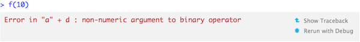

# Exceptions and debugging

R functions have three main ways to communicate to the user:

* By raising a fatal error with `stop()`. Errors force all execution to stop, 
  and are usually displayed in a bold font or in red. Errors are used when
  there is no way for a function to continue, and try to provide useful
  diagnostics to allow you to solve the problem.

* By generating a `warning()`, which is prefixed by "Warning message".
  By default, multiple warnings are aggregated together, and displayed all at 
  once when you call `warnings()`. Warnings are used to display potential
  problems, or when some elements of a vectorised input are invalid.

* By sending a `message()`, which usually is printed in bold font. Messages
  are used to give informative output in a way that can easily be suppressed
  by the user (with `suppressMessages()`).

This chapter describes tools and techniques to help when things go wrong:

* As a user, debugging tools and techniques help you get to the root cause of
  an error when you encounter it. Exception handling tools allow you to continue
  execution when something goes wrong, which is particularly useful when you're
  fitting potentially problematic models to multiple datasets.

* As a programmer, exceptions, warnings and messages (collectively known as 
  conditions) allow you to communicate problems to the user. Condition handling 
  tools allow you to recover from known problems and take appropriate action.
  
* As a programmer, you can avoid errors in the first place by using defensive 
  programming techniques. These make code take longer to write, but pay off by 
  reducing the chance of an error, and when errors occur, by providing more 
  informative messages.

The focus of this chapter is to give you the basic tools to debugging your code and handle conditions. R offers an exceptionally powerful condition handling system based on ideas from common lisp, but it's currently not very well documented or often used. If you want to learn more about the possibilities, I recommend the following two primary sources:

* [A prototype of a condition system for R](http://homepage.stat.uiowa.edu/~luke/R/exceptions/simpcond.html) by Robert Gentleman and Luke Tierney. This is describes an early version of R's condition system. The implementation changed somewhat since this was written, but it provides a good overview of how the pieces fit together, and some motivation for the design.

* [Beyond Exception Handling: Conditions and Restarts](http://www.gigamonkeys.com/book/beyond-exception-handling-conditions-and-restarts.html) by Peter Seibel. This describes exception handling in LISP, but the ideas are very similar in R, it provides useful motivation and examples. I have provided an R translation of the chapter at [beyond-exception-handling.html](beyond-exception-handling.html).

## Debugging techniques

> Finding your bug is a process of confirming the many things
> that you believe are true --- until you find one which is not
> true.
> --- Norm Matloff

Debugging code is challenging. R provides some useful tools which we'll discuss in the next section, but if you have a good technique, you can still productively debug a problem with just `print()`. There are four key components to the debugging process:

1. __Realise that you have a bug__

    If you're reading this chapter, you've probably already completed this step. 
    But this is a surprisingly important step: you can't fix a bug until you're 
    aware of it. This is one reason why automated test suites are so important
    when producing high-quality code. Automated testing is unfortunately 
    outside the scope of this book, but you can read some notes about it at
    http://adv-r.had.co.nz/Testing.html.

2. __Make it repeatable__

    Once you've determined you have a bug, you need to be able to recreate it 
    on command. This can be the most frustrating part of debugging, but if you 
    can't consistently recreate the bug, then it's extremely difficult to 
    isolate why it's occuring, and it's impossible to confirm that you've 
    fixed it. 
    
    Generally, you will start with a big block of code that you know causes the 
    error and then slowly whittle it down to get to the smallest possible 
    snippet that still causes the error. If it takes a long time to generate 
    the bug, it's also worthwhile figuring how to make it faster. It may be 
    worthwhile to use a caching strategy to save incremental results (but be 
    careful that you don't create new bugs by doing that).
    
    As you work on creating a minimal example, you'll also discover similar 
    inputs that don't cause the bug. Make a note of those: they will be 
    helpful when diagnosing the cause of the bug. 

    If you're using automated testing, this is a good time to create an
    automated test case. If your existing test coverage is low, take the 
    opportunity to add some nearby tests to reduce your chances of creating
    a new bug.
    
3. __Figure out where it is.__

    If you're lucky, one of the tools in the following section will allow you 
    to quickly navigate to the line of code that's causing the bug. Usually, 
    however, you'll probably have to think a bit more about the problem. Two 
    general useful techniques are binary search and the scientific process.
   
    To do a binary search, you repeatedly remove half of the code. The bug
    will either bug appear or not; but either way you've reduced the amount of
    code to look through by half. This allows you to quickly narrow down the
    problem even if you have a lot of code.

    If binary search doesn't work, adopt the scientific process. Generate 
    hypotheses, design experiments to test them and then record your results. 
    This does seem like more work, but a systematic approach will end up 
    saving you time in the long run because each step you take will move you 
    towards a solution. You can generate initial hypothesis by comparing the
    inputs that cause the bug with those that don't.

4. __Fix it and test it.__

    Once you've found the bug, you need to figure out how to fix it, and then 
    check that it actually worked.  Again, it's very useful to have 
    automated tests so that you can ensure that you've actually fixed the bug, 
    and you haven't created any new bugs in the process.

In my experience, it doesn't matter so much exactly what your process is, just that you have one. I often end up wasting too much time trying to rely on my intuition when I would have been better off taking a systematic approach.

## Debugging tools

As well as a broad strategy to follow when debugging code, you also need some concrete tools. In this section you'll learn tools provided both by R and the RStudio IDE. Rstudio's integrated debugging support makes life easier, but it mostly exposes existing R tools in a user friendly way. I'll show you both the Rstudio way and the regular R way so that you can work with whatever environment you have. You may also want to refer to the official [Rstudio debugging documentation](http://www.rstudio.com/ide/docs/debugging/overview) - this will always reflect the functionality in the latest version of Rstudio.

There are three key debugging tools:

* Determining the sequence of calls that lead to the error with the Rstudio
  error inspector or `traceback()`.

* Entering an interactive session where an error occured with Rstudio's "Rerun 
  on debug" or `recover()`.

* Entering an interactive session in arbitrary code with Rstudio's breakpoints 
  or `browser()`.

I'll explain each tool in more detail below.

Note that you shouldn't need to use these tools when writing new functions. If you find yourself using them frequently with new code, you may want to reconsider your approach: it's much easier to start simple and test interactively as you go, rather than writing something big and complicated and then trying to figure out exactly where the problem is. 

### Determining the sequence of calls

The most important tool to start with is the traceback, the sequence of calls that lead up to an error. Here's a simple an example: you can see that `f()` calls `g()` calls `h()` calls `i()` which adds together a number and a string creating a error:

```{r, eval = FALSE}
f <- function(a) g(a)
g <- function(b) h(b)
h <- function(c) i(c)
i <- function(d) "a" + d
f(10)
```

When we run this code in Rstudio we see:



If you click "Show traceback" you see:


If you're not using Rstudio, you can use the `traceback()` function to get the equivalent information:

```{r, eval = FALSE}
traceback()
# 4: i(c) at error.R#3
# 3: h(b) at error.R#2
# 2: g(a) at error.R#1
# 1: f(10)
```

You read the call stack from bottom to top: the initial call is `f()`, which eventually calls `i()` which triggers the error. If you're calling code that you `source()`d into R, the traceback will also display the location of the function, in the form `filename.r#linenumber`. These are clickable in Rstudio, and will take you to the corresponding line of code in the editor.

Sometimes this is enough information to let you track down the error and fix it. However, it's usually not enough: it shows you where the error occured, but not why. The next useful tool is the interactive debugger, which allows you to pause execution of a function and interactively explore its state.

### Browsing on error

The easiest way to enter the interactive debugger is through RStudio's "Rerun with debug" tool. This reruns the command that created the error, pausing execution where the error occured. You're now in an interactive state just like the regular R console, but you're inside the function, and can interact with any object defined their. You'll see the objects in the current environment in the Environment pane, the traceback in a new traceback pane and you can run arbitrary R code in the console to figure out what went wrong.

As well as any regular R function, there are a few special commands you can use in debug model. You can access them either with the Rstudio toolbar () or with the keyboard:

* Next, `n`: executes the next step in the function. Be careful if you have a 
  variable named `n`; to print it you'll need to do `print(n)`.

* Continue, `c`: leaves interactive debugging and continues regular execution
  of the function. This is useful if you've fixed the bad state and want to 
  check that the function proceeds correctly.

* Stop, `Q`: stops debugging, terminates the function and return to the global
  workspace.

There are two other useful commands:

* Enter: repeats the previous command. I find this too easy to activate while
  debugging, so I turn it off using `options(browserNLdisabled = TRUE)`.

* `where`: prints stack trace of active calls (the interactive equivalent of
  `traceback`)

To enter this style of debugging outside of Rstudio, you can use the `error` option. This specifies a function to run when an error occurs. The function most similar to Rstudio's debug is `browser()`: this will start an interactive console in the environment where the error occured. Use `options(error = browser)` to turn it on, re-run the previous command, then use `options(error = NULL)` to return to the default error behaviour. You could automate this with the `browseOnce()` function as defined below:

```{r, eval = FALSE}
browseOnce <- function() {
  old <- getOption("error")
  function() {
    options(error = old)
    browser()
  }
}
options(error = browseOnce())

f <- function() stop("!")
# Enters browser
f()
# Runs normally
f()
```

There are two other useful functions that you can use with the `error` option:

* `recover` is this is a step up from `browser`, as it allows you to enter the
  environment of any of the calls in the call stack. This is useful because
  often the cause of the error is a number of calls back.

* `dump.frames` is an equivalent to `recover` for non-interactive code. It 
  creates a `last.dump.rda` file in the current working directory that you 
  can load into an interactive later R session using `debugger()`, and 
  recreates the error as if you had called `recover`. This allows interactive 
  debugging of batch code.

    ```{r, eval = FALSE}
    # In batch R process
    dump_and_quit <- function() {
      # Save debugging info to file last.dump.rda
      dump.frames(to.file = TRUE)
      # Quit R with error status
      q(status = 1)
    }
    options(error = dump_and_quit)

    # Then in an interactive R session:
    load("last.dump.rda")
    debugger()
    ```

Finally, to reset error behaviour to the default, use `options(error = NULL)`. Then errors will print a message and abort function execution.

### Browsing arbitrary code

As well as entering an interactive console on error, you can enter it at an arbitrary location in your code by using either an Rstudio breakpoint or `browser()`. You can set a breakpoint in Rstudio by clicking to the left of the line number, or pressing `Shift + F9`, or equivalently, add `browser()` when you want execution to pause. Breakpoints behave similarly to `browser()` but they are easier to set (one click instead of nine key presses), and you don't run the risk of accidentally including a `browser()` statement in your source code. There are few places that breakpoints are not equivalent to `browser()`: read [breakpoint troubleshooting](http://www.rstudio.com/ide/docs/debugging/breakpoint-troubleshooting) for more details. One downside of breakpoints is that you can't set them conditionally, whereas you can always put `browser()` inside an `if` statement.

As well as adding `browser()` yourself, there are two functions that will add it to code:

* `debug()` inserts a browser statement in the first line of the specified
  function. `undebug()` will remove it, or you can use `debugonce()` to insert 
  to browse only on the next run.

* `utils::setBreakpoint()` works similarly, but instead of taking a function 
  name, it takes a file name and line number and finds the appropriate function
  for you.

These two functions are both special cases of `trace()`, which inserts arbitrary code at any position in an existing function. `trace()` is occasionally useful when you're debugging code that you don't have the source for.  To remove tracing from a function, use  `untrace()`. Also note that you can only perform one trace per function.

### The call stack: `traceback(), `where` and `recover()`.

Unfortunately the call stacks printed by `traceback()`, `browser()` + `where` and `recover()` are not consistent. Using the simple nested set of calls below, the call backs look like this table. Note that numbering is different between `traceback()` and `where`, and `recover()` displays calls in the opposite order, and omits the call to `stop()`.

`traceback()`     `where`                 `recover()`
----------------  ----------------------- ------------
4: stop("Error")  where 1: stop("Error")   1: f()  
3: h(x)           where 2: h(x)            2: g(x)
2: g(x)           where 3: g(x)            3: h(x)
1: f()            where 4: f() 

Rstudio displays calls in the same order as `traceback()` but omits the numbers.

```{r, eval = FALSE, echo = FALSE}
f <- function(x) g(x)
g <- function(x) h(x)
h <- function(x) stop("Error")
f(); traceback()
options(error = browser); f()
options(error = recover); f()
options(error = NULL)
```

### Other types of failure

There are other ways for a function to fail apart from throwing an error or returning an incorrect result. 

* A function may generate an unexpected warning. The easiest way to track down
  warnings is to convert them into errors with `options(warn = 2)`. The you can
  use the regular debugging tools. When you do this you'll see some extra calls 
  in the call stack, like to `doWithOneRestart()`, `withOneRestart()`, 
  `withRestarts()` and `.signalSimpleWarning()`. Ignore these: they are 
  internal functions used to turn warnings into errors.

* A function may generate an unexpected message. There's no built in tool to 
  help solve like for warnings, but it's easy to create one (you'll learn how
  this function works in the next section):

    ```{r, error = TRUE}
    message2error <- function(code) {
      withCallingHandlers(code, message = function(e) stop(e))  
    }

    f <- function(x) message("Hi!")
    f()
    message2error(f())
    traceback()
    ```
  
    As with warnings, you'll need to ignore some of the calls on the tracback 
    (i.e. the first two and the last 7).

* A function might never return. This is particularly hard to debug 
  automatically, but sometimes terminating the function and looking at the 
  call stack is informative. Otherwise, use the basic debugging strategies 
  described above.

* The worst scenario is that your code might crash R completely, leaving you 
  no way to interactively debug your code. This typically indicates a bug with 
  underlying C code, and the tools are much harder to use.  Sometimes an 
  interative debugger, like `gdb`, can be useful, but describing how to use 
  one is beyond the scope of this book.  If it's in base R code, posting a 
  reproducible example to R-help is a good idea. If it's in a package, contact
  the maintainer. If it's your own C or C++ code, you'll  need to use 
  numerous `print()` statements to narrow down the location of the bug, and 
  then you'll need to use many more print statements to figure out which 
  data structure doesn't have the properties that you expect.

## Error handling

Unexpected errors require interactive debugging to figure out what went wrong. Some errors, however, are expected, and you want to handle them automatically. In R, expected errors crop up most frequently when you're fitting many models to different datasets or bootstrap replicates. Sometimes the model might fail to fit and throw an error, but you don't want to stop everything; instead you want to fit as many models as possible and then perform diagnostics after the fact. In R, there are two tools for handling exceptions programmatically: `try()` (simple) and `tryCatch()` (complex). 

### Basic error handling with try()

`try()` allows execution to continue even after an error has occured. For example, normally if you run a function that throws an error, it terminates immediately and doesn't return a value:

```{r, error = TRUE}
f1 <- function(x) {
  log(x)
  10
}
f1("x")
```

However, if you wrap the statement that creates the error in `try()`, the error message will  be printed but execution will continue:

```{r}
f2 <- function(x) {
  try(log(x))
  10
}
f2()
```

You can suppress the message with `try(..., silent = TRUE)`. To pass larger blocks of code to `try()`, wrap them in `{}`:

```{r}
try({
  a <- 1
  b <- "x"
  a + b
})
a
b
```

You can also capture the output of the `try()` function. If successful, it will be the last result evaluated in the block (just like a function); if unsuccessful it will be an (invisible) object of class "try-error":

```{r}
success <- try(1 + 2)
failure <- try("a" + "b")
str(success)
str(failure)
```

`try()` is particularly useful when you're applying a function to multiple elements in a list:

```{r, error = TRUE}
elements <- list(1:10, c(-1, 10), c(T, F), letters)
results <- lapply(elements, log)
results <- lapply(elements, function(x) try(log(x)))
```

There isn't a built-in function for testing for this class, so we'll define one. Then you can easily find the locations of errors with `sapply()` (as discussed in the Functions chapter), and extract the successes or look at the inputs that lead to failures.

```{r}
is.error <- function(x) inherits(x, "try-error")
succeeded <- !sapply(results, is.error)

# look at successful results
str(results[succeeded])

# look at inputs that failed
str(elements[!succeeded])
```

Another useful `try()` idiom is setting a default value if an expression fails. Simply assign the default value outside the try block, and then run the risky code:

```{r, eval = FALSE}
default <- NULL
try(default <- read.csv("possibly-bad-input.csv"), silent = TRUE)
```

The function operators chapter discusses the `failwith()` function operator which makes this pattern particularly useful.

### Advanced error handling with `tryCatch()`

`tryCatch()` is more powerful than `try()`, because as well as dealing with errors, it also allows you to take specific actions for messages, warnings and interrupts. You've seen messages (made by `message()`) and warnings (made by `warn()`) before, but interrupts are new. They can't be generated directly by the programmer, but are raised when the user attempts to terminate execution by by presses Ctrl + Break, Escape, or Ctrl + C (depending on the platform). `tryCatch()` also provides the finally hook to run code regardless of whether or not an error occured.

The `tryCatch()` has three arguments:

* `expr`: the code to run.

* `...`: a set of named functions. If an condition is raised, `tryCatch` will 
  call the first handler whose name matches one of the classes of the condition. 
  The only useful names for built-in conditions are `error`, `warning`,
  `message`, `interrupt` and `condition`. Handler functions are passed a single 
  object, representing the condition that was raised.

* `finally`: code to run regardless of whether `expr` succeeds or fails. This
  is useful for clean up, as described below. All handlers have been turned
  off by the time the `finally` code is run, so errors will propagate as
  usual. (Note that this is functionally equivalent to using `on.exit()` 
  but it can wrap smaller chunks of code than an entire function).

The following examples illustrate the basic properties of `tryCatch`:

```{r, error = TRUE}
# If multiple handlers match, the first is used
tryCatch(stop("error"), 
  error = function(c) "a",
  error = function(c) "b"
)

# If multiple signals are nested, the the most internal is used first.
tryCatch(
  tryCatch(stop("error"), error = function(c) "a"),
  error = function(c) "b"
)

# Uncaught conditions propagate outwards. 
tryCatch(
  tryCatch(stop("error")),
  error = function(c) "b"
)

# No matter what happens, finally is run:
tryCatch(stop("error"), 
  finally = print("Done."))
tryCatch(a <- 1, 
  finally = print("Done."))
  
# Any errors that occur in the finally block are handled normally
a <- 1
tryCatch(a <- 2, finally = stop("Error!"))
```

Catching interrupts can be useful if you want to take special action when the user tries to abort running code.

```{r, eval = FALSE}
# Don't let the user interrupt the code
i <- 1
while(i < 3) {
  tryCatch({
    Sys.sleep(0.5)
    message("Try to escape")
  }, interrupt = function(x) {
    message("Try again!")
    i <<- i + 1
  })  
}
```

A handler function can do anything, but typically it will either return a value, or pass the condition along. For example, we can write a simple version of `try` using `tryCatch`: 

```{r}
try2 <- function(code, silent = FALSE) {
  tryCatch(code, error = function(c) {
    msg <- conditionMessage(c)
    if (!silent) message("Error: ", c)
    invisible(structure(conditionMessage(c), class = "try-error"))
  })
}

try2(1)
try2(stop("Hi"))
try2(stop("Hi"), silent = TRUE)
```

The real version of `try` is considerably more complicated to make the error message look more like what you'd see if `tryCatch()` wasn't used.

### Advanced error handling

One of the downsides of most functions in R is that they just call `stop()` with a string. That means if you want to figure out if a particular error occured, you have to look at the text of the error message. This is error prone, not only because the text of the error might change over time, but also because many error messages are translated, so the message might be completely different to what you expect.

However, R has a little known and little used feature that alleviates this problem. Conditions are S3 classes, so you can define your own for specific types of errors. Each function, `stop()`, `warning()` and `message()` can be given either a list of strings, or a custom S3 condition object. Custom condition objects are not used very often, but are very useful because they make it possible for the user to respond to different errors in different ways. For example, "expected" (like a model failing to converge for some input datasets) can be silently ignored, while unexpected errors (like no disk space available) can be propagated to the user. 

R doesn't come with a built-in constructer function for conditions, but we can easily add one. Conditions must contain a `message` and `call` components, but can contain anything else that is useful for  When creating a new condition, it should always inherit from `condition` and one of `error`, `warning` and `message`.

```{r}
condition <- function(subclass, message, call = sys.call(-1), ...) {
  structure(
    class = c(subclass, "condition"),
    list(message = message, call = call),
    ...
  )
}
is.condition <- function(x) inheritis(x, "condition")
```

You can signal an arbitrary condition with `signalCondition()`, but nothing will happen unless you've instantiated a custom signal handler. Instead, use `stop()`, `warning()` or `message()` as appropriate to trigger the usual handling. (Note that R won't complain if the class of your condition doesn't match the function, but you should avoid this in real code).

```{r, error = TRUE}

c <- condition(c("my_error", "error"), message = "This is an error")
signalCondition(c)
stop(c)
warning(c)
message(c)
```

Note that when using `tryCatch()` with multiple handlers and custom classes, the first handler to match any class in the hierarchy is called, not necessarily the best match. For this reason, you need to make sure to put the most specific handlers first:

```{r}
tryCatch(stop(c), 
  error = function(c) "error",
  my_error = function(c) "my_error"
)
tryCatch(stop(a), 
  my_error = function(c) "my_error",
  error = function(c) "error"
)
```

There is one other way to capture conditions: `withCallingHandlers()`. There are two main differences between `tryCatch()` and `withCallingHandlers()`:

* The default behaviour of `tryCatch()` handlers is handle the error and return
  a value, where the return value of `withCallingHandlers()` handlers is 
  ignored by default:

    ```{r, error = TRUE}
    f <- function() stop("!")
    tryCatch(f(), error = function(e) 1)
    withCallingHandlers(f(), error = function(e) 1)
    ```

* The handlers in `withCallingHandlers()` are called in the context of the 
  call that generated the condition; the handlers in `tryCatch()` are called 
  in the context of `tryCatch()`:
  
    ```{r, eval = FALSE}
    f <- function() g()
    g <- function() h()
    h <- function() stop("!")

    tryCatch(f(), error = function(e) print(sys.calls()))
    # [[1]] tryCatch(f(), error = function(e) print(sys.calls()))
    # [[2]] tryCatchList(expr, classes, parentenv, handlers)
    # [[3]] tryCatchOne(expr, names, parentenv, handlers[[1L]])
    # [[4]] value[[3L]](cond)
    
    withCallingHandlers(f(), error = function(e) print(sys.calls()))
    # [[1]] withCallingHandlers(f(), error = function(e) print(sys.calls()))
    # [[2]] f()
    # [[3]] g()
    # [[4]] h()
    # [[5]] stop("!")
    # [[6]] .handleSimpleError(function (e) print(sys.calls()), "!", quote(h()))
    # [[7]] h(simpleError(msg, call))
    ```
    
    This also affects the order in which `on.exit()` is called.

These subtle differences are rarely useful, except when you're trying to capture exactly what went wrong and pass it on to another function. For most purposes, you should never need to use `withCallingHandlers()`

## Defensive programming

Defensive programming is the art of making code fail in a well-defined manner even when something unexpected occurs. There are two components of this art related to exceptions: raising exceptions as soon as you notice something has gone wrong, and responding to errors as cleanly as possible.

A general principle for errors is to "fail fast" - as soon as you figure out something as wrong, and your inputs are not as expected, you should raise an error. This is more work for you as the function author, but will make it easier for the user to debug because they get errors early on, not after unexpected input has passed through several functions and caused a problem.

There is a tension between interactive analysis and programming. When you a doing an analysis, you want R to do what you mean, and if it guesses wrong, then you'll discover it right away and can fix it. If you're creating a function, then you want to make it as robust as possible so that any problems become apparent right away (see fail fast below).

* Be explicit:

  * Check the types of inputs

  * Be explicit about missings: 

  * Avoid functions that have non-standard evaluation rules (i.e 
    `subset`, `with`, `transform`). These functions save you time when working
    interactively, but when they fail inside a function they usually don't
    return a useful error message.

* Avoid functions that can return different types of objects:

  * Make sure you use preserving subsetting.

  * Don't use `sapply()`: use `vapply()`, or `lapply()` plus the appropriate
    transformation

### Creating

There are a number of options for letting the user know when something has gone wrong:

* don't use `cat()` or `print()`, except for print methods, or for optional
  debugging information.

* use `message()` to inform the user about something expected - I often do
  this when filling in important missing arguments that have a non-trivial
  computation or impact. Two examples are `reshape2::melt` package, which
  informs the user what melt and id variables were used if not specified, and
  `plyr::join`, which informs which variables were used to join the two
  tables.  You can suppress messages with `suppressMessages`.

* use `warning()` for unexpected problems that aren't show stoppers.
  Warnings are a good match for vectorised functions when a single value in
  the vector is incorrect, e.g. `log(-1:2)` and `sqrt(-1:2)`. 

* use `stop()` when the problem is so big you can't continue

* `stopifnot()` is a quick and dirty way of checking that pre-conditions for
  your function are met. The problem with `stopifnot` is that if they aren't
  met, it will display the test code as an error, not a more informative
  message. Checking pre-conditions with `stopifnot` is better than nothing,
  but it's better still to check the condition yourself and return an
  informative message with `stop()`


### An example

The following function is naively written and might cause problems:

```{r}
col_means <- function(df) {
  numeric <- sapply(df, is.numeric)
  numeric_cols <- df[, numeric]
  
  data.frame(lapply(numeric_cols, mean))
}
```

The ability to come up with a set of potential pathological inputs is a good skill to master. Common cases that I try and check are:

* dimensions of length 0
* dimensions of length 1 (in case dropping occurs)
* incorrect input types

The following code exercises some of those cases for `col_means`

```{r, error = TRUE}
col_means(mtcars)
col_means(mtcars[, 0])
col_means(mtcars[0, ])
col_means(mtcars[, "mpg", drop = F])
col_means(1:10)
col_means(as.matrix(mtcars))
col_means(as.list(mtcars))

mtcars2 <- mtcars
mtcars2[-1] <- lapply(mtcars2[-1], as.character)
col_means(mtcars2)
```

A better version of `col_means` might be:

```{r}
col_means <- function(df) {
  numeric <- vapply(df, is.numeric, logical(1))
  numeric_cols <- df[, numeric, drop = FALSE]
  
  data.frame(lapply(numeric_cols, mean))
}
```

We use `vapply` instead of `sapply`, remember to use `drop = FALSE`.  It still doesn't check that the input is correct, or coerce it to the correct format.

## Example ideas

```{r}
insert <- function(x, value, pos) {
  before <- x[1:pos]
  after <- x[pos:length(x)]
  
  c(before, value, after)
}
insert(1:5, 10, 3)
insert(1:5, 10, 1)

insert <- function(x, value, pos) {
  before <- x[1:(pos - 1)]
  after <- x[(pos - 1):length(x)]
  
  c(before, value, after)
}
insert(1:5, 10, 3)
insert(1:5, 10, 1)
insert(1:5, 10, 5)

larger <- function(x, y) {
  y.is.bigger <- y > x
  x[y.is.bigger] <- y[y.is.bigger]
  y
}

factorial1 <- function(x) {
  x * factorial1(x - 1)
}
greetings <- function(name) {
  first <- substr(name, 1, 1)
  capital <- toupper(first)
  name <- gsub(first, capital, names)
  paste("Hello", name, "!")
}
```
