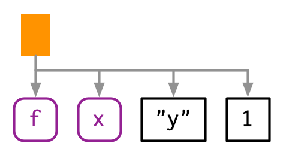
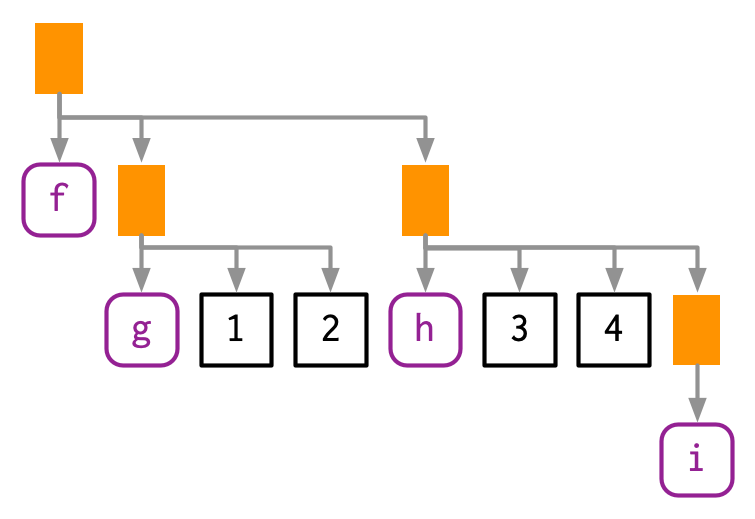
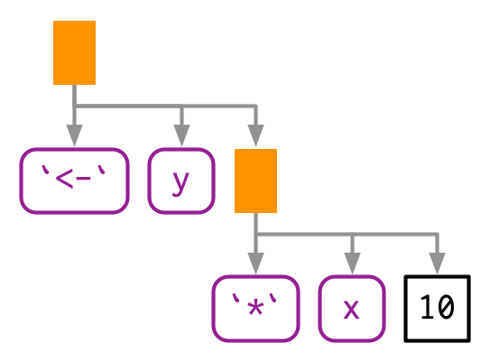
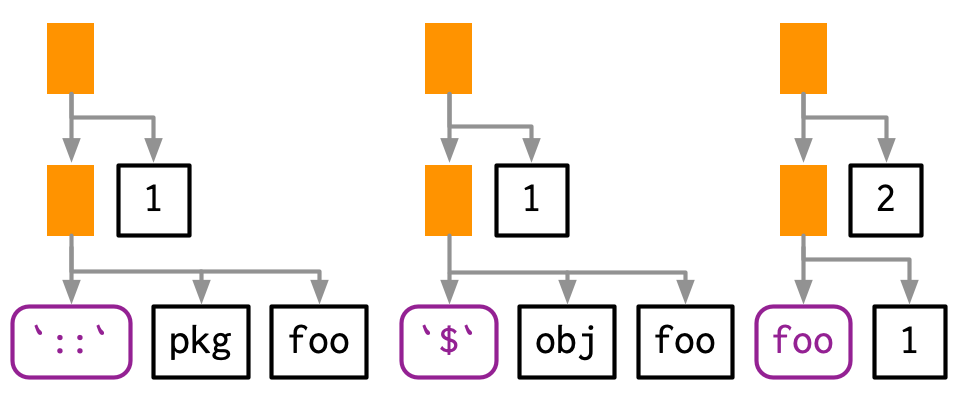
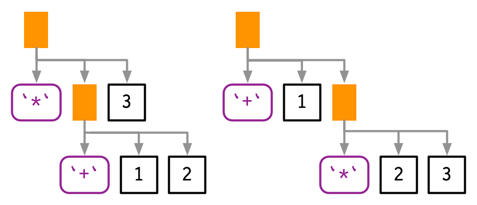

# Expressions

```{r, include = FALSE}
source("common.R")
```

## Introduction
\index{expressions}

To compute on the language, we first need to understand its structure. That requires some new vocabulary, some new tools, and some new ways of thinking about R code. The first of these is the distinction between an operation and its result. Take the following code, which multiplies a variable `x` by 10 and saves the result to a new variable called `y`. It doesn't work because we haven't defined a variable called `x`:

```{r, error = TRUE}
y <- x * 10
```

It would be nice if we could capture the intent of the code without executing it. In other words, how can we separate our description of the action from the action itself? 

One way is to use `rlang::expr()`:

```{r}
z <- rlang::expr(y <- x * 10)
z
```

`expr()` returns an expression, an object that captures the structure of the code without evaluating it (i.e. running it). If you have an expression, you can evaluate it with `base::eval()`:

```{r}
x <- 4
eval(z)
y
```

The focus of this chapter is the data structures that underlie expressions. Mastering this knowledge will allow you to inspect and modify captured code, and to generate code with code. We'll come back to `expr()` in Chapter \@ref(quasiquotation), and to `eval()` in Chapter \@ref(evaluation).

### Outline {-}

* Section \@ref(ast) introduces the idea of the abstract syntax tree (AST), 
  and reveals the tree like structure that underlies all R code.

* Section \@ref(expression-details) dives into the details of the data 
  structures that underpin the AST: constants, symbols, and calls, which 
  are collectively known as expressions.

* Section \@ref(grammar) covers parsing, the act of converting the linear 
  sequence of character in code into the AST, and uses that idea to explore
  some details of R's grammar.

* Section \@ref(ast-funs) shows you how you can use recursive functions to
  compute on the language, writing functions that compute with expressions. 

* Section \@ref(expression-special) circles back to three more 
  specialised data structures: pairlists, missing arguments, and expression
  vectors.

### Prerequisites {-}

Make sure you've read the metaprogramming overview in Chapter \@ref(meta-big-picture) to get a broad overview of the motivation and the basic vocabulary. You'll also need the [rlang](https://rlang.r-lib.org) package to capture and compute on expressions, and the [lobstr](https://lobstr.r-lib.org) package to visualise them.

```{r setup}
library(rlang)
library(lobstr)
```

## Abstract syntax trees {#ast}
\index{ASTs}
\index{abstract syntax tree!see {ASTs}}

Expressions are also called __abstract syntax trees__ (ASTs) because the structure of code is hierarchical and can be naturally represented as a tree. Understanding this tree structure is crucial for inspecting and modifying expressions (i.e. metaprogramming).

### Drawing
\index{ASTs!ast()@\texttt{ast()}}

We'll start by introducing some conventions for drawing ASTs, beginning with a simple call that shows their main components: `f(x, "y", 1)`. I'll draw trees in two ways[^more-complex]:

*   By "hand" (i.e. with OmniGraffle):

    ```{r, echo = FALSE, out.width = NULL}
    
    ```

*   With `lobstr::ast()`:

    ```{r}
    lobstr::ast(f(x, "y", 1))
    ```

[^more-complex]: For more complex code, you can also use RStudio's tree viewer which doesn't obey quite the same graphical conventions, but allows you to interactively explore large ASTs. Try it out with `View(expr(f(x, "y", 1)))`. 

Both approaches share conventions as much as possible:

*   The leaves of the tree are either symbols, like `f` and `x`, or constants,
    like `1` or `"y"`. Symbols are drawn in purple and have rounded corners.
    Constants have black borders and square corners. Strings and symbols are
    easily confused, so strings are always surrounded in quotes.

*   The branches of the tree are call objects, which represent function calls,
    and are drawn as orange rectangles. The first child (`f`) is the function
    that gets called; the second and subsequent children (`x`, `"y"`, and `1`)
    are the arguments to that function.

Colours will be shown when _you_ call `ast()`, but do not appear in the book for complicated technical reasons.

The above example only contained one function call, making for a very shallow tree. Most expressions will contain considerably more calls, creating trees with multiple levels. For example, consider the AST for `f(g(1, 2), h(3, 4, i()))`:

```{r, echo = FALSE, out.width = NULL}

```
```{r}
lobstr::ast(f(g(1, 2), h(3, 4, i())))
```

You can read the hand-drawn diagrams from left-to-right (ignoring vertical position), and the lobstr-drawn diagrams from top-to-bottom (ignoring horizontal position). The depth within the tree is determined by the nesting of function calls. This also determines evaluation order, as evaluation generally proceeds from deepest-to-shallowest, but this is not guaranteed because of lazy evaluation (Section \@ref(lazy-evaluation)). Also note the appearance of `i()`, a function call with no arguments; it's a branch with a single (symbol) leaf.

### Non-code components
\index{ASTs!non-code}

You might have wondered what makes these _abstract_ syntax trees. They are abstract because they only capture important structural details of the code, not whitespace or comments:

```{r}
ast(
  f(x,  y)  # important!
)
```

There's only one place where whitespace affects the AST:

```{r}
lobstr::ast(y <- x)
lobstr::ast(y < -x)
```

### Infix calls
\index{ASTs!infix calls}

Every call in R can be written in tree form because any call can be written in prefix form (Section \@ref(prefix-transform)). Take `y <- x * 10` again: what are the functions that are being called? It is not as easy to spot as `f(x, 1)` because this expression contains two infix calls: `<-` and `*`. That means that these two lines of code are equivalent:

```{r, eval = FALSE}
y <- x * 10
`<-`(y, `*`(x, 10))
```

And they both have this AST[^ast-infix]:

[^ast-infix]: The names of non-prefix functions are non-syntactic so I surround them with ``` `` ```, as in Section \@ref(non-syntactic).

```{r, echo = FALSE, out.width = NULL}

```
```{r}
lobstr::ast(y <- x * 10)
```

There really is no difference between the ASTs, and if you generate an expression with prefix calls, R will still print it in infix form:

```{r}
expr(`<-`(y, `*`(x, 10)))
```

The order in which infix operators are applied is governed by a set of rules called operator precedence, and we'll use `lobstr::ast()` to explore them in Section \@ref(operator-precedence).

### Exercises

1.  Reconstruct the code represented by the trees below:
    
    ```{r, echo = FALSE}
    ast(f(g(h())))

    ast(1 + 2 + 3)

    ast((x + y) * z)
    ```

1.  Draw the following trees by hand and then check your answers with
    `lobstr::ast()`.

    ```{r, eval = FALSE}
    f(g(h(i(1, 2, 3))))
    f(1, g(2, h(3, i())))
    f(g(1, 2), h(3, i(4, 5)))
    ```

1.  What's happening with the ASTs below? (Hint: carefully read `?"^"`.)

    ```{r}
    lobstr::ast(`x` + `y`)
    lobstr::ast(x ** y)
    lobstr::ast(1 -> x)
    ```

1.  What is special about the AST below? (Hint: re-read Section
    \@ref(fun-components).)

    ```{r}
    lobstr::ast(function(x = 1, y = 2) {})
    ```

1.  What does the call tree of an `if` statement with multiple `else if`
    conditions look like? Why?

## Expressions {#expression-details}
\index{expressions}
\indexc{expr()}

Collectively, the data structures present in the AST are called expressions. An __expression__ is any member of the set of base types created by parsing code: constant scalars, symbols, call objects, and pairlists. These are the data structures used to represent captured code from `expr()`, and  `is_expression(expr(...))` is always true[^exceptions]. Constants, symbols and call objects are the most important, and are discussed below. Pairlists and empty symbols are more specialised and we'll come back to them in Sections \@ref(pairlists) and Section \@ref(empty-symbol).

[^exceptions]: It is _possible_ to insert any other base object into an expression, but this is unusual and only needed in rare circumstances. We'll come back to that idea in Section \@ref(non-standard-ast).

NB: In base R documentation "expression" is used to mean two things. As well as the definition above, expression is also used to refer to the type of object returned by `expression()` and `parse()`, which are basically lists of expressions as defined above. In this book I'll call these __expression vectors__, and I'll come back to them in Section \@ref(expression-vectors).

### Constants
\index{constants}
\index{scalars}

Scalar constants are the simplest component of the AST. More precisely, a __constant__ is either `NULL` or a length-1 atomic vector (or scalar, Section \@ref(scalars)) like `TRUE`, `1L`, `2.5` or `"x"`. You can test for a constant with `rlang::is_syntactic_literal()`.

Constants are self-quoting in the sense that the expression used to represent a constant is the same constant:

```{r}
identical(expr(TRUE), TRUE)
identical(expr(1), 1)
identical(expr(2L), 2L)
identical(expr("x"), "x")
```

### Symbols
\index{symbols}
\index{names|see {symbols}}
\indexc{sym()}

A __symbol__ represents the name of an object like `x`, `mtcars`, or `mean`. In base R, the terms symbol and name are used interchangeably (i.e. `is.name()` is identical to `is.symbol()`), but in this book I used symbol consistently because "name" has many other meanings.

You can create a symbol in two ways: by capturing code that references an object with `expr()`, or turning a string into a symbol with `rlang::sym()`:

```{r}
expr(x)
sym("x")
```

\indexc{as\_string()}
You can turn a symbol back into a string with `as.character()` or `rlang::as_string()`. `as_string()` has the advantage of clearly signalling that you'll get a character vector of length 1.

```{r}
as_string(expr(x))
```

You can recognise a symbol because it's printed without quotes, `str()` tells you that it's a symbol, and `is.symbol()` is `TRUE`:

```{r}
str(expr(x))
is.symbol(expr(x))
```

The symbol type is not vectorised, i.e. a symbol is always length 1. If you want multiple symbols, you'll need to put them in a list, using (e.g.) `rlang::syms()`.

### Calls
\index{call objects}
\index{language objects!see {call objects}}

A __call object__ represents a captured function call. Call objects are a special type of list[^call-pairlist] where the first component specifies the function to call (usually a symbol), and the remaining elements are the arguments for that call. Call objects create branches in the AST, because calls can be nested inside other calls.

[^call-pairlist]: More precisely, they're pairlists, Section \@ref(pairlists), but this distinction rarely matters.

You can identify a call object when printed because it looks just like a function call. Confusingly `typeof()` and `str()` print "language"[^is.language] for call objects, but `is.call()` returns `TRUE`:

[^is.language]: Avoid `is.language()` which returns `TRUE` for symbols, calls, and expression vectors.

```{r}
lobstr::ast(read.table("important.csv", row.names = FALSE))
x <- expr(read.table("important.csv", row.names = FALSE))

typeof(x)
is.call(x)
```

#### Subsetting
\index{call objects!subsetting}

Calls generally behave like lists, i.e. you can use standard subsetting tools. The first element of the call object is the function to call, which is usually a symbol:

```{r}
x[[1]]
is.symbol(x[[1]])
```

The remainder of the elements are the arguments:

```{r}
as.list(x[-1])
```

You can extract individual arguments with `[[` or, if named, `$`:

```{r}
x[[2]]
x$row.names
```

You can determine the number of arguments in a call object by subtracting 1 from its length:

```{r}
length(x) - 1
```

Extracting specific arguments from calls is challenging because of R's flexible rules for argument matching: it could potentially be in any location, with the full name, with an abbreviated name, or with no name. To work around this problem, you can use `rlang::call_standardise()` which standardises all arguments to use the full name: 
\indexc{standardise\_call()}

```{r}
rlang::call_standardise(x)
```

(NB: If the function uses `...` it's not possible to standardise all arguments.)

Calls can be modified in the same way as lists:

```{r}
x$header <- TRUE
x
```

#### Function position
\index{call objects!function component}

The first element of the call object is the __function position__. This contains the function that will be called when the object is evaluated, and is usually a symbol[^call-number]:

```{r}
lobstr::ast(foo())
```

[^call-number]: Peculiarly, it can also be a number, as in the expression `3()`. But this call will always fail to evaluate because a number is not a function.

While R allows you to surround the name of the function with quotes, the parser converts it to a symbol:

```{r}
lobstr::ast("foo"())
```

However, sometimes the function doesn't exist in the current environment and you need to do some computation to retrieve it: for example, if the function is in another package, is a method of an R6 object, or is created by a function factory. In this case, the function position will be occupied by another call:

```{r}
lobstr::ast(pkg::foo(1))
lobstr::ast(obj$foo(1))
lobstr::ast(foo(1)(2))
```
```{r, echo = FALSE, out.width = NULL}

```

#### Constructing {#call2}
\index{call objects!constructing}
\indexc{call2()}

You can construct a call object from its components using `rlang::call2()`. The first argument is the name of the function to call (either as a string, a symbol, or another call). The remaining arguments will be passed along to the call:

```{r}
call2("mean", x = expr(x), na.rm = TRUE)
call2(expr(base::mean), x = expr(x), na.rm = TRUE)
```

Infix calls created in this way still print as usual.

```{r}
call2("<-", expr(x), 10)
```

Using `call2()` to create complex expressions is a bit clunky. You'll learn another technique in Chapter \@ref(quasiquotation).


### Summary

The following table summarises the appearance of the different expression subtypes in `str()` and `typeof()`:

|                   | `str()`                   | `typeof()`                               |
|-------------------|---------------------------|------------------------------------------|
| Scalar constant   | `logi`/`int`/`num`/`chr`  | `logical`/`integer`/`double`/`character` |
| Symbol            | `symbol`                  | `symbol`                                 |
| Call object       | `language`                | `language`                               |
| Pairlist          | Dotted pair list          | `pairlist`                               |
| Expression vector | `expression()`            | `expression`                             |


Both base R and rlang provide functions for testing for each type of input, although the types covered are slightly different. You can easily tell them apart because all the base functions start with `is.` and the rlang functions start with `is_`.

\newpage

<!-- New page so that there's no beak inside the table -->

|                   | base                | rlang                    |
|-------------------|---------------------|--------------------------|
| Scalar constant   | —                   | `is_syntactic_literal()` |
| Symbol            | `is.symbol()`       | `is_symbol()`            |
| Call object       | `is.call()`         | `is_call()`              |
| Pairlist          | `is.pairlist()`     | `is_pairlist()`          |
| Expression vector | `is.expression()`   | —                        |


### Exercises

1.  Which two of the six types of atomic vector can't appear in an expression?
    Why? Similarly, why can't you create an expression that contains an atomic 
    vector of length greater than one?

1.  What happens when you subset a call object to remove the first element?
    e.g. `expr(read.csv("foo.csv", header = TRUE))[-1]`. Why?

1.  Describe the differences between the following call objects.

    ```{r, results = FALSE}
    x <- 1:10

    call2(median, x, na.rm = TRUE)
    call2(expr(median), x, na.rm = TRUE)
    call2(median, expr(x), na.rm = TRUE)
    call2(expr(median), expr(x), na.rm = TRUE)
    ```

1.  `rlang::call_standardise()` doesn't work so well for the following calls.
    Why? What makes `mean()` special?

    ```{r}
    call_standardise(quote(mean(1:10, na.rm = TRUE)))
    call_standardise(quote(mean(n = T, 1:10)))
    call_standardise(quote(mean(x = 1:10, , TRUE)))
    ```

1.  Why does this code not make sense?

    ```{r, eval = FALSE}
    x <- expr(foo(x = 1))
    names(x) <- c("x", "y")
    ```

1.  Construct the expression `if(x > 1) "a" else "b"` using multiple calls to
    `call2()`. How does the code structure reflect the structure of the AST?

## Parsing and grammar {#grammar}
\index{grammar}

We've talked a lot about expressions and the AST, but not about how expressions are created from code that you type (like `"x + y"`). The process by which a computer language takes a string and constructs an expression is called __parsing__, and is governed by a set of rules known as a __grammar__. In this section, we'll use `lobstr::ast()` to explore some of the details of R's grammar, and then show how you can transform back and forth between expressions and strings.

### Operator precedence
\index{operator precedence}

Infix functions introduce two sources of ambiguity[^ambig]. The first source of ambiguity arises from infix functions: what does `1 + 2 * 3` yield? Do you get 9 (i.e. `(1 + 2) * 3`), or 7 (i.e. `1 + (2 * 3)`)? In other words, which of the two possible parse trees below does R use?

[^ambig]: This ambiguity does not exist in languages with only prefix or postfix calls. It's interesting to compare a simple arithmetic operation in Lisp (prefix) and Forth (postfix). In Lisp you'd write `(* (+ 1 2) 3))`; this avoids ambiguity by requiring parentheses everywhere. In Forth, you'd write `1 2 + 3 *`; this doesn't require any parentheses, but does require more thought when reading.

```{r, echo = FALSE, out.width = NULL}

```

Programming languages use conventions called __operator precedence__ to resolve this ambiguity. We can use `ast()` to see what R does:

```{r}
lobstr::ast(1 + 2 * 3)
```

Predicting the precedence of arithmetic operations is usually easy because it's drilled into you in school and is consistent across the vast majority of programming languages. 

Predicting the precedence of other operators is harder. There's one particularly surprising case in R: `!` has a much lower precedence (i.e. it binds less tightly) than you might expect. This allows you to write useful operations like:

```{r}
lobstr::ast(!x %in% y)
```

R has over 30 infix operators divided into 18 precedence groups. While the details are described in `?Syntax`, very few people have memorised the complete ordering. If there's any confusion, use parentheses!

```{r}
lobstr::ast((1 + 2) * 3)
```

Note the appearance of the parentheses in the AST as a call to the `(` function.

### Associativity

The second source of ambiguity is introduced by repeated usage of the same infix function. For example, is `1 + 2 + 3` equivalent to `(1 + 2) + 3` or to `1 + (2 + 3)`?  This normally doesn't matter because `x + (y + z) == (x + y) + z`, i.e. addition is associative, but is needed because some S3 classes define `+` in a non-associative way. For example, ggplot2 overloads `+` to build up a complex plot from simple pieces; this is non-associative because earlier layers are drawn underneath later layers (i.e. `geom_point()` + `geom_smooth()` does not yield the same plot as `geom_smooth()` + `geom_point()`).

In R, most operators are __left-associative__, i.e. the operations on the left are evaluated first:

```{r}
lobstr::ast(1 + 2 + 3)
```

There are two exceptions: exponentiation and assignment.

```{r}
lobstr::ast(2^2^3)
lobstr::ast(x <- y <- z)
```

### Parsing and deparsing {#parsing}
\index{parsing}
\indexc{parsing!parse\_expr@\texttt{parse\_expr()}}

Most of the time you type code into the console, and R takes care of turning the characters you've typed into an AST. But occasionally you have code stored in a string, and you want to parse it yourself. You can do so using `rlang::parse_expr()`:

```{r}
x1 <- "y <- x + 10"
x1
is.call(x1)

x2 <- rlang::parse_expr(x1)
x2
is.call(x2)
```

`parse_expr()` always returns a single expression. If you have multiple expression separated by `;` or `\n`, you'll need to use `rlang::parse_exprs()`. It returns a list of expressions:

```{r}
x3 <- "a <- 1; a + 1"
rlang::parse_exprs(x3)
```

If you find yourself working with strings containing code very frequently, you should reconsider your process. Read Chapter \@ref(quasiquotation) and consider whether you can generate expressions using quasiquotation more safely.

::: base
\indexc{parsing!parse@\texttt{parse()}}
The base equivalent to `parse_exprs()` is `parse()`. It is a little harder to use because it's specialised for parsing R code stored in files. You need to supply your string to the `text` argument and it returns an expression vector (Section \@ref(expression-vectors)). I recommend turning the output into a list:

```{r}
as.list(parse(text = x1))
```
:::

\index{deparsing}
\indexc{expr\_text()}

The inverse of parsing is __deparsing__: given an expression, you want the string that would generate it. This happens automatically when you print an expression, and you can get the string with `rlang::expr_text()`:

```{r}
z <- expr(y <- x + 10)
expr_text(z)
```

Parsing and deparsing are not perfectly symmetric because parsing generates an _abstract_ syntax tree. This means we lose backticks around ordinary names, comments, and whitespace:

```{r}
cat(expr_text(expr({
  # This is a comment
  x <-             `x` + 1
})))
```

::: base
\indexc{deparse()}
Be careful when using the base R equivalent, `deparse()`: it returns a character vector with one element for each line. Whenever you use it, remember that the length of the output might be greater than one, and plan accordingly.
:::

### Exercises

1.  R uses parentheses in two slightly different ways as illustrated by
    these two calls:

    ```{r, eval = FALSE}
    f((1))
    `(`(1 + 1)
    ```

    Compare and contrast the two uses by referencing the AST.

1.  `=` can also be used in two ways. Construct a simple example that shows
    both uses.

1.  Does `-2^2` yield 4 or -4? Why?

1.  What does `!1 + !1` return? Why?

1.  Why does `x1 <- x2 <- x3 <- 0` work? Describe the two reasons.

1.  Compare the ASTs of `x + y %+% z` and `x ^ y %+% z`. What have you learned
    about the precedence of custom infix functions?

1.  What happens if you call `parse_expr()` with a string that generates
    multiple expressions? e.g. `parse_expr("x + 1; y + 1")`

1.  What happens if you attempt to parse an invalid expression? e.g. `"a +"`
    or `"f())"`.

1.  `deparse()` produces vectors when the input is long. For example, the
    following call produces a vector of length two:

    ```{r, eval = FALSE}
    expr <- expr(g(a + b + c + d + e + f + g + h + i + j + k + l + 
      m + n + o + p + q + r + s + t + u + v + w + x + y + z))

    deparse(expr)
    ```

    What does `expr_text()` do instead?

1.  `pairwise.t.test()` assumes that `deparse()` always returns a length one
    character vector. Can you construct an input that violates this expectation?
    What happens?

## Walking AST with recursive functions {#ast-funs}
\index{recursion!over ASTs}
\index{ASTs!computing with}

To conclude the chapter I'm going to use everything you've learned about ASTs to solve more complicated problems. The inspiration comes from the base codetools package, which provides two interesting functions:

* `findGlobals()` locates all global variables used by a function. This
  can be useful if you want to check that your function doesn't inadvertently
  rely on variables defined in their parent environment.

* `checkUsage()` checks for a range of common problems including
  unused local variables, unused parameters, and the use of partial
  argument matching.

Getting all of the details of these functions correct is fiddly, so we won't fully develop the ideas. Instead we'll focus on the big underlying idea: recursion on the AST. Recursive functions are a natural fit to tree-like data structures because a recursive function is made up of two parts that correspond to the two parts of the tree:

* The __recursive case__ handles the nodes in the tree. Typically, you'll
  do something to each child of a node, usually calling the recursive function
  again, and then combine the results back together again. For expressions,
  you'll need to handle calls and pairlists (function arguments).

* The __base case__ handles the leaves of the tree. The base cases ensure
  that the function eventually terminates, by solving the simplest cases
  directly. For expressions, you need to handle symbols and constants in the
  base case.

To make this pattern easier to see, we'll need two helper functions. First we define `expr_type()` which will return "constant" for constant, "symbol" for symbols, "call", for calls, "pairlist" for pairlists, and the "type" of anything else:

```{r}
expr_type <- function(x) {
  if (rlang::is_syntactic_literal(x)) {
    "constant"
  } else if (is.symbol(x)) {
    "symbol"
  } else if (is.call(x)) {
    "call"
  } else if (is.pairlist(x)) {
    "pairlist"
  } else {
    typeof(x)
  }
}

expr_type(expr("a"))
expr_type(expr(x))
expr_type(expr(f(1, 2)))
```

We'll couple this with a wrapper around the switch function:

```{r}
switch_expr <- function(x, ...) {
  switch(expr_type(x),
    ...,
    stop("Don't know how to handle type ", typeof(x), call. = FALSE)
  )
}
```

With these two functions in hand, we can write a basic template for any function that walks the AST using `switch()` (Section \@ref(switch)):

```{r}
recurse_call <- function(x) {
  switch_expr(x,
    # Base cases
    symbol = ,
    constant = ,

    # Recursive cases
    call = ,
    pairlist =
  )
}
```

Typically, solving the base case is easy, so we'll do that first, then check the results. The recursive cases are trickier, and will often require some functional programming.

### Finding F and T

We'll start with a function that determines whether another function uses the logical abbreviations `T` and `F` because using them is often considered to be poor coding practice. Our goal is to return `TRUE` if the input contains a logical abbreviation, and `FALSE` otherwise. 

Let's first find the type of `T` versus `TRUE`:

```{r}
expr_type(expr(TRUE))

expr_type(expr(T))
```

`TRUE` is parsed as a logical vector of length one, while `T` is parsed as a name. This tells us how to write our base cases for the recursive function: a constant is never a logical abbreviation, and a symbol is an abbreviation if it's "F" or "T":

```{r}
logical_abbr_rec <- function(x) {
  switch_expr(x,
    constant = FALSE,
    symbol = as_string(x) %in% c("F", "T")
  )
}

logical_abbr_rec(expr(TRUE))
logical_abbr_rec(expr(T))
```

I've written `logical_abbr_rec()` function assuming that the input will be an expression as this will make the recursive operation simpler. However, when writing a recursive function it's common to write a wrapper that provides defaults or makes the function a little easier to use. Here we'll typically make a wrapper that quotes its input (we'll learn more about that in the next chapter), so we don't need to use `expr()` every time.

```{r}
logical_abbr <- function(x) {
  logical_abbr_rec(enexpr(x))
}

logical_abbr(T)
logical_abbr(FALSE)
```

Next we need to implement the recursive cases. Here we want to do the same thing for calls and for pairlists: recursively apply the function to each subcomponent, and return `TRUE` if any subcomponent contains a logical abbreviation. This is made easy by `purrr::some()`, which iterates over a list and returns `TRUE` if the predicate function is true for any element.

```{r}
logical_abbr_rec <- function(x) {
  switch_expr(x,
    # Base cases
    constant = FALSE,
    symbol = as_string(x) %in% c("F", "T"),

    # Recursive cases
    call = ,
    pairlist = purrr::some(x, logical_abbr_rec)
  )
}

logical_abbr(mean(x, na.rm = T))
logical_abbr(function(x, na.rm = T) FALSE)
```

### Finding all variables created by assignment

`logical_abbr()` is relatively simple: it only returns a single `TRUE` or `FALSE`. The next task, listing all variables created by assignment, is a little more complicated. We'll start simply, and then make the function progressively more rigorous. \indexc{find\_assign()}

We start by looking at the AST for assignment:

```{r}
ast(x <- 10)
```

Assignment is a call object where the first element is the symbol `<-`, the second is the name of variable, and the third is the value to be assigned.

Next, we need to decide what data structure we're going to use for the results. Here I think it will be easiest if we return a character vector. If we return symbols, we'll need to use a `list()` and that makes things a little more complicated.

With that in hand we can start by implementing the base cases and providing a helpful wrapper around the recursive function. Here the base cases are straightforward because we know that neither a symbol nor a constant represents assignment.

```{r}
find_assign_rec <- function(x) {
  switch_expr(x,
    constant = ,
    symbol = character()
  )
}
find_assign <- function(x) find_assign_rec(enexpr(x))

find_assign("x")
find_assign(x)
```

Next we implement the recursive cases. This is made easier by a function that should exist in purrr, but currently doesn't. `flat_map_chr()` expects `.f` to return a character vector of arbitrary length, and flattens all results into a single character vector.

<!-- GVW: by this point, will readers have seen the `.x` and `.f` conventions enough that they don't need explanation? -->

```{r}
flat_map_chr <- function(.x, .f, ...) {
  purrr::flatten_chr(purrr::map(.x, .f, ...))
}

flat_map_chr(letters[1:3], ~ rep(., sample(3, 1)))
```

The recursive case for pairlists is straightforward: we iterate over every element of the pairlist (i.e. each function argument) and combine the results. The case for calls is a little bit more complex: if this is a call to `<-` then we should return the second element of the call:

```{r}
find_assign_rec <- function(x) {
  switch_expr(x,
    # Base cases
    constant = ,
    symbol = character(),

    # Recursive cases
    pairlist = flat_map_chr(as.list(x), find_assign_rec),
    call = {
      if (is_call(x, "<-")) {
        as_string(x[[2]])
      } else {
        flat_map_chr(as.list(x), find_assign_rec)
      }
    }
  )
}

find_assign(a <- 1)
find_assign({
  a <- 1
  {
    b <- 2
  }
})
```

Now we need to make our function more robust by coming up with examples intended to break it. What happens when we assign to the same variable multiple times?

```{r}
find_assign({
  a <- 1
  a <- 2
})
```

It's easiest to fix this at the level of the wrapper function:

```{r}
find_assign <- function(x) unique(find_assign_rec(enexpr(x)))

find_assign({
  a <- 1
  a <- 2
})
```

What happens if we have nested calls to `<-`? Currently we only return the first. That's because when `<-` occurs we immediately terminate recursion.

```{r}
find_assign({
  a <- b <- c <- 1
})
```

Instead we need to take a more rigorous approach. I think it's best to keep the recursive function focused on the tree structure, so I'm going to extract out `find_assign_call()` into a separate function.

```{r}
find_assign_call <- function(x) {
  if (is_call(x, "<-") && is_symbol(x[[2]])) {
    lhs <- as_string(x[[2]])
    children <- as.list(x)[-1]
  } else {
    lhs <- character()
    children <- as.list(x)
  }

  c(lhs, flat_map_chr(children, find_assign_rec))
}

find_assign_rec <- function(x) {
  switch_expr(x,
    # Base cases
    constant = ,
    symbol = character(),

    # Recursive cases
    pairlist = flat_map_chr(x, find_assign_rec),
    call = find_assign_call(x)
  )
}

find_assign(a <- b <- c <- 1)
find_assign(system.time(x <- print(y <- 5)))
```

The complete version of this function is quite complicated, it's important to remember we wrote it by working our way up by writing simple component parts.

### Exercises

1.  `logical_abbr()` returns `TRUE` for `T(1, 2, 3)`. How could you modify
    `logical_abbr_rec()` so that it ignores function calls that use `T` or `F`?

1.  `logical_abbr()` works with expressions. It currently fails when you give it
    a function. Why? How could you modify `logical_abbr()` to make it
    work? What components of a function will you need to recurse over?

    ```{r, eval = FALSE}
    logical_abbr(function(x = TRUE) {
      g(x + T)
    })
    ```

1.  Modify `find_assign` to also detect assignment using replacement
    functions, i.e. `names(x) <- y`.

1.  Write a function that extracts all calls to a specified function.


## Specialised data structures {#expression-special}

There are two data structures and one special symbol that we need to cover for the sake of completeness. They are not usually important in practice.

### Pairlists
\index{pairlists}

Pairlists are a remnant of R's past and have been replaced by lists almost everywhere. The only place you are likely to see pairlists in R[^pairlists-c] is when working with calls to the `function` function, as the formal arguments to a function are stored in a pairlist:

```{r}
f <- expr(function(x, y = 10) x + y)

args <- f[[2]]
args
typeof(args)
```

[^pairlists-c]: If you're working in C, you'll encounter pairlists more often. For example, call objects are also implemented using pairlists.

Fortunately, whenever you encounter a pairlist, you can treat it just like a regular list:

```{r}
pl <- pairlist(x = 1, y = 2)
length(pl)
pl$x
```

Behind the scenes pairlists are implemented using a different data structure, a linked list instead of an array. That makes subsetting a pairlist much slower than subsetting a list, but this has little practical impact.

### Missing arguments {#empty-symbol}
\index{symbols|empty}
\index{missing arguments}

The special symbol that needs a little extra discussion is the empty symbol, which is used to represent missing arguments (not missing values!). You only need to care about the missing symbol if you're programmatically creating functions with missing arguments; we'll come back to that in Section \@ref(unquote-missing).

You can make an empty symbol with  `missing_arg()` (or `expr()`):

```{r}
missing_arg()
typeof(missing_arg())
```

An empty symbol doesn't print anything, so you can check if you have one with `rlang::is_missing()`:

```{r}
is_missing(missing_arg())
```

You'll find them in the wild in function formals:

```{r}
f <- expr(function(x, y = 10) x + y)
args <- f[[2]]
is_missing(args[[1]])
```

This is particularly important for `...` which is always associated with an empty symbol:

```{r}
f <- expr(function(...) list(...))
args <- f[[2]]
is_missing(args[[1]])
```

The empty symbol has a peculiar property: if you bind it to a variable, then access that variable, you will get an error:

```{r, error = TRUE}
m <- missing_arg()
m
```

But you won't if you store it inside another data structure!

```{r}
ms <- list(missing_arg(), missing_arg())
ms[[1]]
```
If you need to preserve the missingness of a variable, `rlang::maybe_missing()` is often helpful. It allows you to refer to a potentially missing variable without triggering the error. See the documentation for use cases and more details.

### Expression vectors {#expression-vectors}
\index{expression vectors}
\index{expression vectors!expression@\texttt{expression()}}

Finally, we need to briefly discuss the expression vector. Expression vectors are only produced by two base functions: `expression()` and `parse()`:

```{r}
exp1 <- parse(text = c("
x <- 4
x
"))
exp2 <- expression(x <- 4, x)

typeof(exp1)
typeof(exp2)

exp1
exp2
```

Like calls and pairlists, expression vectors behave like lists:

```{r}
length(exp1)
exp1[[1]]
```

Conceptually, an expression vector is just a list of expressions. The only difference is that calling `eval()` on an expression evaluates each individual expression. I don't believe this advantage merits introducing a new data structure, so instead of expression vectors I just use lists of expressions.
