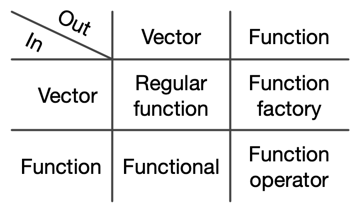

# (PART) Functional programming {-}

```{r, include = FALSE}
source("common.R")
```

# Introduction {#fp .unnumbered}  
\index{functional programming}

R, at its heart, is a __functional__ language. This means that it has certain technical properties, but more importantly that it lends itself to a style of problem solving centred on functions. Below I'll give a brief overview of the technical definition of a functional _language_, but in this book I will primarily focus on the functional _style_ of programming, because I think it is an extremely good fit to the types of problem you commonly encounter when doing data analysis.

Recently, functional techniques have experienced a surge in interest because they can produce efficient and elegant solutions to many modern problems. A functional style tends to create functions that can easily be analysed in isolation (i.e. using only local information), and hence is often much easier to automatically optimise or parallelise. The traditional weaknesses of functional languages, poorer performance and sometimes unpredictable memory usage, have been much reduced in recent years. Functional programming is complementary to object-oriented programming, which has been the dominant programming paradigm for the last several decades. 

## Functional programming languages {-}

Every programming language has functions, so what makes a programming language functional? There are many definitions for precisely what makes a language functional, but there are two common threads. 

Firstly, functional languages have __first-class functions__, functions that behave like any other data structure. In R, this means that you can do many of the things with a function that you can do with a vector: you can assign them to variables, store them in lists, pass them as arguments to other functions, create them inside functions, and even return them as the result of a function. 

Secondly, many functional languages require functions to be __pure__. A function is pure if it satisfies two properties:

* The output only depends on the inputs, i.e. if you call it again with the 
  same inputs, you get the same outputs. This excludes functions like `runif()`,
  `read.csv()`, or `Sys.time()` that can return different values.

* The function has no side-effects, like changing the value of a global 
  variable, writing to disk, or displaying to the screen. This excludes 
  functions like `print()`, `write.csv()` and `<-`.

Pure functions are much easier to reason about, but obviously have significant downsides: imagine doing a data analysis where you couldn't generate random numbers or read files from disk. 

Strictly speaking, R isn't a functional programming _language_ because it doesn't require that you write pure functions. However, you can certainly adopt a functional style in parts of your code: you don't _have_ to write pure functions, but you often _should_. In my experience, partitioning code into functions that are either extremely pure or extremely impure tends to lead to code that is easier to understand and extends to new situations.

## Functional style {-}

It's hard to describe exactly what a functional _style_ is, but generally I think it means decomposing a big problem into smaller pieces, then solving each piece with a function or combination of functions. When using a functional style, you strive to decompose components of the problem into isolated functions that operate independently. Each function taken by itself is simple and straightforward to understand; complexity is handled by composing functions in various ways.

The following three chapters discuss the three key functional techniques that help you to decompose problems into smaller pieces:

* Chapter \@ref(functionals) shows you how to replace many for loops with 
  __functionals__ which are functions (like `lapply()`) that take another 
  function as an argument. Functionals allow you to take a function that solves 
  the problem for a single input and generalise it to handle any number of 
  inputs. Functionals are by far and away the most important technique and 
  you'll use them all the time in data analysis.

* Chapter \@ref(function-factories) introduces __function factories__: 
  functions that create functions. Function factories are less commonly
  used than functionals, but can allow you to elegantly partition work 
  between different parts of your code.

* Chapter \@ref(function-operators) shows you how to create __function
  operators__: functions that take functions as input and produce functions 
  as output. They are like adverbs, because they typically modify the operation 
  of a function.

Collectively, these types of function are called __higher-order functions__ and they fill out a two-by-two table:

```{r, echo = FALSE, out.width = NULL}

```
