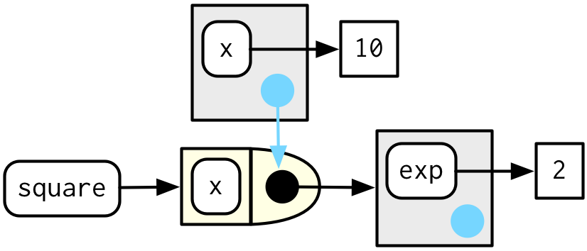

# Function factories
\index{function factories}

```{r, include = FALSE}
source("common.R")
```

## Introduction

A __function factory__ is a function that makes functions. Here's a very simple example: we use a function factory (`power1()`) to make two child functions (`square()` and `cube()`):

```{r}
power1 <- function(exp) {
  function(x) {
    x ^ exp
  }
}

square <- power1(2)
cube <- power1(3)
```

Don't worry if this doesn't make sense yet, it should by the end of the chapter!

\index{manufactured functions}
\index{functions!manufactured}
I'll call `square()` and `cube()` __manufactured functions__, but this is just a term to ease communication with other humans: from R's perspective they are no different to functions created any other way. 

```{r}
square(3)
cube(3)
```

You have already learned about the individual components that make function factories possible:

* In Section \@ref(first-class-functions), you learned about R's first-class 
  functions. In R, you bind a function to a name in the same way as you bind
  any object to a name: with `<-`.

* In Section \@ref(function-environments), you learned that a function
  captures (encloses) the environment in which it is created.

* In Section \@ref(execution-environments), you learned that a function 
  creates a new execution environment every time it is run. This environment
  is usually ephemeral, but here it becomes the enclosing environment of 
  the manufactured function.

In this chapter, you'll learn how the non-obvious combination of these three features leads to the function factory. You'll also see examples of their usage in visualisation and statistics.

Of the three main functional programming tools (functionals, function factories, and function operators), function factories are the least used. Generally, they don't tend to reduce overall code complexity but instead partition complexity into more easily digested chunks. Function factories are also an important building block for the very useful function operators, which you'll learn about in Chapter \@ref(function-operators).

### Outline {-}

* Section \@ref(factory-fundamentals) begins the chapter with an explanation
  of how function factories work, pulling together ideas from scoping and 
  environments. You'll also see how function factories can be used to implement
  a memory for functions, allowing data to persist across calls.

* Section \@ref(graph-fact) illustrates the use of function factories with 
  examples from ggplot2. You'll see two examples of how ggplot2 works
  with user supplied function factories, and one example of where ggplot2 
  uses a function factory internally.

* Section \@ref(stat-fact) uses function factories to tackle three challenges from
  statistics: understanding the Box-Cox transform, solving maximum likelihood
  problems, and drawing bootstrap resamples. 

* Section \@ref(functional-factories) shows how you can combine function 
  factories and functionals to rapidly generate a family of functions from data.

### Prerequisites {-}

Make sure you're familiar with the contents of Sections \@ref(first-class-functions) (first-class functions), \@ref(function-environments) (the function environment), and \@ref(execution-environments) (execution environments) mentioned above.

Function factories only need base R. We'll use a little [rlang](https://rlang.r-lib.org) to peek inside of them more easily, and we'll use [ggplot2](https://ggplot2.tidyverse.org) and [scales](https://scales.r-lib.org) to explore the use of function factories in visualisation.

```{r setup}
library(rlang)
library(ggplot2)
library(scales)
```

## Factory fundamentals

The key idea that makes function factories work can be expressed very concisely:

> The enclosing environment of the manufactured function is an execution
> environment of the function factory. 

It only takes few words to express these big ideas, but it takes a lot more work to really understand what this means. This section will help you put the pieces together with interactive exploration and some diagrams.

### Environments

Let's start by taking a look at `square()` and `cube()`:

```{r}
square

cube
```

It's obvious where `x` comes from, but how does R find the value associated with `exp`? Simply printing the manufactured functions is not revealing because the bodies are identical; the contents of the enclosing environment are the important factors. We can get a little more insight by using `rlang::env_print()`. That shows us that we have two different environments (each of which was originally an execution environment of `power1()`). The environments have the same parent, which is the enclosing environment of `power1()`, the global environment.

```{r}
env_print(square)

env_print(cube)
```

`env_print()` shows us that both environments have a binding to `exp`, but we want to see its value[^env_print]. We can do that by first getting the environment of the function, and then extracting the values:

```{r}
fn_env(square)$exp

fn_env(cube)$exp
```

This is what makes manufactured functions behave differently from one another: names in the enclosing environment are bound to different values.

[^env_print]: A future version of `env_print()` is likely to do better at summarising the contents so you don't need this step.

### Diagram conventions

We can also show these relationships in a diagram:

```{r, echo = FALSE, out.width = NULL}
knitr::include_graphics("diagrams/function-factories/power-full.png")
```

There's a lot going on this diagram and some of the details aren't that important. We can simplify considerably by using two conventions:

* Any free floating symbol lives in the global environment.

* Any environment without an explicit parent inherits from the global 
  environment.

```{r, echo = FALSE, out.width = NULL}
knitr::include_graphics("diagrams/function-factories/power-simple.png")
```

This view, which focuses on the environments, doesn't show any direct link between `cube()` and `square()`. That's because the link is the through the body of the function, which is identical for both, but is not shown in this diagram.

To finish up, let's look at the execution environment of `square(10)`. When `square()` executes `x ^ exp` it finds `x` in the execution environment and `exp` in its enclosing environment.

```{r}
square(10)
```

```{r, echo = FALSE, out.width = NULL}

```

### Forcing evaluation
\indexc{lazy evaluation}
\indexc{force()}

There's a subtle bug in `power1()` caused by lazy evaluation. To see the problem we need to introduce some indirection:

```{r}
x <- 2
square <- power1(x)
x <- 3
```

What should `square(2)` return? You would hope it returns 4:

```{r}
square(2)
```

Unfortunately it doesn't because `x` is only evaluated lazily when `square()` is run, not when `power1()` is run. In general, this problem will arise whenever a binding changes in between calling the factory function and calling the manufactured function. This is likely to only happen rarely, but when it does, it will lead to a real head-scratcher of a bug. 

We can fix this problem by __forcing__ evaluation with `force()`:

```{r}
power2 <- function(exp) {
  force(exp)
  function(x) {
    x ^ exp
  }
}

x <- 2
square <- power2(x)
x <- 3
square(2)
```

Whenever you create a function factory, make sure every argument is evaluated, using `force()` as necessary if the argument is only used by the manufactured function.

### Stateful functions {#stateful-funs}
\indexc{<<-} 
\index{copy-on-modify!exceptions}

Function factories also allow you to maintain state across function invocations, which is generally hard to do because of the fresh start principle described in Section \@ref(fresh-start).

There are two things that make this possible:

* The enclosing environment of the manufactured function is unique and constant.
  
* R has a special assignment operator, `<<-`, which modifies bindings in the 
  enclosing environment.
  
The usual assignment operator, `<-`, always creates a binding in the current environment. The __super assignment operator__, `<<-` rebinds an existing name found in a parent environment.

The following example shows how we can combine these ideas to create a function that records how many times it has been called:

```{r}
new_counter <- function() {
  i <- 0
  
  function() {
    i <<- i + 1
    i
  }
}

counter_one <- new_counter()
counter_two <- new_counter()
```

```{r, echo = FALSE, out.width = NULL}
knitr::include_graphics("diagrams/function-factories/counter-1.png")
```

When the manufactured function is run `i <<- i + 1` will modify `i` in its enclosing environment. Because manufactured functions have independent enclosing environments, they have independent counts:

```{r}
counter_one()
counter_one()
counter_two()
```

```{r, echo = FALSE, out.width = NULL}
knitr::include_graphics("diagrams/function-factories/counter-2.png")
```

Stateful functions are best used in moderation. As soon as your function starts managing the state of multiple variables, it's better to switch to R6, the topic of Chapter \@ref(r6).

### Garbage collection {#factory-pitfalls}
\index{garbage collector!manufactured functions}

With most functions, you can rely on the garbage collector to clean up any large temporary objects created inside a function. However, manufactured functions hold on to the execution environment, so you'll need to explicitly unbind any large temporary objects with `rm()`. Compare the sizes of `g1()` and `g2()` in the example below:

```{r}
f1 <- function(n) {
  x <- runif(n)
  m <- mean(x)
  function() m
}

g1 <- f1(1e6)
lobstr::obj_size(g1)

f2 <- function(n) {
  x <- runif(n)
  m <- mean(x)
  rm(x)
  function() m
}

g2 <- f2(1e6)
lobstr::obj_size(g2)
```

### Exercises

1.  The definition of `force()` is simple:

    ```{r}
    force
    ```
    
    Why is it better to `force(x)` instead of just `x`?

1.  Base R contains two function factories, `approxfun()` and `ecdf()`. 
    Read their documentation and experiment to figure out what the functions 
    do and what they return.

1.  Create a function `pick()` that takes an index, `i`, as an argument and 
    returns a function with an argument `x` that subsets `x` with `i`.

    ```{r, eval = FALSE}
    pick(1)(x)
    # should be equivalent to
    x[[1]]
    
    lapply(mtcars, pick(5))
    # should be equivalent to
    lapply(mtcars, function(x) x[[5]])
    ```
    
1.  Create a function that creates functions that compute the i^th^
    [central moment](http://en.wikipedia.org/wiki/Central_moment) of a numeric 
    vector. You can test it by running the following code:

    ```{r, eval = FALSE}
    m1 <- moment(1)
    m2 <- moment(2)

    x <- runif(100)
    stopifnot(all.equal(m1(x), 0))
    stopifnot(all.equal(m2(x), var(x) * 99 / 100))
    ```

1.  What happens if you don't use a closure? Make predictions, then verify with 
    the code below.

    ```{r}
    i <- 0
    new_counter2 <- function() {
      i <<- i + 1
      i
    }
    ```

1.  What happens if you use `<-` instead of `<<-`? Make predictions, then verify 
    with the code below.

    ```{r}
    new_counter3 <- function() {
      i <- 0
      function() {
        i <- i + 1
        i
      }
    }
    ```

## Graphical factories {#graph-fact}

We'll begin our exploration of useful function factories with a few examples from ggplot2. 

### Labelling

One of the goals of the [scales](http://scales.r-lib.org) package is to make it easy to customise the labels on ggplot2. It provides many functions to control the fine details of axes and legends. The formatter functions[^suffix] are a useful class of functions which make it easier to control the appearance of axis breaks. The design of these functions might initially seem a little odd: they all return a function, which you have to call in order to format a number.

```{r}
y <- c(12345, 123456, 1234567)
comma_format()(y)

number_format(scale = 1e-3, suffix = " K")(y)
```

[^suffix]: It's an unfortunate accident of history that scales uses function suffixes instead of function prefixes. That's because it was written before I understood the autocomplete advantages to using common prefixes instead of common suffixes.

In other words, the primary interface is a function factory. At first glance, this seems to add extra complexity for little gain. But it enables a nice interaction with ggplot2's scales, because they accept functions in the `label` argument:

```{r, out.width = "24%", fig.align="default", fig.width = 2, fig.height = 2, fig.asp = NULL}
df <- data.frame(x = 1, y = y)
core <- ggplot(df, aes(x, y)) + 
  geom_point() + 
  scale_x_continuous(breaks = 1, labels = NULL) +
  labs(x = NULL, y = NULL)
  
core
core + scale_y_continuous(
  labels = comma_format()
)
core + scale_y_continuous(
  labels = number_format(scale = 1e-3, suffix = " K")
)
core + scale_y_continuous(
  labels = scientific_format()
)
```

### Histogram bins

A little known feature of `geom_histogram()` is that the `binwidth` argument can be a function. This is particularly useful because the function is executed once for each group, which means you can have different binwidths in different facets, which is otherwise not possible.

To illustrate this idea, and see where variable binwidth might be useful, I'm going to construct an example where a fixed binwidth isn't great.

```{r, fig.width = 6, fig.height = 2.5, fig.asp = NULL, out.width = "90%"}
# construct some sample data with very different numbers in each cell
sd <- c(1, 5, 15)
n <- 100

df <- data.frame(x = rnorm(3 * n, sd = sd), sd = rep(sd, n))

ggplot(df, aes(x)) + 
  geom_histogram(binwidth = 2) + 
  facet_wrap(~ sd, scales = "free_x") + 
  labs(x = NULL)
```

Here each facet has the same number of observations, but the variability is very different. It would be nice if we could request that the binwidths vary so we get approximately the same number of observations in each bin. One way to do that is with a function factory that inputs the desired number of bins (`n`), and outputs a function that takes a numeric vector and returns a binwidth:

```{r, fig.width = 6, fig.height = 2.5, fig.asp = NULL, out.width = "90%"}
binwidth_bins <- function(n) {
  force(n)
  
  function(x) {
    (max(x) - min(x)) / n
  }
}

ggplot(df, aes(x)) + 
  geom_histogram(binwidth = binwidth_bins(20)) + 
  facet_wrap(~ sd, scales = "free_x") + 
  labs(x = NULL)
```

We could use this same pattern to wrap around the base R functions that automatically find the so-called optimal[^optimal] binwidth, `nclass.Sturges()`, `nclass.scott()`, and `nclass.FD()`:

```{r, fig.width = 6, fig.height = 2.5, fig.asp = NULL, out.width = "90%"}
base_bins <- function(type) {
  fun <- switch(type,
    Sturges = nclass.Sturges,
    scott = nclass.scott,
    FD = nclass.FD,
    stop("Unknown type", call. = FALSE)
  )
  
  function(x) {
    (max(x) - min(x)) / fun(x)
  }
}

ggplot(df, aes(x)) + 
  geom_histogram(binwidth = base_bins("FD")) + 
  facet_wrap(~ sd, scales = "free_x") + 
  labs(x = NULL)
```

[^optimal]: ggplot2 doesn't expose these functions directly because I don't think the definition of optimality needed to make the problem mathematically tractable is a good match to the actual needs of data exploration.

### `ggsave()`
\indexc{ggsave()}

Finally, I want to show a function factory used internally by ggplot2. `ggplot2:::plot_dev()` is used by `ggsave()` to go from a file extension (e.g. `png`, `jpeg` etc) to a graphics device function (e.g. `png()`, `jpeg()`). The challenge here arises because the base graphics devices have some minor inconsistencies which we need to paper over:

* Most have `filename` as first argument but some have `file`.

* The `width` and `height` of raster graphic devices use pixels units
  by default, but the vector graphics use inches.

A mildly simplified version of `plot_dev()` is shown below:

```{r}
plot_dev <- function(ext, dpi = 96) {
  force(dpi)
  
  switch(ext,
    eps =  ,
    ps  =  function(path, ...) {
      grDevices::postscript(
        file = filename, ..., onefile = FALSE, 
        horizontal = FALSE, paper = "special"
      )
    },
    pdf = function(filename, ...) grDevices::pdf(file = filename, ...),
    svg = function(filename, ...) svglite::svglite(file = filename, ...),
    emf = ,
    wmf = function(...) grDevices::win.metafile(...),
    png = function(...) grDevices::png(..., res = dpi, units = "in"),
    jpg = ,
    jpeg = function(...) grDevices::jpeg(..., res = dpi, units = "in"),
    bmp = function(...) grDevices::bmp(..., res = dpi, units = "in"),
    tiff = function(...) grDevices::tiff(..., res = dpi, units = "in"),
    stop("Unknown graphics extension: ", ext, call. = FALSE)
  )
}

plot_dev("pdf")
plot_dev("png")
```

### Exercises

1.  Compare and contrast `ggplot2::label_bquote()` with 
    `scales::number_format()`
    
## Statistical factories {#stat-fact}

More motivating examples for function factories come from statistics:

* The Box-Cox transformation.
* Bootstrap resampling. 
* Maximum likelihood estimation. 

All of these examples can be tackled without function factories, but I think function factories are a good fit for these problems and provide elegant solutions. These examples expect some statistical background, so feel free to skip if they don't make much sense to you.

### Box-Cox transformation
\index{Box-Cox transformation}

The Box-Cox transformation (a type of [power transformation](https://en.wikipedia.org/wiki/Power_transform)) is a flexible transformation often used to transform data towards normality. It has a single parameter, $\lambda$, which controls the strength of the transformation. We could express the transformation as a simple two argument function:

```{r}
boxcox1 <- function(x, lambda) {
  stopifnot(length(lambda) == 1)
  
  if (lambda == 0) {
    log(x)
  } else {
    (x ^ lambda - 1) / lambda
  }
}
```

But re-formulating as a function factory makes it easy to explore its behaviour with `stat_function()`:

```{r, out.width = "50%", fig.align="default", fig.width=4}
boxcox2 <- function(lambda) {
  if (lambda == 0) {
    function(x) log(x)
  } else {
    function(x) (x ^ lambda - 1) / lambda
  }
}

stat_boxcox <- function(lambda) {
  stat_function(aes(colour = lambda), fun = boxcox2(lambda), size = 1)
}

ggplot(data.frame(x = c(0, 5)), aes(x)) + 
  lapply(c(0.5, 1, 1.5), stat_boxcox) + 
  scale_colour_viridis_c(limits = c(0, 1.5))

# visually, log() does seem to make sense as the transformation
# for lambda = 0; as values get smaller and smaller, the function
# gets close and closer to a log transformation
ggplot(data.frame(x = c(0.01, 1)), aes(x)) + 
  lapply(c(0.5, 0.25, 0.1, 0), stat_boxcox) + 
  scale_colour_viridis_c(limits = c(0, 1.5))
```

In general, this allows you to use a Box-Cox transformation with any function that accepts a unary transformation function: you don't have to worry about that function providing `...` to pass along additional arguments. I also think that the partitioning of `lambda` and `x` into two different function arguments is natural since `lambda` plays quite a different role than `x`. 

### Bootstrap generators
\index{bootstrapping}

Function factories are a useful approach for bootstrapping. Instead of thinking about a single bootstrap (you always need more than one!), you can think about a bootstrap __generator__, a function that yields a fresh bootstrap every time it is called:

```{r}
boot_permute <- function(df, var) {
  n <- nrow(df)
  force(var)
  
  function() {
    col <- df[[var]]
    col[sample(n, replace = TRUE)]
  }
}

boot_mtcars1 <- boot_permute(mtcars, "mpg")
head(boot_mtcars1())
head(boot_mtcars1())
```

The advantage of a function factory is more clear with a parametric bootstrap where we have to first fit a model. We can do this setup step once, when the factory is called, rather than once every time we generate the bootstrap:

```{r}
boot_model <- function(df, formula) {
  mod <- lm(formula, data = df)
  fitted <- unname(fitted(mod))
  resid <- unname(resid(mod))
  rm(mod)

  function() {
    fitted + sample(resid)
  }
} 

boot_mtcars2 <- boot_model(mtcars, mpg ~ wt)
head(boot_mtcars2())
head(boot_mtcars2())
```

I use `rm(mod)` because linear model objects are quite large (they include complete copies of the model matrix and input data) and I want to keep the manufactured function as small as possible.

### Maximum likelihood estimation {#MLE}
\index{maximum likelihood}
\indexc{optimise()}
\indexc{optim()}

The goal of maximum likelihood estimation (MLE) is to find the parameter values for a distribution that make the observed data most likely. To do MLE, you start with a probability function. For example, take the Poisson distribution. If we know $\lambda$, we can compute the probability of getting a vector $\mathbf{x}$ of values ($x_1$, $x_2$, ..., $x_n$) by multiplying the Poisson probability function as follows:

\[ P(\lambda, \mathbf{x}) = \prod_{i=1}^{n} \frac{\lambda ^ {x_i} e^{-\lambda}}{x_i!} \]

In statistics, we almost always work with the log of this function. The log is a monotonic transformation which preserves important properties (i.e. the extrema occur in the same place), but has specific advantages:

* The log turns a product into a sum, which is easier to work with.

* Multiplying small numbers yields even smaller numbers, which makes the 
  floating point approximation used by a computer less accurate.

Let's apply a log transformation to this probability function and simplify it as much as possible:

\[ \log(P(\lambda, \mathbf{x})) = \sum_{i=1}^{n} \log(\frac{\lambda ^ {x_i} e^{-\lambda}}{x_i!}) \]

\[ \log(P(\lambda, \mathbf{x})) = \sum_{i=1}^{n} \left( x_i \log(\lambda) - \lambda - \log(x_i!) \right) \]

\[ \log(P(\lambda, \mathbf{x})) = 
     \sum_{i=1}^{n} x_i \log(\lambda)
   - \sum_{i=1}^{n} \lambda 
   - \sum_{i=1}^{n} \log(x_i!) \]

\[ \log(P(\lambda, \mathbf{x})) = 
   \log(\lambda) \sum_{i=1}^{n} x_i - n \lambda - \sum_{i=1}^{n} \log(x_i!) \]

We can now turn this function into an R function. The R function is quite elegant because R is vectorised and, because it's a statistical programming language, R comes with built-in functions like the log-factorial (`lfactorial()`).

```{r}
lprob_poisson <- function(lambda, x) {
  n <- length(x)
  (log(lambda) * sum(x)) - (n * lambda) - sum(lfactorial(x))
}
```

Consider this vector of observations:

```{r}
x1 <- c(41, 30, 31, 38, 29, 24, 30, 29, 31, 38)
```

We can use `lprob_poisson()` to compute the (logged) probability of `x1` for different values of `lambda`. 

```{r}
lprob_poisson(10, x1)
lprob_poisson(20, x1)
lprob_poisson(30, x1)
```

So far we’ve been thinking of `lambda` as fixed and known and the function told us the probability of getting different values of `x`. But in real-life, we observe `x` and it is `lambda` that is unknown. The likelihood is the probability function seen through this lens: we want to find the `lambda` that makes the observed `x` the most likely. That is, given `x`, what value of `lambda` gives us the highest value of `lprob_poisson`()?

In statistics, we highlight this change in perspective by writing $f_{\mathbf{x}}(\lambda)$ instead of $f(\lambda, \mathbf{x})$. In R, we can use a function factory. We provide `x` and generate a function with a single parameter, `lambda`:

```{r}
ll_poisson1 <- function(x) {
  n <- length(x)

  function(lambda) {
    log(lambda) * sum(x) - n * lambda - sum(lfactorial(x))
  }
}
```

(We don't need `force()` because `length()` implicitly forces evaluation of `x`.)

One nice thing about this approach is that we can do some precomputation: any term that only involves `x` can be computed once in the factory. This is useful because we're going to need to call this function many times to find the best `lambda`.

```{r}
ll_poisson2 <- function(x) {
  n <- length(x)
  sum_x <- sum(x)
  c <- sum(lfactorial(x))

  function(lambda) {
    log(lambda) * sum_x - n * lambda - c
  }
}
```

Now we can use this function to find the value of `lambda` that maximizes the (log) likelihood:

```{r}
ll1 <- ll_poisson2(x1)

ll1(10)
ll1(20)
ll1(30)
```

Rather than trial and error, we can automate the process of finding the best value with `optimise()`. It will evaluate `ll1()` many times, using mathematical tricks to narrow in on the largest value as quickly as possible. The results tell us that the highest value is `-30.27` which occurs when `lambda = 32.1`:

```{r}
optimise(ll1, c(0, 100), maximum = TRUE)
```

Now, we could have solved this problem without using a function factory because `optimise()` passes `...` on to the function being optimised. That means we could use the log-probability function directly:

```{r}
optimise(lprob_poisson, c(0, 100), x = x1, maximum = TRUE)
```

The advantage of using a function factory here is fairly small, but there are two niceties:

* We can precompute some values in the factory, saving computation time
  in each iteration.
  
* The two-level design better reflects the mathematical structure of 
  the underlying problem.

These advantages get bigger in more complex MLE problems, where you have multiple parameters and multiple data vectors. 

<!-- GVW: stepping back, what patterns in existing code should people look for that suggest "Hey, maybe use a function factory here"? -->

### Exercises

1.  In `boot_model()`, why don't I need to force the evaluation of `df` 
    or `model`?
    
1.  Why might you formulate the Box-Cox transformation like this?

    ```{r}
    boxcox3 <- function(x) {
      function(lambda) {
        if (lambda == 0) {
          log(x)
        } else {
          (x ^ lambda - 1) / lambda
        }
      }  
    }
    ```

1.  Why don't you need to worry that `boot_permute()` stores a copy of the 
    data inside the function that it generates?

1.  How much time does `ll_poisson2()` save compared to `ll_poisson1()`?
    Use `bench::mark()` to see how much faster the optimisation occurs.
    How does changing the length of `x` change the results?

## Function factories + functionals {#functional-factories}

To finish off the chapter, I'll show how you might combine functionals and function factories to turn data into many functions. The following code creates many specially named power functions by iterating over a list of arguments:

```{r}
names <- list(
  square = 2, 
  cube = 3, 
  root = 1/2, 
  cuberoot = 1/3, 
  reciprocal = -1
)
funs <- purrr::map(names, power1)

funs$root(64)
funs$root
```

This idea extends in a straightforward way if your function factory takes two (replace `map()` with `map2()`) or more (replace with `pmap()`) arguments.

\indexc{with()}
\indexc{attach()}
\indexc{env\_bind\_*}

One downside of the current construction is that you have to prefix every function call with `funs$`. There are three ways to eliminate this additional syntax:

*   For a very temporary effect, you can use `with()`: 

    ```{r}
    with(funs, root(100))
    ```
    
    I recommend this because it makes it very clear when code is being 
    executed in a special context and what that context is.

*   For a longer effect, you can `attach()` the functions to the search path, 
    then `detach()` when you're done:

    ```{r}
    attach(funs)
    root(100)
    detach(funs)
    ```
    
    You've probably been told to avoid using `attach()`, and that's generally
    good advice. However, the situation is a little different to the usual
    because we're attaching a list of functions, not a data frame. It's less 
    likely that you'll modify a function than a column in a data frame, so the
    some of the worst problems with `attach()` don't apply.

*   Finally, you could copy the functions to the global environment with 
    `env_bind()` (you'll learn about `!!!` in Section \@ref(tidy-dots)). 
    This is mostly permanent:
    
    ```{r}
    rlang::env_bind(globalenv(), !!!funs)
    root(100)
    ```
  
    You can later unbind those same names, but there's no guarantee that 
    they haven't been rebound in the meantime, and you might be deleting an
    object that someone else created.
    
    ```{r}
    rlang::env_unbind(globalenv(), names(funs))
    ```

You'll learn an alternative approach to the same problem in Section \@ref(new-function). Instead of using a function factory, you could construct the function with quasiquotation. This requires additional knowledge, but generates functions with readable bodies, and avoids accidentally capturing large objects in the enclosing scope. We use that idea in Section \@ref(tag-functions) when we work on tools for generating HTML from R.

### Exercises

1. Which of the following commands is equivalent to `with(x, f(z))`?

    (a) `x$f(x$z)`.
    (b) `f(x$z)`.
    (c) `x$f(z)`.
    (d) `f(z)`.
    (e) It depends.

1. Compare and contrast the effects of `env_bind()` vs. `attach()` for the 
   following code.
   
    ```{r}
    funs <- list(
      mean = function(x) mean(x, na.rm = TRUE),
      sum = function(x) sum(x, na.rm = TRUE)
    )
    
    attach(funs)
    mean <- function(x) stop("Hi!")
    detach(funs)
    
    env_bind(globalenv(), !!!funs)
    mean <- function(x) stop("Hi!") 
    env_unbind(globalenv(), names(funs))
    ```
