# Functionals {#functionals}

```{r, include = FALSE}
source("common.R")

cols <- function(x, n = 4) {
  pal <- scales::gradient_n_pal(c("white", x))
  col <- pal(seq(0, 1, length = n + 1)[-1])
  scales::show_col(col)
  col
}
cols("#FF9300")
cols("#8DD3FB")
```

## Introduction
\index{functionals}
\index{for loops}

> "To become significantly more reliable, code must become more transparent.
> In particular, nested conditions and loops must be viewed with great
> suspicion. Complicated control flows confuse programmers. Messy code often
> hides bugs."
>
> --- Bjarne Stroustrup

A __functional__ is a function that takes a function as an input and returns a vector as output. Here's a simple functional: it calls the function provided as input with 1000 random uniform numbers. 

```{r}
randomise <- function(f) f(runif(1e3))
randomise(mean)
randomise(mean)
randomise(sum)
```

The chances are that you've already used a functional. You might have used for-loop replacement like base R's `lapply()`, `apply()`, or `tapply()`, or maybe purrr's `map()` or variant; or maybe you've used a mathemetical functional like `integrate()` or `optim()`. All functionals take a function as input (among other things) and return a vector as output.

A common use of functionals is as an alternative to for loops. For loops have a bad rap in R. They have a reputation for being slow (although that reputation is only partly true, see Section \@ref(single-binding) for more details). But the real downside of for loops is that they're not very expressive. A for loop conveys that it's iterating over something, but doesn't clearly convey a high level goal. Instead of using a for loop, it's better to use a functional. Each functional is tailored for a specific task, so when you recognise the functional you immediately know why it's being used. Functionals play other roles as well as replacements for for-loops. They are useful for encapsulating common data manipulation tasks like split-apply-combine, for thinking "functionally", and for working with mathematical functions. 

Functionals reduce bugs in your code by better communicating intent. Functionals implemented in base R and purrr are well tested (i.e., bug-free) and efficient, because they're used by so many people. Many are written in C, and use special tricks to enhance performance. That said, using functionals will not always produce the fastest code. Instead, it helps you clearly communicate and build tools that solve a wide range of problems. It's a mistake to focus on speed until you know it'll be a problem. Once you have clear, correct code you can make it fast using the techniques you'll learn in Section \@ref(profiling).

### Outline {-}

<!--
* [My first functional: lapply()](#lapply) introduces your first functional:
  `lapply()`.

* [For loop functionals](#functionals-loop) shows you variants of `lapply()` 
  that produce different outputs, take different inputs, and distribute
  computation in different ways.

* [Data structure functionals](#functionals-ds) discusses functionals that 
  work with more complex data structures like matrices and arrays.

* [Functional programming](#functionals-fp) teaches you about the powerful
  `Reduce()` and `Filter()` functions which are useful for working with 
  lists.

* [Lists of functions](#lists-of-functions) shows how to put functions in a 
  list, and explains why you might care.

* [Mathematical functionals](#functionals-math) discusses functionals that you 
  might be familiar with from mathematics, like root finding, integration, and 
  optimisation.

* [Loops that shouldn't be converted to functions](#functionals-not) provides
  some important caveats about when you shouldn't attempt to convert a loop into
  a functional.

* [A family of functions](#function-family) finishes off the chapter by 
  showing you how functionals can take a simple building block and use it to
  create a set of powerful and consistent tools.
-->

### Prerequisites {-}

This chapter will focus on functionals provided by the purrr package. These functions have a consistent interface that makes it easier to understand the key ideas than their base equivalents, which have grown organically over many years. I'll compare and contrast base R functions as we go, and then wrap up the chapter with a discussion of base functionals that don't have purrr equivalents.

```{r setup}
library(purrr)
```

Many R users feel guilty about using for loops instead of apply functions. It's natural to blame yourself for failing to understand and internalise the apply family of functions. However, I think this is like blaming yourself when embarass yourself by failing to pull open a door when it's supposed to be pushed open[^norman-door]. It's not actually your fault, because many people suffer the same problem; it's a failing of design. Similarly, I think the reason why the apply functions are so hard for so many people is because their design is suboptimal.

[^norman-door]: These are sometimes called Norman doors after Don Norman who described them in his book, "The Design of Everyday Things". There's a nice video about them at <https://99percentinvisible.org/article/norman-doors/>.

## My first functional: `map()` {#map}
\indexc{map()}

The most fundamental functional is `purrr::map()`[^Map]. It takes a vector and a function, applies the function individually to each element in the vector, and returns the results in a list. In other words, `map(1:4, f)` yields `list(f(x[[1]]), f(x[[2]]), f(x[[3]]), f(x[[4]]))`. Or, graphically:

```{r, echo = FALSE, out.width = NULL}
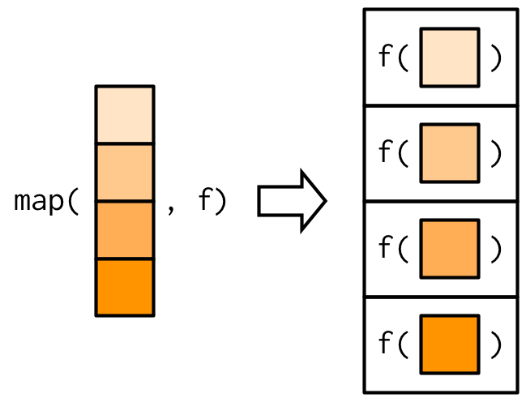
```

[^Map]: Not to be confused with `base::Map()`, which is considerably more complex and we'll come back to in Section \ref(pmap).

The implementation of `map()` is quite simple. We allocate a list the same length as the input, and then fill in the list with a for loop. The basic implementation is only a handful of lines of code:

```{r}
simple_map <- function(x, f, ...) {
  out <- vector("list", length(x))
  for (i in seq_along(x)) {
    out[[i]] <- f(x[[i]], ...)
  }
  out
}
```

The real `purrr::map()` function has a few differences: its written in C to eke out every last iota of performance, preserves names, and has a few helpers that you'll learn about shortly.

::: sidebar
You might wonder why this function is called `map()`. What does it have to do with depicting physical features of land or sea `r emo::ji("world_map")`? In fact, the meaning comes from mathematics where map refers to "an operation that associates each element of a given set with one or more elements of a second set". This makes sense here because `map()` defines a mapping from one vector to another. ("Map" also has the nice property of being short, which useful for such a fundamental building block.)
:::

::: base

The base equivalent to `map()` is `lapply()`. The only difference is that `lappy()` does not support the helpers that you'll learn about below, so if you're only using `map()` from purrr, you might as well skip the additional package and use `base::lapply()`.

:::

### Producing atomic vectors

`map()` returns a list which makes it very general because you can put anything in a list. But what if you want something simpler? There are four variatns, `map_lgl()`, `map_int()`, `map_dbl()` and `map_chr()`, that return atomic vectors:

```{r}
map_chr(mtcars, typeof)
map_lgl(mtcars, is.double)
map_dbl(mtcars, mean)
n_unique <- function(x) length(unique(x))
map_int(mtcars, n_unique)
```

Like `map()`, the input and the output must be the same length, so you can not return multiple values:

```{r, error = TRUE}
pair <- function(x) c(x, x)
map_dbl(1:4, pair)

map(1:3, pair)
```

::: base
Base R has two functions similar to these variants: `sapply()` and `vapply()`. `sapply()` tries to simplify the result to an atomic vector, whereever possible. But this simplifiation depends on the input, so sometimes you'll get a list, sometimes a vector, and sometimes a matrix. This makes it difficult to program with. `vapply()` allows you to provide a template that describes the output shape. If you want to stick to with base R code you should always use `vapply()` in your functions, not `sapply()`. The primary downside of `vapply()` is its vebosity: the equivalent to `map_dbl(x, mean, na.rm = TRUE)` is `vapply(x, mean, na.rm = TRUE, FUN.VALUE = double())`.
:::

### Anonymous functions and helpers

Instead of using `map()` with an existing function, you can create an inline anonymous function (as mentioned in Section \ref(first-class-functions)):

```{r}
map_dbl(mtcars, function(x) length(unique(x)))
```

Anonymous functions are very useful, but the syntax is verbose. So purrr offers a shorthand:

```{r}
map_dbl(mtcars, ~ length(unique(.x)))
```

Inside all purrr functions you can create an anonymous function using a `~` (the usual formula operator, pronouned "twiddle"). You can see what happens by calling `as_mapper()` explicitly (this is usually done automatically):

```{r}
as_mapper(~ length(unique(.x)))
```

The function arguments are a little quirky but allow you to refer to `.`, `.x` and `.y.` or `..1`, `..2`, `..3`, etc.

purrr also provides helpers for extracting elements from a vector, powered by  `purrr::pluck()`. Use a character vector to select elements by name, an integer vector to select by position, or a list to select by both name and position. These are very useful for working with deeply nested lists as often arises when working with data stored in JSON.

```{r, error = TRUE}
x <- list(
  list(-1, x = 1, y = c(2), z = "a"),
  list(-2, x = 4, y = c(5, 6), z = "b"),
  list(-3, x = 8, y = c(9, 10, 11))
)

# Select by name
map_dbl(x, "x")

# Or by position
map_dbl(x, 1)

# Or by both
map_dbl(x, list("y", 1))

# You'll get an error if a component doesn't exist:
map_chr(x, "z")
# Unless you supply a .default value
map_chr(x, "z", .default = NA)
```

### Passing arguments with `...` {#passing-arguments}

It's often necessary to pass on along additional constant arguments to the function that you're calling. For example, you might want to pass `na.rm = TRUE` along to `mean()`. One way to do that is with an anonymous function:

```{r}
x <- list(1:5, c(1:10, NA))
map_dbl(x, ~ mean(.x, na.rm = TRUE))
```

But because the map functions pass `...` along, there's a simpler form available:

```{r}
map_dbl(x, mean, na.rm = TRUE)
```

This is easiest to understand with a picture: any arguments that come after `f` in the call to `map()` after inserted after the data in individual calls to `f()`:

```{r, echo = FALSE, out.width = NULL}
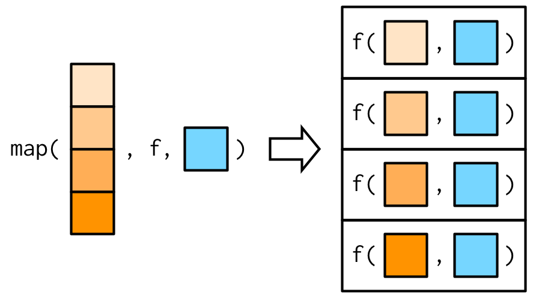
```

Just note that moviing arguments inside an anonymous function means that they will be evaluated every time, not once when you call `map()`. This is easiest to see if we make the additional argument random:

```{r}
plus <- function(x, y) x + y

x <- c(0, 0, 0, 0)
map_dbl(x, plus, runif(1))
map_dbl(x, ~ plus(.x, runif(1)))
```

This gives a useful pattern for generating random data:

```{r}
x <- map(1:3, ~ runif(2))
str(x)
```

In the diagrams, I'm omitted argument names to focus on the big ideas. But I recommend writing out the full names in your code, as it makes it easier to read. `map(x, mean, 0.1)` is perfectly valid code, but it relies on the reader remembering that the second argument to `mean()` is `trim`; it's better to be explicit and write `map(x, mean, 0.1)`.

This is the reason why the arguments to `map()` are a little odd: instead of being `x` and `f`, they are `.x` and `.f`. It's easiest to see why this is a problem using `simple_map()` defined above. `simple_map()` has arguments `x` and `f` so you'll have problems:

```{r, error = TRUE}
boostrap_summary <- function(x, f) {
  f(sample(x, replace = TRUE))
}

simple_map(mtcars, boostrap_summary, f = mean)
```

The error is a little bewildering until you remember that the call to `simple_map()` is equivalent to `simple_map(x = mtcars, f = mean, bootstrap_summary)` because named matching beats positional matching. purrr functions reduce the likelihood of this occuring by using `.f` and `.x` instead of the more common `f` and `x`. Of course this technique isn't perfect, but it avoids 99% of issues, and you can still always use an anonymous function if it's causes a problem.

::: base

Base functions that pass `...` use a variety of naming conventions to prevent undesired argument matching. The apply family mostly uses capital letters (e.g `X` and `FUN`). `transform()` uses more exotic prefix `_`: this makes the name non-syntactic so it must always be surrounded in `` ` ``, as described in Section \@ref(non-syntactic).

:::

### Varying another argument

So far the first argument to `map()` has always become the first argument to the function. But what happens if the first argument should be constant, and you want to vary a different argument? How do I get the resutlt in this picture?

```{r, echo = FALSE, out.width = NULL}
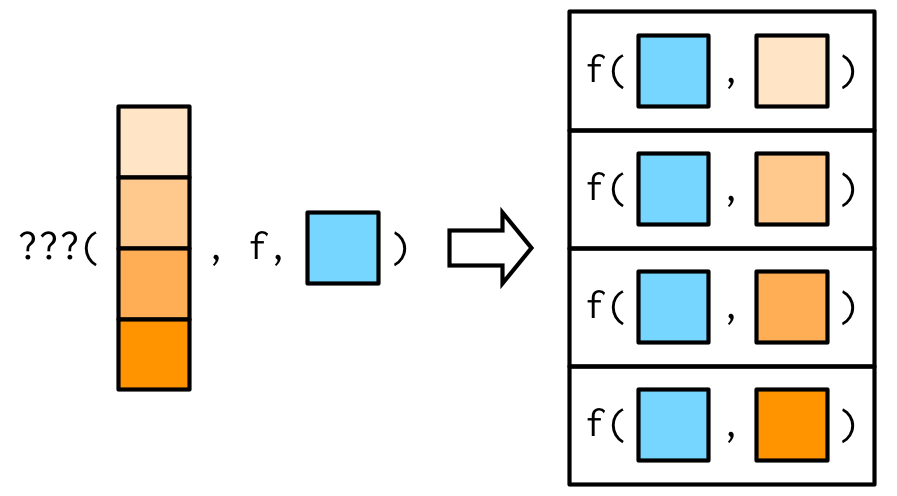
```

There's no way to do it directly with an existing purrr function, but there are two tricks you can use. To illustrate them, imagine I have a vector that contains a few unusual values, and I want to explore the effective of different amounts of trimming when computing the mean.

```{r}
trims <- c(0, 0.1, 0.2, 0.5)
x <- rcauchy(1000)
```

*   The simplest technique is to use an anonymous function to rearrange the 
    argument order:

    ```{r}
    map_dbl(trims, ~ mean(x, trim = .x))
    ```

*   Sometimes, if you want to be (too) clever, you can take advantage of R's 
    flexible argument matching rules (as described in Section 
    \ref(prefix-form)). For example, in this case `trim` is the second 
    argument to `mean()`, so you can rewrite `mean(x, trim = 0.1)` as
    `mean(0.1, x = x)` which leads to:

    ```{r}
    map_dbl(trims, mean, x = x)
    ```
    
    I don't recommend this technique as it relies on the reader
    being very familiar with both the argument order to `.f`, and R's 
    argument matching rules.

### Exercises

1.  Use `as_mapper()` to explore how purrr generates anonymous functions for
    the integer, character, and list helpers. What helper allows you to 
    extract attributes?
    
1.  The following code uses a map nested inside another map to apply a
    function to every element of a nested list. Why does it fail, and 
    what do you need to do to make it work?

    ```{r, eval = FALSE}
    x <- list(
      list(1, c(3, 9)),
      list(c(3, 6), 7, c(4, 7, 6))
    )
    
    triple <- function(x) x * 3
    
    map(x, map, .f = triple)
    ```

1.  Because map functions have consistent inputs and outputs they work
    very naturally with the pipe. Describe what the following code does in 
    words, and identify the key idea used in each line.
    
    ```{r}
    mtcars %>% 
      split(mtcars$cyl) %>% 
      map(~ lm(mpg ~ wt, data = .x)) %>% 
      map(coef) %>% 
      map_dbl(1)
    ```

## Map variants {#functionals-loop}

There are 14 more variations of `map()` that you should know about. This sounds like a lot (!) but fortunately you only need to learn four new ideas:

* Returning atomic vectors `_lgl`, `_int`, `_dbl` and `_chr` suffixes
* Iteration over two inputs: `map2()`
* Returning nothing: `walk()`
* Iterating over any number of inputs: `pmap()`

The design of purrr makes the input and output orthogonal so combining `map()` with the four ideas above generates a large table of functions:

|               | List     | Atomic                                                 | Nothing   |
|---------------|----------|--------------------------------------------------------|-----------|
| One argument  | `map()`  | `map_lgl()`, `map_int()`, `map_dbl()`, `map_chr()`     | `walk()`  |
| Two arguments | `map2()` | `map2_lgl()`, `map2_int()`, `map2_dbl()`, `map2_chr()` | `walk2()` |
| N arguments   | `pmap()` | `pmap_lgl()`, `pmap_int()`, `pmap_dbl()`, `pmap_chr()` | `pwalk()` |

Mastering a column allows you to combine it with all the rows you all ready know and vice versa.

### Two inputs: `map2()` and friends {#map2}
\indexc{map2()}

`map()` is vectorsed over a single argument. This makes it poorly suited for some problems. For example, how would you find a weighted mean when you have two lists, one of observations and the other of weights?

```{r}
# Generate some sample data
xs <- map(1:8, ~ runif(10))
ws <- map(1:8, ~ rpois(10, 5) + 1)
```

You can use `map_dbl()` to compute the unweighted means:

```{r}
map_dbl(xs, mean)
```

But switching to  `ws` as an additional argument doesn't work:

```{r, error = TRUE}
map_dbl(xs, weighted.mean, w = ws)
```

```{r, echo = FALSE, out.width = NULL}
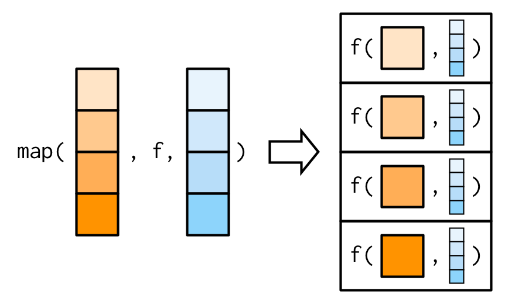
```

We need a new tool: a `map2()`, which is vectorised over two arguments:

```{r}
map2_dbl(xs, ws, weighted.mean)
```
```{r, echo = FALSE, out.width = NULL}
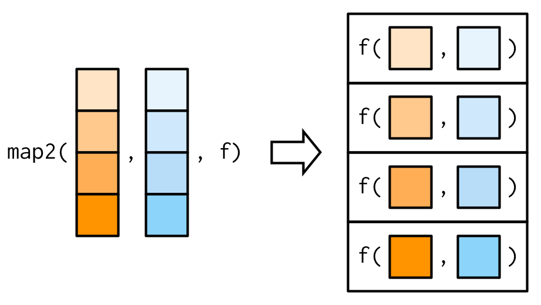
```

Note that the argument list is a now little different: there are two vectors before the function, not just one. Additional arguments can still come after the function.

```{r}
map2_dbl(xs, ws, weighted.mean, na.rm = TRUE)
```
```{r, echo = FALSE, out.width = NULL}
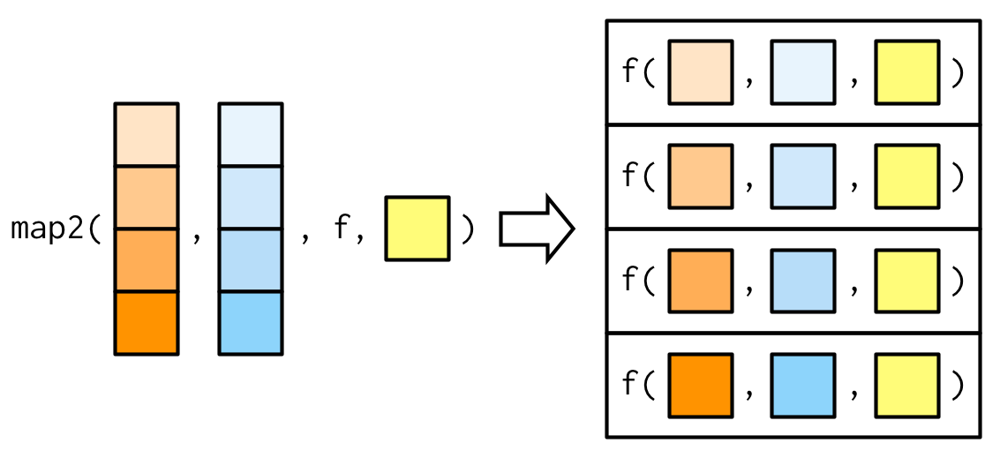
```

The basic implementation `map2()` is simple, and very similar to the basic imeplementation `map()`. The only difference is that we now subset two vectors, instead of one. This leads to the following basic implementation:

```{r}
simple_map2 <- function(x, y, f, ...) {
  out <- vector("list", length(xs))
  for (i in seq_along(x)) {
    out[[i]] <- f(x[[i]], y[[i]], ...)
  }
  out
}
```

One of the big differences between `map2()` and the simple function above is that `map2()` recycles its inputs to make sure that they're the same length:

```{r, echo = FALSE, out.width = NULL}
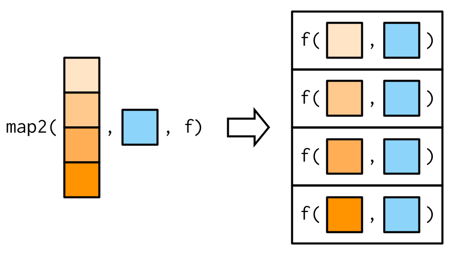
```

In other words, `map2(x, y, f)` will automatically behave like `map(x, f, y)` when needed. This is helpful when writing functions; in scripts you'd just use the simpler form when possible.

::: base 
There is no base equivalent to `map2()`.
:::

### No outputs: `walk()` and friends

```{r, echo = FALSE, out.width = NULL}
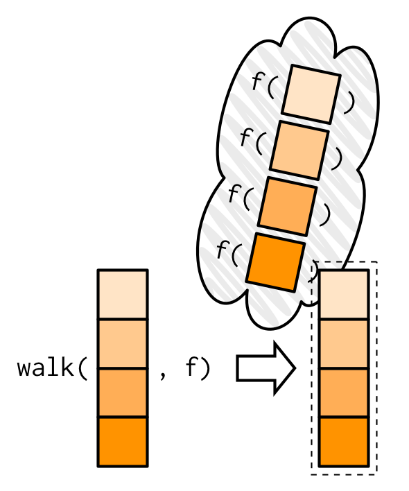
```

One of the most useful `walk()` variants is `walk2()` because a very common side-effect is saving something to disk, so you end with a pair of values: the object and the file name to save it to.

```{r, echo = FALSE, out.width = NULL}
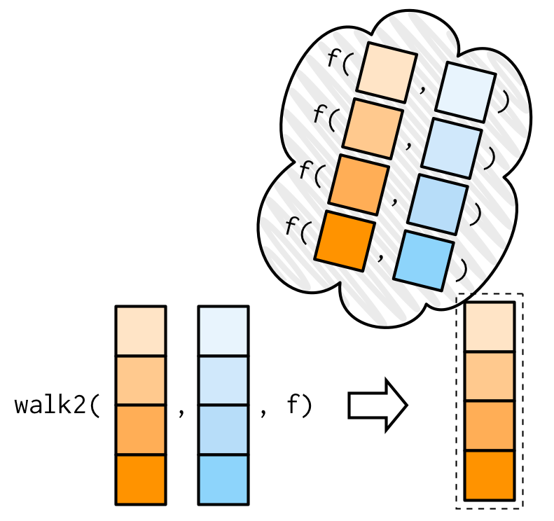
```

### Any number of inputs: `pmap()` and friends {#pmap}

::: base

You may be more familiar with `mapply()` than `Map()`. I prefer `Map()` because:

* It's equivalent to `mapply` with `simplify = FALSE`, which is almost always 
  what you want.

* Instead of using an anonymous function to provide constant inputs, `mapply` 
  has the `MoreArgs` argument that takes a list of extra arguments that will 
  be supplied, as is, to each call. This breaks R's usual lazy evaluation 
  semantics, and is inconsistent with other functions.

In brief, `mapply()` adds more complication for little gain. \indexc{mapply()}
:::

```{r, echo = FALSE, out.width = NULL}
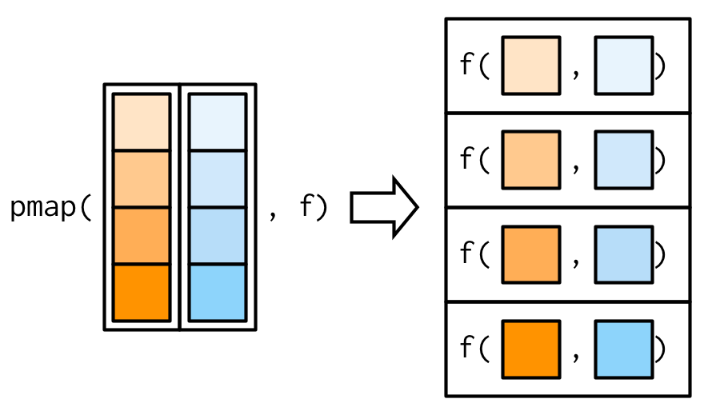
```

```{r, echo = FALSE, out.width = NULL}
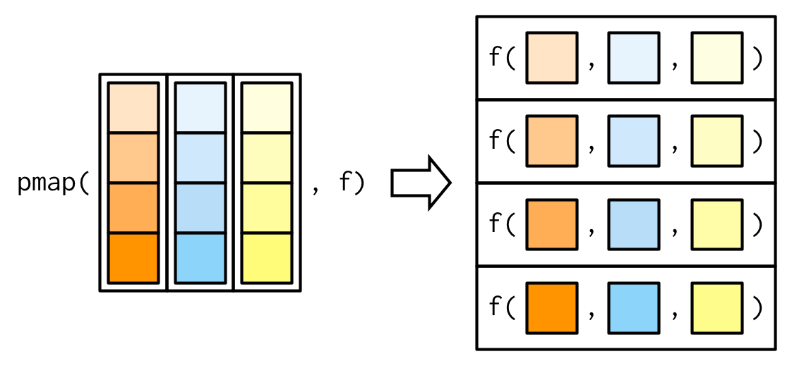
```

```{r, echo = FALSE, out.width = NULL}
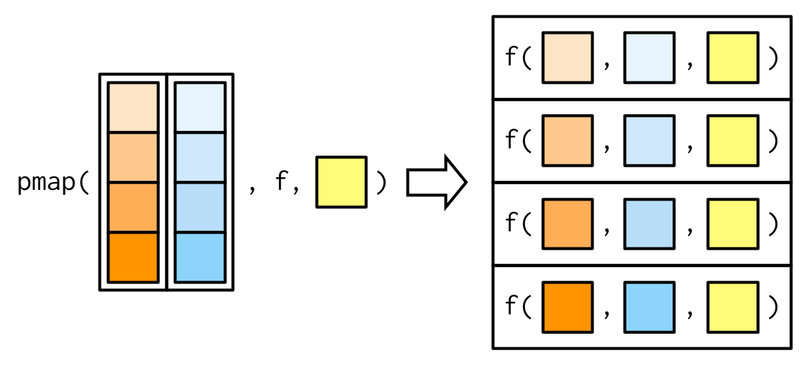
```

## Map extensions

As well as the basic variants of `map()` described enough, there are more extreme extensions that:

* Modify objects "in place".

* Allow you to work with list of functions.

* Spread computation across multiple cores (or multiple computers).

### Modify in place


### Lists of functions {#lists-of-functions}

In R, functions can be stored in lists. This makes it easier to work with groups of related functions, in the same way a data frame makes it easier to work with groups of related vectors. \index{lists!of functions}

We'll start with a simple benchmarking example. Imagine you are comparing the performance of multiple ways of computing the arithmetic mean. You could do this by storing each approach (function) in a list:

```{r}
compute_mean <- list(
  base = function(x) mean(x),
  sum = function(x) sum(x) / length(x),
  manual = function(x) {
    total <- 0
    n <- length(x)
    for (i in seq_along(x)) {
      total <- total + x[i] / n
    }
    total
  }
)
```


Calling a function from a list is straightforward. You extract it then call it:

```{r}
x <- runif(1e5)
system.time(compute_mean$base(x))
system.time(compute_mean[[2]](x))
system.time(compute_mean[["manual"]](x))
```

To call each function (e.g., to check that they all return the same results), use `lapply()`. We'll need either an anonymous function or a new named function, since there isn't a built-in function to handle this situation.

```{r, eval = FALSE}
map(compute_mean, function(f) f(x))
map(compute_mean, ~ .x(x))
```

### Parallelisation
\index{parallel computing} 
\index{multicore}
\index{bootstrapping}

One interesting thing about the implementation of `map()` is that because each iteration is isolated from all others, the order in which they are computed doesn't matter. This has a very important consequence: since we can compute each element in any order, it's easy to dispatch the tasks to different cores, and compute them in parallel. This is the idea behind the furrr package which combines the interface of purrr with the backends of future.

```{r}
library(furrr)
future::plan(multiprocess)
```

```{r, cache = TRUE}
boot_df <- function(x) x[sample(nrow(x), replace = T), ]
rsquared <- function(mod) summary(mod)$r.squared
boot_lm <- function(i) {
  rsquared(lm(mpg ~ wt + disp, data = boot_df(mtcars)))
}

system.time(lapply(1:500, boot_lm))
system.time(parallel::mclapply(1:500, boot_lm, mc.cores = 4))
system.time(future_map(1:500, boot_lm))
```

While increasing the number of cores will not always lead to linear improvement, switching from `lapply()` or `Map()` to its parallelised forms can dramatically improve computational performance.

### Exercises

1.  Use `vapply()` to:
    
    a) Compute the standard deviation of every column in a numeric data frame.
    
    a) Compute the standard deviation of every numeric column in a mixed data
       frame. (Hint: you'll need to use `vapply()` twice.)

1.  The following code simulates the performance of a t-test for non-normal 
    data. Use `sapply()` and an anonymous function to extract the p-value from 
    every trial.

    ```{r}
    trials <- replicate(
      100, 
      t.test(rpois(10, 10), rpois(7, 10)),
      simplify = FALSE
    )
    ```
    
    Extra challenge: get rid of the anonymous function by using `[[` directly.

1.  What does `replicate()` do? What sort of for loop does it eliminate? Why 
    do its arguments differ from `lapply()` and friends?

1.  Implement a version of `lapply()` that supplies `FUN` with both the name 
    and the value of each component.

1.  Implement a combination of `Map()` and `vapply()` to create an `lapply()`
    variant that iterates in parallel over all of its inputs and stores its 
    outputs in a vector (or a matrix). What arguments should the function 
    take?

1.  Implement `mcsapply()`, a multicore version of `sapply()`. Can you
    implement `mcvapply()`, a parallel version of `vapply()`? Why or why not?

## Creating your own functional: rolling computations

What if you need a for loop replacement that doesn't exist in base R? You can often create your own by recognising common looping structures and implementing your own wrapper. For example, you might be interested in smoothing your data using a rolling (or running) mean function: \index{rolling calculation}

```{r roll-mean, small_mar = TRUE, fig.width = 3, fig.height = 2}
rollmean <- function(x, n) {
  out <- rep(NA, length(x))

  offset <- trunc(n / 2)
  for (i in (offset + 1):(length(x) - n + offset + 1)) {
    out[i] <- mean(x[(i - offset):(i + offset - 1)])
  }
  out
}
x <- seq(1, 3, length = 1e2) + runif(1e2)
plot(x)
lines(rollmean(x, 5), col = "blue", lwd = 2)
lines(rollmean(x, 10), col = "red", lwd = 2)
```

But if the noise was more variable (i.e., it has a longer tail), you might worry that your rolling mean was too sensitive to outliers. Instead, you might want to compute a rolling median.

```{r outliers, small_mar = TRUE, fig.width = 3, fig.height = 2}
x <- seq(1, 3, length = 1e2) + rt(1e2, df = 2) / 3
plot(x)
lines(rollmean(x, 5), col = "red", lwd = 2)
```

To change `rollmean()` to `rollmedian()`, all you need to do is replace `mean` with `median` inside the loop. But instead of copying and pasting to create a new function, we could extract the idea of computing a rolling summary into its own function: \indexc{rollapply()}

```{r roll-apply, small_mar = TRUE, fig.width = 3, fig.height = 2}
rollapply <- function(x, n, f, ...) {
  out <- rep(NA, length(x))

  offset <- trunc(n / 2)
  for (i in (offset + 1):(length(x) - n + offset + 1)) {
    out[i] <- f(x[(i - offset):(i + offset - 1)], ...)
  }
  out
}
plot(x)
lines(rollapply(x, 5, median), col = "red", lwd = 2)
```

You might notice that the internal loop looks pretty similar to a `vapply()` loop, so we could rewrite the function as:

```{r roll-apply-2}
rollapply <- function(x, n, f, ...) {
  offset <- trunc(n / 2)
  locs <- (offset + 1):(length(x) - n + offset + 1)
  num <- vapply(
    locs, 
    function(i) f(x[(i - offset):(i + offset)], ...),
    numeric(1)
  )

  c(rep(NA, offset), num)
}
```

This is effectively the same as the implementation in `zoo::rollapply()`, which provides many more features and much more error checking.

## Looping patterns
\index{loops!common patterns}
\index{loops!when to use}

It's useful to remember that there are three basic ways to loop over a vector: 

* Loop over the elements: `for (x in xs)`
* Loop over the numeric indices: `for (i in seq_along(xs))`
* Loop over the names: `for (nm in names(xs))`

And each has a direct analog with a functional.

These are also three common looping patterns that _don't_ have a functional equivalent: 

* Modifying in place.
* Recursive functions.
* While loops.

It's possible to torture these problems to use a functional, but it's not a good idea. You'll create code that is harder to understand, eliminating the main reason for using functionals in the first case.

### Looping patterns

The first form is usually not a good choice for a for loop because it leads to inefficient ways of saving output. With this form it's very natural to save the output by extending a data structure, like in this example:

```{r, eval = FALSE}
xs <- runif(1e3)
res <- c()
for (x in xs) {
  # This is slow!
  res <- c(res, sqrt(x))
}
```

This is slow because each time you extend the vector, R has to copy all of the existing elements. [Avoid copies](#avoid-copies) discusses this problem in more depth. Instead, it's much better to create the space you'll need for the output and then fill it in. This is easiest with the second form: \index{avoiding copies}

```{r, eval = FALSE}
res <- numeric(length(xs))
for (i in seq_along(xs)) {
  res[i] <- sqrt(xs[i])
}
```

Just as there are three basic ways to use a for loop, there are three basic ways to use `lapply()`:

```{r, eval = FALSE}
lapply(xs, function(x) {})
lapply(seq_along(xs), function(i) {})
lapply(names(xs), function(nm) {})
```

Typically you'd use the first form because `lapply()` takes care of saving the output for you. However, if you need to know the position or name of the element you're working with, you should use the second or third form. Both give you an element's position (`i`, `nm`) and value (`xs[[i]]`, `xs[[nm]]`). If you're struggling to solve a problem using one form, you might find it easier with another.

::: sidebar

Note that you can get the same effect by passing the name of the function as a string, rather than the function itself:

```{r}
sapply(1:5, "+", 3)
```

This works because because `sapply` can be given the name of a function instead of the function itself: if you read the source of `sapply()`, you'll see the first line uses `match.fun()` to find functions given their names. Functions in the purrr package don't do this, instead using character inputs as a shortcut for subsetting.

:::

### Modifying in place

If you need to modify part of an existing data frame, it's often better to use a for loop. For example, the following code performs a variable-by-variable transformation by matching the names of a list of functions to the names of variables in a data frame.

```{r}
trans <- list(
  disp = function(x) x * 0.0163871,
  am = function(x) factor(x, labels = c("auto", "manual"))
)
for(var in names(trans)) {
  mtcars[[var]] <- trans[[var]](mtcars[[var]])
}
```

We wouldn't normally use `lapply()` to replace this loop directly, but it is _possible_. Just replace the loop with `lapply()` by using `<<-`: \indexc{<<-}

```{r, eval = FALSE}
lapply(names(trans), function(var) {
  mtcars[[var]] <<- trans[[var]](mtcars[[var]])
})
```

The for loop is gone, but the code is longer and much harder to understand. The reader needs to understand `<<-` and how `x[[y]] <<- z` works (it's not simple!). In short, we've taken a simple, easily understood for loop, and turned it into something few people will understand: not a good idea!

### Recursive relationships

It's hard to convert a for loop into a functional when the relationship between elements is not independent, or is defined recursively. For example, exponential smoothing works by taking a weighted average of the current and previous data points. The `exps()` function below implements exponential smoothing with a for loop. \index{recurrence relations}

```{r}
exps <- function(x, alpha) {
  s <- numeric(length(x) + 1)
  for (i in seq_along(s)) {
    if (i == 1) {
      s[i] <- x[i]
    } else {
      s[i] <- alpha * x[i] + (1 - alpha) * s[i - 1]
    }
  }
  s
}
x <- runif(6)
exps(x, 0.5)
```

We can't eliminate the for loop because none of the functionals we've seen allow the output at position `i` to depend on both the input and output at position `i - 1`.

One way to eliminate the for loop in this case is to [solve the recurrence relation](http://en.wikipedia.org/wiki/Recurrence_relation#Solving) by removing the recursion and replacing it with explicit references. This requires a new set of mathematical tools, and is challenging, but it can pay off by producing a simpler function.

### While loops

Another type of looping construct in R is the `while` loop. It keeps running until some condition is met. `while` loops are more general than `for` loops: you can rewrite every for loop as a while loop, but you can't do the reverse.  For example, we could turn this for loop: \index{loops!while} \indexc{while}

```{r, eval = FALSE}
for (i in 1:10) print(i)
```

into this while loop:

```{r, eval = FALSE}
i <- 1
while(i <= 10) {
  print(i)
  i <- i + 1
}
```

Not every while loop can be turned into a for loop because many while loops don't know in advance how many times they will be run:

```{r, eval = FALSE}
i <- 0
while(TRUE) {
  if (runif(1) > 0.9) break
  i <- i + 1
}
```

This is a common problem when you're writing simulations.

In this case we can remove the loop by recognising a special feature of the problem. Here we're counting the number of failures before Bernoulli trial with p = 0.1 succeeds. This is a geometric random variable, so you could replace the code with `i <- rgeom(1, 0.1)`. Reformulating the problem in this way is hard to do in general, but you'll benefit greatly if you can do it for your problem.


### Exercises

1.  Why are the following two invocations of `lapply()` equivalent?

    ```{r, eval = FALSE}
    trims <- c(0, 0.1, 0.2, 0.5)
    x <- rcauchy(100)
    
    lapply(trims, function(trim) mean(x, trim = trim))
    lapply(trims, mean, x = x)
    ```

1.  The function below scales a vector so it falls in the range [0, 1]. How
    would you apply it to every column of a data frame? How would you apply it 
    to every numeric column in a data frame?

    ```{r}
    scale01 <- function(x) {
      rng <- range(x, na.rm = TRUE)
      (x - rng[1]) / (rng[2] - rng[1])
    }
    ```

1.  Use both for loops and `lapply()` to fit linear models to the
    `mtcars` using the formulas stored in this list:

    ```{r}
    formulas <- list(
      mpg ~ disp,
      mpg ~ I(1 / disp),
      mpg ~ disp + wt,
      mpg ~ I(1 / disp) + wt
    )
    ```

1.  Fit the model `mpg ~ disp` to each of the bootstrap replicates of `mtcars` 
    in the list below by using a for loop and `lapply()`. Can you do it 
    without an anonymous function?

    ```{r}
    bootstraps <- lapply(1:10, function(i) {
      rows <- sample(1:nrow(mtcars), rep = TRUE)
      mtcars[rows, ]
    })
    ```

1.  For each model in the previous two exercises, extract $R^2$ using the
    function below.

    ```{r}
    rsq <- function(mod) summary(mod)$r.squared
    ```


## Vector functionals {#functionals-fp}

Another way of thinking about functionals is as a set of general tools for altering, subsetting, and collapsing vectors. Every functional programming language has three tools for this: `Map()`, `Reduce()`, and `Filter()`. We've seen `Map()` already, and the following sections describe `Reduce()`, a powerful tool for extending two-argument functions, and `Filter()`, a member of an important class of functionals that work with predicates, functions that return a single `TRUE` or `FALSE`.

### Reduce

`Reduce()` reduces a vector, `x`, to a single value by recursively calling a function, `f`, two arguments at a time. It combines the first two elements with `f`, then combines the result of that call with the third element, and so on. Calling `Reduce(f, 1:3)` is equivalent to `f(f(1, 2), 3)`. Reduce is also known as fold, because it folds together adjacent elements in the list. \indexc{Reduce()} \index{fold}

The following two examples show what `Reduce` does with an infix and prefix function:

```{r, eval = FALSE}
Reduce(`+`, 1:3) # -> ((1 + 2) + 3)
Reduce(sum, 1:3) # -> sum(sum(1, 2), 3)
```

The essence of `Reduce()` can be described by a simple for loop:

```{r}
Reduce2 <- function(f, x) {
  out <- x[[1]]
  for(i in seq(2, length(x))) {
    out <- f(out, x[[i]])
  }
  out
}
```

The real `Reduce()` is more complicated because it includes arguments to control whether the values are reduced from the left or from the right (`right`), an optional initial value (`init`), and an option to output intermediate results (`accumulate`).

`Reduce()` is an elegant way of extending a function that works with two inputs into a function that can deal with any number of inputs. It's useful for implementing many types of recursive operations, like merges and intersections. (We'll see another use in the final case study.) Imagine you have a list of numeric vectors, and you want to find the values that occur in every element:

```{r}
l <- map(1:5, ~ sample(1:10, 15, replace = T))
str(l)
```

You could do that by intersecting each element in turn:

```{r}
intersect(intersect(intersect(intersect(l[[1]], l[[2]]),
  l[[3]]), l[[4]]), l[[5]])
```

That's hard to read. With `Reduce()`, the equivalent is:

```{r}
Reduce(intersect, l)
```

Map-reduce

### Predicate functionals
\index{predicates} 
\index{functions!predicate|see{predicates}}

A __predicate__ is a function that returns a single `TRUE` or `FALSE`, like `is.character`, `all`, or `is.NULL`. A predicate functional applies a predicate to each element of a list or data frame. There are three useful predicate functionals in base R: `Filter()`, `Find()`, and `Position()`. 

* `Filter()` selects only those elements which match the predicate.

* `Find()` returns the first element which matches the predicate (or the last 
  element if `right = TRUE`).

* `Position()` returns the position of the first element that matches the
  predicate (or the last element if `right = TRUE`).

The following example shows how you might use these functionals with a data frame:

```{r}
df <- data.frame(x = 1:3, y = c("a", "b", "c"))
detect(df, is.factor)
detect_index(df, is.factor)

str(keep(df, is.factor))
str(discard(df, is.factor))
```

### `map_if()` and `modify_if()`

\index{data frames!modifying each column}

Compare on data frame.

### Exercises

1.  Why isn't `is.na()` a predicate function? What base R function is closest
    to being a predicate version of `is.na()`?

1.  Use `Filter()` and `vapply()` to create a function that applies a summary 
    statistic to every numeric column in a data frame.

1.  What's the relationship between `which()` and `Position()`? What's
    the relationship between `where()` and `Filter()`?

1.  Implement `Any()`, a function that takes a list and a predicate function, 
    and returns `TRUE` if the predicate function returns `TRUE` for any of 
    the inputs. Implement `All()` similarly.

1.  Implement the `span()` function from Haskell: given a list `x` and a 
    predicate function `f`, `span` returns the location of the longest 
    sequential run of elements where the predicate is true. (Hint: you 
    might find `rle()` helpful.)

1.  Implement `arg_max()`. It should take a function and a vector of inputs, 
    and return the elements of the input where the function returns the highest 
    value. For example, `arg_max(-10:5, function(x) x ^ 2)` should return -10.
    `arg_max(-5:5, function(x) x ^ 2)` should return `c(-5, 5)`.
    Also implement the matching `arg_min()` function.

## Base functionals {#functionals-math}

Base R functionals have more of a mathematical/statistical flavour.

### Matrices and array operations

So far, all the functionals we've seen work with 1d input structures. The three functionals in this section provide useful tools for working with higher-dimensional data structures. `apply()` is a variant of `sapply()` that works with matrices and arrays. You can think of it as an operation that summarises a matrix or array by collapsing each row or column to a single number. It has four arguments: \indexc{apply()}

* `X`, the matrix or array to summarise
* `MARGIN`, an integer vector giving the dimensions to summarise over, 
  1 = rows, 2 = columns, etc.
* `FUN`, a summary function
* `...` other arguments passed on to `FUN`

A typical example of `apply()` looks like this

```{r}
a <- matrix(1:20, nrow = 5)
apply(a, 1, mean)
apply(a, 2, mean)
```

There are a few caveats to using `apply()`. It doesn't have a simplify argument, so you can never be completely sure what type of output you'll get. This  means that `apply()` is not safe to use inside a function unless you carefully check the inputs. `apply()` is also not idempotent in the sense that if the summary function is the identity operator, the output is not always the same as the input:

```{r}
a1 <- apply(a, 1, identity)
identical(a, a1)
identical(a, t(a1))
a2 <- apply(a, 2, identity)
identical(a, a2)
```

(You can put high-dimensional arrays back in the right order using `aperm()`, or use `plyr::aaply()`, which is idempotent.)

`sweep()` allows you to "sweep" out the values of a summary statistic. It is often used with `apply()` to standardise arrays. The following example scales the rows of a matrix so that all values lie between 0 and 1. \indexc{sweep()}

```{r}
x <- matrix(rnorm(20, 0, 10), nrow = 4)
x1 <- sweep(x, 1, apply(x, 1, min), `-`)
x2 <- sweep(x1, 1, apply(x1, 1, max), `/`)
```

The final matrix functional is `outer()`. It's a little different in that it takes multiple vector inputs and creates a matrix or array output where the input function is run over every combination of the inputs: \indexc{outer()}

```{r}
# Create a times table
outer(1:3, 1:10, "*")
```

Good places to learn more about `apply()` and friends are:

* ["Using apply, sapply, lapply in R"](http://petewerner.blogspot.com/2012/12/using-apply-sapply-lapply-in-r.html) by Peter Werner.

* ["The infamous apply function"](http://rforpublichealth.blogspot.no/2012/09/the-infamous-apply-function.html) by Slawa Rokicki.

* ["The R apply function - a tutorial with examples"](http://forgetfulfunctor.blogspot.com/2011/07/r-apply-function-tutorial-with-examples.html) by axiomOfChoice.

* The stackoverflow question ["R Grouping functions: `sapply` vs. `lapply` vs. `apply` vs. `tapply` vs. `by` vs. `aggregate`"](http://stackoverflow.com/questions/3505701).

### `tapply()`
\indexc{split()}

You can think about `tapply()` as a generalisation to `apply()` that allows for "ragged" arrays, arrays where each row can have a different number of columns. This is often needed when you're trying to summarise a data set. For example, imagine you've collected pulse rate data from a medical trial, and you want to compare the two groups: \indexc{tapply()}

```{r}
pulse <- round(rnorm(22, 70, 10 / 3)) + rep(c(0, 5), c(10, 12))
group <- rep(c("A", "B"), c(10, 12))

tapply(pulse, group, length)
tapply(pulse, group, mean)
```

`tapply()` works by creating a "ragged" data structure from a set of inputs, and then applying a function to the individual elements of that structure. The first task is actually what the `split()` function does. It takes two inputs and returns a list which groups elements together from the first vector according to elements, or categories, from the second vector:

```{r}
split(pulse, group)
```

Then `tapply()` is just the combination of `split()` and `sapply()`:

```{r}
tapply2 <- function(x, group, f, ..., simplify = TRUE) {
  pieces <- split(x, group)
  sapply(pieces, f, simplify = simplify)
}
tapply2(pulse, group, length)
tapply2(pulse, group, mean)
```

Being able to rewrite `tapply()` as a combination of `split()` and `sapply()` is a good indication that we've identified some useful building blocks. 

### Mathmatical

Functionals are very common in mathematics. The limit, the maximum, the roots (the set of points where `f(x) = 0`), and the definite integral are all functionals: given a function, they return a single number (or vector of numbers). At first glance, these functions don't seem to fit in with the theme of eliminating loops, but if you dig deeper you'll find out that they are all implemented using an algorithm that involves iteration.

In this section we'll use some of R's built-in mathematical functionals. There are three functionals that work with functions to return single numeric values: \indexc{integrate()} \indexc{uniroot()} \indexc{optimise()}

* `integrate()` finds the area under the curve defined by `f()`
* `uniroot()` finds where `f()` hits zero
* `optimise()` finds the location of lowest (or highest) value of `f()`

Let's explore how these are used with a simple function, `sin()`:

```{r}
integrate(sin, 0, pi)
str(uniroot(sin, pi * c(1 / 2, 3 / 2)))
str(optimise(sin, c(0, 2 * pi)))
str(optimise(sin, c(0, pi), maximum = TRUE))
```

### Exercises

1.  How does `apply()` arrange the output? Read the documentation and perform 
    some experiments.

1.  There's no equivalent to `split()` + `vapply()`. Should there be? When 
    would it be useful? Implement one yourself.

1.  Implement a pure R version of `split()`. (Hint: use `unique()` and 
    subsetting.) Can you do it without a for loop?

1.  What other types of input and output are missing? Brainstorm before you 
    look up some answers in the [plyr paper](http://www.jstatsoft.org/v40/i01/).

1.  Challenge: read about the 
    [fixed point algorithm](http://mitpress.mit.edu/sicp/full-text/book/book-Z-H-12.html#%_sec_1.3). 
    Complete the exercises using R.

