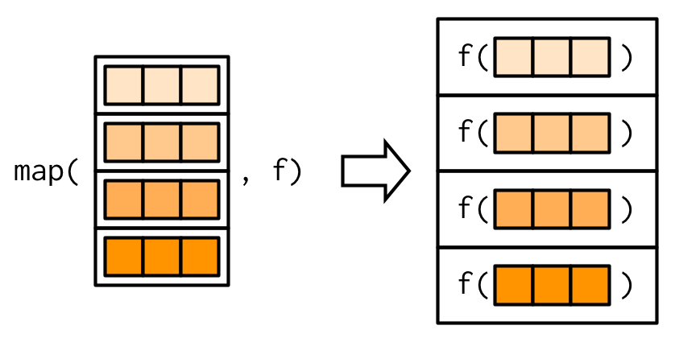
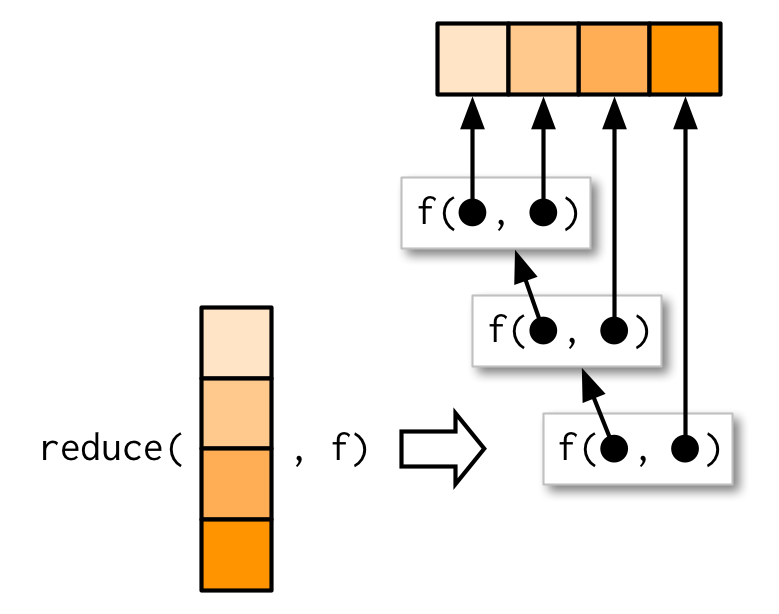
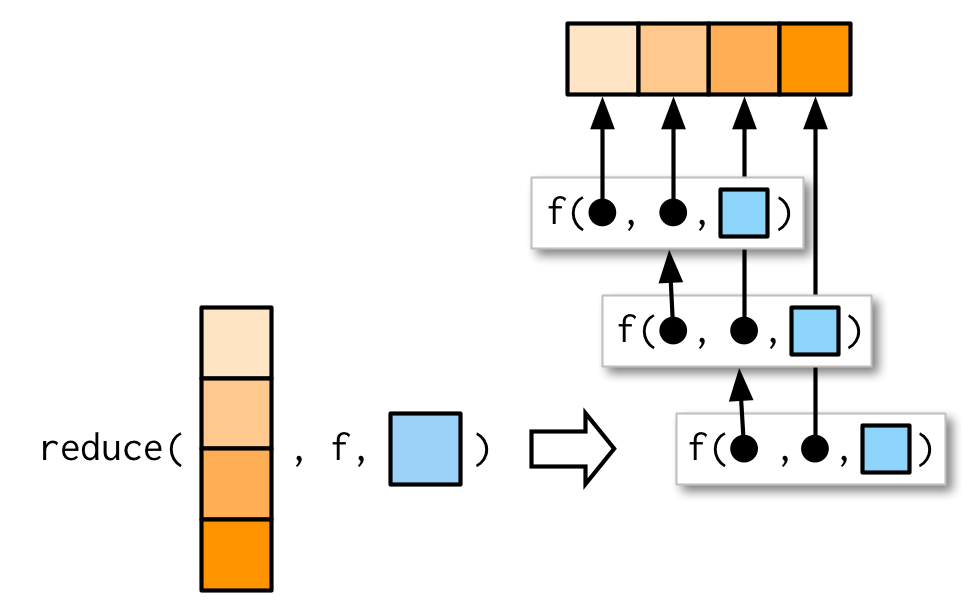
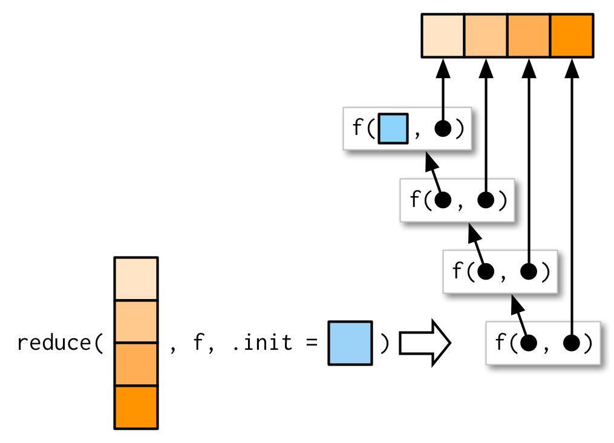
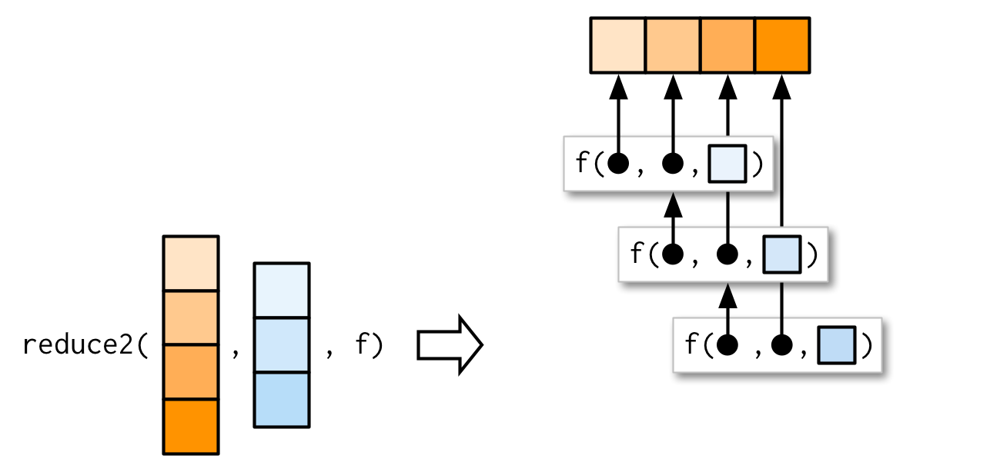
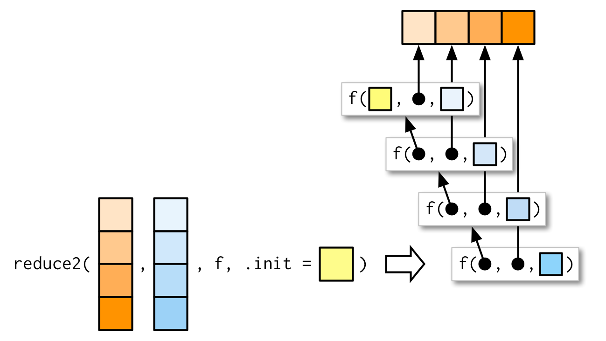

# Functionals {#functionals}

```{r, include = FALSE}
source("common.R")
source("emoji.R")

cols <- function(x, n = 4) {
  pal <- scales::gradient_n_pal(c("white", x))
  col <- pal(seq(0, 1, length = n + 1)[-1])
  scales::show_col(col)
  col
}

print.rlang_lambda_function <- function(x, ...) {
  print(unclass(x))
}
cols("#FF9300")
cols("#8DD3FB")
```

## Introduction
\index{functionals}

> To become significantly more reliable, code must become more transparent.
> In particular, nested conditions and loops must be viewed with great
> suspicion. Complicated control flows confuse programmers. Messy code often
> hides bugs.
>
> --- Bjarne Stroustrup

A __functional__ is a function that takes a function as an input and returns a vector as output. Here's a simple functional: it calls the function provided as input with 1000 random uniform numbers. 

```{r}
randomise <- function(f) f(runif(1e3))
randomise(mean)
randomise(mean)
randomise(sum)
```

The chances are that you've already used a functional. You might have used for-loop replacements like base R's `lapply()`, `apply()`, and `tapply()`; or purrr's `map()`; or maybe you've used a mathematical functional like `integrate()` or `optim()`. 

\index{loops!replacing}
A common use of functionals is as an alternative to for loops. For loops have a bad rap in R because many people believe they are slow[^not-slow], but the real downside of for loops is that they're very flexible: a loop conveys that you're iterating, but not what should be done with the results. Just as it's better to use `while` than `repeat`, and it's better to use `for` than `while` (Section \@ref(for-family)), it's better to use a functional than `for`. Each functional is tailored for a specific task, so when you recognise the functional you immediately know why it's being used.

[^not-slow]: Typically it's not the for loop itself that's slow, but what you're doing inside of it. A common culprit of slow loops is modifying a data structure, where each modification generates a copy. See Sections \@ref(single-binding) and \@ref(avoid-copies) for more details.

If you're an experienced for loop user, switching to functionals is typically a pattern matching exercise. You look at the for loop and find a functional that matches the basic form. If one doesn't exist, don't try and torture an existing functional to fit the form you need. Instead, just leave it as a for loop! (Or once you've repeated the same loop two or more times, maybe think about writing your own functional).

### Outline {-}

* Section \@ref(map) introduces your first functional: `purrr::map()`.

* Section \@ref(purrr-style) demonstrates how you can combine multiple simple
  functionals to solve a more complex problem and discusses how purrr style
  differs from other approaches.

* Section \@ref(map-variants) teaches you about 18 (!!) important variants of 
  `purrr::map()`. Fortunately, their orthogonal design makes them easy to 
  learn, remember, and master.

* Section \@ref(reduce) introduces a new style of functional: `purrr::reduce()`.
  `reduce()` systematically reduces a vector to a single result by applying
  a function that takes two inputs.

* Section \@ref(predicate-functionals) teaches you about predicates: functions
  that return a single `TRUE` or `FALSE`, and the family of functionals
  that use them to solve common problems.
  
* Section \@ref(base-functionals) reviews some functionals in base R that
  are not members of the map, reduce, or predicate families.

### Prerequisites {-}

This chapter will focus on functionals provided by the [purrr package](https://purrr.tidyverse.org) [@purrr]. These functions have a consistent interface that makes it easier to understand the key ideas than their base equivalents, which have grown organically over many years. I'll compare and contrast base R functions as we go, and then wrap up the chapter with a discussion of base functionals that don't have purrr equivalents.

```{r setup}
library(purrr)
```

## My first functional: `map()` {#map}
\indexc{map()}

The most fundamental functional is `purrr::map()`[^Map]. It takes a vector and a function, calls the function once for each element of the vector, and returns the results in a list. In other words, `map(1:3, f)` is equivalent to `list(f(1), f(2), f(3))`. 

```{r}
triple <- function(x) x * 3
map(1:3, triple)
```

Or, graphically:

```{r, echo = FALSE, out.width = NULL}
knitr::include_graphics("diagrams/functionals/map.png")
```

::: sidebar
You might wonder why this function is called `map()`. What does it have to do with depicting physical features of land or sea `r emoji("world_map")`? In fact, the meaning comes from mathematics where _map_ refers to "an operation that associates each element of a given set with one or more elements of a second set". This makes sense here because `map()` defines a mapping from one vector to another. (_"Map"_ also has the nice property of being short, which is useful for such a fundamental building block.)
:::

[^Map]: Not to be confused with `base::Map()`, which is considerably more complex. I'll discuss `Map()` in Section \@ref(pmap).

The implementation of `map()` is quite simple. We allocate a list the same length as the input, and then fill in the list with a for loop. The heart of the implementation is only a handful of lines of code:

```{r}
simple_map <- function(x, f, ...) {
  out <- vector("list", length(x))
  for (i in seq_along(x)) {
    out[[i]] <- f(x[[i]], ...)
  }
  out
}
```

The real `purrr::map()` function has a few differences: it is written in C to eke out every last iota of performance, preserves names, and supports a few shortcuts that you'll learn about in Section \@ref(purrr-shortcuts).

::: base
\indexc{lapply()}
The base equivalent to `map()` is `lapply()`. The only difference is that `lapply()` does not support the helpers that you'll learn about below, so if you're only using `map()` from purrr, you can skip the additional dependency and use `lapply()` directly.
:::

### Producing atomic vectors {#map-atomic}

`map()` returns a list, which makes it the most general of the map family because you can put anything in a list. But it is inconvenient to return a list when a simpler data structure would do, so there are four more specific variants: `map_lgl()`, `map_int()`, `map_dbl()`, and `map_chr()`. Each returns an atomic vector of the specified type:

```{r}
# map_chr() always returns a character vector
map_chr(mtcars, typeof)

# map_lgl() always returns a logical vector
map_lgl(mtcars, is.double)

# map_int() always returns a integer vector
n_unique <- function(x) length(unique(x))
map_int(mtcars, n_unique)

# map_dbl() always returns a double vector
map_dbl(mtcars, mean)
```

purrr uses the convention that suffixes, like `_dbl()`, refer to the output. All `map_*()` functions can take any type of vector as input. These examples rely on two facts: `mtcars` is a data frame, and data frames are lists containing vectors of the same length. This is more obvious if we draw a data frame with the same orientation as vector:

```{r, echo = FALSE, out.width = NULL}

```

All map functions always return an output vector the same length as the input, which implies that each call to `.f` must return a single value. If it does not, you'll get an error:

```{r, error = TRUE}
pair <- function(x) c(x, x)
map_dbl(1:2, pair)
```

This is similar to the error you'll get if `.f` returns the wrong type of result:

```{r, error = TRUE}
map_dbl(1:2, as.character)
```

In either case, it's often useful to switch back to `map()`, because `map()` can accept any type of output. That allows you to see the problematic output, and figure out what to do with it.

```{r}
map(1:2, pair)
map(1:2, as.character)
```

::: base
\indexc{sapply()}
\indexc{vapply()}

Base R has two apply functions that can return atomic vectors: `sapply()` and `vapply()`. I recommend that you avoid `sapply()` because it tries to simplify the result, so it can return a list, a vector, or a matrix. This makes it difficult to program with, and it should be avoided in non-interactive settings. `vapply()` is safer because it allows you to provide a template, `FUN.VALUE`, that describes the output shape. If you don't want to use purrr, I recommend you always use `vapply()` in your functions, not `sapply()`. The primary downside of `vapply()` is its verbosity: for example, the equivalent to `map_dbl(x, mean, na.rm = TRUE)` is `vapply(x, mean, na.rm = TRUE, FUN.VALUE = double(1))`.
:::

### Anonymous functions and shortcuts {#purrr-shortcuts}
\index{functions!anonymous}
\indexc{\textasciitilde}

Instead of using `map()` with an existing function, you can create an inline anonymous function (as mentioned in Section \@ref(first-class-functions)):

```{r}
map_dbl(mtcars, function(x) length(unique(x)))
```

Anonymous functions are very useful, but the syntax is verbose. So purrr supports a special shortcut:

```{r}
map_dbl(mtcars, ~ length(unique(.x)))
```

This works because all purrr functions translate formulas, created by `~` (pronounced "twiddle"), into functions. You can see what's happening behind the scenes by calling `as_mapper()`:

```{r}
as_mapper(~ length(unique(.x)))
```

The function arguments look a little quirky but allow you to refer to `.` for one argument functions, `.x` and `.y.` for two argument functions, and `..1`, `..2`, `..3`, etc, for functions with an arbitrary number of arguments. `.` remains for backward compatibility but I don't recommend using it because it's easily confused with the `.` used by magrittr's pipe.

This shortcut is particularly useful for generating random data:

```{r}
x <- map(1:3, ~ runif(2))
str(x)
```

Reserve this syntax for short and simple functions. A good rule of thumb is that if your function spans lines or uses `{}`, it's time to give it a name.

\indexc{pluck()}

The map functions also have shortcuts for extracting elements from a vector, powered by  `purrr::pluck()`. You can use a character vector to select elements by name, an integer vector to select by position, or a list to select by both name and position. These are very useful for working with deeply nested lists, which often arise when working with JSON. 

```{r, error = TRUE}
x <- list(
  list(-1, x = 1, y = c(2), z = "a"),
  list(-2, x = 4, y = c(5, 6), z = "b"),
  list(-3, x = 8, y = c(9, 10, 11))
)

# Select by name
map_dbl(x, "x")

# Or by position
map_dbl(x, 1)

# Or by both
map_dbl(x, list("y", 1))

# You'll get an error if a component doesn't exist:
map_chr(x, "z")

# Unless you supply a .default value
map_chr(x, "z", .default = NA)
```

::: base
In base R functions, like `lapply()`, you can provide the name of the function as a string. This isn't tremendously useful as `lapply(x, "f")` is almost always equivalent to `lapply(x, f)` and is more typing.
:::

### Passing arguments with `...` {#passing-arguments}
\indexc{...}
\index{vectorisation}

It's often convenient to pass along additional arguments to the function that you're calling. For example, you might want to pass `na.rm = TRUE` along to `mean()`. One way to do that is with an anonymous function:

```{r}
x <- list(1:5, c(1:10, NA))
map_dbl(x, ~ mean(.x, na.rm = TRUE))
```

But because the map functions pass `...` along, there's a simpler form available:

```{r}
map_dbl(x, mean, na.rm = TRUE)
```

This is easiest to understand with a picture: any arguments that come after `f` in the call to `map()` are inserted _after_ the data in individual calls to `f()`:

```{r, echo = FALSE, out.width = NULL}
knitr::include_graphics("diagrams/functionals/map-arg.png")
```

It's important to note that these arguments are not decomposed; or said another way, `map()` is only vectorised over its first argument. If an argument after `f` is a vector, it will be passed along as is:

```{r, echo = FALSE, out.width = NULL}
knitr::include_graphics("diagrams/functionals/map-arg-recycle.png")
```

(You'll learn about map variants that _are_ vectorised over multiple arguments in Sections \@ref(map2) and \@ref(pmap).)

Note there's a subtle difference between placing extra arguments inside an anonymous function compared with passing them to `map()`. Putting them in an anonymous function means that they will be evaluated every time `f()` is executed, not just once when you call `map()`. This is easiest to see if we make the additional argument random:

```{r}
plus <- function(x, y) x + y

x <- c(0, 0, 0, 0)
map_dbl(x, plus, runif(1))
map_dbl(x, ~ plus(.x, runif(1)))
```

### Argument names

In the diagrams, I've omitted argument names to focus on the overall structure. But I recommend writing out the full names in your code, as it makes it easier to read. `map(x, mean, 0.1)` is perfectly valid code, but will call `mean(x[[1]], 0.1)` so it relies on the reader remembering that the second argument to `mean()` is `trim`.  To avoid unnecessary burden on the brain of the reader[^future-you], be kind and write `map(x, mean, trim = 0.1)`.

[^future-you]: Who is highly likely to be future you!

This is the reason why the arguments to `map()` are a little odd: instead of being `x` and `f`, they are `.x` and `.f`. It's easiest to see the problem that leads to these names using `simple_map()` defined above. `simple_map()` has arguments `x` and `f` so you'll have problems whenever the function you are calling has arguments `x` or `f`:

```{r, error = TRUE}
boostrap_summary <- function(x, f) {
  f(sample(x, replace = TRUE))
}

simple_map(mtcars, boostrap_summary, f = mean)
```

<!-- GVW: a diagram here showing how the various f's and x's are matched to one another in the example above would be very helpful -->

The error is a little bewildering until you remember that the call to `simple_map()` is equivalent to `simple_map(x = mtcars, f = mean, bootstrap_summary)` because named matching beats positional matching. 

purrr functions reduce the likelihood of such a clash by using `.f` and `.x` instead of the more common `f` and `x`. Of course this technique isn't perfect (because the function you are calling might still use `.f` and `.x`), but it avoids 99% of issues. The remaining 1% of the time, use an anonymous function.

::: base
Base functions that pass along `...` use a variety of naming conventions to prevent undesired argument matching:

* The apply family mostly uses capital letters (e.g. `X` and `FUN`). 

* `transform()` uses the more exotic prefix `_`: this makes the name non-syntactic 
  so it must always be surrounded in `` ` ``, as described in 
  Section \@ref(non-syntactic). This makes undesired matches extremely 
  unlikely.
  
* Other functionals like `uniroot()` and `optim()` make no effort to avoid 
  clashes but they tend to be used with specially created functions so
  clashes are less likely.
:::

### Varying another argument {#change-argument}

So far the first argument to `map()` has always become the first argument to the function. But what happens if the first argument should be constant, and you want to vary a different argument? How do you get the result in this picture?

```{r, echo = FALSE, out.width = NULL}
knitr::include_graphics("diagrams/functionals/map-arg-flipped.png")
```

It turns out that there's no way to do it directly, but there are two tricks you can use instead. To illustrate them, imagine I have a vector that contains a few unusual values, and I want to explore the effect of different amounts of trimming when computing the mean. In this case, the first argument to `mean()` will be constant, and I want to vary the second argument, `trim`.

```{r}
trims <- c(0, 0.1, 0.2, 0.5)
x <- rcauchy(1000)
```

*   The simplest technique is to use an anonymous function to rearrange the 
    argument order:

    ```{r}
    map_dbl(trims, ~ mean(x, trim = .x))
    ```
    
    This is still a little confusing because I'm using both `x` and `.x`.
    You can make it a little clearer by abandoning the `~` helper:
    
    ```{r}
    map_dbl(trims, function(trim) mean(x, trim = trim))
    ```

*   Sometimes, if you want to be (too) clever, you can take advantage of R's 
    flexible argument matching rules (as described in Section 
    \@ref(prefix-form)). For example, in this example you can rewrite 
    `mean(x, trim = 0.1)` as `mean(0.1, x = x)`, so you could write the 
    call to `map_dbl()` as:

    ```{r}
    map_dbl(trims, mean, x = x)
    ```
    
    I don't recommend this technique as it relies on the reader's familiarity with both the argument order to `.f`, and R's 
    argument matching rules.

You'll see one more alternative in Section \@ref(pmap).

### Exercises

1.  Use `as_mapper()` to explore how purrr generates anonymous functions for
    the integer, character, and list helpers. What helper allows you to 
    extract attributes? Read the documentation to find out.

1.  `map(1:3, ~ runif(2))` is a useful pattern for generating random
    numbers, but `map(1:3, runif(2))` is not. Why not? Can you explain why 
    it returns the result that it does?

1.  Use the appropriate `map()` function to:
    
    a) Compute the standard deviation of every column in a numeric data frame.
    
    a) Compute the standard deviation of every numeric column in a mixed data
       frame. (Hint: you'll need to do it in two steps.)
       
    a) Compute the number of levels for every factor in a data frame.

1.  The following code simulates the performance of a t-test for non-normal 
    data. Extract the p-value from each test, then visualise.

    ```{r}
    trials <- map(1:100, ~ t.test(rpois(10, 10), rpois(7, 10)))
    ```

1.  The following code uses a map nested inside another map to apply a
    function to every element of a nested list. Why does it fail, and 
    what do you need to do to make it work?

    ```{r, error = TRUE}
    x <- list(
      list(1, c(3, 9)),
      list(c(3, 6), 7, c(4, 7, 6))
    )
    
    triple <- function(x) x * 3
    map(x, map, .f = triple)
    ```

1.  Use `map()` to fit linear models to the `mtcars` dataset using the formulas
    stored in this list:

    ```{r}
    formulas <- list(
      mpg ~ disp,
      mpg ~ I(1 / disp),
      mpg ~ disp + wt,
      mpg ~ I(1 / disp) + wt
    )
    ```

1.  Fit the model `mpg ~ disp` to each of the bootstrap replicates of `mtcars` 
    in the list below, then extract the $R^2$ of the model fit (Hint: you can
    compute the $R^2$ with `summary()`.)

    ```{r}
    bootstrap <- function(df) {
      df[sample(nrow(df), replace = TRUE), , drop = FALSE]
    }
    
    bootstraps <- map(1:10, ~ bootstrap(mtcars))
    ```

## Purrr style
\indexc{\%>\%}

Before we go on to explore more map variants, let's take a quick look at how you tend to use multiple purrr functions to solve a moderately realistic problem: fitting a model to each subgroup and extracting a coefficient of the model. For this toy example, I'm going to break the `mtcars` data set down into groups defined by the number of cylinders, using the base `split` function:

```{r}
by_cyl <- split(mtcars, mtcars$cyl)
```

This creates a list of three data frames: the cars with 4, 6, and 8 cylinders respectively.

Now imagine we want to fit a linear model, then extract the second coefficient (i.e. the slope). The following code shows how you might do that with purrr:

```{r}
by_cyl %>% 
  map(~ lm(mpg ~ wt, data = .x)) %>% 
  map(coef) %>% 
  map_dbl(2)
```

(If you haven't seen `%>%`, the pipe, before, it's described in Section \@ref(function-composition).)

I think this code is easy to read because each line encapsulates a single step, you can easily distinguish the functional from what it does, and the purrr helpers allow us to very concisely describe what to do in each step.

How would you attack this problem with base R? You certainly _could_ replace each purrr function with the equivalent base function:

```{r}
by_cyl %>% 
  lapply(function(data) lm(mpg ~ wt, data = data)) %>% 
  lapply(coef) %>% 
  vapply(function(x) x[[2]], double(1))
```

But this isn't really base R since we're using the pipe. To tackle purely in base I think you'd use an intermediate variable, and do more in each step:

```{r}
models <- lapply(by_cyl, function(data) lm(mpg ~ wt, data = data))
vapply(models, function(x) coef(x)[[2]], double(1))
```

Or, of course, you could use a for loop:

```{r}
intercepts <- double(length(by_cyl))
for (i in seq_along(by_cyl)) {
  model <- lm(mpg ~ wt, data = by_cyl[[i]])
  intercepts[[i]] <- coef(model)[[2]]
}
intercepts
```

It's interesting to note that as you move from purrr to base apply functions to for loops you tend to do more and more in each iteration. In purrr we iterate 3 times (`map()`, `map()`, `map_dbl()`), with apply functions we iterate twice (`lapply()`, `vapply()`), and with a for loop we iterate once. I prefer more, but simpler, steps because I think it makes the code easier to understand and later modify.

## Map variants

There are 23 primary variants of `map()`. So far, you've learned about five (`map()`, `map_lgl()`, `map_int()`, `map_dbl()` and `map_chr()`). That means that you've got 18 (!!) more to learn. That sounds like a lot, but fortunately the design of purrr means that you only need to learn five new ideas:

* Output same type as input with `modify()`
* Iterate over two inputs with `map2()`.
* Iterate with an index using `imap()`
* Return nothing with `walk()`.
* Iterate over any number of inputs with `pmap()`.

The map family of functions has orthogonal input and outputs, meaning that we can organise all the family into a matrix, with inputs in the rows and outputs in the columns. Once you've mastered the idea in a row, you can combine it with any column; once you've mastered the idea in a column, you can combine it with any row. That relationship is summarised in the following table:

|                       | List     | Atomic            | Same type   | Nothing   |
|-----------------------|----------|-------------------|-------------|-----------|
| One argument          | `map()`  | `map_lgl()`, ...  | `modify()`  | `walk()`  |
| Two arguments         | `map2()` | `map2_lgl()`, ... | `modify2()` | `walk2()` |
| One argument + index  | `imap()` | `imap_lgl()`, ... | `imodify()` | `iwalk()` |
| N arguments           | `pmap()` | `pmap_lgl()`, ... | ---         | `pwalk()` |

### Same type of output as input: `modify()` {#modify}
\indexc{modify()}

Imagine you wanted to double every column in a data frame. You might first try using `map()`, but `map()` always returns a list:

```{r}
df <- data.frame(
  x = 1:3,
  y = 6:4
)

map(df, ~ .x * 2)
```

If you want to keep the output as a data frame, you can use `modify()`, which always returns the same type of output as the input:

```{r}
modify(df, ~ .x * 2)
```

Despite the name, `modify()` doesn't modify in place, it returns a modified copy, so if you wanted to permanently modify `df`, you'd need to assign it: 

```{r}
df <- modify(df, ~ .x * 2)
```

As usual, the basic implementation of `modify()` is simple, and in fact it's even simpler than `map()` because we don't need to create a new output vector; we can just progressively replace the input. (The real code is a little complex to handle edge cases more gracefully.)

```{r}
simple_modify <- function(x, f, ...) {
  for (i in seq_along(x)) {
    x[[i]] <- f(x[[i]], ...)
  }
  x
}
```

In Section \@ref(predicate-map) you'll learn about a very useful variant of `modify()`, called `modify_if()`. This allows you to (e.g.) only double _numeric_ columns of a data frame with `modify_if(df, is.numeric, ~ .x * 2)`.

### Two inputs: `map2()` and friends {#map2}
\indexc{map2()}

`map()` is vectorised over a single argument, `.x`. This means it only varies `.x` when calling `.f`, and all other arguments are passed along unchanged, thus making it poorly suited for some problems. For example, how would you find a weighted mean when you have a list of observations and a list of weights? Imagine we have the following data:

```{r}
xs <- map(1:8, ~ runif(10))
xs[[1]][[1]] <- NA
ws <- map(1:8, ~ rpois(10, 5) + 1)
```

You can use `map_dbl()` to compute the unweighted means:

```{r}
map_dbl(xs, mean)
```

But passing `ws` as an additional argument doesn't work because arguments after `.f` are not transformed:

```{r, error = TRUE}
map_dbl(xs, weighted.mean, w = ws)
```
```{r, echo = FALSE, out.width = NULL}
knitr::include_graphics("diagrams/functionals/map-arg-recycle.png")
```

We need a new tool: a `map2()`, which is vectorised over two arguments. This means both `.x` and `.y` are varied in each call to `.f`:

```{r}
map2_dbl(xs, ws, weighted.mean)
```
```{r, echo = FALSE, out.width = NULL}
knitr::include_graphics("diagrams/functionals/map2.png")
```

The arguments to `map2()` are slightly different to the arguments to `map()` as two vectors come before the function, rather than one. Additional arguments still go afterwards:

```{r}
map2_dbl(xs, ws, weighted.mean, na.rm = TRUE)
```
```{r, echo = FALSE, out.width = NULL}
knitr::include_graphics("diagrams/functionals/map2-arg.png")
```

The basic implementation of `map2()` is simple, and quite similar to that of `map()`. Instead of iterating over one vector, we iterate over two in parallel:

```{r}
simple_map2 <- function(x, y, f, ...) {
  out <- vector("list", length(x))
  for (i in seq_along(x)) {
    out[[i]] <- f(x[[i]], y[[i]], ...)
  }
  out
}
```

One of the big differences between `map2()` and the simple function above is that `map2()` recycles its inputs to make sure that they're the same length:

```{r, echo = FALSE, out.width = NULL}
knitr::include_graphics("diagrams/functionals/map2-recycle.png")
```

In other words, `map2(x, y, f)` will automatically behave like `map(x, f, y)` when needed. This is helpful when writing functions; in scripts you'd generally just use the simpler form directly.

::: base 
The closest base equivalent to `map2()` is `Map()`, which is discussed in Section \@ref(pmap).
:::

### No outputs: `walk()` and friends
\indexc{walk()}
\indexc{walk2()}
\indexc{invisible()}

Most functions are called for the value that they return, so it makes sense to capture and store the value with a `map()` function. But some functions are called primarily for their side-effects (e.g. `cat()`, `write.csv()`, or `ggsave()`) and it doesn't make sense to capture their results. Take this simple example that displays a welcome message using `cat()`. `cat()` returns `NULL`, so while `map()` works (in the sense that it generates the desired welcomes), it also returns `list(NULL, NULL)`. 

```{r}
welcome <- function(x) {
  cat("Welcome ", x, "!\n", sep = "")
}
names <- c("Hadley", "Jenny")

# As well as generate the welcomes, it also shows 
# the return value of cat()
map(names, welcome)
```

You could avoid this problem by assigning the results of `map()` to a variable that you never use, but that would muddy the intent of the code. Instead, purrr provides the walk family of functions that ignore the return values of the `.f` and instead return `.x` invisibly[^invisible].

```{r}
walk(names, welcome)
```

My visual depiction of walk attempts to capture the important difference from `map()`: the outputs are ephemeral, and the input is returned invisibly.

```{r, echo = FALSE, out.width = NULL}
knitr::include_graphics("diagrams/functionals/walk.png")
```

[^invisible]: In brief, invisible values are only printed if you explicitly request it. This makes them well suited for functions called primarily for their side-effects, as it allows their output to be ignored by default, while still giving an option to capture it. See Section \@ref(invisible) for more details.

One of the most useful `walk()` variants is `walk2()` because a very common side-effect is saving something to disk, and when saving something to disk you always have a pair of values: the object and the path that you want to save it to.

```{r, echo = FALSE, out.width = NULL}
knitr::include_graphics("diagrams/functionals/walk2.png")
```

For example, imagine you have a list of data frames (which I've created here using `split()`), and you'd like to save each one to a separate CSV file. That's easy with `walk2()`:

```{r}
temp <- tempfile()
dir.create(temp)

cyls <- split(mtcars, mtcars$cyl)
paths <- file.path(temp, paste0("cyl-", names(cyls), ".csv"))
walk2(cyls, paths, write.csv)

dir(temp)
```

Here the `walk2()` is equivalent to `write.csv(cyls[[1]], paths[[1]])`, `write.csv(cyls[[2]], paths[[2]])`, `write.csv(cyls[[3]], paths[[3]])`.

::: base 
There is no base equivalent to `walk()`; either wrap the result of `lapply()` in `invisible()` or save it to a variable that is never used.
:::

### Iterating over values and indices
\indexc{imap()}
\index{loops!common patterns}

There are three basic ways to loop over a vector with a for loop: 

* Loop over the elements: `for (x in xs)`
* Loop over the numeric indices: `for (i in seq_along(xs))`
* Loop over the names: `for (nm in names(xs))`

The first form is analogous to the `map()` family. The second and third forms are equivalent to the `imap()` family which allows you to iterate over the values and the indices of a vector in parallel.

`imap()` is like `map2()` in the sense that your `.f` gets called with two arguments, but here both are derived from the vector. `imap(x, f)` is equivalent to `map2(x, names(x), f)` if x has names, and `map2(x, seq_along(x), f)` if it does not.

`imap()` is often useful for constructing labels:

```{r}
imap_chr(iris, ~ paste0("The first value of ", .y, " is ", .x[[1]]))
```

If the vector is unnamed, the second argument will be the index:

```{r}
x <- map(1:6, ~ sample(1000, 10))
imap_chr(x, ~ paste0("The highest value of ", .y, " is ", max(.x)))
```

`imap()` is a useful helper if you want to work with the values in a vector along with their positions.

### Any number of inputs: `pmap()` and friends {#pmap}
\indexc{pmap()}

Since we have `map()` and `map2()`, you might expect `map3()`, `map4()`, `map5()`, ... But where would you stop? Instead of generalising `map2()` to an arbitrary number of arguments, purrr takes a slightly different tack with `pmap()`: you supply it a single list, which contains any number of arguments. In most cases, that will be a list of equal-length vectors, i.e. something very similar to a data frame. In diagrams, I'll emphasise that relationship by drawing the input similar to a data frame.

```{r, echo = FALSE, out.width = NULL}
knitr::include_graphics("diagrams/functionals/pmap.png")
```

There's a simple equivalence between `map2()` and `pmap()`: `map2(x, y, f)` is the same as `pmap(list(x, y), f)`. The `pmap()` equivalent to the `map2_dbl(xs, ws, weighted.mean)` used above is:

```{r}
pmap_dbl(list(xs, ws), weighted.mean)
```

As before, the varying arguments come before `.f` (although now they must be wrapped in a list), and the constant arguments come afterwards.

```{r}
pmap_dbl(list(xs, ws), weighted.mean, na.rm = TRUE)
```
```{r, echo = FALSE, out.width = NULL}
knitr::include_graphics("diagrams/functionals/pmap-arg.png")
```

A big difference between `pmap()` and the other map functions is that `pmap()` gives you much finer control over argument matching because you can name the components of the list. Returning to our example from Section \@ref(change-argument), where we wanted to vary the `trim` argument to `x`, we could instead use `pmap()`:

```{r}
trims <- c(0, 0.1, 0.2, 0.5)
x <- rcauchy(1000)

pmap_dbl(list(trim = trims), mean, x = x)
```

I think it's good practice to name the components of the list to make it very clear how the function will be called. 

It's often convenient to call `pmap()` with a data frame. A handy way to create that data frame is with `tibble::tribble()`, which allows you to describe a data frame row-by-row (rather than column-by-column, as usual): thinking about the parameters to a function as a data frame is a very powerful pattern. The following example shows how you might draw random uniform numbers with varying parameters:

```{r}
params <- tibble::tribble(
  ~ n, ~ min, ~ max,
   1L,     0,     1,
   2L,    10,   100,
   3L,   100,  1000
)

pmap(params, runif)
```

```{r, echo = FALSE, out.width = NULL}
knitr::include_graphics("diagrams/functionals/pmap-3.png")
```
Here, the column names are critical: I've carefully chosen to match them to the arguments to `runif()`, so the `pmap(params, runif)` is equivalent to `runif(n = 1L, min = 0, max = 1)`, `runif(n = 2, min = 10, max = 100)`, `runif(n = 3L, min = 100, max = 1000)`. (If you have a data frame in hand, and the names don't match, use `dplyr::rename()` or similar.)

::: base
\indexc{Map()}
\indexc{mapply()}

There are two base equivalents to the `pmap()` family: `Map()` and `mapply()`. Both have significant drawbacks:

* `Map()` vectorises over all arguments so you cannot supply arguments that
  do not vary.

* `mapply()` is the multidimensional version of `sapply()`; conceptually it 
  takes the output of `Map()` and simplifies it if possible. This gives it
  similar issues to `sapply()`. There is no multi-input equivalent of 
  `vapply()`. 
  
:::

### Exercises

1.  Explain the results of `modify(mtcars, 1)`.

1.  Rewrite the following code to use `iwalk()` instead of `walk2()`. What
    are the advantages and disadvantages?
    
    ```{r, eval = FALSE}
    cyls <- split(mtcars, mtcars$cyl)
    paths <- file.path(temp, paste0("cyl-", names(cyls), ".csv"))
    walk2(cyls, paths, write.csv)
    ```

1.  Explain how the following code transforms a data frame using functions
    stored in a list.

    ```{r}
    trans <- list(
      disp = function(x) x * 0.0163871,
      am = function(x) factor(x, labels = c("auto", "manual"))
    )
    
    nm <- names(trans)
    mtcars[nm] <- map2(trans, mtcars[nm], function(f, var) f(var))
    ```
    
    Compare and contrast the `map2()` approach to this `map()` approach:
    
    ```{r, eval = FALSE}
    mtcars[vars] <- map(vars, ~ trans[[.x]](mtcars[[.x]]))
    ```

1.  What does `write.csv()` return? i.e. what happens if you use it with 
    `map2()` instead of `walk2()`?

## Reduce family {#reduce}

After the map family, the next most important family of functions is the reduce family. This family is much smaller, with only two main variants, and is used less commonly, but it's a powerful idea, gives us the opportunity to discuss some useful algebra, and powers the map-reduce framework frequently used for processing very large datasets.

### Basics
\indexc{reduce()} 
\index{fold|see {reduce}}

`reduce()` takes a vector of length _n_ and produces a vector of length 1 by calling a function with a pair of values at a time: `reduce(1:4, f)` is equivalent to `f(f(f(1, 2), 3), 4)`. 

```{r, echo = FALSE, out.width = NULL}

```

`reduce()` is a useful way to generalise a function that works with two inputs (a __binary__ function) to work with any number of inputs. Imagine you have a list of numeric vectors, and you want to find the values that occur in every element. First we generate some sample data:

```{r}
l <- map(1:4, ~ sample(1:10, 15, replace = T))
str(l)
```

To solve this challenge we need to use `intersect()` repeatedly:

```{r}
out <- l[[1]]
out <- intersect(out, l[[2]])
out <- intersect(out, l[[3]])
out <- intersect(out, l[[4]])
out
```

`reduce()` automates this solution for us, so we can write:

```{r}
reduce(l, intersect)
```

We could apply the same idea if we wanted to list all the elements that appear in at least one entry. All we have to do is switch from `intersect()` to `union()`:

```{r}
reduce(l, union)
```

Like the map family, you can also pass additional arguments. `intersect()` and `union()` don't take extra arguments so I can't demonstrate them here, but the principle is straightforward and I drew you a picture.

```{r, echo = FALSE, out.width = NULL}

```

As usual, the essence of `reduce()` can be reduced to a simple wrapper around a for loop:

```{r}
simple_reduce <- function(x, f) {
  out <- x[[1]]
  for (i in seq(2, length(x))) {
    out <- f(out, x[[i]])
  }
  out
}
```

::: base 
The base equivalent is `Reduce()`. Note that the argument order is different: the function comes first, followed by the vector, and there is no way to supply additional arguments.
:::

### Accumulate
\indexc{accumulate()}

The first `reduce()` variant, `accumulate()`, is useful for understanding how reduce works, because instead of returning just the final result, it returns all the intermediate results as well:

```{r}
accumulate(l, intersect)
```

Another useful way to understand reduce is to think about `sum()`: `sum(x)` is equivalent to `x[[1]] + x[[2]] + x[[3]] + ...`, i.e. ``reduce(x, `+`)``. Then ``accumulate(x, `+`)`` is the cumulative sum:

```{r}
x <- c(4, 3, 10)
reduce(x, `+`)

accumulate(x, `+`)
```

### Output types

In the above example using `+`, what should `reduce()` return when `x` is short, i.e. length 1 or 0? Without additional arguments, `reduce()` just returns the input when `x` is length 1:

```{r}
reduce(1, `+`)
```

This means that `reduce()` has no way to check that the input is valid:

```{r}
reduce("a", `+`)
```

What if it's length 0? We get an error that suggests we need to use the `.init` argument:

```{r, error = TRUE}
reduce(integer(), `+`)
```

What should `.init` be here? To figure that out, we need to see what happens when `.init` is supplied:

```{r, echo = FALSE, out.width = NULL}

```

So if we call ``reduce(1, `+`, init)`` the result will be `1 + init`. Now we know that the result should be just `1`, so that suggests that `.init` should be 0:

```{r}
reduce(integer(), `+`, .init = 0)
```

This also ensures that `reduce()` checks that length 1 inputs are valid for the function that you're calling:

```{r, error = TRUE}
reduce("a", `+`, .init = 0)
```

If you want to get algebraic about it, 0 is called the __identity__ of the real numbers under the operation of addition: if you add a 0 to any number, you get the same number back. R applies the same principle to determine what a summary function with a zero length input should return:

```{r, warning = FALSE}
sum(integer())  # x + 0 = x
prod(integer()) # x * 1 = x
min(integer())  # min(x, Inf) = x
max(integer())  # max(x, -Inf) = x
```

If you're using `reduce()` in a function, you should always supply `.init`. Think carefully about what your function should return when you pass a vector of length 0 or 1, and make sure to test your implementation.

### Multiple inputs
\indexc{reduce2()}

Very occasionally you need to pass two arguments to the function that you're reducing. For example, you might have a list of data frames that you want to join together, and the variables you use to join will vary from element to element. This is a very specialised scenario, so I don't want to spend much time on it, but I do want you to know that `reduce2()` exists.

The length of the second argument varies based on whether or not `.init` is supplied: if you have four elements of `x`, `f` will only be called three times. If you supply init, `f` will be called four times.

```{r, echo = FALSE, out.width = NULL}

```
```{r, echo = FALSE, out.width = NULL}

```

### Map-reduce
\index{map-reduce}

You might have heard of map-reduce, the idea that powers technology like Hadoop. Now you can see how simple and powerful the underlying idea is: map-reduce is a map combined with a reduce. The difference for large data is that the data is spread over multiple computers. Each computer performs the map on the data that it has, then it sends the result to back to a coordinator which _reduces_ the individual results back to a single result.

As a simple example, imagine computing the mean of a very large vector, so large that it has to be split over multiple computers. You could ask each computer to calculate the sum and the length, and then return those to the coordinator which computes the overall mean by dividing the total sum by the total length.

## Predicate functionals
\index{predicates} 
\index{functions!predicate|see {predicates}}

A __predicate__ is a function that returns a single `TRUE` or `FALSE`, like `is.character()`, `is.null()`, or `all()`, and we say a predicate __matches__ a vector if it returns `TRUE`. 

### Basics

A __predicate functional__ applies a predicate to each element of a vector.  purrr provides six useful functions which come in three pairs:

*   `some(.x, .p)` returns `TRUE` if _any_ element matches;
    `every(.x, .p)` returns `TRUE` if _all_ elements match.
    
    These are similar to `any(map_lgl(.x, .p))` and `all(map_lgl(.x, .p))`
    but they terminate early: `some()` returns `TRUE` when it sees the first 
    `TRUE`, and `every()` returns `FALSE` when it sees the first `FALSE`.

* `detect(.x, .p)` returns the _value_ of the first match;
  `detect_index(.x, .p)` returns the _location_ of the first match.

* `keep(.x, .p)` _keeps_ all matching elements;
  `discard(.x, .p)` _drops_ all matching elements.

The following example shows how you might use these functionals with a data frame:

```{r}
df <- data.frame(x = 1:3, y = c("a", "b", "c"))
detect(df, is.factor)
detect_index(df, is.factor)

str(keep(df, is.factor))
str(discard(df, is.factor))
```

### Map variants {#predicate-map}

`map()` and `modify()` come in variants that also take predicate functions, transforming only the elements of `.x` where `.p` is `TRUE`.

```{r}
df <- data.frame(
  num1 = c(0, 10, 20),
  num2 = c(5, 6, 7),
  chr1 = c("a", "b", "c"),
  stringsAsFactors = FALSE
)

str(map_if(df, is.numeric, mean))
str(modify_if(df, is.numeric, mean))
str(map(keep(df, is.numeric), mean))
```

### Exercises

1.  Why isn't `is.na()` a predicate function? What base R function is closest
    to being a predicate version of `is.na()`?

1.  `simple_reduce()` has a problem when `x` is length 0 or length 1. Describe
    the source of the problem and how you might go about fixing it.
    
    ```{r}
    simple_reduce <- function(x, f) {
      out <- x[[1]]
      for (i in seq(2, length(x))) {
        out <- f(out, x[[i]])
      }
      out
    }
    ```

1.  Implement the `span()` function from Haskell: given a list `x` and a 
    predicate function `f`, `span(x, f)` returns the location of the longest 
    sequential run of elements where the predicate is true. (Hint: you 
    might find `rle()` helpful.)

1.  Implement `arg_max()`. It should take a function and a vector of inputs, 
    and return the elements of the input where the function returns the highest 
    value. For example, `arg_max(-10:5, function(x) x ^ 2)` should return -10.
    `arg_max(-5:5, function(x) x ^ 2)` should return `c(-5, 5)`.
    Also implement the matching `arg_min()` function.

1.  The function below scales a vector so it falls in the range [0, 1]. How
    would you apply it to every column of a data frame? How would you apply it 
    to every numeric column in a data frame?

    ```{r}
    scale01 <- function(x) {
      rng <- range(x, na.rm = TRUE)
      (x - rng[1]) / (rng[2] - rng[1])
    }
    ```

## Base functionals {#base-functionals}

To finish up the chapter, here I provide a survey of important base functionals that are not members of the map, reduce, or predicate families, and hence have no equivalent in purrr. This is not to say that they're not important, but they have more of a mathematical or statistical flavour, and they are generally less useful in data analysis.

### Matrices and arrays
\indexc{apply()}

`map()` and friends are specialised to work with one-dimensional vectors. `base::apply()` is specialised to work with two-dimensional and higher vectors, i.e. matrices and arrays. You can think of `apply()` as an operation that summarises a matrix or array by collapsing each row or column to a single value. It has four arguments: 

* `X`, the matrix or array to summarise.

* `MARGIN`, an integer vector giving the dimensions to summarise over, 
  1 = rows, 2 = columns, etc. (The argument name comes from thinking about
  the margins of a joint distribution.)

* `FUN`, a summary function.

* `...` other arguments passed on to `FUN`.

A typical example of `apply()` looks like this

```{r}
a2d <- matrix(1:20, nrow = 5)
apply(a2d, 1, mean)
apply(a2d, 2, mean)
```

<!-- HW: recreate diagrams from plyr paper -->

You can specify multiple dimensions to `MARGIN`, which is useful for high-dimensional arrays:

```{r}
a3d <- array(1:24, c(2, 3, 4))
apply(a3d, 1, mean)
apply(a3d, c(1, 2), mean)
```

There are two caveats to using `apply()`: 

*    Like `base::sapply()`, you have no control over the output type; it 
     will automatically be simplified to a list, matrix, or vector. However, 
     you usually use `apply()` with numeric arrays and a numeric summary
     function so you are less likely to encounter a problem than with 
     `sapply()`.

*   `apply()` is also not idempotent in the sense that if the summary 
    function is the identity operator, the output is not always the same as 
    the input. 

    ```{r}
    a1 <- apply(a2d, 1, identity)
    identical(a2d, a1)

    a2 <- apply(a2d, 2, identity)
    identical(a2d, a2)
    ```

*   Never use `apply()` with a data frame. It always coerces it to a matrix,
    which will lead to undesirable results if your data frame contains anything
    other than numbers.
    
    ```{r}
    df <- data.frame(x = 1:3, y = c("a", "b", "c"))
    apply(df, 2, mean)
    ```

### Mathematical concerns

Functionals are very common in mathematics. The limit, the maximum, the roots (the set of points where `f(x) = 0`), and the definite integral are all functionals: given a function, they return a single number (or vector of numbers). At first glance, these functions don't seem to fit in with the theme of eliminating loops, but if you dig deeper you'll find out that they are all implemented using an algorithm that involves iteration.

Base R provides a useful set:

* `integrate()` finds the area under the curve defined by `f()`
* `uniroot()` finds where `f()` hits zero
* `optimise()` finds the location of the lowest (or highest) value of `f()`

The following example shows how functionals might be used with a simple function, `sin()`:

```{r}
integrate(sin, 0, pi)
str(uniroot(sin, pi * c(1 / 2, 3 / 2)))
str(optimise(sin, c(0, 2 * pi)))
str(optimise(sin, c(0, pi), maximum = TRUE))
```

### Exercises

1.  How does `apply()` arrange the output? Read the documentation and perform 
    some experiments.

1.  What do `eapply()` and `rapply()` do? Does purrr have equivalents?

1.  Challenge: read about the 
    [fixed point algorithm](https://mitpress.mit.edu/sites/default/files/sicp/full-text/book/book-Z-H-12.html#%25_idx_1096).
    Complete the exercises using R.
