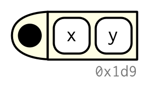
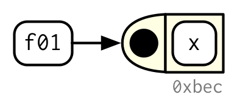

# Functions

```{r setup, include = FALSE}
source("common.R")
```

## Introduction
\index{functions}
\index{closures|see {functions}}

If you're reading this book, you've probably already created many R functions and know how to use them to reduce duplication in your code. In this chapter, you'll learn how to turn that informal, working knowledge into more rigorous, theoretical understanding. And while you'll see some interesting tricks and techniques along the way, keep in mind that what you'll learn here will be important for understanding the more advanced topics discussed later in the book.

### Quiz {-}

Answer the following questions to see if you can safely skip this chapter. You can find the answers in Section \@ref(function-answers).

1.  What are the three components of a function?

1.  What does the following code return?

    ```{r, eval = FALSE}
    x <- 10
    f1 <- function(x) {
      function() {
        x + 10
      }
    }
    f1(1)()
    ```
    
1.  How would you usually write this code?

    ```{r, eval = FALSE}
    `+`(1, `*`(2, 3))
    ```
    
1.  How could you make this call easier to read?

    ```{r, eval = FALSE}
    mean(, TRUE, x = c(1:10, NA))
    ```

1.  Does the following code throw an error when executed? Why or why not?

    ```{r, eval = FALSE}
    f2 <- function(a, b) {
      a * 10
    }
    f2(10, stop("This is an error!"))
    ```

1.  What is an infix function? How do you write it? What's a replacement 
    function? How do you write it?

1.  How do you ensure that cleanup action occurs regardless of how a function 
    exits?

### Outline {-}

* Section \@ref(function-fundamentals) describes the basics of creating a 
  function, the three main components of a function, and the exception
  to many function rules: primitive functions (which are implemented in C, not 
  R).

* Section \@ref(function-composition) discusses the strengths and weaknesses
  of the three forms of function composition commonly used in R code.

* Section \@ref(lexical-scoping) shows you how R finds the value associated
  with a given name, i.e. the rules of lexical scoping.

* Section \@ref(lazy-evaluation) is devoted to an important property of 
  function arguments: they are only evaluated when used for the first time.

* Section \@ref(fun-dot-dot-dot) discusses the special `...` argument, which
  allows you to pass on extra arguments to another function.

* Section \@ref(exiting-a-function) discusses the two primary ways that a
  function can exit, and how to define an exit handler, code that is run on
  exit, regardless of what triggers it.
  
* Section \@ref(function-forms) shows you the various ways in which R 
  disguises ordinary function calls, and how you can use the standard prefix
  form to better understand what's going on.

## Function fundamentals

To understand functions in R you need to internalise two important ideas:

* Functions can be broken down into three components: arguments, body, and environment.

There are exceptions to every rule, and in this case, there is a small selection of "primitive" base functions that are implemented purely in C.

* Functions are objects, just as vectors are objects.

### Function components {#fun-components}
\index{functions!body} 
\indexc{body()} 
\index{functions!formals} 
\index{arguments!formal} 
\indexc{formals()} 
\index{functions!environment}
\index{environments!of a function}
\indexc{srcref}

A function has three parts: 

* The `formals()`, the list of arguments that control how you call the function.
  
* The `body()`, the code inside the function.

* The `environment()`, the data structure that determines how the function finds 
the values associated with the names.

While the formals and body are specified explicitly when you create a function, the environment is specified implicitly, based on _where_ you defined the function. The function environment always exists, but it is only printed when the function isn't defined in the global environment.

```{r}
f02 <- function(x, y) {
  # A comment
  x + y
}

formals(f02)

body(f02)

environment(f02)
```

I'll draw functions as in the following diagram. The black dot on the left is the environment. The two blocks to the right are the function arguments. I won't draw the body, because it's usually large, and doesn't help you understand the shape of the function.

```{r, echo = FALSE, out.width = NULL}

```

Like all objects in R, functions can also possess any number of additional `attributes()`. One attribute used by base R is `srcref`, short for source reference. It points to the source code used to create the function. The `srcref` is used for printing because, unlike `body()`, it contains code comments and other formatting.  

```{r}
attr(f02, "srcref")
```

### Primitive functions
\index{primitive functions} 
\index{functions!primitive} 
\indexc{.Primitive()}

There is one exception to the rule that a function has three components. Primitive functions, like `sum()` and `[`, call C code directly. 

```{r}
sum
`[`
```

They have either type `builtin` or type `special`.

```{r}
typeof(sum)
typeof(`[`)
```

These functions exist primarily in C, not R, so their `formals()`, `body()`, and `environment()` are all `NULL`:  

```{r}
formals(sum)
body(sum)
environment(sum)
```

Primitive functions are only found in the base package. While they have certain performance advantages, this benefit comes at a price: they are harder to write. For this reason, R-core generally avoids creating them unless there is no other option.

<!-- HW: mention internal functions here too? Cross-reference to perf example -->

### First-class functions {#first-class-functions}
\index{functions!anonymous} 
\index{anonymous functions}

It's very important to understand that R functions are objects in their own right, a language property often called "first-class functions". Unlike in many other languages, there is no special syntax for defining and naming a function: you simply create a function object (with `function`) and bind it to a name with `<-`:

```{r}
f01 <- function(x) {
  sin(1 / x ^ 2)
}
```

```{r, echo = FALSE, out.width = NULL}

```

While you almost always create a function and then bind it to a name, the binding step is not compulsory. If you choose not to give a function a name, you get an __anonymous function__. This is useful when it's not worth the effort to figure out a name:

```{r, eval = FALSE}
lapply(mtcars, function(x) length(unique(x)))
Filter(function(x) !is.numeric(x), mtcars)
integrate(function(x) sin(x) ^ 2, 0, pi)
```

A final option is to put functions in a list:

```{r}
funs <- list(
  half = function(x) x / 2,
  double = function(x) x * 2
)

funs$double(10)
```

In R, you'll often see functions called __closures__. This name reflects the fact that R functions capture, or enclose, their environments, which you'll learn more about in Section \@ref(function-environments).

### Invoking a function
\indexc{do.call()}

You normally call a function by placing its arguments, wrapped in parentheses, after its name: `mean(1:10, na.rm = TRUE)`. But what happens if you have the arguments already in a data structure?

```{r}
args <- list(1:10, na.rm = TRUE)
```

You can instead use `do.call()`: it has two arguments. The function to call, and a list containing the function arguments:

```{r}
do.call(mean, args)
```

We'll come back to this idea in Section \@ref(tidy-dots).

### Exercises

1. Given a name, like `"mean"`, `match.fun()` lets you find a function. 
   Given a function, can you find its name? Why doesn't that make sense in R?

1.  It's possible (although typically not useful) to call an anonymous function.
    Which of the two approaches below is correct? Why?

    ```{r, result = "hide"}
    function(x) 3()
    (function(x) 3)()
    ```

1. A good rule of thumb is that an anonymous function should fit on one line 
   and shouldn't need to use `{}`. Review your code. Where could you have 
   used an anonymous function instead of a named function? Where should you 
   have used a named function instead of an anonymous function?

1.  What function allows you to tell if an object is a function? What function
    allows you to tell if a function is a primitive function?

1.  This code makes a list of all functions in the base package. 
    
    ```{r}
    objs <- mget(ls("package:base", all = TRUE), inherits = TRUE)
    funs <- Filter(is.function, objs)
    ```

    Use it to answer the following questions:

    a. Which base function has the most arguments?
    
    a. How many base functions have no arguments? What's special about those
       functions?
       
    a. How could you adapt the code to find all primitive functions?

1. What are the three important components of a function?

1. When does printing a function not show the environment it was created in?
  
## Function composition {#function-composition}
\index{functions!composition}
\indexc{\%>\%}
\index{magrittr|see {\texttt{\%>\%}}}
\index{piping|see {\texttt{\%>\%}}}

Base R provides two ways to compose multiple function calls. For example, imagine you want to compute the population standard deviation using `sqrt()` and `mean()` as building blocks:

```{r}
square <- function(x) x^2
deviation <- function(x) x - mean(x)
```

You either nest the function calls:

```{r}
x <- runif(100)

sqrt(mean(square(deviation(x))))
```

Or you save the intermediate results as variables:

```{r}
out <- deviation(x)
out <- square(out)
out <- mean(out)
out <- sqrt(out)
out
```

The magrittr package [@magrittr] provides a third option: the binary operator `%>%`, which is called the pipe and is pronounced as "and then".

```{r}
library(magrittr)

x %>%
  deviation() %>%
  square() %>%
  mean() %>%
  sqrt()
```

`x %>% f()` is equivalent to `f(x)`; `x %>% f(y)` is equivalent to `f(x, y)`. The pipe allows you to focus on the high-level composition of functions rather than the low-level flow of data; the focus is on what's being done (the verbs), rather than on what's being modified (the nouns). This style is common in Haskell and F#, the main inspiration for magrittr, and is the default style in stack based programming languages like Forth and Factor. 

Each of the three options has its own strengths and weaknesses:

* Nesting, `f(g(x))`, is concise, and well suited for short sequences. But
  longer sequences are hard to read because they are read inside out and
  right to left. As a result, arguments can get spread out over long distances
  creating the [Dagwood
  sandwich](https://en.wikipedia.org/wiki/Dagwood_sandwich) problem.

* Intermediate objects, `y <- f(x); g(y)`, requires you to name intermediate
  objects. This is a strength when objects are important, but a weakness when
  values are truly intermediate.

* Piping, `x %>% f() %>% g()`, allows you to read code in straightforward
  left-to-right fashion and doesn't require you to name intermediate objects.
  But you can only use it with linear sequences of transformations of a single
  object. It also requires an additional third party package and assumes that
  the reader understands piping.

Most code will use a combination of all three styles. Piping is more common in data analysis code, as much of an analysis consists of a sequence of transformations of an object (like a data frame or plot). I tend to use piping infrequently in packages; not because it is a bad idea, but because it's often a less natural fit.

## Lexical scoping {#lexical-scoping}
\index{scoping!lexical}

In Chapter \@ref(names-values), we discussed assignment, the act of binding a name to a value. Here we'll discuss __scoping__, the act of finding the value associated with a name.

The basic rules of scoping are quite intuitive, and you've probably already internalised them, even if you never explicitly studied them. For example, what will the following code return, 10 or 20?[^answer1]

[^answer1]: I'll "hide" the answers to these challenges in the footnotes. Try solving them before looking at the answer; this will help you to better remember the correct answer. In this case, `g01()` will return `20`.

```{r, results = "hide"}
x <- 10
g01 <- function() {
  x <- 20
  x
}

g01()
```

In this section, you'll learn the formal rules of scoping as well as some of its more subtle details. A deeper understanding of scoping will help you to use more advanced functional programming tools, and eventually, even to write tools that translate R code into other languages.

R uses __lexical scoping__[^dyn-scope]: it looks up the values of names based on how a function is defined, not how it is called. "Lexical" here is not the English adjective that means relating to words or a vocabulary. It's a technical CS term that tells us that the scoping rules use a parse-time, rather than a run-time structure. 

R's lexical scoping follows four primary rules:

* Name masking
* Functions versus variables
* A fresh start
* Dynamic lookup

[^dyn-scope]: Functions that automatically quote one or more arguments can override the default scoping rules to implement other varieties of scoping. You'll learn more about that in Chapter \@ref(evaluation).

### Name masking
\index{functions!scoping}

The basic principle of lexical scoping is that names defined inside a function mask names defined outside a function. This is illustrated in the following example.

```{r}
x <- 10
y <- 20
g02 <- function() {
  x <- 1
  y <- 2
  c(x, y)
}
g02()
```

If a name isn't defined inside a function, R looks one level up.

```{r}
x <- 2
g03 <- function() {
  y <- 1
  c(x, y)
}
g03()

# And this doesn't change the previous value of y
y
```

The same rules apply if a function is defined inside another function. First, R looks inside the current function. Then, it looks where that function was defined (and so on, all the way up to the global environment). Finally, it looks in other loaded packages. 

Run the following code in your head, then confirm the result by running the code.[^answer2]

[^answer2]: `g04()` returns `c(1, 2, 3)`.

```{r, results = "hide"}
x <- 1
g04 <- function() {
  y <- 2
  i <- function() {
    z <- 3
    c(x, y, z)
  }
  i()
}
g04()
```

The same rules also apply to functions created by other functions, which I call manufactured functions, the topic of Chapter \@ref(function-factories). 

### Functions versus variables

In R, functions are ordinary objects. This means the scoping rules described above also apply to functions:

```{r}
g07 <- function(x) x + 1
g08 <- function() {
  g07 <- function(x) x + 100
  g07(10)
}
g08()
```

However, when a function and a non-function share the same name (they must, of course, reside in different environments), applying these rules gets a little more complicated. When you use a name in a function call, R ignores non-function objects when looking for that value. For example, in the code below, `g09` takes on two different values:

```{r}
g09 <- function(x) x + 100
g10 <- function() {
  g09 <- 10
  g09(g09)
}
g10()
```

For the record, using the same name for different things is confusing and best avoided!

### A fresh start {#fresh-start}

What happens to values between invocations of a function? Consider the example below. What will happen the first time you run this function? What will happen the second time?[^answer4] (If you haven't seen `exists()` before, it returns `TRUE` if there's a variable with that name and returns `FALSE` if not.)

[^answer4]: `g11()` returns `1` every time it's called.

```{r, results = "hide"}
g11 <- function() {
  if (!exists("a")) {
    a <- 1
  } else {
    a <- a + 1
  }
  a
}

g11()
g11()
```

You might be surprised that `g11()` always returns the same value. This happens because every time a function is called a new environment is created to host its execution. This means that a function has no way to tell what happened the last time it was run; each invocation is completely independent. We'll see some ways to get around this in Section \@ref(stateful-funs).

### Dynamic lookup
\indexc{findGlobals()}

Lexical scoping determines where, but not when to look for values. R looks for values when the function is run, not when the function is created. Together, these two properties tell us that the output of a function can differ depending on the objects outside the function's environment:

```{r}
g12 <- function() x + 1
x <- 15
g12()

x <- 20
g12()
```

This behaviour can be quite annoying. If you make a spelling mistake in your code, you won't get an error message when you create the function. And depending on the variables defined in the global environment, you might not even get an error message when you run the function. 

To detect this problem, use `codetools::findGlobals()`. This function lists all the external dependencies (unbound symbols) within a function:

```{r}
codetools::findGlobals(g12)
```

To solve this problem, you can manually change the function's environment to the `emptyenv()`, an environment which contains nothing:

```{r, error = TRUE}
environment(g12) <- emptyenv()
g12()
```

The problem and its solution reveal why this seemingly undesirable behaviour exists: R relies on lexical scoping to find _everything_, from the obvious, like `mean()`, to the less obvious, like `+` or even `{`. This gives R's scoping rules a rather beautiful simplicity.

### Exercises

1. What does the following code return? Why? Describe how each of the three
   `c`'s is interpreted.

    ```{r, eval = FALSE}
    c <- 10
    c(c = c)
    ```

1. What are the four principles that govern how R looks for values?

1. What does the following function return? Make a prediction before 
   running the code yourself.

    ```{r, results = "hide"}
    f <- function(x) {
      f <- function(x) {
        f <- function() {
          x ^ 2
        }
        f() + 1
      }
      f(x) * 2
    }
    f(10)
    ```

## Lazy evaluation {#lazy-evaluation}
\index{evaluation!lazy|see {lazy evaluation}} 
\index{lazy evaluation} 
\index{functions!lazy evaluation}

In R, function arguments are __lazily evaluated__: they're only evaluated if accessed. For example, this code doesn't generate an error because `x` is never used:

```{r}
h01 <- function(x) {
  10
}
h01(stop("This is an error!"))
```

This is an important feature because it allows you to do things like include potentially expensive computations in function arguments that will only be evaluated if needed.

### Promises
\index{promises}
\index{thunks|see {promises}}

Lazy evaluation is powered by a data structure called a __promise__, or (less commonly) a thunk. It's one of the features that makes R such an interesting programming language (we'll return to promises again in Section \@ref(quosures)).

A promise has three components: 

*   An expression, like `x + y`, which gives rise to the delayed computation.

*   An environment where the expression should be evaluated, i.e. the
    environment where the function is called. This makes sure that the
    following function returns 11, not 101:
    
    ```{r}
    y <- 10
    h02 <- function(x) {
      y <- 100
      x + 1
    }
    
    h02(y)
    ```
    
    This also means that when you do assignment inside a call to a function,
    the variable is bound outside of the function, not inside of it.
    
    ```{r}
    h02(y <- 1000)
    y
    ```
    
*   A value, which is computed and cached the first time a promise is 
    accessed when the expression is evaluated in the specified environment.
    This ensures that the promise is evaluated at most once, and is why you
    only see "Calculating..." printed once in the following example.
    
    ```{r}
    double <- function(x) { 
      message("Calculating...")
      x * 2
    }
    
    h03 <- function(x) {
      c(x, x)
    }
    
    h03(double(20))
    ```

You cannot manipulate promises with R code. Promises are like a quantum state: any attempt to inspect them with R code will force an immediate evaluation, making the promise disappear. Later, in Section \@ref(quosures), you'll learn about quosures, which convert promises into an R object where you can easily inspect the expression and the environment.


### Default arguments
\index{functions!default values}

Thanks to lazy evaluation, default values can be defined in terms of other arguments, or even in terms of variables defined later in the function:

```{r}
h04 <- function(x = 1, y = x * 2, z = a + b) {
  a <- 10
  b <- 100
  
  c(x, y, z)
}

h04()
```

Many base R functions use this technique, but I don't recommend it. It makes the code harder to understand: to predict _what_ will be returned, you need to know the exact order in which default arguments are evaluated.

The evaluation environment is slightly different for default and user supplied arguments, as default arguments are evaluated inside the function. This means that seemingly identical calls can yield different results. It's easiest to see this with an extreme example:

```{r, eval = FALSE}
h05 <- function(x = ls()) {
  a <- 1
  x
}

# ls() evaluated inside h05:
h05()
#> [1] "a" "x"

# ls() evaluated in global environment:
h05(ls())
#> [1] "h05"
```

### Missing arguments
\index{missing arguments!missing@\texttt{missing()}}
\indexc{\%\textbar\textbar\%}

To determine if an argument's value comes from the user or from a default, you can use `missing()`:

```{r}
h06 <- function(x = 10) {
  list(missing(x), x)
}
str(h06())
str(h06(10))
```

`missing()` is best used sparingly, however. Take `sample()`, for example. How many arguments are required?

```{r}
args(sample)
```
 
It looks like both `x` and `size` are required, but if `size` is not supplied, `sample()` uses `missing()` to provide a default. If I were to rewrite sample, I'd use an explicit `NULL` to indicate that `size` is not required but can be supplied:

```{r}
sample <- function(x, size = NULL, replace = FALSE, prob = NULL) {
  if (is.null(size)) {
    size <- length(x)
  }
  
  x[sample.int(length(x), size, replace = replace, prob = prob)]
}
```

With the binary pattern created by the `%||%` infix function, which uses the left side if it's not `NULL` and the right side otherwise, we can further simplify `sample()`:
\indexc{NULL}

```{r}
`%||%` <- function(lhs, rhs) {
  if (!is.null(lhs)) {
    lhs
  } else {
    rhs
  }
}

sample <- function(x, size = NULL, replace = FALSE, prob = NULL) {
  size <- size %||% length(x)
  x[sample.int(length(x), size, replace = replace, prob = prob)]
}
```

Because of lazy evaluation, you don't need to worry about unnecessary computation: the right side of `%||%` will only be evaluated if the left side is `NULL`.

### Exercises

1.  What important property of `&&` makes `x_ok()` work?

    ```{r}
    x_ok <- function(x) {
      !is.null(x) && length(x) == 1 && x > 0
    }
    
    x_ok(NULL)
    x_ok(1)
    x_ok(1:3)
    ```

    What is different with this code? Why is this behaviour undesirable here?
    
    ```{r}
    x_ok <- function(x) {
      !is.null(x) & length(x) == 1 & x > 0
    }
    
    x_ok(NULL)
    x_ok(1)
    x_ok(1:3)
    ```
    
1.  What does this function return? Why? Which principle does it illustrate?

    ```{r, results = "hide"}
    f2 <- function(x = z) {
      z <- 100
      x
    }
    f2()
    ```

1.  What does this function return? Why? Which principle does it illustrate?
  
    ```{r, results = "hide"}
    y <- 10
    f1 <- function(x = {y <- 1; 2}, y = 0) {
      c(x, y)
    }
    f1()
    y
    ```
  
1.  In `hist()`, the default value of `xlim` is `range(breaks)`, the default 
    value for `breaks` is `"Sturges"`, and

    ```{r}
    range("Sturges")
    ```
    
    Explain how `hist()` works to get a correct `xlim` value.
    
1.  Explain why this function works. Why is it confusing?

    ```{r}
    show_time <- function(x = stop("Error!")) {
      stop <- function(...) Sys.time()
      print(x)
    }
    show_time()
    ```

1.  How many arguments are required when calling `library()`?

## `...`  (dot-dot-dot) {#fun-dot-dot-dot}
\indexc{...}
\index{functions!variadic|see {...}}
\index{ellipsis|see {...}}
\index{dot-dot-dot|see {...}}

Functions can have a special argument `...` (pronounced dot-dot-dot). With it, a function can take any number of additional arguments. In other programming languages, this type of argument is often called _varargs_ (short for variable arguments), and a function that uses it is said to be variadic. 

You can also use `...` to pass those additional arguments on to another function.

```{r}
i01 <- function(y, z) {
  list(y = y, z = z)
}

i02 <- function(x, ...) {
  i01(...)
}

str(i02(x = 1, y = 2, z = 3))
```

Using a special form, `..N`, it's possible (but rarely useful) to refer to elements of `...` by position:

```{r}
i03 <- function(...) {
  list(first = ..1, third = ..3)
}
str(i03(1, 2, 3))
```

More useful is `list(...)`, which evaluates the arguments and stores them in a list:

```{r}
i04 <- function(...) {
  list(...)
}
str(i04(a = 1, b = 2))
```

(See also `rlang::list2()` to support splicing and to silently ignore trailing commas, and `rlang::enquos()` to capture unevaluated arguments, the topic of [quasiquotation].)

There are two primary uses of `...`, both of which we'll come back to later in the book:

*   If your function takes a function as an argument, you want some way to 
    pass additional arguments to that function. In this example, `lapply()`
    uses `...` to pass `na.rm` on to `mean()`:
    
    ```{r}
    x <- list(c(1, 3, NA), c(4, NA, 6))
    str(lapply(x, mean, na.rm = TRUE))
    ```
    
    We'll come back to this technique in Section \@ref(passing-arguments).
    
*   If your function is an S3 generic, you need some way to allow methods to 
    take arbitrary extra arguments. For example, take the `print()` function. 
    Because there are different options for printing depending on the type of 
    object, there's no way to pre-specify every possible argument and `...` 
    allows individual methods to have different arguments:

    ```{r, eval = FALSE}
    print(factor(letters), max.levels = 4)
    
    print(y ~ x, showEnv = TRUE)
    ```
    
    We'll come back to this use of `...` in Section \@ref(s3-arguments).

Using `...` comes with two downsides:

*   When you use it to pass arguments to another function, you have to 
    carefully explain to the user where those arguments go. This makes it
    hard to understand what you can do with functions like `lapply()` and 
    `plot()`.
    
*   A misspelled argument will not raise an error. This makes it easy for 
    typos to go unnoticed:

    ```{r}
    sum(1, 2, NA, na_rm = TRUE)
    ```

### Exercises

1.  Explain the following results:
    
    ```{r}
    sum(1, 2, 3)
    mean(1, 2, 3)
    
    sum(1, 2, 3, na.omit = TRUE)
    mean(1, 2, 3, na.omit = TRUE)
    ```

1.  Explain how to find the documentation for the named arguments in the 
    following function call:
    
    ```{r, fig.asp = 1, small_mar = TRUE, fig.width = 3}
    plot(1:10, col = "red", pch = 20, xlab = "x", col.lab = "blue")
    ```
    
1.  Why does `plot(1:10, col = "red")` only colour the points, not the axes 
    or labels? Read the source code of `plot.default()` to find out.

## Exiting a function

Most functions exit in one of two ways[^esoterica]: they either return a value, indicating success, or they throw an error, indicating failure. This section describes return values (implicit versus explicit; visible versus invisible), briefly discusses errors, and introduces exit handlers, which allow you to run code when a function exits.

[^esoterica]: Functions can exit in other more esoteric ways like signalling a condition that is caught by an exit handler, invoking a restart, or pressing "Q" in an interactive browser.

### Implicit versus explicit returns
\index{functions!return value}
\indexc{return()}

There are two ways that a function can return a value:

*   Implicitly, where the last evaluated expression is the return value:

    ```{r}
    j01 <- function(x) {
      if (x < 10) {
        0
      } else {
        10
      }
    }
    j01(5)
    j01(15)
    ```

*   Explicitly, by calling `return()`:

    ```{r}
    j02 <- function(x) {
      if (x < 10) {
        return(0)
      } else {
        return(10)
      }
    }
    ```
    
### Invisible values {#invisible}
\indexc{invisible()} 
\index{functions!invisible results}
\index{assignment}

Most functions return visibly: calling the function in an interactive context prints the result.

```{r}
j03 <- function() 1
j03()
```

However, you can prevent automatic printing by applying `invisible()` to the last value:

```{r}
j04 <- function() invisible(1)
j04()
```

To verify that this value does indeed exist, you can explicitly print it or wrap it in parentheses:

```{r}
print(j04())

(j04())
```

Alternatively, you can use `withVisible()` to return the value and a visibility flag:

```{r}
str(withVisible(j04()))
```

The most common function that returns invisibly is `<-`: 

```{r}
a <- 2
(a <- 2)
```

This is what makes it possible to chain assignments:

```{r}
a <- b <- c <- d <- 2
```

In general, any function called primarily for a side effect (like `<-`, `print()`, or `plot()`) should return an invisible value (typically the value of the first argument).

### Errors
\indexc{stop()}
\index{errors}

If a function cannot complete its assigned task, it should throw an error with `stop()`, which immediately terminates the execution of the function.

```{r, error = TRUE}
j05 <- function() {
  stop("I'm an error")
  return(10)
}
j05()
```

An error indicates that something has gone wrong, and forces the user to deal with the problem. Some languages (like C, Go, and Rust) rely on special return values to indicate problems, but in R you should always throw an error. You'll learn more about errors, and how to handle them, in Chapter \@ref(conditions).

### Exit handlers {#on-exit}
\indexc{on.exit()}
\index{handlers!exit}

Sometimes a function needs to make temporary changes to the global state. But having to cleanup those changes can be painful (what happens if there's an error?). To ensure that these changes are undone and that the global state is restored no matter how a function exits, use `on.exit()` to set up an __exit handler__. The following simple example shows that the exit handler is run regardless of whether the function exits normally or with an error.

```{r, error = TRUE}
j06 <- function(x) {
  cat("Hello\n")
  on.exit(cat("Goodbye!\n"), add = TRUE)
  
  if (x) {
    return(10)
  } else {
    stop("Error")
  }
}

j06(TRUE)

j06(FALSE)
```

::: sidebar
Always set `add = TRUE` when using `on.exit()`. If you don't, each call to `on.exit()` will overwrite the previous exit handler. Even when only registering a single handler, it's good practice to set `add = TRUE` so that you won't get any unpleasant surprises if you later add more exit handlers.
:::

`on.exit()` is useful because it allows you to place clean-up code directly next to the code that requires clean-up:

```{r}
cleanup <- function(dir, code) {
  old_dir <- setwd(dir)
  on.exit(setwd(old_dir), add = TRUE)
  
  old_opt <- options(stringsAsFactors = FALSE)
  on.exit(options(old_opt), add = TRUE)
}
```

Coupled with lazy evaluation, this creates a very useful pattern for running a block of code in an altered environment:

```{r}
with_dir <- function(dir, code) {
  old <- setwd(dir)
  on.exit(setwd(old), add = TRUE)

  force(code)
}

getwd()
with_dir("~", getwd())
```

The use of `force()` isn't strictly necessary here as simply referring to `code` will force its evaluation. However, using `force()` makes it very clear that we are deliberately forcing the execution. You'll learn other uses of `force()` in Chapter \@ref(function-factories).

The withr package [@withr] provides a collection of other functions for setting up a temporary state.

In R 3.4 and earlier, `on.exit()` expressions are always run in order of creation:

```{r}
j08 <- function() {
  on.exit(message("a"), add = TRUE)
  on.exit(message("b"), add = TRUE)
}
j08()
```

This can make cleanup a little tricky if some actions need to happen in a specific order; typically you want the most recent added expression to be run first. In R 3.5 and later, you can control this by setting `after = FALSE`:

```{r, eval = getRversion() >= "3.5"}
j09 <- function() {
  on.exit(message("a"), add = TRUE, after = FALSE)
  on.exit(message("b"), add = TRUE, after = FALSE)
}
j09()
```

### Exercises

1.  What does `load()` return? Why don't you normally see these values?

1.  What does `write.table()` return? What would be more useful?

1.  How does the `chdir` parameter of `source()` compare to `with_dir()`? Why 
    might you prefer one to the other?

1.  Write a function that opens a graphics device, runs the supplied code, and 
    closes the graphics device (always, regardless of whether or not the 
    plotting code works).

1.  We can use `on.exit()` to implement a simple version of `capture.output()`.

    ```{r, eval = getRversion() >= "3.5"}
    capture.output2 <- function(code) {
      temp <- tempfile()
      on.exit(file.remove(temp), add = TRUE, after = TRUE)

      sink(temp)
      on.exit(sink(), add = TRUE, after = TRUE)

      force(code)
      readLines(temp)
    }
    capture.output2(cat("a", "b", "c", sep = "\n"))
    ```

    Compare `capture.output()` to `capture.output2()`. How do the functions 
    differ? What features have I removed to make the key ideas easier to see? 
    How have I rewritten the key ideas so they're easier to understand?
    
## Function forms

> To understand computations in R, two slogans are helpful:
>
> * Everything that exists is an object.
> * Everything that happens is a function call.
>
> --- John Chambers

While everything that happens in R is a result of a function call, not all calls look the same. Function calls come in four varieties:

* __prefix__: the function name comes before its arguments, like
  `foofy(a, b, c)`. These constitute of the majority of function calls in R.

* __infix__: the function name comes in between its arguments, like
  `x + y`. Infix forms are used for many mathematical operators, and for
  user-defined functions that begin and end with `%`.

* __replacement__: functions that replace values by assignment, like
  `names(df) <- c("a", "b", "c")`. They actually look like prefix functions.

* __special__: functions like `[[`, `if`, and `for`. While they don't have a
  consistent structure, they play important roles in R's syntax.

While there are four forms, you actually only need one because any call can be written in prefix form. I'll demonstrate this property, and then you'll learn about each of the forms in turn.

### Rewriting to prefix form {#prefix-transform}
\index{'@\texttt{`}}
\index{backticks|see {\texttt{`}}}
\indexc{sapply()}

An interesting property of R is that every infix, replacement, or special form can be rewritten in prefix form. Doing so is useful because it helps you better understand the structure of the language, it gives you the real name of every function, and it allows you to modify those functions for fun and profit.

The following example shows three pairs of equivalent calls, rewriting an infix form, replacement form, and a special form into prefix form. 

```{r, eval = FALSE}
x + y
`+`(x, y)

names(df) <- c("x", "y", "z")
`names<-`(df, c("x", "y", "z"))

for(i in 1:10) print(i)
`for`(i, 1:10, print(i))
```

Surprisingly, in R, `for` can be called like a regular function! The same is true for basically every operation in R, which means that knowing the function name of a non-prefix function allows you to override its behaviour. For example, if you're ever feeling particularly evil, run the following code while a friend is away from their computer. It will introduce a fun bug: 10% of the time, it will add 1 to any numeric calculation inside the parentheses.

```{r}
`(` <- function(e1) {
  if (is.numeric(e1) && runif(1) < 0.1) {
    e1 + 1
  } else {
    e1
  }
}
replicate(50, (1 + 2))
rm("(")
```

Of course, overriding built-in functions like this is a bad idea, but, as you'll learn in Section \@ref(html-env), it's possible to apply it only to selected code blocks. This provides a clean and elegant approach to writing domain specific languages and translators to other languages.

A more useful application comes up when using functional programming tools. For example, you could use `lapply()` to add 3 to every element of a list by first defining a function `add()`:

```{r}
add <- function(x, y) x + y
lapply(list(1:3, 4:5), add, 3)
```

But we can also get the same result simply by relying on the existing `+` function:

```{r}
lapply(list(1:3, 4:5), `+`, 3)
```

We'll explore this idea in detail in Section \@ref(functionals).

### Prefix form {#prefix-form}
\index{functions!arguments}
\index{arguments!matching}

The prefix form is the most common form in R code, and indeed in the majority of programming languages. Prefix calls in R are a little special because you can specify arguments in three ways:

* By position, like `help(mean)`.
* Using partial matching, like `help(top = mean)`.
* By name, like `help(topic = mean)`.

As illustrated by the following chunk, arguments are matched by exact name, then with unique prefixes, and finally by position.

```{r, error = TRUE}
k01 <- function(abcdef, bcde1, bcde2) {
  list(a = abcdef, b1 = bcde1, b2 = bcde2)
}
str(k01(1, 2, 3))
str(k01(2, 3, abcdef = 1))

# Can abbreviate long argument names:
str(k01(2, 3, a = 1))

# But this doesn't work because abbreviation is ambiguous
str(k01(1, 3, b = 1))
```

In general, use positional matching only for the first one or two arguments; they will be the most commonly used, and most readers will know what they are. Avoid using positional matching for less commonly used arguments, and never use partial matching. Unfortunately you can't disable partial matching, but you can turn it into a warning with the `warnPartialMatchArgs` option:
\index{options!warnPartialMatchArgs@\texttt{warnPartialMatchArgs}}

```{r}
options(warnPartialMatchArgs = TRUE)
x <- k01(a = 1, 2, 3)
```

### Infix functions
\index{functions!infix} 
\index{infix functions} 
\indexc{\%\%}

Infix functions get their name from the fact the function name comes inbetween its arguments, and hence have two arguments. R comes with a number of built-in infix operators: `:`, `::`, `:::`, `$`, `@`, `^`, `*`, `/`, `+`, `-`, `>`, `>=`, `<`, `<=`, `==`, `!=`, `!`, `&`, `&&`, `|`, `||`, `~`, `<-`, and `<<-`. You can also create your own infix functions that start and end with `%`. Base R uses this pattern to define `%%`, `%*%`, `%/%`, `%in%`, `%o%`, and `%x%`.

Defining your own infix function is simple. You create a two argument function and bind it to a name that starts and ends with `%`:

```{r}
`%+%` <- function(a, b) paste0(a, b)
"new " %+% "string"
```

The names of infix functions are more flexible than regular R functions: they can contain any sequence of characters except for `%`. You will need to escape any special characters in the string used to define the function, but not when you call it:

```{r}
`% %` <- function(a, b) paste(a, b)
`%/\\%` <- function(a, b) paste(a, b)

"a" % % "b"
"a" %/\% "b"
```

R's default precedence rules mean that infix operators are composed left to right:

```{r}
`%-%` <- function(a, b) paste0("(", a, " %-% ", b, ")")
"a" %-% "b" %-% "c"
```

There are two special infix functions that can be called with a single argument: `+` and `-`.  
```{r}
-1
+10
```

### Replacement functions {#replacement-functions}
\index{replacement functions} 
\index{functions!replacement}
\index{assignment!in replacement functions}

Replacement functions act like they modify their arguments in place, and have the special name `xxx<-`. They must have arguments named `x` and `value`, and must return the modified object. For example, the following function modifies the second element of a vector: 

```{r}
`second<-` <- function(x, value) {
  x[2] <- value
  x
}
```

Replacement functions are used by placing the function call on the left side of `<-`: 

```{r}
x <- 1:10
second(x) <- 5L
x
```

I say they act like they modify their arguments in place, because, as explained in Section \@ref(modify-in-place), they actually create a modified copy. We can see that by using `tracemem()`:

```{r, eval = FALSE}
x <- 1:10
tracemem(x)
#> <0x7ffae71bd880>

second(x) <- 6L
#> tracemem[0x7ffae71bd880 -> 0x7ffae61b5480]: 
#> tracemem[0x7ffae61b5480 -> 0x7ffae73f0408]: second<- 
```

If your replacement function needs additional arguments, place them between `x` and `value`, and call the replacement function with additional arguments on the left:

```{r}
`modify<-` <- function(x, position, value) {
  x[position] <- value
  x
}
modify(x, 1) <- 10
x
```

When you write `modify(x, 1) <- 10`, behind the scenes R turns it into:

```{r, eval = FALSE}
x <- `modify<-`(x, 1, 10)
```

Combining replacement with other functions requires more complex translation. For example:

```{r}
x <- c(a = 1, b = 2, c = 3)
names(x)

names(x)[2] <- "two"
names(x)
```

is translated into:

```{r}
`*tmp*` <- x
x <- `names<-`(`*tmp*`, `[<-`(names(`*tmp*`), 2, "two"))
rm(`*tmp*`)
```

(Yes, it really does create a local variable named `*tmp*`, which is removed afterwards.)

### Special forms
\index{special forms}
\index{functions!special}

Finally, there are a bunch of language features that are usually written in special ways, but also have prefix forms. These include parentheses:

* `(x)` (`` `(`(x) ``)
* `{x}` (`` `{`(x) ``).

The subsetting operators:

* `x[i]` (`` `[`(x, i) ``) 
* `x[[i]]` (`` `[[`(x, i) ``)

And the tools of control flow:

* `if (cond) true` (`` `if`(cond, true) ``)
* `if (cond) true else false` (`` `if`(cond, true, false) ``)
* `for(var in seq) action` (`` `for`(var, seq, action) ``)
* `while(cond) action` (`` `while`(cond, action)  ``)
* `repeat expr` (`` `repeat`(expr) ``)
* `next` (`` `next`() ``)
* `break` (`` `break`() ``)

Finally, the most complex is the `function` function:

* `function(arg1, arg2) {body}` (`` `function`(alist(arg1, arg2), body, env)``)

Knowing the name of the function that underlies a special form is useful for getting documentation: `?(` is a syntax error; `` ?`(` `` will give you the documentation for parentheses.

All special forms are implemented as primitive functions (i.e. in C); this means printing these functions is not informative:

```{r}
`for`
```

### Exercises

1. Rewrite the following code snippets into prefix form:

    ```{r, eval = FALSE}
    1 + 2 + 3
    
    1 + (2 + 3)
    
    if (length(x) <= 5) x[[5]] else x[[n]]
    ```

1.  Clarify the following list of odd function calls:

    ```{r, eval = FALSE}
    x <- sample(replace = TRUE, 20, x = c(1:10, NA))
    y <- runif(min = 0, max = 1, 20)
    cor(m = "k", y = y, u = "p", x = x)
    ```


1. Explain why the following code fails:

    ```{r, eval = FALSE}
    modify(get("x"), 1) <- 10
    #> Error: target of assignment expands to non-language object
    ```

1. Create a replacement function that modifies a random location in a vector.

1. Write your own version of `+` that pastes its inputs together if they are 
   character vectors but behaves as usual otherwise. In other words, make this 
   code work:
   
    ```{r, eval = FALSE}
    1 + 2
    #> [1] 3
    
    "a" + "b"
    #> [1] "ab"
    ```

1. Create a list of all the replacement functions found in the base package. 
   Which ones are primitive functions? (Hint: use `apropos()`.)

1. What are valid names for user-created infix functions?

1. Create an infix `xor()` operator.

1. Create infix versions of the set functions `intersect()`, `union()`, and
   `setdiff()`. You might call them `%n%`, `%u%`, and `%/%` to match 
   conventions from mathematics.


## Quiz answers {#function-answers}

1.  The three components of a function are its body, arguments, and environment.

1.  `f1(1)()` returns 11.

1.  You'd normally write it in infix style: `1 + (2 * 3)`.

1.  Rewriting the call to `mean(c(1:10, NA), na.rm = TRUE)` is easier to
    understand.
    
1.  No, it does not throw an error because the second argument is never used 
    so it's never evaluated.

1.  See Sections \@ref(infix-functions) and \@ref(replacement-functions).

1.  You use `on.exit()`; see Section \@ref(on-exit) for details.
