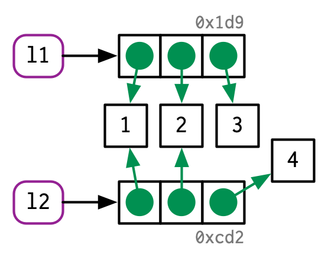
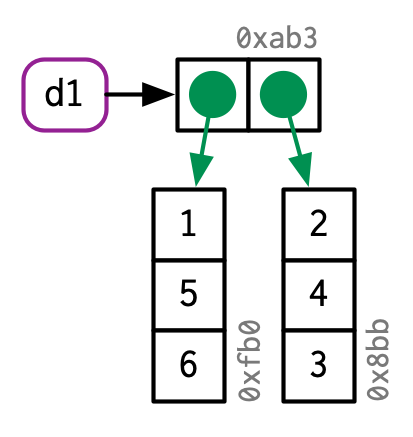
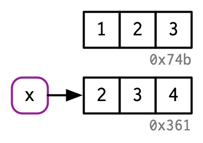

# Names and values {#names-values}

```{r, include = FALSE}
source("common.R")

id <- function() {
  x <- sample(c(0:9, letters[1:6]), 3, replace = TRUE)
  paste0("0x", paste(x, collapse = ""))
}
```

## Introduction

In R, it is important to understand the distinction between an object and its name. Doing so will help you:

* More accurately predict the performance and memory usage of your code. 
* Write faster code by avoiding accidental copies, a major source of slow code. 
* Better understand R's functional programming tools.

The goal of this chapter is to help you understand the distinction between names and values, and when R will copy an object.

### Quiz {-}

Answer the following questions to see if you can safely skip this chapter. You can find the answers at the end of the chapter in Section \@ref(names-values-answers).

1.  Given the following data frame, how do I create a new column called "3"
    that contains the sum of `1` and `2`? You may only use `$`, not `[[`.
    What makes `1`, `2`, and `3` challenging as variable names?

    ```{r}
    df <- data.frame(runif(3), runif(3))
    names(df) <- c(1, 2)
    ```

1.  In the following code, how much memory does `y` occupy?
   
    ```{r}
    x <- runif(1e6)
    y <- list(x, x, x)
    ```

1.  On which line does `a` get copied in the following example?

    ```{r}
    a <- c(1, 5, 3, 2)
    b <- a
    b[[1]] <- 10
    ```

### Outline {-}

* Section \@ref(binding-basics) introduces you to the distinction between
  names and values, and discusses how `<-` creates a binding, or reference,
  between a name and a value. 

* Section \@ref(copy-on-modify) describes when R makes a copy: whenever you
  modify a vector, you're almost certainly creating a new, modified vector. 
  You'll learn how to use `tracemem()` to figure out when a copy actually 
  occurs. Then you'll explore the implications as they apply to function calls, 
  lists, data frames, and character vectors. 

* Section \@ref(object-size) explores the implications of the previous two 
  sections on how much memory an object occupies. Since your intuition may be 
  profoundly wrong and since `utils::object.size()` is unfortunately 
  inaccurate, you'll learn how to use `lobstr::obj_size()`.

* Section \@ref(modify-in-place) describes the two important exceptions to
  copy-on-modify: with environments and values with a single name, objects are 
  actually modified in place.

* Section \@ref(gc) concludes the chapter with a discussion of the garbage 
  collector, which frees up the memory used by objects no longer referenced by 
  a name.

### Prerequisites {-}

We'll use the development version of [lobstr](https://github.com/r-lib/lobstr) to dig into the internal representation of R objects.

```{r setup}
# devtools::install_github("r-lib/lobstr")
library(lobstr)
```

### Sources {-}

The details of R's memory management are not documented in a single place. Much of the information in this chapter was gleaned from a close reading of the documentation (particularly `?Memory` and `?gc`), the [memory profiling](http://cran.r-project.org/doc/manuals/R-exts.html#Profiling-R-code-for-memory-use) section of "Writing R extensions" [@r-exts], and the [SEXPs](http://cran.r-project.org/doc/manuals/R-ints.html#SEXPs) section of "R internals" [@r-ints]. The rest I figured out by reading the C source code, performing small experiments, and asking questions on R-devel. Any mistakes are entirely mine.

## Binding basics
\index{bindings} \index{assignment}

Consider this code: 

```{r bind1}
x <- c(1, 2, 3)
```

It's easy to read it as: "create an object named 'x', containing the values 1, 2, and 3". Unfortunately, that's a simplification that will lead to inaccurate predictions about what R is actually doing behind the scenes. It's more accurate to say that this code is doing two things:

* It's creating an object, a vector of values, `c(1, 2, 3)`.
* And it's binding that object to a name, `x`.

In other words, the object, or value, doesn't have a name; it's actually the name that has a value. 

To further clarify this distinction, I'll draw diagrams like this:  

```{r, echo = FALSE, out.width = NULL}
knitr::include_graphics("diagrams/name-value/binding-1.png")
```

The name, `x`, is drawn with a rounded rectangle. It has an arrow that points to (or binds or references) the value, the vector `1:3`. Note that the arrow points in opposite direction to the assignment arrow: `<-` creates a binding from the name on the left-hand side to the object on the right-hand side.

Thus, you can think of a name as a reference to a value. For example, if you run this code, you don't get another copy of the value `1:3`, you get another binding to the existing object:

```{r bind2, dependson = "bind1"}
y <- x
```
```{r, echo = FALSE, out.width = NULL}
knitr::include_graphics("diagrams/name-value/binding-2.png")
```

You might have noticed that the value `1:3` has a label: `0x74b`. While the vector doesn't have a name, I'll occasionally need to refer to an object independent of its bindings. To make that possible, I'll label values with a unique identifier. These identifiers have a special form that looks like the object's memory "address", i.e. the location in memory where the object is stored. But because the actual memory addresses changes every time the code is run, we use these identifiers instead.

You can access an object's identifier with `lobstr::obj_addr()`. Doing so allows you to see that both `x` and `y` point to the same identifier:

```{r bind3, dependson = "bind2"}
obj_addr(x)
obj_addr(y)
```

These identifiers are long, and change every time you restart R.

It can take some time to get your head around the distinction between names and values, but understanding this is really helpful in functional programming where functions can have different names in different contexts.

### Non-syntactic names {#non-syntactic}
\index{reserved names} 
\indexc{`} 
\index{non-syntactic names}

R has strict rules about what constitutes a valid name. A __syntactic__ name must consist of letters[^letters], digits, `.` and `_` but can't begin with `_` or a digit. Additionally, you can't use any of the __reserved words__ like `TRUE`, `NULL`, `if`, and `function` (see the complete list in `?Reserved`). A name that don't follow these rules is a __non-syntactic__ name; if you try to use them, you'll get an error:

```{r, eval = FALSE}
_abc <- 1
#> Error: unexpected input in "_"

if <- 10
#> Error: unexpected assignment in "if <-"
```

[^letters]: Surprisingly, what constitutes a letter is determined by your current locale. That means that the syntax of R code can actually differ from computer to computer, and that it's possible for a file that works on one computer to not even parse on another!

<!-- GVW: please add a line to this footnote describing the safe character set to use in programs, or a link to the style guide section. -->

It's possible to override these rules and use any name, i.e., any sequence of characters, by surrounding it with backticks:

```{r}
`_abc` <- 1
`_abc`

`if` <- 10
`if`
```

While it's unlikely you'd deliberately create such crazy names, you need to understand how these crazy names work because you'll come across them, most commonly when you load data that has been created outside of R.

::: sidebar
You _can_ also create non-syntactic bindings using single or double quotes (e.g. `"_abc" <- 1`) instead of backticks, but you shouldn't, because you'll have to use a different syntax to retrieve the values. The ability to use strings on the left hand side of the assignment arrow is an historical artefact, used before R supported backticks.
:::

### Exercises

1.  Explain the relationship between `a`, `b`, `c` and `d` in the following 
    code:

    ```{r}
    a <- 1:10
    b <- a
    c <- b
    d <- 1:10
    ```

1.  The following code accesses the mean function in multiple ways. Do they all 
    point to the same underlying function object? Verify this with 
    `lobstr::obj_addr()`.
    
    ```{r, eval = FALSE}
    mean
    base::mean
    get("mean")
    evalq(mean)
    match.fun("mean")
    ```
    
1.  By default, base R data import functions, like `read.csv()`, will 
    automatically convert non-syntactic names to syntactic ones. Why might 
    this be problematic? What option allows you to suppress this behaviour
    
1.  What rules does `make.names()` use to convert non-syntactic names into
    syntactic ones?

1.  I slightly simplified the rules that govern syntactic names. Why is `.123e1`
    not a syntactic name? Read `?make.names` for the full details.

## Copy-on-modify

Consider the following code. It binds `x` and `y` to the same underlying value, then modifies `y`.[^double-bracket]

[^double-bracket]: You may be surprised to see `[[` used with a numeric vector. We'll come back to this in Section \@ref(subset-single), but in brief, I think you should always use `[[` when you are getting or setting a single element.

<!-- GVW: should I be surprised that `[[` is used with a numeric vector as subscript, or that it's being used to subscript a numeric vector? (I'm new enough that I don't know what should surprise me.) -->

```{r}
x <- c(1, 2, 3)
y <- x

y[[3]] <- 4
x
```

Modifying `y` clearly didn't modify `x`. So what happened to the shared binding? While the value associated with `y` changed, the original object did not. Instead, R created a new object, `0xcd2`, a copy of `0x74b` with one value changed, then rebinded `y` to that object.

```{r, echo = FALSE, out.width = NULL}
knitr::include_graphics("diagrams/name-value/binding-3.png")
```

This behaviour is called __copy-on-modify__. Understanding it will radically improve your intuition about the performance of R code. A related way to describe this behaviour is to say that R objects are unchangeable, or __immutable__. However, I'll generally avoid that term because there are a couple of important exceptions to copy-on-modify that you'll learn about in Section \@ref(modify-in-place). 

### `tracemem()`

You can see when an object gets copied with the help of `base::tracemem()`. Once you call that function with an object, you'll get the object's current address:

```{r trace1, eval = FALSE}
x <- c(1, 2, 3)
cat(tracemem(x), "\n")
#> <0x7f80c0e0ffc8> 
```

From then on, whenever that object is copied, `tracemem()` will print a message telling you which object was copied, its new address, and the sequence of calls that led to the copy:

<!-- GVW: that's cool. -->

```{r trace2, dependson = "trace1", eval = FALSE}
y <- x
y[[3]] <- 4L
#> tracemem[0x7f80c0e0ffc8 -> 0x7f80c4427f40]: 
```

Note that if you modify `y` again, it won't get copied. That's because the new object now only has a single name bound to it, so R applies modify-in-place optimisation. We'll come back to this shortly.

<!-- GVW: forward link to section that resolves the "shortly". -->

```{r trace3, dependson = "trace2"}
y[[3]] <- 5L

untracemem(y)
```

`untracemem()` is the opposite of `tracemem()`; it turns tracing off.

### Function calls

The same rules for copying also apply to function calls. Take this code:

```{r}
f <- function(a) {
  a
}

x <- c(1, 2, 3)
cat(tracemem(x), "\n")

z <- f(x)
# there's no copy here!

untracemem(x)
```

While `f()` is running, the `a` inside the function points to the same value as the `x` does outside the function:

```{r, echo = FALSE, out.width = NULL}
knitr::include_graphics("diagrams/name-value/binding-f1.png")
```

(You'll learn more about the conventions used in this diagram in [Execution environments].)

<!-- GVW: I think I've figured out what the colors and curves mean, but I'm not sure... -->

Once `f()` completes, `x` and `z` will point to the same object. `0x74b` never gets copied because it never gets modified. If `f()` did modify `x`, R would create a new copy, and then `z` would bind that object.

```{r, echo = FALSE, out.width = NULL}
knitr::include_graphics("diagrams/name-value/binding-f2.png")
```

### Lists {#list-references}

It's not just names (i.e. variables) that point to values; elements of lists do too. Take this list, which is superficially very similar to the vector above:

```{r list1}
l1 <- list(1, 2, 3)
```

The internal representation of a list is actually quite different from that of a vector. A list is really a vector of references:

<!-- GVW: isn't this exactly the same as the structure of a vector, just storing a different type? -->

```{r, echo = FALSE, out.width = NULL}
knitr::include_graphics("diagrams/name-value/list.png")
```

This is particularly important when we modify a list:

```{r list2, dependson = "list1"}
l2 <- l1
```

```{r, echo = FALSE, out.width = NULL}
knitr::include_graphics("diagrams/name-value/l-modify-1.png")
```

```{r list3, dependson = "list2"}
l2[[3]] <- 4
```

```{r, echo = FALSE, out.width = NULL}

```

Like vectors, lists use copy-on-modify behaviour; the original list is left unchanged, and R creates a modified copy. This, however, is a __shallow__ copy: the list object and its bindings are copied, but the values pointed to by the bindings are not. The opposite of a shallow copy is a deep copy where the contents of every reference are copied. Prior to R 3.1.0, copies were always deep copies.

To see values that are shared across lists, use `lobstr::ref()`. `ref()` prints the memory address of each object, along with a local ID so that you can easily cross-reference shared components.

<!-- GVW: install.packages("lobstr") produces "package 'lobstr' is not available (for R version 3.5.1).", but devtools::install_github("r-lib/lobstr") works. -->

```{r list4, dependson = "list3"}
ref(l1, l2)
```

### Data frames {#df-modify}

Data frames are lists of vectors, so copy-on-modify has important consequences when you modify a data frame. Take this data frame as an example:

```{r}
d1 <- data.frame(x = c(1, 5, 6), y = c(2, 4, 3))
```
```{r, echo = FALSE, out.width = NULL}

```

If you modify a column, only _that_ column needs to be modified; the others will still point to their original references:

```{r}
d2 <- d1
d2[, 2] <- d2[, 2] * 2
```
```{r, echo = FALSE, out.width = NULL}
knitr::include_graphics("diagrams/name-value/d-modify-c.png")
```

However, if you modify a row, there is no way to share data with the previous version of the data frame: every column must be copied-and-modified.

<!-- GVW: "if you modify a row, every column is modified, which means every column must be copied" -->

```{r}
d3 <- d1
d3[1, ] <- d3[1, ] * 3
```
```{r, echo = FALSE, out.width = NULL}
knitr::include_graphics("diagrams/name-value/d-modify-r.png")
```

### Character vectors
\index{string pool}

The final place that R uses references is with character vectors. I usually draw character vectors like this:

```{r}
x <- c("a", "a", "abc", "d")
```
```{r, echo = FALSE, out.width = NULL}
knitr::include_graphics("diagrams/name-value/character.png")
```

But this is a polite fiction. R actually uses a __global string pool__ where each element of a character vector is a pointer to a unique string in the pool:

```{r, echo = FALSE, out.width = NULL}
knitr::include_graphics("diagrams/name-value/character-2.png")
```

<!-- GVW: what I brought with me from other languages was that "character vector" referred to a single string (a vector of characters), but what I now understand is that "character vector" means "a vector of character strings".  Might be worth footnoting this for people who make the same mistake I did? -->

You can request that `ref()` show these references by setting the `character` argument to `TRUE`:

```{r}
ref(x, character = TRUE)
```

This has a profound impact on the amount of memory a character vector uses but is otherwise generally unimportant, so elsewhere in the book I'll draw character vectors as if the strings lived inside a vector.

### Exercises

1.  Why is `tracemem(1:10)` not useful?

1.  Explain why `tracemem()` shows two copies when you run this code.
    Hint: carefully look at the difference between this code and the code 
    shown earlier in the section.
     
    ```{r, results = FALSE}
    x <- c(1L, 2L, 3L)
    tracemem(x)
    
    x[[3]] <- 4
    ```

1.  Sketch out the relationship between the following objects:

    ```{r}
    a <- 1:10
    b <- list(a, a)
    c <- list(b, a, 1:10)
    ```

1.  What happens when you run this code?

    ```{r}
    x <- list(1:10)
    x[[2]] <- x
    ```
    
    Draw a picture.

## Object size
\indexc{object\_size} 
\indexc{obj\_size}

You can find out how much space an object occupies in memory with `lobstr::obj_size()`[^object.size]:

[^object.size]: Beware of the base `utils::object.size()` function. It does not correctly account for shared references and will return sizes that are too large.

```{r}
obj_size(letters)
obj_size(ggplot2::diamonds)
```

Since the elements of lists are references to values, the size of a list might be much smaller than you expect:

```{r}
x <- runif(1e6)
obj_size(x)

y <- list(x, x, x)
obj_size(y)
```

`y` is only 80 bytes[^32bit] bigger than `x`. That's the size of an empty list with three elements:

```{r}
obj_size(list(NULL, NULL, NULL))
```

[^32bit]: If you're running 32-bit R you'll see slightly different sizes.

<!-- GVW: "On a 64-bit machine --- if you're running 32-bit R ..." -->

Similarly, the global string pool means that character vectors take up less memory than you might expect: repeating a string 1000 times does not make it take up 1000 times as much memory.

```{r}
banana <- "bananas bananas bananas"
obj_size(banana)
obj_size(rep(banana, 100))
```

References also make it challenging to think about the size of individual objects. `obj_size(x) + obj_size(y)` will only equal `obj_size(x, y)` if there are no shared values. Here, the combined size of `x` and `y` is the same as the size of `y`:

```{r}
obj_size(x, y)
```

### Exercises

1.  In the following example, why are `object.size(y)` and `obj_size(y)`
    so radically different? Consult the documentation of `object.size()`.

    ```{r}
    y <- rep(list(runif(1e4)), 100)
    
    object.size(y)
    obj_size(y)
    ```

1.  Take the following list. Why is its size somewhat misleading?

    ```{r}
    x <- list(mean, sd, var)
    obj_size(x)
    ```

1.  Predict the output of the following code:

    ```{r, results = FALSE}
    x <- runif(1e6)
    obj_size(x)
    
    y <- list(x, x)
    obj_size(y)
    obj_size(x, y)
    
    y[[1]][[1]] <- 10
    obj_size(y)
    obj_size(x, y)
    
    y[[2]][[1]] <- 10
    obj_size(y)
    obj_size(x, y)
    ```

## Modify-in-place

As we've seen above, modifying an R object will usually create a copy. There are two exceptions that we'll explore below:

* Objects with a single binding get a special performance optimisation.

* Environments are a special type of object that is always modified in place.

### Objects with a single binding {#single-binding}

If an object has a single name that binds it, R will modify it in place:

```{r}
v <- c(1, 2, 3)
```

```{r, echo = FALSE, out.width = NULL}
knitr::include_graphics("diagrams/name-value/v-inplace-1.png")
```

```{r}
v[[3]] <- 4
```

```{r, echo = FALSE, out.width = NULL}
knitr::include_graphics("diagrams/name-value/v-inplace-2.png")
```

(Carefully note the object ids here: `v` continues to bind to the same object, `0x207`.)

It's challenging to predict exactly when R applies this optimisation because of two complications:

* When it comes to bindings, R can currently[^refcnt] only count 0, 1, 
  and many. That means if an object has two bindings, and one goes away,
  the reference count does not go back to 1 (because one less than many is 
  still many).
  
* Whenever you call any regular function, it will make a reference to the 
  object. The only exception are specially written C functions. These occur 
  mostly in the base package.

[^refcnt]: By the time you read this, that may have changed, as plans are afoot to improve reference counting: https://developer.r-project.org/Refcnt.html

Together, this makes it hard to predict whether or not a copy will occur. Instead, it's better to determine it empirically with `tracemem()`. Let's explore the subtleties with a case study using for loops. For loops have a reputation for being slow in R, but often that slowness is because every iteration of the loop is creating a copy. 

Consider the following code. It subtracts the median from each column of a large data frame: \index{loops!avoiding copies}

```{r, cache = TRUE}
x <- data.frame(matrix(runif(5 * 1e4), ncol = 5))
medians <- vapply(x, median, numeric(1))

for (i in seq_along(medians)) {
  x[[i]] <- x[[i]] - medians[[i]]
}
```

This loop is surprisingly slow because every iteration of the loop copies the data frame, as revealed by using `tracemem()`:

```{r, eval = FALSE}
cat(tracemem(x), "\n")
#> <0x7f80c429e020> 

for (i in 1:5) {
  x[[i]] <- x[[i]] - medians[[i]]
}
#> tracemem[0x7f80c429e020 -> 0x7f80c0c144d8]: 
#> tracemem[0x7f80c0c144d8 -> 0x7f80c0c14540]: [[<-.data.frame [[<- 
#> tracemem[0x7f80c0c14540 -> 0x7f80c0c145a8]: [[<-.data.frame [[<- 
#> tracemem[0x7f80c0c145a8 -> 0x7f80c0c14610]: 
#> tracemem[0x7f80c0c14610 -> 0x7f80c0c14678]: [[<-.data.frame [[<- 
#> tracemem[0x7f80c0c14678 -> 0x7f80c0c146e0]: [[<-.data.frame [[<- 
#> tracemem[0x7f80c0c146e0 -> 0x7f80c0c14748]: 
#> tracemem[0x7f80c0c14748 -> 0x7f80c0c147b0]: [[<-.data.frame [[<- 
#> tracemem[0x7f80c0c147b0 -> 0x7f80c0c14818]: [[<-.data.frame [[<- 
#> tracemem[0x7f80c0c14818 -> 0x7f80c0c14880]: 
#> tracemem[0x7f80c0c14880 -> 0x7f80c0c148e8]: [[<-.data.frame [[<- 
#> tracemem[0x7f80c0c148e8 -> 0x7f80c0c14950]: [[<-.data.frame [[<- 
#> tracemem[0x7f80c0c14950 -> 0x7f80c0c149b8]: 
#> tracemem[0x7f80c0c149b8 -> 0x7f80c0c14a20]: [[<-.data.frame [[<- 
#> tracemem[0x7f80c0c14a20 -> 0x7f80c0c14a88]: [[<-.data.frame [[<- 

untracemem(x)
```

In fact, each iteration copies the data frame not once, not twice, but three times! Two copies are made by `[[.data.frame`, and a further copy[^shallow-copy] it made because `[[.data.frame` is a regular function and hence increments the reference count of `x`. 

[^shallow-copy]: Note that these copies are shallow, and only copy the reference to each individual column, not the contents. This means the performance isn't terrible, but it's obviously not as good as it could be.

We can reduce the number of copies by using a list instead of a data frame. Modifying a list uses internal C code, so the refs are not incremented and only a single copy is made:

```{r, eval = FALSE}
y <- as.list(x)
cat(tracemem(y), "\n")
#> <0x7f80c5c3de20>
  
for (i in 1:5) {
  y[[i]] <- y[[i]] - medians[[i]]
}
#> tracemem[0x7f80c5c3de20 -> 0x7f80c48de210]: 
```

While it's not hard to determine when copies are made, it is hard to prevent them. If you find yourself resorting to exotic tricks to avoid copies, it may be time to rewrite your function in C++, as described in Chapter \@ref(rcpp).

### Environments {#env-modify}

You'll learn more about environments in Chapter \@ref(environments), but it's important to mention them here because they behave differently to other objects: environments are always modified in place. This property is sometimes described as __reference semantics__ because when you modify an environment all existing bindings to the environment continue to have the same reference.

Take this environment, which we bind to `e1` and `e2`:

```{r}
e1 <- rlang::env(a = 1, b = 2, c = 3)
e2 <- e1
```

```{r, echo = FALSE, out.width = NULL}
knitr::include_graphics("diagrams/name-value/e-modify-1.png")
```

If we change a binding, the environment is modified in place:

```{r}
e1$c <- 4
e2$c
```
```{r, echo = FALSE, out.width = NULL}
knitr::include_graphics("diagrams/name-value/e-modify-2.png")
```

This basic idea can be used to create functions that "remember" their previous state. See Section \@ref(stateful-funs) for more details. This property is also used to implement the R6 object oriented programming system, the topic of Chapter \@ref(r6).

One consequence of this is that environments can contain themselves:

```{r}
e <- rlang::env()
e$self <- e

ref(e)
```
```{r, echo = FALSE, out.width = NULL}
knitr::include_graphics("diagrams/name-value/e-self.png")
```

This is a unique property of environments!

<!-- GVW: having people explain why `x <- list(); x[[1]] <- x` *doesn't* produce a circular list might be a good exercise. -->

### Exercises

1.  Wrap the two methods for subtracting medians into two functions, then
    use the bench [@bench] package to carefully compare their speeds. How does
    performance change as the number of columns increase?

1.  What happens if you attempt to use `tracemem()` on an environment?

## Unbinding and the garbage collector {#gc}
\index{garbage collector} 
\indexc{rm()}
\indexc{gc()}

Consider this code:

```{r}
x <- 1:3
```
```{r, echo = FALSE, out.width = NULL}
knitr::include_graphics("diagrams/name-value/unbinding-1.png")
```

```{r}
x <- 2:4
```
```{r, echo = FALSE, out.width = NULL}

```

```{r}
rm(x)
```
```{r, echo = FALSE, out.width = NULL}
knitr::include_graphics("diagrams/name-value/unbinding-3.png")
```

We create two objects, but by the end of code neither object is bound to a name. How do these objects get deleted? That's the job of the __garbage collector__, or GC, for short. The GC creates more memory by deleting R objects that are no longer used, and if needed, requesting more memory from the operating system. 

R uses a __tracing__ GC. That means it traces every object reachable from the global[^callstack] environment, and all the objects reachable from those objects (i.e. the references in lists and environments are searched recursively). The garbage collector does not use the reference count used for the modify-in-place optimisation described above. The two ideas are closely related but the internal data structures have been optimised for different use cases.

[^callstack]: And every environment on the current call stack.

The garbage collector (GC) is run automatically whenever R needs more memory to create a new object. From the outside, it's basically impossible to predict when the GC will run, and indeed, you shouldn't try. Instead, if you want to find out when the GC runs, call `gcinfo(TRUE)`: then the GC will print a message to the console every time it runs.

You can force the garbage collector to run by calling `gc()`. Despite what you might have read elsewhere, there's never any _need_ to call `gc()` yourself. You may _want_ to call `gc()` to ask R to return memory to your operating system, or for its side-effect of telling you how much memory is currently being used:  

<!-- GVW: why would I want to ask R to return memory the OS? -->

```{r}
gc() 
```

`lobstr::mem_used()` is a wrapper around `gc()` that just prints the total number of bytes used:

```{r}
mem_used()
```

This number won't agree with the amount of memory reported by your operating system for three reasons:

1. It only includes objects created by R, not the R interpreter itself.

1. Both R and the operating system are lazy: they won't reclaim memory 
   until it's actually needed. R might be holding on to memory because 
   the OS hasn't yet asked for it back.

1. R counts the memory occupied by objects but there may be gaps due to 
   deleted objects. This problem is known as memory fragmentation.

## Answers {#names-values-answers}

1.  You must surround non-syntactic names in `` ` ``. The variables `1`, `2`,
    and `3` have non-syntactic names, so must always be quoted with backticks.

    ```{r}
    df <- data.frame(runif(3), runif(3))
    names(df) <- c(1, 2)
    
    df$`3` <- df$`1` + df$`2`
    ```


1.  It occupies about 8 MB.
   
    ```{r}
    x <- runif(1e6)
    y <- list(x, x, x)
    obj_size(y)
    ```

1.  `a` is copied when `b` is modified, `b[[1]] <- 10`.
