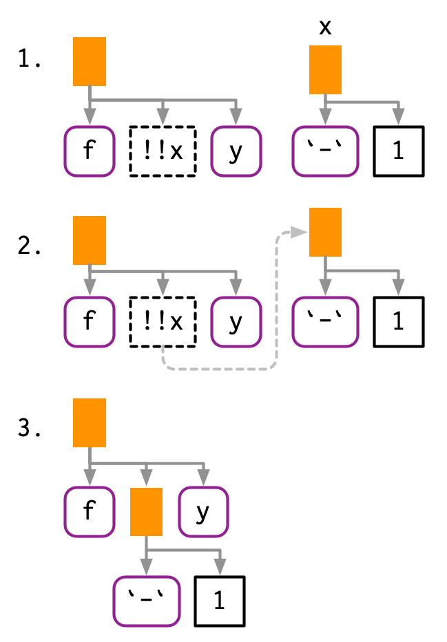
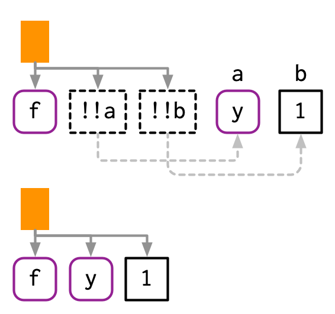
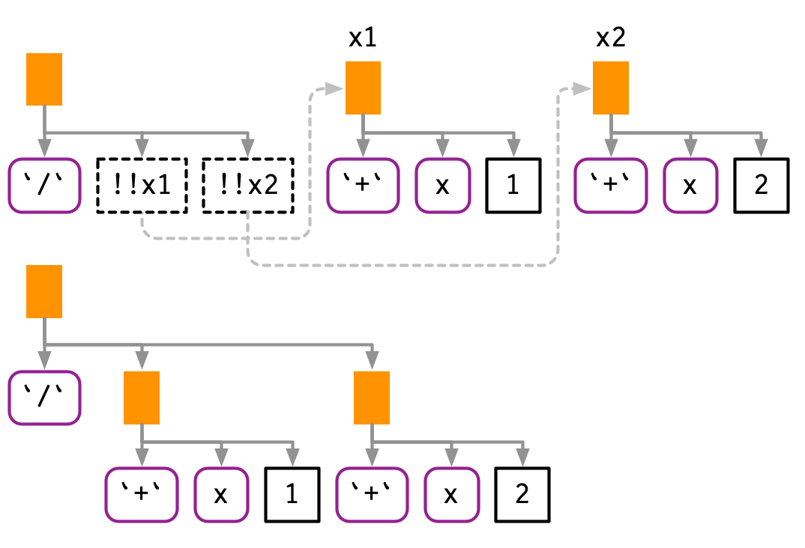
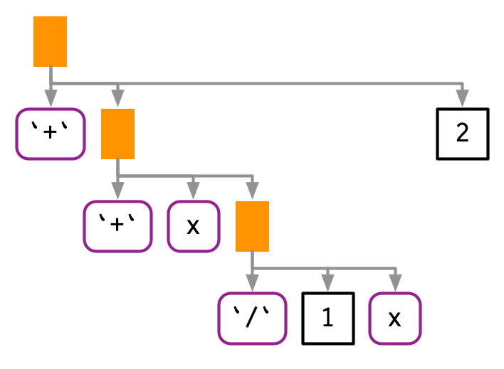
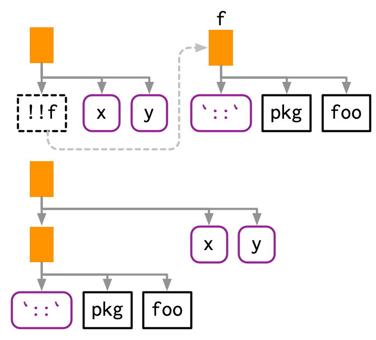
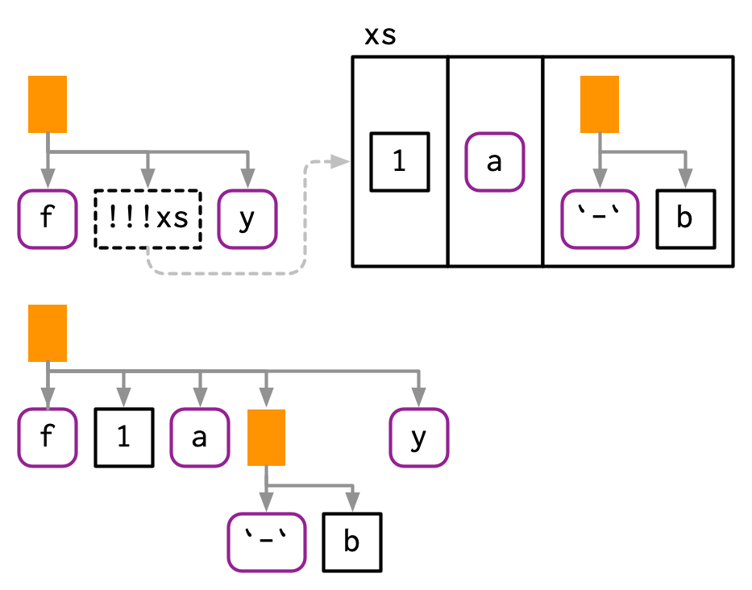

# Quasiquotation

```{r, include = FALSE}
source("common.R")
```

## Introduction

Now that you understand the tree structure of R code, it's time to return to one of the fundamental ideas that make `expr()` and `ast()` work: quotation. In tidy evaluation, all quoting functions are actually quasiquoting functions because they also support unquoting. Where quotation is the act of capturing an unevaluated expression, __unquotation__ is the ability to selectively evaluate parts of an otherwise quoted expression. Together, this is called quasiquotation. Quasiquotation makes it easy to create functions that combine code written by the function's author with code written by the function's user. This helps to solve a wide variety of challenging problems. 

Quasiquotation is one of the three pillars of tidy evaluation. You'll learn about the other two (quosures and the data mask) in Chapter \@ref(evaluation). When used alone, quasiquotation is most useful for programming, particularly for generating code. But when it's combined with the other techniques, tidy evaluation becomes a powerful tool for data analysis.

### Outline {-}

* Section \@ref(quasi-motivation) motivates the development of quasiquotation
  with a function, `cement()`, that works like `paste()` but automatically
  quotes its arguments so that you don't have to.
  
* Section \@ref(quoting) gives you the tools to quote expressions, whether
  they come from you or the user, or whether you use rlang or base R tools.
  
* Section \@ref(unquoting) introduces the biggest difference between rlang 
  quoting functions and base quoting function: unquoting with `!!` and `!!!`.

* Section \@ref(base-nonquote) discusses the three main non-quoting
  techniques that base R functions uses to disable quoting behaviour. 
  
* Section \@ref(tidy-dots) explores another place that you can use `!!!`,
  functions that take `...`. It also introduces the special `:=` operator,
  which allows you to dynamically change argument names.
  
* Section \@ref(expr-case-studies) shows a few practical uses of quoting to solve
  problems that naturally require some code generation.

* Section \@ref(history) finishes up with a little history of quasiquotation
  for those who are interested.

### Prerequisites {-}

Make sure you've read the metaprogramming overview in Chapter \@ref(meta-big-picture) to get a broad overview of the motivation and the basic vocabulary, and that you're familiar with the tree structure of expressions as described in Section \@ref(expression-details).

Code-wise, we'll mostly be using the tools from [rlang](https://rlang.r-lib.org), but at the end of the chapter you'll also see some powerful applications in conjunction with [purrr](https://purrr.tidyverse.org).

```{r setup, message = FALSE}
library(rlang)
library(purrr)
```

### Related work {-}
\index{macros} 
\index{fexprs}
 
Quoting functions have deep connections to Lisp __macros__. But macros are usually run at compile-time, which doesn't exist in R, and they always input and output ASTs. See @lumley-2001 for one approach to implementing them in R. Quoting functions are more closely related to the more esoteric Lisp [__fexprs__](http://en.wikipedia.org/wiki/Fexpr), functions where all arguments are quoted by default. These terms are useful to know when looking for related work in other programming languages.

## Motivation {#quasi-motivation}

We'll start with a concrete example that helps motivate the need for unquoting, and hence quasiquotation. Imagine you're creating a lot of strings by joining together words:

```{r}
paste("Good", "morning", "Hadley")
paste("Good", "afternoon", "Alice")
```

You are sick and tired of writing all those quotes, and instead you just want to use bare words. To that end, you've written the following function. (Don't worry about the implementation for now; you'll learn about the pieces later.)

```{r}
cement <- function(...) {
  args <- ensyms(...)
  paste(purrr::map(args, as_string), collapse = " ")
}

cement(Good, morning, Hadley)
cement(Good, afternoon, Alice)
```

Formally, this function quotes all of its inputs. You can think of it as automatically putting quotation marks around each argument. That's not precisely true as the intermediate objects it generates are expressions, not strings, but it's a useful approximation, and the root meaning of the term "quote".

This function is nice because we no longer need to type quotation marks. The problem comes when we want to use variables. It's easy to use variables with `paste()`: just don't surround them with quotation marks.

```{r}
name <- "Hadley"
time <- "morning"

paste("Good", time, name)
```

Obviously this doesn't work with `cement()` because every input is automatically quoted:

```{r}
cement(Good, time, name)
```

We need some way to explicitly _unquote_ the input to tell `cement()` to remove the automatic quote marks. Here we need `time` and `name` to be treated differently to `Good`. Quasiquotation gives us a standard tool to do so: `!!`, called "unquote", and pronounced bang-bang. `!!` tells a quoting function to drop the implicit quotes:

```{r}
cement(Good, !!time, !!name)
```

It's useful to compare `cement()` and `paste()` directly. `paste()` evaluates its arguments, so we must quote where needed; `cement()` quotes its arguments, so we must unquote where needed.

```{r, eval = FALSE}
paste("Good", time, name)
cement(Good, !!time, !!name)
```

### Vocabulary
\index{arguments!evaluated versus quoted}
\index{non-standard evaluation}

The distinction between quoted and evaluated arguments is important:

* An __evaluated__ argument obeys R's usual evaluation rules.

* A __quoted__ argument is captured by the function, and is processed in
  some custom way.

`paste()` evaluates all its arguments; `cement()` quotes all its arguments.

If you're ever unsure about whether an argument is quoted or evaluated, try executing the code outside of the function. If it doesn't work or does something different, then that argument is quoted. For example, you can use this technique to determine that the first argument to `library()` is quoted:

```{r, error = TRUE}
# works
library(MASS)

# fails
MASS
```

Talking about whether an argument is quoted or evaluated is a more precise way of stating whether or not a function uses non-standard evaluation (NSE). I will sometimes use "quoting function" as short-hand for a function that quotes one or more arguments, but generally, I'll talk about quoted arguments since that is the level at which the difference applies.

### Exercises

1.  For each function in the following base R code, identify which arguments
    are quoted and which are evaluated.

    ```{r, results = FALSE}
    library(MASS)
    
    mtcars2 <- subset(mtcars, cyl == 4)
    
    with(mtcars2, sum(vs))
    sum(mtcars2$am)
    
    rm(mtcars2)
    ```

1.  For each function in the following tidyverse code, identify which arguments
    are quoted and which are evaluated.

    ```{r, eval = FALSE}
    library(dplyr)
    library(ggplot2)
    
    by_cyl <- mtcars %>%
      group_by(cyl) %>%
      summarise(mean = mean(mpg))
    
    ggplot(by_cyl, aes(cyl, mean)) + geom_point()
    ```

## Quoting
\index{quoting}

The first part of quasiquotation is quotation: capturing an expression without evaluating it. We'll need a pair of functions because the expression can be supplied directly or indirectly, via lazily-evaluated function argument. I'll start with the rlang quoting functions, then circle back to those provided by base R.

### Capturing expressions
\index{expressions!capturing}
\indexc{expr()}
\index{quoting!expr@\texttt{expr()}}

There are four important quoting functions. For interactive exploration, the most important is `expr()`, which captures its argument exactly as provided:

```{r}
expr(x + y)
expr(1 / 2 / 3)
```

(Remember that white space and comments are not part of the expression, so will not be captured by a quoting function.)

`expr()` is great for interactive exploration, because it captures what you, the developer, typed. It's not so useful inside a function:

```{r}
f1 <- function(x) expr(x)
f1(a + b + c)
```

\indexc{enexpr()}
We need another function to solve this problem: `enexpr()`. This captures what the caller supplied to the function by looking at the internal promise object that powers lazy evaluation (Section \@ref(promises)).

```{r}
f2 <- function(x) enexpr(x)
f2(a + b + c)
```

(It's called "en"-`expr()` by analogy to enrich. Enriching someone makes them richer; `enexpr()`ing a argument makes it an expression.)

To capture all arguments in `...`, use `enexprs()`.

```{r}
f <- function(...) enexprs(...)
f(x = 1, y = 10 * z)
```

Finally, `exprs()` is useful interactively to make a list of expressions:

```{r, results = FALSE}
exprs(x = x ^ 2, y = y ^ 3, z = z ^ 4)
# shorthand for
# list(x = expr(x ^ 2), y = expr(y ^ 3), z = expr(z ^ 4))
```

In short, use `enexpr()` and `enexprs()` to capture the expressions supplied as arguments _by the user_. Use `expr()` and `exprs()` to capture expressions that _you_ supply.

### Capturing symbols
\index{symbols!capturing}
\indexc{ensym()}

Sometimes you only want to allow the user to specify a variable name, not an arbitrary expression. In this case, you can use `ensym()` or `ensyms()`. These are variants of `enexpr()` and `enexprs()` that check the captured expression is either symbol or a string (which is converted to a symbol[^string-symbol]). `ensym()` and `ensyms()` throw an error if given anything else.

[^string-symbol]: This is for compatibility with base R, which allows you to provide a string instead of a symbol in many places: `"x" <- 1`, `"foo"(x, y)`, `c("x" = 1)`.

```{r}
f <- function(...) ensyms(...)
f(x)
f("x")
```

### With base R
\index{expressions!capturing with base R}
\index{quoting!quote@\texttt{quote()}}

Each rlang function described above has an equivalent in base R. Their primary difference is that the base equivalents do not support unquoting (which we'll talk about very soon). This make them quoting functions, rather than quasiquoting functions.

The base equivalent of `expr()` is `quote()`:
  
```{r}
quote(x + y)
```

The base function closest to `enexpr()` is `substitute()`:

```{r}
f3 <- function(x) substitute(x)
f3(x + y)
```

\indexc{alist()}
The base equivalent to `exprs()` is `alist()`:
  
```{r}
alist(x = 1, y = x + 2)
```

The equivalent to `enexprs()` is an undocumented feature of `substitute()`[^peter-meilstrup]:

```{r}
f <- function(...) as.list(substitute(...()))
f(x = 1, y = 10 * z)
```

[^peter-meilstrup]: Discovered by Peter Meilstrup and described in [R-devel on 2018-08-13](http://r.789695.n4.nabble.com/substitute-on-arguments-in-ellipsis-quot-dot-dot-dot-quot-td4751658.html).

There are two other important base quoting functions that we'll cover elsewhere:

* `bquote()` provides a limited form of quasiquotation, and is discussed in 
  Section \@ref(base-nonquote). 
  
* `~`, the formula, is a quoting function that also captures the environment. 
  It's the inspiration for quosures, the topic of the next chapter, and is 
  discussed in Section \@ref(quosure-impl).

### Substitution
\indexc{substitute()}

You'll most often see `substitute()` used to capture unevaluated arguments. However, as well as quoting, `substitute()` also does substitution (as its name suggests!). If you give it an expression, rather than a symbol, it will substitute in the values of symbols defined in the current environment. 

```{r}
f4 <- function(x) substitute(x * 2)
f4(a + b + c)
```

I think this makes code hard to understand, because if it is taken out of context, you can't tell if the goal of `substitute(x + y)` is to replace `x`, `y`, or both. If you do want to use `substitute()` for substitution, I recommend that you use the second argument to make your goal clear:

```{r}
substitute(x * y * z, list(x = 10, y = quote(a + b)))
```

### Summary

When quoting (i.e. capturing code), there are two important distinctions: 

* Is it supplied by the developer of the code or the user of the code?
  In other words, is it fixed (supplied in the body of the function) or varying (supplied
  via an argument)?
  
* Do you want to capture a single expression or multiple expressions?

This leads to a 2 $\times$ 2 table of functions for rlang, Table \@ref(tab:quoting-rlang), and for base R, Table \@ref(tab:quoting-base).

|      | Developer | User        |
|------|-----------|-------------|
| One  | `expr()`  | `enexpr()`  |
| Many | `exprs()` | `enexprs()` |
Table: (\#tab:quoting-rlang) rlang quasiquoting functions

|      | Developer | User                         |
|------|-----------|------------------------------|
| One  | `quote()` | `substitute()`               |
| Many | `alist()` | `as.list(substitute(...()))` |
Table: (\#tab:quoting-base) base R quoting functions

### Exercises

1.  How is `expr()` implemented? Look at its source code.

1.  Compare and contrast the following two functions. Can you predict the
    output before running them?

    ```{r, results = FALSE}
    f1 <- function(x, y) {
      exprs(x = x, y = y)
    }
    f2 <- function(x, y) {
      enexprs(x = x, y = y)
    }
    f1(a + b, c + d)
    f2(a + b, c + d)
    ```

1.  What happens if you try to use `enexpr()` with an expression (i.e. 
    `enexpr(x + y)` ? What happens if `enexpr()` is passed a missing argument?

1.  How are `exprs(a)` and `exprs(a = )` different? Think about both the
    input and the output.

1.  What are other differences between `exprs()` and `alist()`? Read the 
    documentation for the named arguments of `exprs()` to find out.

1.  The documentation for `substitute()` says:

    > Substitution takes place by examining each component of the parse tree 
    > as follows: 
    > 
    > * If it is not a bound symbol in `env`, it is unchanged. 
    > * If it is a promise object (i.e., a formal argument to a function) 
    >   the expression slot of the promise replaces the symbol. 
    > * If it is an ordinary variable, its value is substituted, unless 
    > `env` is .GlobalEnv in which case the symbol is left unchanged.
  
    Create examples that illustrate each of the above cases.

## Unquoting
\index{unquoting}
\index{quasiquotation}
\index{expressions!unquoting}

So far, you've only seen relatively small advantages of the rlang quoting functions over the base R quoting functions: they have a more consistent naming scheme. The big difference is that rlang quoting functions are actually quasiquoting functions because they can also unquote.

Unquoting allows you to selectively evaluate parts of the expression that would otherwise be quoted, which effectively allows you to merge ASTs using a template AST. Since base functions don't use unquoting, they instead use a variety of other techniques, which you'll learn about in Section \@ref(base-nonquote).

Unquoting is one inverse of quoting. It allows you to selectively evaluate code inside `expr()`, so that `expr(!!x)` is equivalent to `x`. In Chapter \@ref(evaluation), you'll learn about another inverse, evaluation. This happens outside `expr()`, so that `eval(expr(x))` is equivalent to `x`.

### Unquoting one argument
\indexc{"!"!}

Use `!!` to unquote a single argument in a function call. `!!` takes a single expression, evaluates it, and inlines the result in the AST. 

```{r}
x <- expr(-1)
expr(f(!!x, y))
```

I think this is easiest to understand with a diagram. `!!` introduces a placeholder in the AST, shown with dotted borders. Here the placeholder `x` is replaced by an AST, illustrated by a dotted connection.

```{r, echo = FALSE, out.width = NULL}

```

As well as call objects, `!!` also works with symbols and constants:

```{r}
a <- sym("y")
b <- 1
expr(f(!!a, !!b))
```
```{r, echo = FALSE, out.width = NULL}

```

If the right-hand side of `!!` is a function call, `!!` will evaluate it and insert the results:

```{r}
mean_rm <- function(var) {
  var <- ensym(var)
  expr(mean(!!var, na.rm = TRUE))
}
expr(!!mean_rm(x) + !!mean_rm(y))
```

`!!` preserves operator precedence because it works with expressions.

```{r}
x1 <- expr(x + 1)
x2 <- expr(x + 2)

expr(!!x1 / !!x2)
```
```{r, echo = FALSE, out.width = NULL}

```

If we simply pasted the text of the expressions together, we'd end up with `x + 1 / x + 2`, which has a very different AST:

```{r, echo = FALSE, out.width = NULL}

```

### Unquoting a function
\index{unquoting!functions}

`!!` is most commonly used to replace the arguments to a function, but you can also use it to replace the function. The only challenge here is operator precedence: `expr(!!f(x, y))` unquotes the result of `f(x, y)`, so you need an extra pair of parentheses.

```{r}
f <- expr(foo)
expr((!!f)(x, y))
```

This also works when `f` is a call:

```{r}
f <- expr(pkg::foo)
expr((!!f)(x, y))
```

```{r, echo = FALSE, out.width = NULL}

```

Because of the large number of parentheses involved, it can be clearer to use `rlang::call2()`:

```{r}
f <- expr(pkg::foo)
call2(f, expr(x), expr(y))
```

### Unquoting a missing argument {#unquote-missing}
\index{unquoting!missing arguments}
\index{missing arguments!unquoting}

Very occasionally it is useful to unquote a missing argument (Section \@ref(empty-symbol)), but the naive approach doesn't work:

```{r, error = TRUE}
arg <- missing_arg()
expr(foo(!!arg, !!arg))
```

You can work around this with the `rlang::maybe_missing()` helper:

```{r}
expr(foo(!!maybe_missing(arg), !!maybe_missing(arg)))
```

### Unquoting in special forms
\index{unquoting!special forms}
\index{special forms!unquoting}

There are a few special forms where unquoting is a syntax error. Take `$` for example: it must always be followed by the name of a variable, not another expression. This means attempting to unquote with `$` will fail with a syntax error:

```r
expr(df$!!x)
#> Error: unexpected '!' in "expr(df$!"
```

To make unquoting work, you'll need to use the prefix form (Section \@ref(prefix-transform)):

```{r}
x <- expr(x)
expr(`$`(df, !!x))
```

### Unquoting many arguments
\indexc{"!"!"!}
\index{splicing!expressions}
\index{splicing|seealso {"!"!"!}}
\index{unquoting!many arguments}

`!!` is a one-to-one replacement. `!!!` (called "unquote-splice", and pronounced bang-bang-bang) is a one-to-many replacement. It takes a list of expressions and inserts them at the location of the `!!!`:

<!-- GVW: brief note to explain why `!!` can't be made smart enough to do this automatically? -->

```{r}
xs <- exprs(1, a, -b)
expr(f(!!!xs, y))

# Or with names
ys <- set_names(xs, c("a", "b", "c"))
expr(f(!!!ys, d = 4))
```

```{r, echo = FALSE, out.width = NULL}

```

`!!!` can be used in any rlang function that takes `...` regardless of whether or not `...` is quoted or evaluated. We'll come back to this in Section \@ref(tidy-dots); for now note that this can be useful in `call2()`.

```{r}
call2("f", !!!xs, expr(y))
```

### The polite fiction of `!!`

So far we have acted as if `!!` and `!!!` are regular prefix operators like `+` , `-`, and `!`. They're not. From R's perspective, `!!` and `!!!` are simply the repeated application of `!`: 

```{r}
!!TRUE
!!!TRUE
```

`!!` and `!!!` behave specially inside all quoting functions powered by rlang, where they behave like real operators with precedence equivalent to unary `+` and `-`. This requires considerable work inside rlang, but means that you can write `!!x + !!y` instead of `(!!x) + (!!y)`.

The biggest downside[^bang-bang-print] to using a fake operator is that you might get silent errors when misusing `!!` outside of quasiquoting functions. Most of the time this is not an issue because `!!` is typically used to unquote expressions or quosures. Since expressions are not supported by the negation operator, you will get an argument type error in this case:

[^bang-bang-print]: Prior to R 3.5.1, there was another major downside: the R deparser treated `!!x` as `!(!x)`. This is why in old versions of R you might see extra parentheses when printing expressions. The good news is that these parentheses are not real and can be safely ignored most of the time. The bad news is that they will become real if you reparse that printed output to R code. These roundtripped functions will not work as expected since `!(!x)` does not unquote.

```{r, error = TRUE}
x <- quote(variable)
!!x
```

But you can get silently incorrect results when working with numeric values:

```{r}
df <- data.frame(x = 1:5)
y <- 100
with(df, x + !!y)
```

Given these drawbacks, you might wonder why we introduced new syntax instead of using regular function calls. Indeed, early versions of tidy evaluation used function calls like `UQ()` and `UQS()`. However, they're not really function calls, and pretending they are leads to a misleading mental mode. We chose `!!` and `!!!` as the least-bad solution:

* They are visually strong and don't look like existing syntax. When you 
  see `!!x` or `!!!x` it's clear that something unusual is happening.
  
* They override a rarely used piece of syntax, as double negation is not a
  common pattern in R[^js-double-neg]. If you do need it, you can just
  add parentheses `!(!x)`.

[^js-double-neg]: Unlike, say, Javascript, where `!!x` is a commonly used shortcut to convert an integer into a logical.

### Non-standard ASTs {#non-standard-ast}
\index{ASTs!non-standard}

With unquoting, it's easy to create non-standard ASTs, i.e. ASTs that contain components that are not expressions. (It is also possible to create non-standard ASTs by directly manipulating the underlying objects, but it's harder to do so accidentally.) These are valid, and occasionally useful, but their correct use is beyond the scope of this book. However, it's important to learn about them, because they can be deparsed, and hence printed, in misleading ways. 

For example, if you inline more complex objects, their attributes are not printed. This can lead to confusing output:

```{r}
x1 <- expr(class(!!data.frame(x = 10)))
x1
eval(x1)
```

You have two main tools to reduce this confusion: `rlang::expr_print()` and `lobstr::ast()`:

```{r}
expr_print(x1)
lobstr::ast(!!x1)
```

Another confusing case arises if you inline an integer sequence:

```{r}
x2 <- expr(f(!!c(1L, 2L, 3L, 4L, 5L)))
x2
expr_print(x2)
lobstr::ast(!!x2)
```

It's also possible to create regular ASTs that can not be generated from code because of operator precedence. In this case, R will print parentheses that do not exist in the AST:

```{r}
x3 <- expr(1 + !!expr(2 + 3))
x3

lobstr::ast(!!x3)
```

### Exercises

1.  Given the following components:

    ```{r}
    xy <- expr(x + y)
    xz <- expr(x + z)
    yz <- expr(y + z)
    abc <- exprs(a, b, c)
    ```
    
    Use quasiquotation to construct the following calls:
    
    ```{r, eval = FALSE}
    (x + y) / (y + z)
    -(x + z) ^ (y + z)
    (x + y) + (y + z) - (x + y)
    atan2(x + y, y + z)
    sum(x + y, x + y, y + z)
    sum(a, b, c)
    mean(c(a, b, c), na.rm = TRUE)
    foo(a = x + y, b = y + z)
    ```

1.  The following two calls print the same, but are actually different:

    ```{r}
    (a <- expr(mean(1:10)))
    (b <- expr(mean(!!(1:10))))
    identical(a, b)
    ```

    What's the difference? Which one is more natural?

## Non-quoting {#base-nonquote}
\indexc{bquote()}
\index{unquoting!base R}

Base R has one function that implements quasiquotation: `bquote()`. It uses `.()` for unquoting:

```{r}
xyz <- bquote((x + y + z))
bquote(-.(xyz) / 2)
```

`bquote()` isn't used by any other function in base R, and has had relatively little impact on how R code is written. There are three challenges to effective use of `bquote()`:

* It is only easily used with your code; it is hard to apply it to arbitrary
  code supplied by a user.
  
* It does not provide an unquote-splice operator that allows you to unquote
  multiple expressions stored in a list.
  
* It lacks the ability to handle code accompanied by an environment, which 
  is crucial for functions that evaluate code in the context of a data frame,
  like `subset()` and friends.

Base functions that quote an argument use some other technique to allow indirect specification. Base R approaches selectively turn quoting off, rather than using unquoting, so I call them __non-quoting__ techniques.

```{r, eval = FALSE, include = FALSE}
call <- names(pryr::find_uses("package:base", "match.call"))
subs <- names(pryr::find_uses("package:base", "substitute"))
eval <- names(pryr::find_uses("package:base", "eval"))

intersect(subs, eval)
```

There are four basic forms seen in base R:

*   A pair of quoting and non-quoting functions. For example, `$` has two 
    arguments, and the second argument is quoted. This is easier to see if you 
    write in prefix form: `mtcars$cyl` is equivalent to `` `$`(mtcars, cyl) ``. 
    If you want to refer to a variable indirectly, you use `[[`, as it 
    takes the name of a variable as a string.
      
    ```{r}
    x <- list(var = 1, y = 2)
    var <- "y"
    
    x$var
    x[[var]]
    ```
    
    There are three other quoting functions closely related to `$`: `subset()`,
    `transform()`, and `with()`. These are seen as wrappers around `$` only
    suitable for interactive use so they all have the same non-quoting
    alternative: `[`
  
    `<-`/`assign()` and `::`/`getExportedValue()` work similarly to `$`/`[`.
    \indexc{\$}
    \indexc{<-}

*   A pair of quoting and non-quoting arguments. For example, `rm()` allows 
    you to provide bare variable names in `...`, or a character vector of
    variable names in `list`:

    ```{r}
    x <- 1
    rm(x)

    y <- 2
    vars <- c("y", "vars")
    rm(list = vars)
    ```
    
    `data()` and `save()` work similarly.
    \indexc{rm()}

*   An argument that controls whether a different argument is quoting or 
    non-quoting. For example, in `library()`, the `character.only` argument
    controls the quoting behaviour of the first argument, `package`:
    
    ```{r, message = FALSE}
    library(MASS)
    
    pkg <- "MASS"
    library(pkg, character.only = TRUE)
    ```
    
    `demo()`, `detach()`, `example()`, and `require()` work similarly.
    \indexc{library()}

*   Quoting if evaluation fails. For example, the first argument to `help()`
    is non-quoting if it evaluates to a string; if evaluation fails, the
    first argument is quoted.

    ```{r, eval = FALSE}
    # Shows help for var
    help(var)
    
    var <- "mean"
    # Shows help for mean
    help(var)
    
    var <- 10
    # Shows help for var
    help(var)
    ```
    
    `ls()`, `page()`, and `match.fun()` work similarly. 
    \indexc{help()}

\indexc{lm()}
Another important class of quoting functions are the base modelling and plotting functions, which follow the so-called standard non-standard evaluation rules: <http://developer.r-project.org/nonstandard-eval.pdf>. For example, `lm()` quotes the `weight` and `subset` arguments, and when used with a formula argument, the plotting function quotes the aesthetic arguments (`col`, `cex`, etc). Take the following code: we only need `col = Species` rather than `col = iris$Species`.

```{r}
palette(RColorBrewer::brewer.pal(3, "Set1"))
plot(
  Sepal.Length ~ Petal.Length, 
  data = iris, 
  col = Species, 
  pch = 20, 
  cex = 2
)
```

These functions have no built-in options for indirect specification, but you'll learn how to simulate unquoting in Section \@ref(base-evaluation).

## `...` (dot-dot-dot) {#tidy-dots}
\indexc{...}
\index{tidy dots}

<!-- GVW: this seems a long way away from the introduction of `!!!` earlier - move this up above non-quoting in base R? -->

`!!!` is useful because it's not uncommon to have a list of expressions that you want to insert into a call. It turns out that this pattern is common elsewhere. Take the following two motivating problems:

*   What do you do if the elements you want to put in `...` are already stored 
    in a list? For example, imagine you have a list of data frames that 
    you want to `rbind()` together:
    
    ```{r}
    dfs <- list(
      a = data.frame(x = 1, y = 2),
      b = data.frame(x = 3, y = 4)
    )
    ```
    
    You could solve this specific case with `rbind(dfs$a, dfs$b)`, but how
    do you generalise that solution to a list of arbitrary length?

*   What do you do if you want to supply the argument name indirectly? For 
    example, imagine you want to create a single column data frame where 
    the name of the column is specified in a variable:
    
    ```{r}
    var <- "x"
    val <- c(4, 3, 9)
    ```
    
    In this case, you could create a data frame and then change names
    (i.e. `setNames(data.frame(val), var)`), but this feels inelegant.
    How can we do better?

One way to think about these problems is to draw explicit parallels to quasiquotation:

*   Row-binding multiple data frames is like unquote-splicing: we want to inline
    individual elements of the list into the call:

    ```{r}
    dplyr::bind_rows(!!!dfs)
    ```
    
    When used in this context, the behaviour of `!!!` is known as "spatting" in 
    Ruby, Go, PHP, and Julia. It is closely related to `*args` (star-args) and
    `**kwarg` (star-star-kwargs) in Python, which are sometimes called argument
    unpacking. 
    \index{splicing}

*   The second problem is like unquoting the left-hand side of `=`: rather 
    than interpreting `var` literally, we want to use the value stored in the 
    variable called `var`:

    ```{r}
    tibble::tibble(!!var := val)
    ```

    Note the use of `:=` (pronounced colon-equals) rather than `=`. Unfortunately 
    we need this new operation because R's grammar does not allow expressions as
    argument names:
    
    ```{r, eval = FALSE}
    tibble::tibble(!!var = value)
    #> Error: unexpected '=' in "tibble::tibble(!!var ="
    ```
    
    `:=` is like a vestigial organ: it's recognised by R's parser, but it
    doesn't have any code associated with it. It looks like an `=` but allows 
    expressions on either side, making it a more flexible alternative to `=`. 
    It is used in data.table for similar reasons.
    \indexc{:=}

<!-- GVW: I think `:=` needs/deserves more than a fly-by in a bullet point... -->

Base R takes a different approach, which we'll come back to in Section \@ref(do-call).

We say functions that support these tools, without quoting arguments, have __tidy dots__[^tidy-dots]. To gain tidy dots behaviour in your own function, all you need to do is use `list2()`.

[^tidy-dots]: This is admittedly not the most creative of names, but it clearly suggests it's something that has been added to R after the fact.

### Examples
\index{attributes!attributes@\texttt{attributes()}}

One place we could use `list2()` is to create a wrapper around `attributes()` that allows us to set attributes flexibly:

```{r}
set_attr <- function(.x, ...) {
  attr <- rlang::list2(...)
  attributes(.x) <- attr
  .x
}

attrs <- list(x = 1, y = 2)
attr_name <- "z"

1:10 %>%
  set_attr(w = 0, !!!attrs, !!attr_name := 3) %>% 
  str()
```

### `exec()`
\indexc{exec()}
\indexc{list2()}

What if you want to use this technique with a function that doesn't have tidy dots? One option is to use `rlang::exec()` to call a function with some arguments supplied  directly (in `...`) and others indirectly (in a list):

```{r}
# Directly
exec("mean", x = 1:10, na.rm = TRUE, trim = 0.1)

# Indirectly
args <- list(x = 1:10, na.rm = TRUE, trim = 0.1)
exec("mean", !!!args)

# Mixed
params <- list(na.rm = TRUE, trim = 0.1)
exec("mean", x = 1:10, !!!params)
```

`rlang::exec()` also makes it possible to supply argument names indirectly:

```{r}
arg_name <- "na.rm"
arg_val <- TRUE
exec("mean", 1:10, !!arg_name := arg_val)
```

And finally, it's useful if you have a vector of function names or a list of functions that you want to call with the same arguments:

```{r}
x <- c(runif(10), NA)
funs <- c("mean", "median", "sd")

purrr::map_dbl(funs, exec, x, na.rm = TRUE)
```

`exec()` is closely related to `call2()`; where `call2()` returns an expression, `exec()` evaluates it.

### `dots_list()`
\indexc{dots\_list()}

`list2()` provides one other handy feature: by default it will ignore any empty arguments at the end. This is useful in functions like `tibble::tibble()` because it means that you can easily change the order of variables without worrying about the final comma:

```{r, results = FALSE}
# Can easily move x to first entry:
tibble::tibble(
  y = 1:5,
  z = 3:-1,
  x = 5:1,
)

# Need to remove comma from z and add comma to x
data.frame(
  y = 1:5,
  z = 3:-1,
  x = 5:1
)
```

`list2()` is a wrapper around `rlang::dots_list()` with defaults set to the most commonly used settings. You can get more control by calling `dots_list()` directly:

* `.ignore_empty` allows you to control exactly which arguments are ignored.
  The default ignores a single trailing argument to get the behaviour
  described above, but you can choose to ignore all missing arguments, or
  no missing arguments.

* `.homonyms` controls what happens if multiple arguments use the same name:
    ```{r, error = TRUE}
    str(dots_list(x = 1, x = 2))
    str(dots_list(x = 1, x = 2, .homonyms = "first"))
    str(dots_list(x = 1, x = 2, .homonyms = "last"))
    str(dots_list(x = 1, x = 2, .homonyms = "error"))
    ```

* If there are empty arguments that are not ignored, `.preserve_empty`
  controls what to do with them. The default throws an error; setting
  `.preserve_empty = TRUE` instead returns missing symbols. This is useful
  if you're using `dots_list()` to generate function calls.

### With base R {#do-call}
\index{splicing!base R}
\indexc{do.call()}

Base R provides a Swiss army knife to solve these problems: `do.call()`. `do.call()` has two main arguments. The first argument, `what`, gives a function to call. The second argument, `args`, is a list of arguments to pass to that function, and so `do.call("f", list(x, y, z))` is equivalent to `f(x, y, z)`.

*   `do.call()` gives a straightforward solution to `rbind()`ing together many 
    data frames:

    ```{r}
    do.call("rbind", dfs)
    ```

*   With a little more work, we can use `do.call()` to solve the second problem. 
    We first create a list of arguments, then name that, then use `do.call()`:
    
    ```{r}
    args <- list(val)
    names(args) <- var
    
    do.call("data.frame", args)
    ```

Some base functions (including `interaction()`, `expand.grid()`, `options()`, and `par()`) use a trick to avoid `do.call()`: if the first component of `...` is a list, they'll take its components instead of looking at the other elements of `...`. The implementation looks something like this:

```{r}
f <- function(...) {
  dots <- list(...)
  if (length(dots) == 1 && is.list(dots[[1]])) {
    dots <- dots[[1]]
  }
  
  # Do something
  ...
}
```

Another approach to avoiding `do.call()` is found in the `RCurl::getURL()` function written by Duncan Temple Lang. `getURL()` takes both `...` and `.dots` which are concatenated together and looks something like this:

```{r}
f <- function(..., .dots) {
  dots <- c(list(...), .dots)
  # Do something
}
```

At the time I discovered it, I found this technique particularly compelling so you can see it used throughout the tidyverse. Now, however, I prefer the approach described previously.

### Exercises

1.  One way to implement `exec()` is shown below. Describe how it works. What are the
    key ideas?
    
    ```{r}
    exec <- function(f, ..., .env = caller_env()) {
      args <- list2(...)
      do.call(f, args, envir = .env)
    }
    ```

1.  Carefully read the source code for `interaction()`, `expand.grid()`, and 
    `par()`.  Compare and contrast the techniques they use for switching 
    between dots and list behaviour.

1.  Explain the problem with this definition of `set_attr()`
    
    ```{r, error = TRUE}
    set_attr <- function(x, ...) {
      attr <- rlang::list2(...)
      attributes(x) <- attr
      x
    }
    set_attr(1:10, x = 10)
    ```


## Case studies {#expr-case-studies}

To make the ideas of quasiquotation concrete, this section contains a few small case studies that use it to solve real problems. Some of the case studies also use purrr: I find the combination of quasiquotation and functional programming to be particularly elegant.

### `lobstr::ast()`
\index{unquoting!in ast()@in \texttt{ast()}}

Quasiquotation allows us to solve an annoying problem with `lobstr::ast()`: what happens if we've already captured the expression?

```{r}
z <- expr(foo(x, y))
lobstr::ast(z)
```

Because `ast()` quotes its first argument, we can use `!!`:

```{r}
lobstr::ast(!!z)
```

### Map-reduce to generate code

Quasiquotation gives us powerful tools for generating code, particularly when combined with `purrr::map()` and `purr::reduce()`. For example, assume you have a linear model specified by the following coefficients:

```{r}
intercept <- 10
coefs <- c(x1 = 5, x2 = -4)
```

And you want to convert it into an expression like `10 + (x1 * 5) + (x2 * -4)`. The first thing we need to do is turn the character names vector into a list of symbols. `rlang::syms()` is designed precisely for this case:

```{r}
coef_sym <- syms(names(coefs))
coef_sym
```

Next we need to combine each variable name with its coefficient. We can do this by combining `rlang::expr()` with `purrr::map2()`:

```{r}
summands <- map2(coef_sym, coefs, ~ expr((!!.x * !!.y)))
summands
```

In this case, the intercept is also a part of the sum, although it doesn't involve a multiplication. We can just add it to the start of the `summands` vector:

```{r}
summands <- c(intercept, summands)
summands
```

Finally, we need to reduce (Section \@ref(reduce)) the individual terms into a single sum by adding the pieces together:

```{r}
eq <- reduce(summands, ~ expr(!!.x + !!.y))
eq
```

We could make this even more general by allowing the user to supply the name of the coefficient, and instead of assuming many different variables, index into a single one.

```{r}
var <- expr(y)
coef_sym <- map(seq_along(coefs), ~ expr((!!var)[[!!.x]]))
coef_sym
```

And finish by wrapping this up in a function:

```{r}
linear <- function(var, val) {
  var <- ensym(var)
  coef_name <- map(seq_along(val[-1]), ~ expr((!!var)[[!!.x]]))

  summands <- map2(val[-1], coef_name, ~ expr((!!.x * !!.y)))
  summands <- c(val[[1]], summands)

  reduce(summands, ~ expr(!!.x + !!.y))
}

linear(x, c(10, 5, -4))
```

Note the use of `ensym()`: we want the user to supply the name of a single variable, not a more complex expression.

### Slicing an array
\index{arrays!slicing}

An occasionally useful tool missing from base R is the ability to extract a slice of an array given a dimension and an index. For example, we'd like to write `slice(x, 2, 1)` to extract the first slice along the second dimension, i.e.  `x[, 1, ]`. This is a moderately challenging problem because it requires working with missing arguments. 

We'll need to generate a call with multiple missing arguments. We first generate a list of missing arguments with `rep()` and `missing_arg()`, then unquote-splice them into a call:

```{r}
indices <- rep(list(missing_arg()), 3)
expr(x[!!!indices])
```

Then we use subset-assignment to insert the index in the desired position:

```{r}
indices[[2]] <- 1
expr(x[!!!indices])
```

We then wrap this into a function, using a couple of `stopifnot()`s to make the interface clear:

```{r}
slice <- function(x, along, index) {
  stopifnot(length(along) == 1)
  stopifnot(length(index) == 1)
    
  nd <- length(dim(x))
  indices <- rep(list(missing_arg()), nd)
  indices[[along]] <- index
  
  expr(x[!!!indices])
}

x <- array(sample(30), c(5, 2, 3))
slice(x, 1, 3)
slice(x, 2, 2)
slice(x, 3, 1)
```

A real `slice()` would evaluate the generated call (Chapter \@ref(evaluation)), but here I think it's more illuminating to see the code that's generated, as that's the hard part of the challenge.

### Creating functions {#new-function}
\index{anaphoric functions}
\index{functions!generating with code}

Another powerful application of quotation is creating functions "by hand", using  `rlang::new_function()`. It's a function that creates a function from its three components (Section \@ref(fun-components)): arguments, body, and (optionally) an environment:

```{r}
new_function(
  exprs(x = , y = ), 
  expr({x + y})
)
```

NB: the empty arguments in `exprs()` generates arguments with no defaults.

One use of `new_function()` is as an alternative to function factories with scalar or symbol arguments. For example, we could write a function that generates functions that raise a function to the power of a number. 
 
```{r}
power <- function(exponent) {
  new_function(
    exprs(x = ), 
    expr({
      x ^ !!exponent
    }), 
    caller_env()
  )
}
power(0.5)
```

Another application of `new_function()` is for functions that work like `graphics::curve()`, which allows you to plot a mathematical expression without creating a function:

```{r curve-demo, fig.width = 3.5, fig.height = 2.5, small_mar = TRUE}
curve(sin(exp(4 * x)), n = 1000)
```

In this code, `x` is a pronoun: it doesn't represent a single concrete value, but is instead a placeholder that varies over the range of the plot. One way to implement `curve()` is to turn that expression into a function with a single argument, `x`, then call that function:

```{r curve2, fig.show="hide"}
curve2 <- function(expr, xlim = c(0, 1), n = 100) {
  expr <- enexpr(expr)
  f <- new_function(exprs(x = ), expr)
  
  x <- seq(xlim[1], xlim[2], length = n)
  y <- f(x)

  plot(x, y, type = "l", ylab = expr_text(expr))
}
curve2(sin(exp(4 * x)), n = 1000)
```

Functions like `curve()` that use an expression containing a pronoun are known as __anaphoric__ functions[^anaphora].

[^anaphora]: Anaphoric comes from the linguistics term "anaphora", an expression that is context dependent. Anaphoric functions are found in [Arc](http://www.arcfn.com/doc/anaphoric.html) (a Lisp like language), [Perl](http://www.perlmonks.org/index.pl?node_id=666047), and [Clojure](http://amalloy.hubpages.com/hub/Unhygenic-anaphoric-Clojure-macros-for-fun-and-profit).

### Exercises

1.  In the linear-model example, we could replace the `expr()` in 
    `reduce(summands, ~ expr(!!.x + !!.y))` with `call2()`:
    `reduce(summands, call2, "+")`. Compare and contrast the two 
    approaches. Which do you think is easier to read?

1.  Re-implement the Box-Cox transform defined below using unquoting and
    `new_function()`:

    ```{r}
    bc <- function(lambda) {
      if (lambda == 0) {
        function(x) log(x)
      } else {
        function(x) (x ^ lambda - 1) / lambda
      }
    }
    ```

1.  Re-implement the simple `compose()` defined below using quasiquotation and 
    `new_function()`:
    
    ```{r}
    compose <- function(f, g) {
      function(...) f(g(...))
    }
    ```

## History

The idea of quasiquotation is an old one. It was first developed by the philosopher Willard van Orman Quine[^quine] in the early 1940s. It's needed in philosophy because it helps when precisely delineating the use and mention of words, i.e. distinguishing between the object and the words we use to refer to that object. 

[^quine]: You might be familiar with the name Quine from "quines", computer programs that return a copy of their own source when run.

Quasiquotation was first used in a programming language, Lisp, in the mid-1970s [@bawden-1999]. Lisp has one quoting function `` ` ``, and uses `,` for unquoting. Most languages with a Lisp heritage behave similarly. For example, Racket (`` ` `` and `@`), Clojure (`` ` `` and `~`), and Julia (`:` and `@`) all have quasiquotation tools that differ only slightly from Lisp. These languages have a single quoting function and you must call it explicitly. 

In R, however, many functions quote one or more inputs. This introduces ambiguity (because you need to read the documentation to determine if an argument is quoted or not), but allows for concise and elegant data exploration code. In base R, only one function supports quasiquotation: `bquote()`, written in 2003 by Thomas Lumley. However, `bquote()` has some major limitations which prevented it from having a wide impact on R code (Section \@ref(base-nonquote)).

My attempt to resolve these limitations led to the lazyeval package (2014-2015). Unfortunately, my analysis of the problem was incomplete and while lazyeval solved some problems, it created others. It was not until I started working with Lionel Henry on the problem that all the pieces finally fell into place and we created the full tidy evaluation framework (2017). Despite the newness of tidy evaluation, I teach it here because it is a rich and powerful theory that, once mastered, makes many hard problems much easier.
