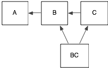

# The S4 object system

<!-- 
http://www.ci.tuwien.ac.at/Conferences/useR-2004/Keynotes/Leisch.pdf
Need to use consistent example throughout - work on car inspection a la Dylan?
-->

Compared to S3, the S4 object system is much stricter, and much closer to other OO systems. I recommend you familiarise yourself with the way that [[S3]] works before reading this document - many of underlying ideas are the same, but the implementation is much stricter. There are two major differences from S3:

* formal class definitions: unlike S3, S4 formally defines the
  representation and inheritance for each class

* multiple dispatch: the generic function can be dispatched to a method
  based on the class of any number of argument, not just one

* There is a special operator, `@`, for extracting slots (aka fields)
  from an S4 object.

Here we introduce the basics of S4, trying to stay away from the esoterica and focussing on the ideas that you need to understand and write the majority of S4 code. 

<!-- This document will hopefully give you the scaffolding to make better sense of documentation and other detailed resources such as: ... -->

All S4 related code is stored in the `methods` package. This package is always available when you're running R interactively, but may not be available when running R in batch mode. For this reason, it's a good idea to include an explicit `library(methods)` whenever you're using S4.

To learn more, some good references are:

* [S4 system development in Bioconductor](http://www.bioconductor.org/help/course-materials/2010/AdvancedR/S4InBioconductor.pdf)

* John Chambers' [_Software for Data Analysis_](http://amzn.com/0387759352?tag=devtools-20)

* [Martin Morgan's answers to S4 questions on stackoverflow](http://stackoverflow.com/search?tab=votes&q=user%3a547331%20%5bs4%5d%20is%3aanswe)

## Identifying S4 objects


There aren't any S4 classes in the commonly used base packages (stats, graphics, utils, datasets, and base), so we'll start by creating an S4 object from the built-in stats4 package, which provides some S4 classes and methods associated with maximum likelihood estimation:

```{r}
library(stats4)
library(pryr)

# From example(mle)
y <- c(26, 17, 13, 12, 20, 5, 9, 8, 5, 4, 8)
nLL <- function(lambda) - sum(dpois(y, lambda, log = TRUE))
fit <- mle(nLL, start = list(lambda = 5), nobs = length(y))

# An S4 object
isS4(fit)
otype(fit)

# An S4 generic
isS4(nobs)
ftype(nobs)

# Retrieve an S4 method, described later
mle_nobs <- method_from_call(nobs(fit))
isS4(mle_nobs)
ftype(mle_nobs)
```

Use `is()` with one argument to list all classes that an object inherits from. Use `is()` with two arguments to test if an object inherits from a specific class.

```{r}
is(fit)
is(fit, "mle")
```

You can get a list of all S4 generics with `getGenerics()`, and a list of all S4 classes with `getClasses()`. This list includes shim classes for S3 classes and base types. You can list all S4 methods with `showMethods()`, optionally restricting selection either by `generic` or by `class` (or both). It's also a good idea to supply `where = search()` to restrict the search to methods available in the global environment.


## Classes and instances

In S3, you can turn any object into an object of a particular class just by setting the class attribute.  S4 is much stricter: you must define the representation of the call using `setClass`, and the only way to create it is through the constructer function `new`.


### Defining classes and creating objects

In S3, you can turn any object into an object of a particular class just by setting the class attribute. S4 is much stricter: you must define the representation of a class with `setClass()`, and create a new object with `new()`. You can find the documentation for a class with a special syntax: `class?className`, e.g., `class?mle`. \index{S4!classes} \index{classes!S4}

An S4 class has three key properties:

* A __name__: an alpha-numeric class identifier. By convention, S4 class names
  use UpperCamelCase.

* A named list of __slots__ (fields), which defines slot names and
  permitted classes. For example, a person class might be represented by a
  character name and a numeric age: `list(name = "character", age = "numeric")`.
  \index{slots}

* A string giving the class it inherits from, or, in S4 terminology,
  that it __contains__. You can provide multiple classes for multiple
  inheritance, but this is an advanced technique which adds much
  complexity.

  In `slots` and `contains` you can use S4 classes, S3 classes registered
  with `setOldClass()`, or the implicit class of a base type. In `slots`
  you can also use the special class `ANY` which does not restrict the input.

S4 classes have other optional properties like a `validity` method that tests if an object is valid, and a `prototype` object that defines default slot values. 

### Initialization

You create a class with `setClass`:

```{r}
setClass("Person", representation(name = "character", age = "numeric"))
setClass("Employee", representation(boss = "Person"), contains = c(self = "Person"))
```

and an object of that class with the generator function `new`

```{r}
hadley <- new("Person", name = "Hadley", age = 31)
hadley
```

The function `setClass` returns a function, the generator, that itself calls `new`.
So one can define an alias for the generator function and use it instead of a call
to `new`.
For clarity, it is recommended to use the name of the class:

```{r}
Person <- setClass("Person", slots = c(name = "character", age = "numeric"))
hadley <- Person(name = "Hadley", age = 31)
```

Unlike S3, S4 checks that all of the slots have the correct type:

```{r, error = TRUE}
hadley <- new("Person", name = "Hadley", age = "thirty")
hadley <- new("Person", name = "Hadley", sex = "male")
```

If you omit a slot, it will initiate it with the default object of the class.  

To access slots of an S4 object use `@` or `slot()`: \index{subsetting!S4} \index{S4|subsetting}

```{r}
hadley <- new("Person", name = "Hadley")
hadley@age
slot(hadley, "age")
```

(`@` is equivalent to `$`, and `slot()` to `[[`.)

Since R is an interactive programming language, it's possible to create new classes or redefine existing classes at any time. This can be a problem when you're interactively experimenting with S4. If you modify a class, make sure you also recreate any objects of that class, otherwise you'll end up with invalid objects.


### Prototype

An emtpy value for `age` is probably not what you want.
There are two approaches to create defaults for the slot.
One is the method `initialize`, which is described later, 
and the other is a default __prototype__ for the class.
The recommended usage is to provide an object (e.g. a list) instead of using
the `prototype` function.
This is due to `representation` is deprecated from version 3.0.0 of R,
and the usage of the arguments `slots` and `contains` is promoted.

```R
Person <- setClass("Person", slots = c(name = "character", age = "numeric"),
  prototype = list(name = NA_character_, age = NA_real_))
hadley <- Person(name = "Hadley")
hadley@age
# [1] NA
```

An empty value for `age` is probably not what you want, so you can also assign a default __prototype__ for the class:

```R
setClass("Person", slots = c(name = "character", age = "numeric"), 
  prototype = list(name = NA_character_, age = NA_real_))
hadley <- new("Person", name = "Hadley")
hadley@age
# [1] NA
```

`getSlots` will return a description of all the slots of a class:

```R
getSlots("Person")
#        name         age 
# "character"   "numeric" 
```

You can find out the class of an object with `is`.

```R
is(hadley, "Person")
# [1] TRUE
```

Note that there's some tension between the usual interactive functional style of R and the global side-effect causing S4 class definitions. In most programming languages, class definition occurs at compile-time, while object instantiation occurs at run-time - it's unusual to be able to create new classes interactively. In particular, note that the examples rely on the fact that multiple calls to `setClass` with the same class name will silently override the previous definition unless the first definition is sealed with `sealed = TRUE`. 

### Constructor

### Checking validity

Do not use the validity method.

## Generic functions and methods

Generic functions and methods work similarly to S3, but dispatch is based on the class of all arguments, and there is a special syntax for creating both generic functions and new methods.  
For introduction to generic functions and methdos, the following example sets up a simple hierarchy of shapes to use with the `sides` method.

```R
setClass("Shape")
setClass("Polygon", slots = c(sides = "integer"), contains = "Shape")
setClass("Triangle", contains = "Polygon")
setClass("Square", contains = "Polygon")
setClass("Circle", contains = "Shape")
```

### Create generic functions

### Creating new methods and generics

S4 provides special functions for creating new generics and methods. `setGeneric()` creates a new generic or converts an existing function into a generic. `setMethod()` takes the name of the generic, the classes the method should be associated with, and a function that implements the method. For example, we could take `union()`, which usually just works on vectors, and make it work with data frames: \index{S4!generics} \index{S4!methods} \index{generics!S4} \index{methods!S4}

```{r}
setGeneric("union")
setMethod("union",
  c(x = "data.frame", y = "data.frame"),
  function(x, y) {
    unique(rbind(x, y))
  }
)
```

If you create a new generic from scratch, you need to supply a function that calls `standardGeneric()`:

```{r}
setGeneric("myGeneric", function(x) {
  standardGeneric("myGeneric")
})
```

`standardGeneric()` is the S4 equivalent to `UseMethod()`.


The `setGeneric` function provides two main ways to create a new generic.  You can either convert an existing function to a generic function, or you can create a new one from scratch.

```R
sides <- function (object) 0
setGeneric("sides")
# [1] "sides"
```

If you create your own, the second argument to `setGeneric` should be a function that defines all the arguments that you want to dispatch on and contains a call to `standardGeneric`:

```R
setGeneric("sides", function (object) standardGeneric("sides") )
# [1] "sides"
```

### Create methods

Defining a method for polygons is straightforward: we just use the sides slot.  The `setMethod` function takes three arguments: the name of the generic function, the signature to match for this method and a function to compute the result.  Unfortunately R doesn't offer any syntactic sugar for this task so the code is a little verbose and repetitive.

```R
setMethod("sides", signature = c(object = "Polygon"), 
          function(object) object@sides )
# [1] "sides"
```

For the others we supply exact values. Note that that for generics with few arguments you can simplify the signature without giving the argument names. This saves spaces at the expense of having to remember which position corresponds to which argument - not a problem if there's only one argument.
Here, also the arguments name is not used:

```R
setMethod("sides", signature("Triangle"), function (object) 3 )
# [1] "sides"
setMethod("sides", signature("Square"),   function (object) 4 )
# [1] "sides"
setMethod("sides", signature("Circle"),   function (object) Inf )
# [1] "sides"
```

You can optionally also specify `valueClass` to define the expected output of the generic. This will raise a runtime error if a method returns output of the wrong class.

```R
setGeneric("sides", function(object) standardGeneric("sides"),
           valueClass = "numeric")
setMethod("sides", "Triangle", function(object) "three")
sides(new("Triangle"))
# Error in .valueClassTest(ans, "numeric", "sides") : 
#   invalid value from generic function ‘sides’, class “character”, 
#   expected “numeric”
```

Note that arguments that the generic dispatches on can't be lazily evaluated - otherwise how would R know which class the object was?  This also means that you can't use `substitute` to access the unevaluated expression.

To find what methods are already defined for a generic function, use `showMethods`:

```R
showMethods("sides")
# Function: sides (package .GlobalEnv)
# object="ANY"
# object="Circle"
# object="Polygon"
# object="Square"
# object="Triangle"
    
showMethods(class = "Polygon")
# Function ".DollarNames":
#  <not an S4 generic function>
# 
# Function "complete":
#  <not an S4 generic function>
# 
# Function "formals<-":
#  <not an S4 generic function>
# 
# Function "functions":
#  <not an S4 generic function>
# 
# Function "prompt":
#  <not an S4 generic function>
# Function: sides (package .GlobalEnv)
# object="Polygon"
```

## Method dispatch

If an S4 generic dispatches on a single class with a single parent, then S4 method dispatch is the same as S3 dispatch. The main difference is how you set up default values: S4 uses the special class `ANY` to match any class and "missing" to match a missing argument. Like S3, S4 also has group generics, documented in `?S4groupGeneric`, and a way to call the "parent" method, `callNextMethod()`. \index{S4!method dispatch rules}

Method dispatch becomes considerably more complicated if you dispatch on multiple arguments, or if your classes use multiple inheritance. The rules are described in `?Methods`, but they are complicated and it's difficult to predict which method will be called. For this reason, I strongly recommend avoiding multiple inheritance and multiple dispatch unless absolutely necessary.

Finally, there are two methods that find which method gets called given the specification of a generic call:

```{r, eval = FALSE}
# From methods: takes generic name and class names
selectMethod("nobs", list("mle"))

# From pryr: takes an unevaluated function call
method_from_call(nobs(fit))
```

<!-- http://www.opendylan.org/books/drm/Method_Dispatch -->

This section describes the strategy for matching a call to a generic function to the correct method. If there's an exact match between the class of the objects in the call, and the signature of a method, it's easy - the generic function just calls that method.  Otherwise, R will figure out the method using the following method:

 * For each argument to the function, calculate the distance between the class
   in the class, and the class in the signature. If they are the same, the
   distance is zero. If the class in the signature is a parent of the class in
   the call, then the distance is 1. If it's a grandparent, 2, and so on.
   Compute the total distance by adding together the individual distances.

 * Calculate this distance for every method. If there's a method with a unique
   smallest distance, use that. Otherwise, give a warning and call one of the
   matching methods as described below.

Note that it's possible to create methods that are ambiguous - i.e. it's not clear which method the generic should pick. In this case R will pick the method that is first alphabetically and return a warning message about the situation:

```R
setClass("A")
setClass("A1", contains = "A")
setClass("A2", contains = "A1")
setClass("A3", contains = "A2")

setGeneric("foo", function (a, b) standardGeneric("foo"))
# [1] "foo"
setMethod("foo", c("A1", "A2"), function (a, b) "1-2")
# [1] "foo"
setMethod("foo", c("A2", "A1"), function (a, b) "2-1")
# [1] "foo"
    
foo(new("A2"), new("A2"))
# Note: method with signature ‘A2#A1’ chosen for function ‘foo’,
#  target signature ‘A2#A2’.
#  "A1#A2" would also be valid
```

Generally, you should avoid this ambiguity by providing a more specific method:

```R
setMethod("foo", c("A2", "A2"), function (a, b) "2-2")
foo(new("A2"), new("A2"))
# [1] "2-2"
```

(The computation is cached for this combination of classes so that it doesn't have to be done again.)

There are two special classes that can be used in the signature: `missing` and `ANY`. `missing` matches the case where the argument is not supplied, and `ANY` is used for setting up default methods.  `ANY` has the lowest possible precedence in method matching.

You can also use basic classes like `numeric`, `character` and `matrix`. A matrix of (e.g.) characters will have class `matrix`.

```R
setGeneric("type", function (x) standardGeneric("type"))
# [1] "type"
setMethod("type", "matrix", function (x) "matrix")
# [1] "type"
setMethod("type", "character", function (x) "character")
# [1] "type"
    
type(letters)
# [1] "character"
type(matrix(letters, ncol = 2))
# [1] "matrix"
```

You can also dispatch on S3 classes provided that you have made S4 aware of them by calling `setOldClass`.

```R
foo <- structure(list(x = 1), class = "foo")
type(foo)

setOldClass("foo")
setMethod("type", "foo", function(x) "foo")
    
type(foo)
# Error in (function (classes, fdef, mtable)  : 
#   unable to find an inherited method for function ‘type’ for signature ‘"foo"’ 

setMethod("+", c(e1 = "foo", e2 = "numeric"), function (e1, e2) {
  structure(list(x = e1$x + e2), class = "foo")
})
foo + 3
```

It's also possible to dispatch on `...` under special circumstances.  See `?dotsMethods` for more details.

### Inheritance

Let's develop a fuller example. This is inspired by an example from the [Dylan language reference](http://opendylan.org/documentation/intro-dylan/index.html), one of the languages that inspired the S4 object system. In this example we'll develop a simple model of vehicle inspections that vary depending on the type of vehicle (car or truck) and type of inspector (normal or state). 

In S4, it's the `callNextMethod` that (surprise!) is used to call the next method. It figures out which method to call by pretending the current method doesn't exist, and looking for the next closest match.

First we set up the classes: two types of vehicle (car and truck), and two types of inspect.

```R
setClass("Vehicle")
setClass("Truck", contains = "Vehicle")
setClass("Car", contains = "Vehicle")
setClass("Inspector", slots = c(name = "character"))
setClass("StateInspector", contains = "Inspector")
```

Next we define the generic function for inspecting a vehicle. It has two arguments: the vehicle being inspected and the person doing the inspection.

```R
setGeneric("inspect.vehicle", function(v, i) {
   standardGeneric("inspect.vehicle")
 })
 # [1] "inspect.vehicle"
```

All vehicle must be checked for rust by all inspectors, so we'll add the first.  Cars also need to have working seatbelts.

```R
setMethod("inspect.vehicle", 
  c(v = "Vehicle", i = "Inspector"), 
  function(v, i) message("Looking for rust") )
# [1] "inspect.vehicle"

setMethod("inspect.vehicle", 
  c(v = "Car", i = "Inspector"),
  function(v, i) {  
   callNextMethod() # perform vehicle inspection
   message("Checking seat belts")
  })
# [1] "inspect.vehicle"

inspect.vehicle(new("Car"), new("Inspector"))
# Looking for rust
# Checking seat belts
```

Note that it's the most specific method that's responsible for ensuring that the more generic methods are called.  

We'll next add methods for trucks (cargo attachments need to be ok), and the special task that the state inspector performs on cars: checking for insurance.

```R
setMethod("inspect.vehicle", 
  c(v = "Truck", i = "Inspector"),
  function(v, i) {
    callNextMethod() # perform vehicle inspection
    message("Checking cargo attachments")
  })
# [1] "inspect.vehicle"

inspect.vehicle(new("Truck"), new("Inspector"))
# Looking for rust
# Checking cargo attachments

setMethod("inspect.vehicle", 
  c(v = "Car", i = "StateInspector"),
  function(v, i) {
    callNextMethod() # perform car inspection
    message("Checking insurance")
})
# [1] "inspect.vehicle"

inspect.vehicle(new("Car"), new("StateInspector"))
# Looking for rust
# Checking seat belts
# Checking insurance
```

This set up ensures that when a state inspector checks a truck, they perform all of the checks a regular inspector would:

```R
inspect.vehicle(new("Truck"), new("StateInspector"))
# Looking for rust
# Checking cargo attachments
```

## Method dispatch 2


To make the ideas in this section concrete, we'll create a simple class structure. We have three classes, C which inherits from a character vector, B inherits from C and A inherits from B. We then instantiate an object from each class.

```R
setClass("C", contains = "character")
setClass("B", contains = "C")
setClass("A", contains = "B")

a <- new("A", "a")
b <- new("B", "b")
c <- new("C", "c")
```

This creates a class graph that looks like this:


Next, we create a generic f, which will dispatch on two arguments: `x` and `y`.

```R
setGeneric("f", function(x, y) standardGeneric("f"))
```

To predict which method a generic will dispatch to, you need to know:

* the name and arguments to the generic
* the signatures of the methods
* the class of arguments supplied to the generic

The simplest type of method dispatch occurs if there's an exact match between the class of arguments (arg-classes) and the signature of (sig-classes). In the following example, we define methods with sig-classes `c("C", "C")` and `c("A", "A")`, and then call them with arg classes `c("C", "C")` and `c("A", "A")`.

```R
setMethod("f", c("C", "C"), function(x, y) "c-c")
setMethod("f", c("A", "A"), function(x, y) "a-a")

f(c, c)
f(a, a)
```

If there isn't an exact match, R looks for the closest method. The distance between the sig-class and arg-class is the sum of the distances between each class (matched by named and excluding ...). The distance between classes is the shortest distance between them in the class graph. For example, the distance A -> B is 1, A -> C is 2 and B -> C is 1. The distances C -> B, C -> A and B -> A are all infinite. That means that of the following two calls will dispatch to the same method:

```R
f(b, b)
f(a, c)
```

If we added another class, BC, that inherited from both B and C, then this class would have distance one to both B and C, and distance two to A. As you can imagine, this can get quite tricky if you have a complicated class graph: for this reason it's better to avoid multiple inheritance unless absolutely necessary.



```R
setClass("BC", contains = c("B", "C"))
bc <- new("BC", "bc")
```

Let's add a more complicated case:

```
setMethod("f", c("B", "C"), function(x, y) "b-c")
setMethod("f", c("C", "B"), function(x, y) "c-b")
f(b, b)
```

Now we have two signatures that have the same distance (1 = 1 + 0 = 0 + 1), and there is not unique closest method. In this situation R gives a warning and calls the method that comes first alphabetically.

There are two special classes that can be used in the signature: `missing` and `ANY`. `missing` matches the case where the argument is not supplied, and `ANY` is used for setting up default methods. `ANY` has the lowest possible precedence in method matching - in other words, it has a distance value higher than any other parent class.

```R
setMethod("f", c("C", "ANY"), function(x,y) "C-*")
setMethod("f", c("C", "missing"), function(x,y) "C-?")

setClass("D", contains = "character")
d <- new("D", "d")

f(c)
f(c, d)
```

It's also possible to dispatch on `...` under special circumstances. See `?dotsMethods` for more details.


## In the wild

To conclude, lets look at some S4 code in practice. The Bioconductor `EBImage`, by Oleg Sklyar, Gregoire Pau, Mike Smith and Wolfgang Huber, package is a good place to start because it's so simple.  It has only one class, an `Image`, which represents a image as an array of pixel values.

```R
setClass ("Image",
  slots = (colormode = "integer"),
  prototype = list(colormode = Grayscale),
  contains = "array"
)

imageData = function (y) {
  if (is(y, 'Image')) y@.Data
  else y
}    
```

The author wrote the `imageData` convenience method to extract the underlying S3 object, the array.  They could have also used the `S3Part` function to extract this.  

Methods are used to define numeric operations for combining two images, or an image with a constant. Here the author is using the `Ops` group generic which will match all calls to `+`, `-`, `*`, `^`, `%%`, `%/%`, `/`, `==`, `>`, `<`, `!=`, `<=`, `>=`, `&`, and `|`.  The `callGeneric` function then passed on this call to the generic method for arrays.  Finally, each method checks that the modified object is valid, before returning it.

```R
setMethod("Ops", c(e1="Image", e2="Image"),
	function(e1, e2) {
          e1@.Data=callGeneric(imageData(e1), imageData(e2))
           validObject(e1)
          return(e1)
	}
)
setMethod("Ops", c(e1="Image", e2="numeric"),
	function(e1, e2) {
          e1@.Data=callGeneric(imageData(e1), e2)
          validObject(e1)
          return(e1)
	}
)
setMethod("Ops", c(e1="numeric", e2="Image"),
	function(e1, e2) {
          e2@.Data=callGeneric(e1, imageData(e2))
          validObject(e2)
          return(e2)
	}
)
```

The `Matrix` package by Douglas Bates and Martin Maechler is a great example of a more complicated setup. It is designed to efficiently store and compute with many different special types of matrix. As at version 0.999375-50 it defines 130 classes and 24 generic functions. The package is well written, well commented and fairly easy to read. The accompanying [vignette](http://cran.r-project.org/web/packages/Matrix/vignettes/Intro2Matrix.pdf) gives a good overview of the structure of the package. I'd highly recommend downloading the source and then skimming the following R files:

* `AllClass.R`: where all classes are defined

* `AllGenerics.R`: where all generics are defined

* `Ops.R`: where pairwise operators are defined, including automatic
  conversion of standard S3 matrices

Most of the hard work is done in C for efficiency, but it's still useful to look at the other R files to see how the code is arranged.

## S3 and base types

If an S4 object contains (inherits from) an S3 class or a base type, it will have a special `.Data` slot which contains the underlying base type or S3 object: \indexc{.Data}

```{r}
RangedNumeric <- setClass(
  "RangedNumeric",
  contains = "numeric",
  slots = list(min = "numeric", max = "numeric")
)
rn <- RangedNumeric(1:10, min = 1, max = 10)
rn@min
rn@.Data
```

S3Part


### Exercises

1.  Which S4 generic has the most methods defined for it? Which S4 class 
    has the most methods associated with it?

1.  What happens if you define a new S4 class that doesn't "contain" an 
    existing class?  (Hint: read about virtual classes in `?setClass`.)

1.  What happens if you pass an S4 object to an S3 generic? What happens 
    if you pass an S3 object to an S4 generic? (Hint: read `?setOldClass` 
    for the second case.)
