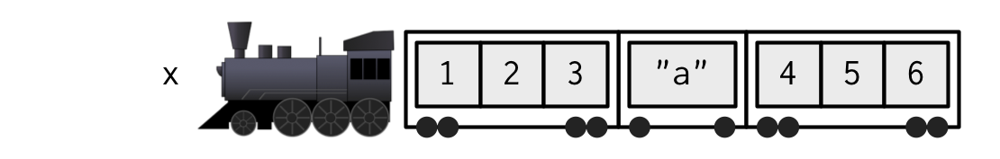
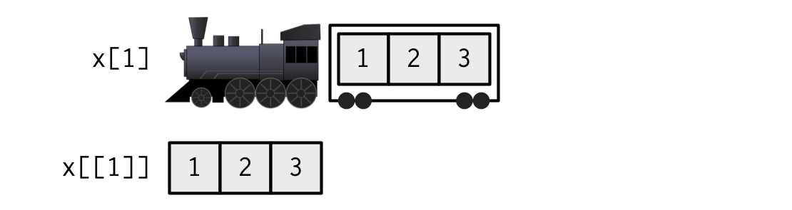

# Subsetting {#subsetting}

```{r setup, include = FALSE}
source("common.R")
rownames(mtcars) <- NULL
```

## Introduction
\index{subsetting}

R's subsetting operators are fast and powerful. Mastering them allows you to succinctly perform complex operations in a way that few other languages can match. Subsetting in R is easy to learn but hard to master because you need to internalise a number of interrelated concepts:

* There are six ways to subset atomic vectors.

* There are three subsetting operators, `[[`, `[`, and `$`.

* Subsetting operators interact differently with different vector 
  types (e.g., atomic vectors, lists, factors, matrices, and data frames).

* Subsetting can be combined with assignment.

Subsetting is a natural complement to `str()`. While `str()` shows you all the pieces of any object (its structure), subsetting allows you to pull out the pieces that you're interested in. For large, complex objects, I highly recommend using the interactive RStudio Viewer, which you can activate with `View(my_object)`.

### Quiz {-}

Take this short quiz to determine if you need to read this chapter. If the answers quickly come to mind, you can comfortably skip this chapter. Check your answers in Section \@ref(subsetting-answers).

1.  What is the result of subsetting a vector with positive integers, 
    negative integers, a logical vector, or a character vector?

1.  What's the difference between `[`, `[[`, and `$` when applied to a list?

1.  When should you use `drop = FALSE`?

1.  If `x` is a matrix, what does `x[] <- 0` do? How is it different from
    `x <- 0`?

1.  How can you use a named vector to relabel categorical variables?

### Outline {-}

* Section \@ref(subset-multiple) starts by teaching you about `[`. 
  You'll learn the six ways to subset atomic vectors. You'll then 
  learn how those six ways act when used to subset lists, matrices, 
  and data frames.
  
* Section \@ref(subset-single) expands your knowledge of subsetting 
  operators to include `[[` and `$` and focuses on the important 
  principles of simplifying versus preserving.
  
* In Section \@ref(subassignment) you'll learn the art of 
  subassignment, which combines subsetting and assignment to modify 
  parts of an object.
  
* Section \@ref(applications) leads you through eight important, but
  not obvious, applications of subsetting to solve problems that you
  often encounter in data analysis.

## Selecting multiple elements {#subset-multiple}
\indexc{[}

Use `[` to select any number of elements from a vector. To illustrate, I'll apply `[` to 1D atomic vectors, and then show how this generalises to more complex objects and more dimensions.

### Atomic vectors
\index{subsetting!atomic vectors} 
\index{atomic vectors!subsetting} 

Let's explore the different types of subsetting with a simple vector, `x`.  

```{r}
x <- c(2.1, 4.2, 3.3, 5.4)
```

Note that the number after the decimal point represents the original position in the vector.

There are six things that you can use to subset a vector: 

*   __Positive integers__ return elements at the specified positions: 

    ```{r}
    x[c(3, 1)]
    x[order(x)]

    # Duplicate indices will duplicate values
    x[c(1, 1)]

    # Real numbers are silently truncated to integers
    x[c(2.1, 2.9)]
    ```

*   __Negative integers__ exclude elements at the specified positions:

    ```{r}
    x[-c(3, 1)]
    ```

    Note that you can't mix positive and negative integers in a single subset:

    ```{r, error = TRUE}
    x[c(-1, 2)]
    ```

*   __Logical vectors__ select elements where the corresponding logical 
    value is `TRUE`. This is probably the most useful type of subsetting
    because you can write an expression that uses a logical vector:
    
    ```{r}
    x[c(TRUE, TRUE, FALSE, FALSE)]
    x[x > 3]
    ```

    \index{recycling}
    In `x[y]`, what happens if `x` and `y` are different lengths? The behaviour 
    is controlled by the __recycling rules__ where the shorter of the two is
    recycled to the length of the longer. This is convenient and easy to
    understand when one of `x` and `y` is length one, but I recommend avoiding
    recycling for other lengths because the rules are inconsistently applied
    throughout base R.
  
    ```{r}
    x[c(TRUE, FALSE)]
    # Equivalent to
    x[c(TRUE, FALSE, TRUE, FALSE)]
    ```

    Note that a missing value in the index always yields a missing value in the output:

    ```{r}
    x[c(TRUE, TRUE, NA, FALSE)]
    ```

*   __Nothing__ returns the original vector. This is not useful for 1D vectors,
    but, as you'll see shortly, is very useful for matrices, data frames, and arrays. 
    It can also be useful in conjunction with assignment.

    ```{r}
    x[]
    ```

*   __Zero__ returns a zero-length vector. This is not something you 
    usually do on purpose, but it can be helpful for generating test data.

    ```{r}
    x[0]
    ```

*   If the vector is named, you can also use __character vectors__ to return
    elements with matching names.

    ```{r}
    (y <- setNames(x, letters[1:4]))
    y[c("d", "c", "a")]

    # Like integer indices, you can repeat indices
    y[c("a", "a", "a")]

    # When subsetting with [, names are always matched exactly
    z <- c(abc = 1, def = 2)
    z[c("a", "d")]
    ```

NB: Factors are not treated specially when subsetting. This means that subsetting will use the underlying integer vector, not the character levels. This is typically unexpected, so you should avoid subsetting with factors:

```{r}
y[factor("b")]
```

### Lists
\index{lists!subsetting} 
\index{subsetting!lists}

Subsetting a list works in the same way as subsetting an atomic vector. Using `[` always returns a list; `[[` and `$`, as described in Section \@ref(subset-single), let you pull out elements of a list.  

### Matrices and arrays {#matrix-subsetting}
\index{subsetting!arrays} 
\index{arrays!subsetting}

You can subset higher-dimensional structures in three ways: 

* With multiple vectors.
* With a single vector.
* With a matrix.

The most common way of subsetting matrices (2D) and arrays (>2D) is a simple generalisation of 1D subsetting: supply a 1D index for each dimension, separated by a comma. Blank subsetting is now useful because it lets you keep all rows or all columns.

```{r}
a <- matrix(1:9, nrow = 3)
colnames(a) <- c("A", "B", "C")
a[1:2, ]
a[c(TRUE, FALSE, TRUE), c("B", "A")]
a[0, -2]
```

By default, `[` simplifies the results to the lowest possible dimensionality. For example, both of the following expressions return 1D vectors. You'll learn how to avoid "dropping" dimensions in Section \@ref(simplify-preserve):

```{r}
a[1, ]
a[1, 1]
```

Because both matrices and arrays are just vectors with special attributes, you can subset them with a single vector, as if they were a 1D vector. Note that arrays in R are stored in column-major order:

```{r}
vals <- outer(1:5, 1:5, FUN = "paste", sep = ",")
vals

vals[c(4, 15)]
```

You can also subset higher-dimensional data structures with an integer matrix (or, if named, a character matrix). Each row in the matrix specifies the location of one value, and each column corresponds to a dimension in the array. This means that you can use a 2 column matrix to subset a matrix, a 3 column matrix to subset a 3D array, and so on. The result is a vector of values:

```{r}
select <- matrix(ncol = 2, byrow = TRUE, c(
  1, 1,
  3, 1,
  2, 4
))
vals[select]
```

### Data frames and tibbles {#df-subsetting}
\index{subsetting!data frames} 
\index{data frames!subsetting}

Data frames have the characteristics of both lists and matrices: 

* When subsetting with a single index, they behave like lists and index 
  the columns, so `df[1:2]` selects the first two columns.
  
* When subsetting with two indices, they behave like matrices, so
  `df[1:3, ]` selects the first three _rows_ (and all the columns)[^python-dims].

[^python-dims]: If you're coming from Python this is likely to be confusing, as you'd probably expect `df[1:3, 1:2]` to select three columns and two rows. Generally, R "thinks" about dimensions in terms of rows and columns while Python does so in terms of columns and rows.

```{r}
df <- data.frame(x = 1:3, y = 3:1, z = letters[1:3])

df[df$x == 2, ]
df[c(1, 3), ]

# There are two ways to select columns from a data frame
# Like a list
df[c("x", "z")]
# Like a matrix
df[, c("x", "z")]

# There's an important difference if you select a single 
# column: matrix subsetting simplifies by default, list 
# subsetting does not.
str(df["x"])
str(df[, "x"])
```

Subsetting a tibble with `[` always returns a tibble:

```{r}
df <- tibble::tibble(x = 1:3, y = 3:1, z = letters[1:3])

str(df["x"])
str(df[, "x"])
```

### Preserving dimensionality {#simplify-preserve}
\indexc{drop = FALSE} 
\index{subsetting!simplifying} 
\index{subsetting!preserving}

By default, subsetting a matrix or data frame with a single number, a single name, or a logical vector containing a single `TRUE`, will simplify the returned output, i.e. it will return an object with lower dimensionality. To preserve the original dimensionality, you must use `drop = FALSE`.

*   For matrices and arrays, any dimensions with length 1 will be dropped:
    
    ```{r}
    a <- matrix(1:4, nrow = 2)
    str(a[1, ])
    
    str(a[1, , drop = FALSE])
    ```

*   Data frames with a single column will return just that column:

    ```{r}
    df <- data.frame(a = 1:2, b = 1:2)
    str(df[, "a"])

    str(df[, "a", drop = FALSE])
    ```

The default `drop = TRUE` behaviour is a common source of bugs in functions: you check your code with a data frame or matrix with multiple columns, and it works. Six months later, you (or someone else) uses it with a single column data frame and it fails with a mystifying error. When writing functions, get in the habit of always using `drop = FALSE` when subsetting a 2D object. For this reason, tibbles default to `drop = FALSE`, and `[` always returns another tibble.

Factor subsetting also has a `drop` argument, but its meaning is rather different. It controls whether or not levels (rather than dimensions) are preserved, and it defaults to `FALSE`. If you find you're using `drop = TRUE` a lot it's often a sign that you should be using a character vector instead of a factor.

```{r}
z <- factor(c("a", "b"))
z[1]
z[1, drop = TRUE]
```

### Exercises

1.  Fix each of the following common data frame subsetting errors:

    ```{r, eval = FALSE}
    mtcars[mtcars$cyl = 4, ]
    mtcars[-1:4, ]
    mtcars[mtcars$cyl <= 5]
    mtcars[mtcars$cyl == 4 | 6, ]
    ```

1.  Why does the following code yield five missing values? (Hint: why is 
    it different from `x[NA_real_]`?)
    
    ```{r}
    x <- 1:5
    x[NA]
    ```
    
1.  What does `upper.tri()` return? How does subsetting a matrix with it 
    work? Do we need any additional subsetting rules to describe its behaviour?

    ```{r, eval = FALSE}
    x <- outer(1:5, 1:5, FUN = "*")
    x[upper.tri(x)]
    ```

1.  Why does `mtcars[1:20]` return an error? How does it differ from the 
    similar `mtcars[1:20, ]`?

1.  Implement your own function that extracts the diagonal entries from a
    matrix (it should behave like `diag(x)` where `x` is a matrix).

1.  What does `df[is.na(df)] <- 0` do? How does it work?

## Selecting a single element {#subset-single}
\index{subsetting!lists} 
\index{lists!subsetting}

There are two other subsetting operators: `[[` and `$`. `[[` is used for extracting single items, while `x$y` is a useful shorthand for `x[["y"]]`.

### `[[`
\indexc{[[} 

`[[` is most important when working with lists because subsetting a list with `[` always returns a smaller list. To help make this easier to understand we can use a metaphor:

> If list `x` is a train carrying objects, then `x[[5]]` is
> the object in car 5; `x[4:6]` is a train of cars 4-6.
>
> --- \@RLangTip, <https://twitter.com/RLangTip/status/268375867468681216>

Let's use this metaphor to make a simple list:

```{r}
x <- list(1:3, "a", 4:6)
```
```{r, echo = FALSE, out.width = NULL}

```

When extracting a single element, you have two options: you can create a smaller train, i.e., fewer carriages, or you can extract the contents of a particular carriage. This is the difference between `[` and `[[`:

```{r, echo = FALSE, out.width = NULL}

```

When extracting multiple (or even zero!) elements, you have to make a smaller train:

```{r, echo = FALSE, out.width = NULL}
knitr::include_graphics("diagrams/subsetting/train-multiple.png")
```

Because `[[` can return only a single item, you must use it with either a single positive integer or a single string. If you use a vector with `[[`, it will subset recursively, i.e. `x[[c(1, 2)]]` is equivalent to `x[[1]][[2]]`. This is a quirky feature that few know about, so I recommend avoiding it in favour of `purrr::pluck()`, which you'll learn about in Section \@ref(subsetting-oob).

While you must use `[[` when working with lists, I'd also recommend using it with atomic vectors whenever you want to extract a single value. For example, instead of writing:

```{r, eval = FALSE}
for (i in 2:length(x)) {
  out[i] <- fun(x[i], out[i - 1])
}
```

It's better to write: 

```{r, eval = FALSE}
for (i in 2:length(x)) {
  out[[i]] <- fun(x[[i]], out[[i - 1]])
}
```

Doing so reinforces the expectation that you are getting and setting individual values.

### `$`
\indexc{\$}

`$` is a shorthand operator: `x$y` is roughly equivalent to `x[["y"]]`.  It's often used to access variables in a data frame, as in `mtcars$cyl` or `diamonds$carat`. One common mistake with `$` is to use it when you have the name of a column stored in a variable:

```{r, include = FALSE}
options(warnPartialMatchDollar = FALSE)
```

```{r}
var <- "cyl"
# Doesn't work - mtcars$var translated to mtcars[["var"]]
mtcars$var

# Instead use [[
mtcars[[var]]
```

The one important difference between `$` and `[[` is that `$` does (left-to-right) partial matching:

```{r}
x <- list(abc = 1)
x$a
x[["a"]]
```

\index{options!warnPartialMatchDollar@\texttt{warnPartialMatchDollar}}
To help avoid this behaviour I highly recommend setting the global option `warnPartialMatchDollar` to `TRUE`:

```{r}
options(warnPartialMatchDollar = TRUE)
x$a
```

(For data frames, you can also avoid this problem by using tibbles, which never do partial matching.)

### Missing and out-of-bounds indices {#subsetting-oob}
\index{subsetting!with NA \& NULL} 
\index{subsetting!out of bounds}
\indexc{pluck()}
\indexc{chuck()}

It's useful to understand what happens with `[[` when you use an "invalid" index. The following table summarises what happens when you subset a logical vector, list, and `NULL` with a zero-length object (like `NULL` or `logical()`), out-of-bounds values (OOB), or a missing value (e.g. `NA_integer_`) with `[[`. Each cell shows the result of subsetting the data structure named in the row by the type of index described in the column. I've only shown the results for logical vectors, but other atomic vectors behave similarly, returning elements of the same type (NB: int = integer; chr = character).

| `row[[col]]` | Zero-length | OOB (int)  | OOB (chr) | Missing  |
|--------------|-------------|------------|-----------|----------|
| Atomic       | Error       | Error      | Error     | Error    |
| List         | Error       | Error      | `NULL`    | `NULL`   |
| `NULL`       | `NULL`      | `NULL`     | `NULL`    | `NULL`   |

```{r, eval = FALSE, echo = FALSE}
logical()[[1]]
logical()[["x"]]
logical()[[NA_real_]]
logical()[[NULL]]

list()[[1]]
list()[["x"]]
list()[[NA_real_]]
list()[[NULL]]

NULL[[1]]
NULL[["x"]]
NULL[[NA_real_]]
NULL[[NULL]]
```

If the vector being indexed is named, then the names of OOB, missing, or `NULL` components will be `<NA>`.

The inconsistencies in the table above led to the development of `purrr::pluck()` and `purrr::chuck()`. When the element is missing, `pluck()` always returns `NULL` (or the value of the `.default` argument) and `chuck()` always throws an error. The behaviour of `pluck()` makes it well suited for indexing into deeply nested data structures where the component you want may not exist (as is common when working with JSON data from web APIs). `pluck()` also allows you to mix integer and character indices, and provides an alternative default value if an item does not exist:

```{r}
x <- list(
  a = list(1, 2, 3),
  b = list(3, 4, 5)
)

purrr::pluck(x, "a", 1)

purrr::pluck(x, "c", 1)

purrr::pluck(x, "c", 1, .default = NA)
```

### `@` and `slot()`

There are two additional subsetting operators, which are needed for S4 objects: `@` (equivalent to `$`), and `slot()` (equivalent to `[[`). `@` is more restrictive than `$` in that it will return an error if the slot does not exist. These are described in more detail in Chapter \@ref(s4).

### Exercises

1.  Brainstorm as many ways as possible to extract the third value from the
    `cyl` variable in the `mtcars` dataset.

1.  Given a linear model, e.g., `mod <- lm(mpg ~ wt, data = mtcars)`, extract
    the residual degrees of freedom. Then extract the R squared from the model
    summary (`summary(mod)`)

<!-- FIXME: more examples -->

## Subsetting and assignment {#subassignment}
\index{subsetting!subassignment} 
\index{assignment!subassignment}
\index{lists!removing an element}

All subsetting operators can be combined with assignment to modify selected values of an input vector: this is called subassignment. The basic form is `x[i] <- value`:

```{r}
x <- 1:5
x[c(1, 2)] <- c(101, 102)
x
```

I recommend that you should make sure that `length(value)` is the same as `length(x[i])`, and that `i` is unique. This is because, while R will recycle if needed, those rules are complex (particularly if `i` contains missing or duplicated values) and may cause problems.

With lists, you can use `x[[i]] <- NULL` to remove a component. To add a literal `NULL`, use `x[i] <- list(NULL)`: 

```{r}
x <- list(a = 1, b = 2)
x[["b"]] <- NULL
str(x)

y <- list(a = 1, b = 2)
y["b"] <- list(NULL)
str(y)
```

Subsetting with nothing can be useful with assignment because it preserves the structure of the original object. Compare the following two expressions. In the first, `mtcars` remains a data frame because you are only changing the contents of `mtcars`, not `mtcars` itself. In the second, `mtcars` becomes a list because you are changing the object it is bound to.

```{r, mtcars}
mtcars[] <- lapply(mtcars, as.integer)
is.data.frame(mtcars)

mtcars <- lapply(mtcars, as.integer)
is.data.frame(mtcars)
```

```{r, dependson = "mtcars", include = FALSE}
rm(mtcars)
```

## Applications {#applications}

The principles described above have a wide variety of useful applications. Some of the most important are described below. While many of the basic principles of subsetting have already been incorporated into functions like `subset()`, `merge()`, `dplyr::arrange()`, a deeper understanding of how those principles have been implemented will be valuable when you run into situations where the functions you need don't exist.

### Lookup tables (character subsetting) {#lookup-tables}
\index{lookup tables}

Character matching is a powerful way to create lookup tables. Say you want to convert abbreviations: 

```{r}
x <- c("m", "f", "u", "f", "f", "m", "m")
lookup <- c(m = "Male", f = "Female", u = NA)
lookup[x]
```

Note that if you don't want names in the result, use `unname()` to remove them.

```{r}
unname(lookup[x])
```

### Matching and merging by hand (integer subsetting) {#matching-merging}
\index{matching and merging}
\indexc{match()}

You can also have more complicated lookup tables with multiple columns of information. For example, suppose we have a vector of integer grades, and a table that describes their properties:

```{r}
grades <- c(1, 2, 2, 3, 1)

info <- data.frame(
  grade = 3:1,
  desc = c("Excellent", "Good", "Poor"),
  fail = c(F, F, T)
)
```

Then, let's say we want to duplicate the `info` table so that we have a row for each value in `grades`. An elegant way to do this is by combining `match()` and integer subsetting (`match(needles, haystack)` returns the position where each `needle` is found in the `haystack`).

```{r}
id <- match(grades, info$grade)
id
info[id, ]
```

If you're matching on multiple columns, you'll need to first collapse them into a single column (with e.g. `interaction()`). Typically, however, you're better off switching to a function designed specifically for joining multiple tables like `merge()`, or `dplyr::left_join()`.

### Random samples and bootstraps (integer subsetting)
\index{sampling} 
\index{bootstrapping}

You can use integer indices to randomly sample or bootstrap a vector or data frame. Just use `sample(n)` to generate a random permutation of `1:n`, and then use the results to subset the values: 

```{r}
df <- data.frame(x = c(1, 2, 3, 1, 2), y = 5:1, z = letters[1:5])

# Randomly reorder
df[sample(nrow(df)), ]

# Select 3 random rows
df[sample(nrow(df), 3), ]

# Select 6 bootstrap replicates
df[sample(nrow(df), 6, replace = TRUE), ]
```

The arguments of `sample()` control the number of samples to extract, and also whether sampling is done with or without replacement.

### Ordering (integer subsetting)
\indexc{order()} 
\index{sorting}
 
`order()` takes a vector as its input and returns an integer vector describing how to order the subsetted vector[^pull-indices]:

[^pull-indices]: These are "pull" indices, i.e., `order(x)[i]` is an index of where each `x[i]` is located. It is not an index of where `x[i]` should be sent.

```{r}
x <- c("b", "c", "a")
order(x)
x[order(x)]
```

To break ties, you can supply additional variables to `order()`. You can also change the order from ascending to descending by using `decreasing = TRUE`. By default, any missing values will be put at the end of the vector; however, you can remove them with `na.last = NA` or put them at the front with `na.last = FALSE`.

For two or more dimensions, `order()` and integer subsetting makes it easy to order either the rows or columns of an object:

```{r}
# Randomly reorder df
df2 <- df[sample(nrow(df)), 3:1]
df2

df2[order(df2$x), ]
df2[, order(names(df2))]
```

You can sort vectors directly with `sort()`, or similarly `dplyr::arrange()`, to sort a data frame.

### Expanding aggregated counts (integer subsetting)

Sometimes you get a data frame where identical rows have been collapsed into one and a count column has been added. `rep()` and integer subsetting make it easy to uncollapse, because we can take advantage of `rep()`s vectorisation: `rep(x, y)` repeats `x[i]` `y[i]` times.

```{r}
df <- data.frame(x = c(2, 4, 1), y = c(9, 11, 6), n = c(3, 5, 1))
rep(1:nrow(df), df$n)

df[rep(1:nrow(df), df$n), ]
```


### Removing columns from data frames (character \mbox{subsetting})

There are two ways to remove columns from a data frame. You can set individual columns to `NULL`: 

```{r}
df <- data.frame(x = 1:3, y = 3:1, z = letters[1:3])
df$z <- NULL
```

Or you can subset to return only the columns you want:

```{r}
df <- data.frame(x = 1:3, y = 3:1, z = letters[1:3])
df[c("x", "y")]
```

If you only know the columns you don't want, use set operations to work out which columns to keep:

```{r}
df[setdiff(names(df), "z")]
```

### Selecting rows based on a condition (logical subsetting)
\index{subsetting!with logical vectors}
\indexc{subset()}
 
Because logical subsetting allows you to easily combine conditions from multiple columns, it's probably the most commonly used technique for extracting rows out of a data frame.  

```{r}
mtcars[mtcars$gear == 5, ]

mtcars[mtcars$gear == 5 & mtcars$cyl == 4, ]
```

Remember to use the vector boolean operators `&` and `|`, not the short-circuiting scalar operators `&&` and `||`, which are more useful inside if statements. And don't forget [De Morgan's laws][demorgans], which can be useful to simplify negations:

* `!(X & Y)` is the same as `!X | !Y`
* `!(X | Y)` is the same as `!X & !Y`

For example, `!(X & !(Y | Z))` simplifies to `!X | !!(Y|Z)`, and then to `!X | Y | Z`.

### Boolean algebra versus sets (logical and integer \mbox{subsetting})
\index{Boolean algebra} 
\index{set algebra}
\indexc{which()}

It's useful to be aware of the natural equivalence between set operations (integer subsetting) and Boolean algebra (logical subsetting). Using set operations is more effective when: 

* You want to find the first (or last) `TRUE`.

* You have very few `TRUE`s and very many `FALSE`s; a set representation 
  may be faster and require less storage.

`which()` allows you to convert a Boolean representation to an integer representation. There's no reverse operation in base R but we can easily create one: 

```{r}
x <- sample(10) < 4
which(x)

unwhich <- function(x, n) {
  out <- rep_len(FALSE, n)
  out[x] <- TRUE
  out
}
unwhich(which(x), 10)
```

Let's create two logical vectors and their integer equivalents, and then explore the relationship between Boolean and set operations.

```{r}
(x1 <- 1:10 %% 2 == 0)
(x2 <- which(x1))
(y1 <- 1:10 %% 5 == 0)
(y2 <- which(y1))

# X & Y <-> intersect(x, y)
x1 & y1
intersect(x2, y2)

# X | Y <-> union(x, y)
x1 | y1
union(x2, y2)

# X & !Y <-> setdiff(x, y)
x1 & !y1
setdiff(x2, y2)

# xor(X, Y) <-> setdiff(union(x, y), intersect(x, y))
xor(x1, y1)
setdiff(union(x2, y2), intersect(x2, y2))
```

When first learning subsetting, a common mistake is to use `x[which(y)]` instead of `x[y]`. Here the `which()` achieves nothing: it switches from logical to integer subsetting but the result is exactly the same. In more general cases, there are two important differences. 

* When the logical vector contains `NA`, logical subsetting replaces these 
  values with `NA` while `which()` simply drops these values. It's not uncommon 
  to use `which()` for this side-effect, but I don't recommend it: nothing 
  about the name "which" implies the removal of missing values.

* `x[-which(y)]` is __not__ equivalent to `x[!y]`: if `y` is all FALSE, 
  `which(y)` will be `integer(0)` and `-integer(0)` is still `integer(0)`, so
  you'll get no values, instead of all values. 
  
In general, avoid switching from logical to integer subsetting unless you want, for example, the first or last `TRUE` value.

### Exercises

1.  How would you randomly permute the columns of a data frame? (This is an
    important technique in random forests.) Can you simultaneously permute 
    the rows and columns in one step?

1.  How would you select a random sample of `m` rows from a data frame? 
    What if the sample had to be contiguous (i.e., with an initial row, a 
    final row, and every row in between)?
    
1.  How could you put the columns in a data frame in alphabetical order?

## Quiz answers {#subsetting-answers}

1.  Positive integers select elements at specific positions, negative integers
    drop elements; logical vectors keep elements at positions corresponding to
    `TRUE`; character vectors select elements with matching names.
   
1.  `[` selects sub-lists: it always returns a list. If you use it with a
    single positive integer, it returns a list of length one. `[[` selects 
    an element within a list. `$` is a convenient shorthand: `x$y` is
    equivalent to `x[["y"]]`.

1.  Use `drop = FALSE` if you are subsetting a matrix, array, or data frame 
    and you want to preserve the original dimensions. You should almost 
    always use it when subsetting inside a function.
   
1.  If `x` is a matrix, `x[] <- 0` will replace every element with 0, 
    keeping the same number of rows and columns. In contrast, `x <- 0` 
    completely replaces the matrix with the value 0.
    
1.  A named character vector can act as a simple lookup table: 
    `c(x = 1, y = 2, z = 3)[c("y", "z", "x")]`

[demorgans]: http://en.wikipedia.org/wiki/De_Morgan's_laws
