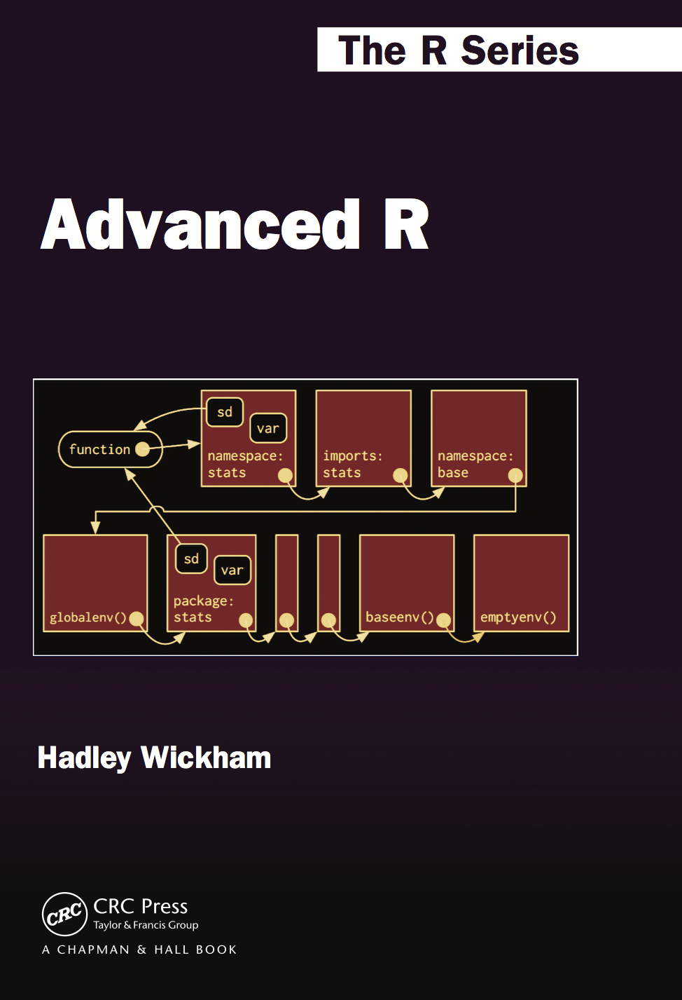

`r if (knitr::is_latex_output()) '<!--'` 

# Welcome {-}

This is the website for the 2nd edition of __"[Advanced R](https://amzn.to/2WoabjB)"__, a book in Chapman & Hall's R Series. The book is designed primarily for R users who want to improve their programming skills and understanding of the language. It should also be useful for programmers coming to R from other languages, as it helps you to understand why R works the way it does.

If you're looking for the electronic version of the 1st edition, you can find it online at <http://adv-r.had.co.nz/>.

## License {-}

This work, as a whole, is licensed under a <a rel="license" href="http://creativecommons.org/licenses/by-nc-sa/4.0/">Creative Commons Attribution-NonCommercial-ShareAlike 4.0 International License</a>.

The code contained in this book is simultaneously available under the [MIT license](https://opensource.org/licenses/MIT); this means that you are free to use it in your own packages, as long as you cite the source.

## Other books {-}

You may also be interested in:

* __"[Advanced R solutions](http://advanced-r-solutions.rbind.io)"__ by
  Malte Grosser and Henning Bumann, provides worked solutions to the exercises
  in this book.

* __"[R for Data Science](http://r4ds.had.co.nz/)"__ which introduces you to R 
  as a tool for doing data science, focussing on a consistent
  set of packages known as the tidyverse.

* __"[R Packages](http://r-pkgs.had.co.nz/)"__ which teaches you 
  how to make the most of R's fantastic package system.

`r if (knitr::is_latex_output()) '-->'`
