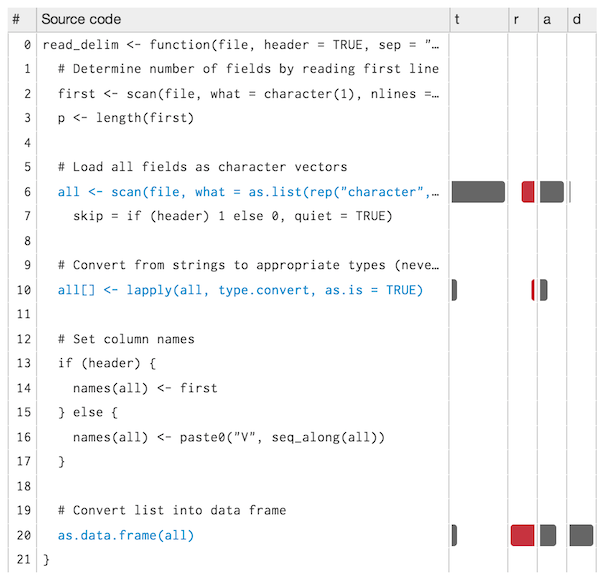
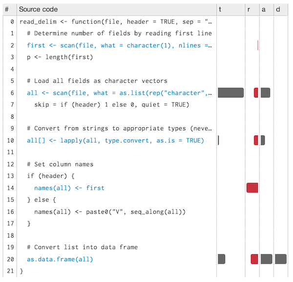

```{r, message = FALSE, echo = FALSE}
library(pryr)
read_chunk("code/read-delim.r")
```

# Memory

Understanding how memory works in R can help you do things like analysing larger datasets within the same amount of memory. It can even help you write faster code (accidental copies are a major cause of slow code). In this chapter, you'll learn:

* how to use `object.size()` to measure the amount of memory taken up by vectors 

* how to use the output from `gc()` to explore the net impact of a sequence of operations on memory

* what garbage collection does, and why you never need to explicitly call `gc()`

* how to use the `lineprof` package to see a line-by-line breakdown of memory usage in larger scripts

* how to determine when R copies an object even though it looks like you're modifying-in-place

The chapter will hopefully also help to dispel myths like:

* the need to manually call `gc()` to free up memory

* For loops in R are always slow.

The details of memory management in R are not documented in a single place. Most of the information in this chapter was gleaned from a close reading of the documentation (particularly `?Memory` and `?gc`), the [memory profiling](http://cran.r-project.org/doc/manuals/R-exts.html#Profiling-R-code-for-memory-use) section of R-exts, and the [SEXPs](http://cran.r-project.org/doc/manuals/R-ints.html#SEXPs) section of R-ints. The rest I figured out by reading the C source code, performing small experiments and asking questions on R-devel.

### Packages

```{r, eval = FALSE}
install.packages("ggplot2")
devtools::install_github("hadley/pryr")
devtools::install_github("hadley/lineprof")
```

## `object.size()`

One of the most useful tools for understanding memory usage in R is `object.size()`. It tells you how much memory an object occupies. This section uses `object.size()` to look at the size of some simple vectors. By exploring some unusual findings, you'll start to understand some important aspects of memory allocation in R.

We'll start with a surprising plot: a line plot of vector length vs. memory size (in bytes) for an integer vector. You might expect that the size of an empty vector would be zero and that memory usage would grow proportionately with length. Neither of those things are true!

```{r size-q}
sizes <- sapply(0:50, function(n) object.size(seq_len(n)))
plot(0:50, sizes, xlab = "Length", ylab = "Bytes", type = "s")
```

This isn't just an artefact of integer vectors. Every vector of length 0 occupies 40 bytes of memory:

```{r}
object.size(numeric())
object.size(logical())
object.size(raw())
object.size(list())
```

What are those 40 bytes of memory used for? The answer lies in the fact that every object in R has four components:

* object metadata, the _sxpinfo_ (4 bytes). These metadata include the base type and information used for debugging and memory management.

* Two pointers: one to the next object in memory and one to the previous object (2 * 8 bytes). This doubly-linked list makes it easy for internal R code to loop through every object in memory.

* A pointer to an object's attributes (8 bytes).

All vector types (i.e., atomic vectors and lists), have three additional components:

* The length of the vector (4 bytes). By using only 4 bytes, one would expect that R could only support vectors up to 2 ^ (4 * 8 - 1) (2 ^ 31, about two billion) elements long. But in R 3.0.0 and later, you can actually have vectors up to 2 ^ 52 long. Read R-internals to see how support for [long vectors](http://cran.r-project.org/doc/manuals/R-ints.html#Long-vectors) was done without having to change the size of this field.

* The "true" length of the vector (4 bytes). This is basically never used, except when the object is the hash table used for an environment. In that case, the true length represents the allocated space, and the length represents the space currently used.

* The data (?? bytes). An empty vector has 0 bytes of data, but it's obviously very important otherwise!

If you're keeping count you'll notice that only this adds up to 36 bytes. The remaining 4 bytes are reserved for padding after the sxpinfo. This ensures that the pointers start on 8 byte (= 64-bit) boundaries. Most process architectures require this alignment for pointers. Even if it weren't required, accessing non-aligned pointers tends to be rather slow. (If you're interested, you can read more about [C structure package](http://www.catb.org/esr/structure-packing/).)

This explains the intercept on the graph. But why does the memory size grow as an irregular step function? To understand that, you need to know a little bit about how R requests memory from the operating system. Requesting memory (done via the `malloc()` function) is a relatively expensive operation. Having to request memory every time a small vector is created would slow R down considerably. Instead, R asks for a big block of memory and then manages that block itself. This block is called the small vector pool. R uses this pool for vectors less than 128 bytes long. For efficiency and simplicity, it only allocates vectors that are 8, 16, 32, 48, 64 or 128 bytes long. If we adjust our previous plot by removing the 40 bytes of overhead, we can see that those values correspond to the jumps in memory use.

```{r size-a}
plot(0:50, sizes - 40, xlab = "Length", ylab = "Bytes excluding overhead", type = "n")
abline(h = 0, col = "grey80")
abline(h = c(8, 16, 32, 48, 64, 128), col = "grey80")
abline(a = 0, b = 4, col = "grey90", lwd = 4)
lines(sizes - 40, type = "s")
```

Beyond 128 bytes, it no longer makes sense for R to manage vectors. After all, allocating big chunks of memory is something that operating systems are very good at. So beyond 128 bytes, R will ask for memory in multiples of 8 bytes. This ensures good alignment for the data, in the same way we needed good alignment for pointers.

Another subtlety about `object.size()` is that it only gives an estimate of the memory usage, not its actual usage. This is because, for more complex objects, it's not immediately obvious what memory usage means. Take environments for example. Using `object.size()` on an environment tells you the size of the environment, not the size of its contents. 

While It would be easy to create a function that did this (see below), the function isn't quite correct:

```{r}
env_size <- function(x) {
  if (!is.environment(x)) return(object.size(x))

  objs <- ls(x, all = TRUE)
  sizes <- vapply(objs, function(o) env_size(get(o, x)), double(1))
  structure(sum(sizes) + object.size(x), class = "object_size")
}
object.size(environment())
env_size(environment())
```

This is because it's very difficult to cover every special case. For example, you might have an object with an attribute that's an environment that contains a formula which has an environment containing a large object, etc. 

Even if you could cover all special cases, there's another problem. Environment objects are reference based so you can point to the same object from multiple locations. For example, in the following example, what should the size of `b` be?

```{r}
a <- new.env()
a$x <- 1:1e6

b <- new.env()
b$a <- a

env_size(a)
env_size(b)
```

You could argue that `b` is actually only 56 bytes, because if you remove `b`, that's how much memory will be freed. But if you deleted `a` first, and then deleted `b`, 4000152 bytes would be freed. So is the size of `b` 56 or 4000152 bytes? The answer depends on the context.

Another challenge for `object.size()` is strings:

```{r}
object.size("banana")
object.size(rep("banana", 100))
```

On my 64-bit computer, the size of a vector containing "banana" is 96 bytes, but the size of a vector containing 100 "banana"s is 888 bytes. Why the difference? The key is 888 = 96 + 99 * 8. R uses a global string pool. This means that every unique string is stored only once in memory. Every other instance of that string is just a pointer, and consequently only needs 8 bytes of storage. `object.size()` tries to take this into account for individual vectors, but as with environments it's not obvious exactly how the accounting should work.

### Exercises

* Repeat the analysis above for numeric, logical, and complex vectors.

* Compare the sizes of the elements in the following two lists. Each contains basically the same data, but one contains vectors of small strings while the other contains a single long string.

    ```{r}
    vec <- lapply(0:50, function(i) c("ba", rep("na", i)))
    str <- lapply(vec, paste0, collapse = "")
    ```

* Which takes up more memory: a factor or a character vector? Why?

* Explain the difference in size between `1:5` and `list(1:5)`.

## Total memory use

`object.size()` tells you the size of a single object; `gc()` (among other things) tells you the total size of all objects in memory:

```{r}
gc()
```

(we'll get to why it's called `gc()` in the next section)

R breaks down memory usage into Vcells (memory used by vectors) and Ncells (memory used by everything else). But this distinction isn't usually important, and neither are the gc trigger and max used columns. What you're usually most interested in is the total memory used. The function below wraps around `gc()` to return just the amount of memory (in megabytes) that R is currently using.

```{r}
mem <- function() {
  bit <- 8L * .Machine$sizeof.pointer
  if (!(bit == 32L || bit == 64L)) {
    stop("Unknown architecture", call. = FALSE)
  }

  node_size <- if (bit == 32L) 28L else 56L

  usage <- gc()
  sum(usage[, 1] * c(node_size, 8)) / (1024 ^ 2)
}
mem()
```

Don't expect this number to agree with the amount of memory that your operating system says that R is using:

* Some overhead associated with the R interpreter is not captured by these numbers.

* Both R and the operating system are lazy: they won't try and reclaim memory until it's actually needed. So R might be holding on to memory because the OS hasn't asked for it back yet.

* R counts the memory occupied by objects; there may be gaps from objects that have been deleted. This problem is known as memory fragmentation.

We can build a function on top of `mem()` that tells us how memory changes during the execution of a block of code. We use a little special evaluation to make the code behave in the same way as running it directly. Positive numbers represent an increase in the memory used by R, and negative numbers a decrease.

```{r}
mem_change <- function(code) {
  start <- mem()

  expr <- substitute(code)
  eval(expr, parent.frame())
  rm(code, expr)

  round(mem() - start, 3)
}
# Need about 4 mb to store 1 million integers
mem_change(x <- 1:1e6)
# We get that memory back when we delete it
mem_change(rm(x))
```

In the next section, we'll use `mem_change()` to explore how memory is allocated and released by R, and memory is released lazily by the "garbage collector".

## Garbarge collection

In some languages you have to explicitly delete unnused objects so that their memory can be returned. R uses an alternative approach, called garbage collection (GC for short), which automatically released memory when an object is no longer used. It does this based on environments and the regular scoping rules: when an environment goes out of scope (for example, when a function finishes executing), all of the contents of that environment are deleted and their memory is freed.

For example, in the following code, a million integers are allocated inside the function, but are automatically removed up when the function terminates. This results in a net change of zero:

```{r}
f <- function() {
  1:1e6
}
mem_change(f())
```

This is a little bit of a simplification because in order to find out how much memory is available, our `mem()` function calls `gc()`. As well as returning the amount of memory currently used, `gc()` also triggers garbage collection. Garbage collection normally happens lazily: R calls `gc()` when it needs more space. In reality, that R might hold onto the memory after the function has terminated, but it will release it as soon as it's needed.

Despite what you might have read elsewhere, there's never any point in calling `gc()` yourself, apart to see how much memory is in use. R will automatically run garbage collection whenever it needs more space; if you want to see when that is, call `gcinfo(TRUE)`. The only reason you _might_ want to call `gc()` is that it also requests that R should return memory to the operating system. Even that might not have any effect: older versions of Windows had no way for a program to return memory to the OS.

Generally, GC takes care of releasing previously used memory. However, you do need to be aware of situations that can cause memory leaks: when you think you've removed all references to an object, but some are still hanging around so the object never gets freed. In R, the two main causes of memory leaks are formulas and closures. They both capture the enclosing environment, so objects in that environment will not be reclaimed automatically.

The following code illustrates the problem. `f1()` returns the object `10`, so the large vector allocated inside the function will go out of scope and get reclaimed, and the net memory change is 0. `f2()` and `f3()` both return objects that capture environments, and so the net memory change is almost 4 megabytes.

```{r}
f1 <- function() {
  x <- 1:1e6
  10
}
mem_change(x <- f1())
x
rm(x)

f2 <- function() {
  x <- 1:1e6
  a ~ b
}
mem_change(y <- f2())
object.size(y)
rm(y)

f3 <- function() {
  x <- 1:1e6
  function() 10
}
mem_change(z <- f3())
object.size(z)
rm(z)
```


## Memory profiling with lineprof {#memory-profiling}

`mem_change()` captures the net change in memory use when running a block of code. Sometimes, however, we may want to measure incremental change. One way to do this is to use memory profiling to capture usage every few milliseconds. This functionality is provided by the `utils::Rprof()`. However, because it doesn't provide a very useful display of the results, we'll use the [lineprof](https://github.com/hadley/lineprof) package instead; it's powered by `Rprof()`, but displays the results in a more informative manner.

To demonstrate `lineprof`, we're going to explore a bare-bones implementation of `read.delim` with only three arguments:

```{r read_delim}
```

We'll also create a sample csv file:

```{r}
library(ggplot2)
write.csv(diamonds, "diamonds.csv", row.names = FALSE)
```

Using lineprof is straightforward. Source the code, apply `lineprof()` to an expression, and use `shine()` to view the results.

Note that you _must_ use `source()` to load the code: you can not do this on the command line. This is because lineprof uses srcrefs to match up the code and run times, and the needed srcrefs are only created when you load code from disk.

```{r, eval = FALSE}
library(lineprof)

source("code/read-delim.R")
prof <- lineprof(read_delim("diamonds.csv"))
shine(prof)
```

`shine()` starts a shiny app which will "block" your R session. To exit, you'll need to stop the process using escape or ctrl + break. `shine()` will also open a new web page (or if you're using RStudio, a new pane) that shows your source code annotated with information about memory usage:



As well as your original source code, there are four columns:

* `t`, the time (in seconds) spent on that line of code

* `a`, the memory (in megabytes) allocated by that line of code.

* `r`, the memory (in megabytes) released by that line of code. While memory allocation is deterministic, memory release is stochastic: it depends on when the GC was run. This means that memory release only tells you that the memory released was no longer needed before this line.

* `d`, the number of vector duplications that occurred. A vector duplication occurs when R copies a vector as a result of its copy on modify semantics.

You can hover over any of the bars to get the exact numbers. In this example, looking at the allocations tells us most of the story:

* `scan()` allocates about 2.5 MB of memory, which is very close to the 2.8 MB of space that the file occupies on disk. You wouldn't expect the two numbers to be identical because R doesn't need to store the commas and because the global string pool will save some memory.

* Converting the columns allocates another 0.6 MB of memory. You'd also expect this step to free some memory because we've converted string columns into integer and numeric columns (which occupy less space), but we can't see those releases because GC hasn't been triggered yet.

* Finally, calling `as.data.frame()` on a list allocates about 1.6 megabytes of memory and performs over 600 duplications. This is because `as.data.frame()` isn't terribly efficient and ends up copying the input multiple times. We'll discuss duplication more in the next section.

There are two downsides to profiling:

1. `read_delim()` only takes around half a second, but profiling can, at best, only capture memory usage every 1ms. So we'll only get about 500 samples.

2. Since GC is lazy, we can never tell exactly when memory is no longer needed.

One way to work around both problems is to use `torture = TRUE`, which forces R to run GC after every allocation (see `gctorture()` for more details). This helps with both problems because memory is freed as soon as possible, and R runs 10-100x slower. So the resolution of the timing is greater: you can see smaller allocations and exactly when memory is no longer needed.

If we re-run our `read_delim()` example with `torture = TRUE` we get:

```{r, eval = FALSE}
prof <- lineprof(read_delim("diamonds.csv"), torture = TRUE)
shine(prof)
```



The basic pattern remains the same, but we now we see a big memory release on line 14. Line 14 is the first line after a type conversion, so the release represents the memory saved by converting strings to numbers. We still see the large number of duplications with `as.data.frame()`, however. We'll explore this in the next section.

### Exercises

* When the input is a list, we can make a more efficient `as.data.frame()` by using special knowledge about data frame. A data frame is a list with class `data.frame` and a special attribute `row.names`. `row.names` is either a character vector specifying a column of names or a vector of sequential integers. The row names are stored in a special format created by `.set_row_names()`. This leads to an alternative `as.data.frame()`:

    ```{r}
    to_df <- function(x) {
      class(x) <- "data.frame"
      attr(x, "row.names") <- .set_row_names(length(x[[1]]))
      x
    }
    ```

    What impact does this function have on `read_delim()`?  What are the downsides of this function?

* Line profile the following function with `torture = TRUE`. What is surprising? Read the source code of `gc()` to figure out what's going on.

    ```{r}
    f <- function(n = 1e5) {
      x <- rep(1, n)
      rm(x)
    }
    ```

## Modification in place

What happens to `x` in the following code?

```{r}
x <- 1:10
x[5] <- 10
x
```

There are two possibilities:

1. R modifies `x` in place.

2. R makes a copy of `x` to a new location, modifies the copy, and then uses the name `x` to point to the new location.

It turns out that R can do either depending on the circumstances. In the example above, it will modify in place. But if another variable also points to `x`, then R will copy it to a new location. To explore what's going on in greater detail, we use the tools found in the `pryr` package. Given the name of a variable, `address()` will tell us the variable's location in memory and `refs()` will tell us how many names point to that location.

```{r, eval = FALSE}
library(pryr)
x <- 1:10
c(address(x), refs(x))
# [1] "0x103100060" "1"

y <- x
c(address(y), refs(y))
# [1] "0x103100060" "2"
```

(Note that if you're using RStudio, `refs()` will always return 2: the environment browser makes a reference to every object you create on the command line, but not inside a function.)

Note that `refs()` is only an estimate. It can only distinguish between 1 and more than 1 reference. This means that `refs()` returns 2 in both of the following cases:

```{r}
x <- 1:5
y <- x
rm(y)
# Should really be 1, because we've deleted y
refs(x)

x <- 1:5
y <- x
z <- x
# Should really be 3
refs(x)
```

When `refs(x)` is 1, modification will occur in place. When `refs(x)` is 2, R will make a copy (this ensures that other pointers to the object remain unaffected). Note that in the following example, `y` keeps pointing to the same location while `x` changes.

```{r}
x <- 1:10
y <- x
c(address(x), address(y))

x[5] <- 6L
c(address(x), address(y))
```

Another useful function is `tracemem()`. It prints a message every time the traced object is copied:

```{r tracemem, eval = FALSE}
x <- 1:10
# Prints the current memory location of the object
tracemem(x)
# [1] "<0x7feeaaa1c6b8>"

x[5] <- 6L

y <- x
# Prints where it has moved from and to
x[5] <- 6L
# tracemem[0x7feeaaa1c6b8 -> 0x7feeaaa1c768]:
```

It's slightly more useful for interactive use than `refs()`, but, because it just prints a message, it's harder to program with. (I don't use it very much in this book because it interacts poorly with [knitr](http://yihui.name/knitr/), the tool used to insert the output of executed R code into the text.)

Non-primitive functions that touch the object always increment the ref count. Primitive functions are usually written in such a way that they don't. (The reasons are a little complicated, but see the R-devel thread [confused about NAMED](http://r.789695.n4.nabble.com/Confused-about-NAMED-td4103326.html).)

```{r, eval = FALSE}
x <- 1:10
refs(x)
# [1] 1
mean(x)
refs(x)
# [1] 2

# Touching the object forces an increment
f <- function(x) x
x <- 1:10; f(x); refs(x)
# [1] 2

# Sum is primitive, so no increment
x <- 1:10; sum(x); refs(x)
# [1] 1

# f() and g() never evaluate x, so refs don't increment
f <- function(x) 10
x <- 1:10; f(x); refs(x)
# [1] 1

g <- function(x) substitute(x)
x <- 1:10; g(x); refs(x)
# [1] 1
```

Generally, provided that the object is not referred to elsewhere, any primitive replacement function will modify in place. This includes `[[<-`, `[<-`, `@<-`, `$<-`, `attr<-`, `attributes<-`, `class<-`, `dim<-`, `dimnames<-`, `names<-`, and `levels<-`. To be precise, all non-primitive functions increment refs, but a primitive function may be written in such a way that it doesn't. The rules are sufficiently complicated that there's little point in trying to memorise them. Instead, you should approach the problem practically by using `refs()` and `tracemem()` to figure out when objects are being copied.

While determining that copies are being made is not hard, preventing such behavior is. If you find yourself resorting to exotic tricks to avoid copies, it may be time to rewrite your function in C++, as described in [Rcpp](#rcpp).

### Loops

For loops in R have a reputation for being slow. Often that slowness is due to the fact that you're modifying a copy instead of modifying in place. Consider the following code. It subtracts the median from each column of a large data frame:

```{r, cache = TRUE}
x <- data.frame(matrix(runif(100 * 1e4), ncol = 100))
medians <- vapply(x, median, numeric(1))

system.time({
  for(i in seq_along(medians)) {
    x[, i] <- x[, i] - medians[i]
  }
})
```

It's rather slow. With 100 columns and 10,000 rows, it takes almost five seconds. We can use `address()` and `refs()` to see what's going on for a small sample of the loop:

```{r}
for(i in 1:5) {
  x[, i] <- x[, i] - medians[i]
  print(c(address(x), refs(x)))
}
```

For each iteration, `x` is moved to a new location (copying the complete data frame) so `refs(x)` is always 2. This occurs because `[<-.data.frame` is not a primitive function, so it always increments the refs. We can make the function substantially more efficient by using either a list or a matrix instead of a data frame. Modifying lists and matrices use primitive functions, so the refs are not incremented and all modifications occur in place.

```{r}
y <- as.list(x)
system.time({
  for(i in seq_along(medians)) {
    y[[i]] <- y[[i]] - medians[i]
  }
})

z <- as.matrix(x)
system.time({
  for(i in seq_along(medians)) {
    z[, i] <- z[, i] - medians[i]
  }
})
```

### Exercises

* The code below makes one duplication. Where does it occur and why? (Hint: Look at `refs(y)`.)

    ```{r}
    y <- as.list(x)
    for(i in seq_along(medians)) {
      y[[i]] <- y[[i]] - medians[i]
    }
    ```
* The implementation of `as.data.frame()` in the previous section has one big downside. What is it and how could you avoid it?
